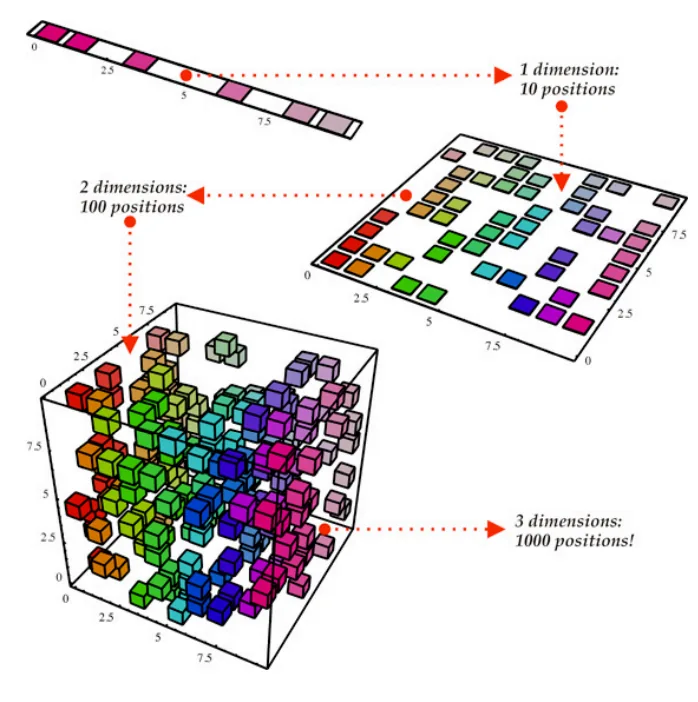
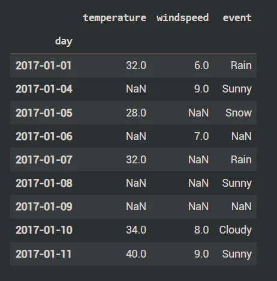
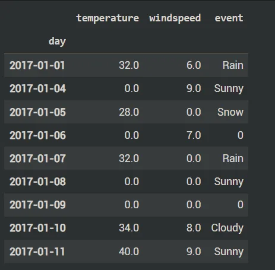
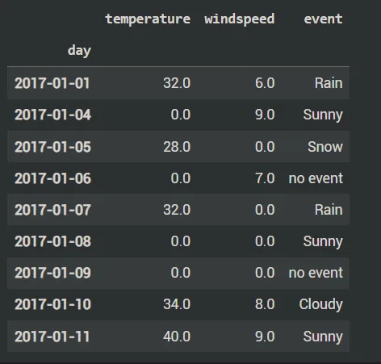
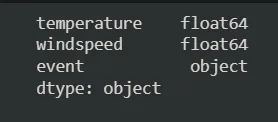
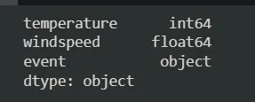
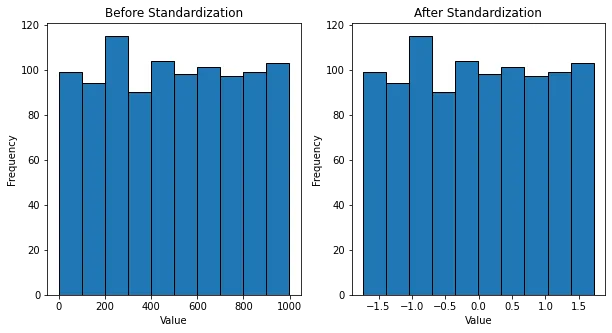

## Dimensionality Reduction In Python
Dimensionality refers to the number of attributes or columns in a dataset. The higher the number of attributes or columns of a dataset, the greater the dimension of that dataset. Dimensionality reduction help to reduce the number of columns or attributes of a dataset to an appreciable number to help reduce complexity of the dataset.

Dimensionality reduction aims to represent numerical input data in a lower-dimensional manner while maintaining important relationships.

There is no one ideal solution for all datasets because there are numerous distinct dimensionality reduction algorithms.

Input dimensions frequently translate into correspondingly fewer degrees of freedom (also known as parameters) or a simpler structure in the machine learning model. Too many degrees of freedom in a model can cause it to overfit the training dataset and underperform on fresh data.

Some popular methods of dimensionality reduction include:

1. Principal Components Analysis
2. Singular Value Decomposition
3. Non-Negative Matrix Factorization.

In this blog, we will move more into details of how the Principal Components Analysis (PCA) works.

## Principal Components Analysis
Popular unsupervised learning methods for reducing the dimensionality of data include principal component analysis. The amount of information lost is reduced while interpretability is increased. By using a smaller set of "summary indices" that are simpler to visualize and interpret, it enables you to summarize the information contained in massive data tables.

A short code on how it is used is outlined below:

```python
#Importing the needed libraries
from sklearn.datasets import load_digits
import pandas as pd

#Loading the dataset
dataset = load_digits()
dataset.keys()

#Showing the data shape
dataset.data.shape

#Loading the dataset as a pandas dataframe
df = pd.DataFrame(dataset.data, columns=dataset.feature_names)
df.head()

#Splitting the data into X and y
X = df
y = dataset.target

#Scaling the dataset
from sklearn.preprocessing import StandardScaler

scaler = StandardScaler()
X_scaled = scaler.fit_transform(X)
X_scaled

#Splitting the data into test set and train set
from sklearn.model_selection import train_test_split

X_train, X_test, y_train, y_test = train_test_split(X_scaled, y, test_size=0.2, random_state=30)

#Training and scoring model
from sklearn.linear_model import LogisticRegression

model = LogisticRegression()
model.fit(X_train, y_train)
model.score(X_test, y_test)

#Using components such that 95% of variance is retained
from sklearn.decomposition import PCA

pca = PCA(0.95)
X_pca = pca.fit_transform(X)
X_pca.shape
```

Output:

From the code above which has its complete outputs in the GitHub link attached at the end of the blog: the number of columns or features is reduced from 64 to 29.

## Preprocessing For Machine Learning
Data preprocessing comes after you have cleaned the data and performed some exploratory data analysis. It entails prepping your data for modelling. It sometimes involving changing categorical columns into numerical columns.

Steps to preprocess your data:

1. Remove missing data which could be rows or columns of the dataset.
2. Converting datatype into the right datatype.
3. Standardizing dataset.
4. Feature engineering: It is the creation of new features from existing features.
5. Splitting data into train and test set.

For this tutorial, we will be going through the first 3.

## Handling Missing Data
```python
#Importing the needed libraries
import pandas as pd
import matplotlib.pyplot as plt

#Uploading the dataset onto google colab
from google.colab import files
files.upload()

#Loading the dataset as a pandas dataframe
df = pd.read_csv('/content/weather_data.csv', parse_dates=['day'])
df.set_index('day', inplace=True)
df

#Checking for missing values
df.isna().sum()

#Method 1: Filling the missing values with 0s and creating a new dataset
new_df = df.fillna(0)
new_df

#Method 2: Filling the missing values with the appropriate values
new_df = df.fillna({
    'temperature': 0,
    'windspeed':0,
    'event': 'no event'
})
new_df
```

Output:

1. Dataset



2. Method 1: Filling the NaN with 0s



3. Method 2: Filling the numerical missing values with 0s and the categorical one with "no event".



## Converting Datatype Into Right Datatype
```python
#Importing the needed libraries
import pandas as pd
import matplotlib.pyplot as plt

#Uploading the dataset onto google colab
from google.colab import files
files.upload()

#Loading the dataset as a pandas dataframe
df = pd.read_csv('/content/weather_data.csv', parse_dates=['day'])
df.set_index('day', inplace=True)
df

#Checking for missing values
df.isna().sum()

#Method 1: Filling the missing values with 0s and creating a new dataset
new_df = df.fillna(0)
new_df

#Method 2: Filling the missing values with the appropriate values
new_df = df.fillna({
    'temperature': 0,
    'windspeed':0,
    'event': 'no event'
})
new_df

#Checking the data types of the various columns
new_df.dtypes

#Changing temperature column from float into integer
new_df['temperature'] = new_df['temperature'].astype('int64')

#Checking the data types once more
new_df.dtypes
```

Output:

1. Datatypes before



2. Datatypes after



## Standardizing Dataset
Standardization entails scaling data to fit a standard normal distribution. A standard normal distribution is defined as a distribution with a mean of 0 and a standard deviation of 1.

```python
import numpy as np
import matplotlib.pyplot as plt
from sklearn.preprocessing import StandardScaler
import random

# set seed
random.seed(42)

# thousand random numbers
num = [[random.randint(0,1000)] for _ in range(1000)]

# standardize values
ss = StandardScaler()
num_ss = ss.fit_transform(num)

# plot histograms
fig, ax = plt.subplots(nrows=1, ncols=2, figsize=(10,5))
ax[0].hist(list(np.concatenate(num).flat), ec='black')
ax[0].set_xlabel('Value')
ax[0].set_ylabel('Frequency')
ax[0].set_title('Before Standardization')
ax[1].hist(list(np.concatenate(num_ss).flat), ec='black')
ax[1].set_xlabel('Value')
ax[1].set_ylabel('Frequency')
ax[1].set_title('After Standardization')
plt.show()
```

Output:



GitHub Link:

<https://github.com/Jegge2003/dimension_preparation>
