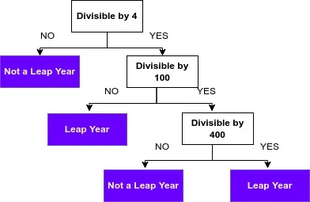
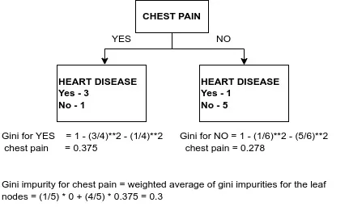
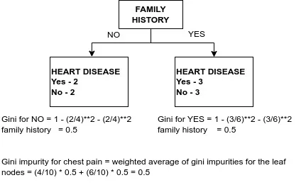
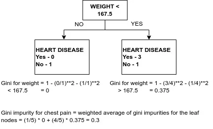

Most of the winning algorithms in machine learning competitions are tree-based models and the base estimator for most of the tree-based models are decision trees. I want to a little dive deeper into the decision tree algorithm as it is simple. Keep in mind that only one decision tree may not be a good model as they are prone to overfit. But the random forest, gradient boosting, and Ada boosting are powerful models and their algorithms are based on the decision tree.

## How does the decision tree work?

It is similar to how to decide leap year or not.

It is the simplest model for the decision tree. It first decides whether the year is divisible by 4. If it is yes, go to the next step. If not, it is not a leap year. Each block can be named as NODE and the “divisible by 4” node is the “**Root Node”.** If there is no next step, it is called “**Terminal Node**” or “**Leaf Node**”, eg- Not a leap year block. If there is a next step to decide, it is called “**Decision Node**”. **Splitting** is the process of dividing the node into two or more sub-nodes. Maximum possible nodes between the root node and leaf node are called **maximum depth** and in this leap year example, it is 3. The above decision node is the **parent node** and the below node is the **child node**, relatively. That’s about how the decision tree works, the condition after we have found our model.

It is easy and simple as we know the formula. How can we find the formula for the decision nodes?

The two main criteria that are used in the sklearn library are GINI and ENTROPY. They will decide the quality of a split for finding the best decision nodes.

## GINI
> Formula for Gini Impurity = 1 - (porbability of yes)\*\*2 - (probability of no)\*\*2

Here suppose we are facing with binary classification problem as it is easy to explain and the formula for multi-classification problem follows the same formula, subtracting the square of the probabilities of the next categories.

Suppose we have a binary classification problem, a group of 10 people with 4 have heart disease and 6 do not. Our goal is to split heart disease or not based on features such as chest pain, family history, age, and so on. First, we will split with chest pain symptoms.

Then we will split heart disease with family history variable.

Suppose if we have only these two features to decide the heart disease, we have to choose the chest pain as it has a low GINI impurity score.

It is how to calculate the GINI impurity score for categorical data. What about the numerical data?

|  |  |
| --- | --- |
| Weight | Heart Disease |
| 155 | No |
| 180 | Yes |
| 190 | No |
| 220 | Yes |
| 225 | Yes |

Let’s calculate with only 5 data. First sort the weight values. Then find the average value between data points and we get 4 average values, 167.5, 185, 205, 222.5. Calculate the GINI impurity scores for each value.

For less than 167.5 lb, the GINI score is 0.3, Then calculate other average values and we will get as follow; 185 is 0.47, 205 is 0.27, 222.5 is 0.4. So best split for weight is 205 lb. Compared with the above variables such as chest pain and family history, the lowest GINI score is by deciding at weight 205 lb with the lowest score of 0.27. So, 205 lb becomes the root node. Then repeat the whole process twice, one for each two sub-nodes. If the parent node has a low GINI score, it will not split. Else it will split and repeat these steps again. That’s all about how to calculate the decision tree by the GINI criterion.

## ENTROPY
> Entropy = - (probability of yes \* log2(probability of yes)) + ( - (probability of no \* log2(probability of no)))

Here you can checkout the [statquest video](https://www.youtube.com/watch?v=YtebGVx-Fxw) how that formula is derived.

For entropy, it is a bit different in the calculation. First, we need to calculate the entropy at each node. Suppose the same problem, a group of 10 people with 4 have heart disease and 6 do not.

We have to calculate the entropy of all 10 people.

Entropy of parent = - (4/10) \* log2(4/10) + ( - (6/10) \* log2(6/10)) = 0.97

Then, split by the chest pain symptoms. Remember the above diagram. If chest pain is present, 3 people with heart disease and 1 normal person and if chest pain is absent, there are 1 person with heart disease and 5 normal people. Let’s calculate entropy for each condition.

For the absence of chest pain, entropy is

Entropy of chest pain present = - (¼) \* log2(¼) + (- (¾) \* log2(¾)) = 0.81

For the absence of chest pain = - (⅙) \* log2(⅙) + (- (⅚) \* log2(⅚)) = 0.651

Then calculate the weighted average to calculate the entropy of chest pain.

Entropy of chest pain = (4/10)\*0.81 + (6/10)\*0.651 = 0.715

This result is subtracted by the parent entropy and the result is called **information gain**.

> Information Gain = Entropy of parent node - Entropy of weighted average of child node

Informatino Gain = 0.97 - 0.715 = 0.255

Then calculate with other variables such as family history, weights, etc. Choose the lowest score and split at that point. Then repeat these steps. That’s about entropy.

It is all about how to create a decision tree.

## Some important hyperparameters
**Maximum Depth** - largest possible length between the root to a leaf. If the maximum depth is large, the tree is prone to overfit.

**Minimum number of samples to split** - the minimum number of samples in a node that needs to split. Eg- min_samples_split is 10, if there are only 9 samples in that node, it will not split. If it is small, it is prone to overfit.

**Minimum number of samples per leaf** - minimum number of samples that are allowed on each leaf. If it is small, it is prone to overfit.

I think coding with sklearn is not difficult and I will skip the coding part. Here you can checkout my [notebook](https://github.com/thihanaung-thnn/MLnotebooks/blob/main/04_iris_best_models.ipynb) of tree models with famous iris dataset.

I hope this will make a lot of sense about decision trees and powerful tree-based ensembled methods are based on this idea.
