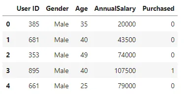
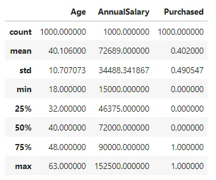
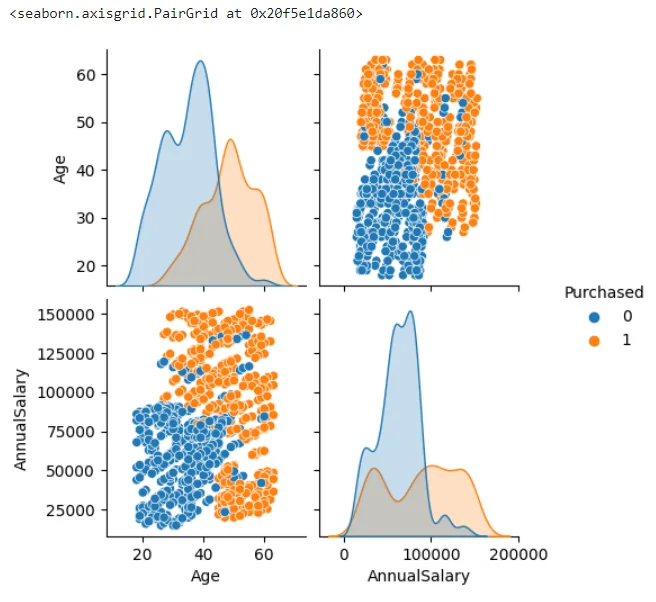
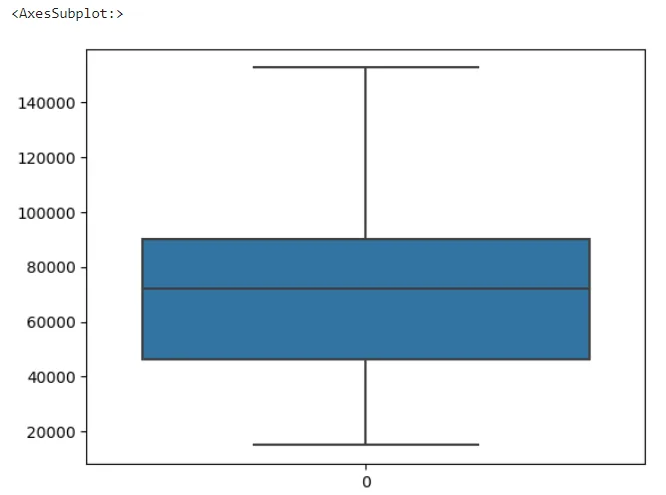
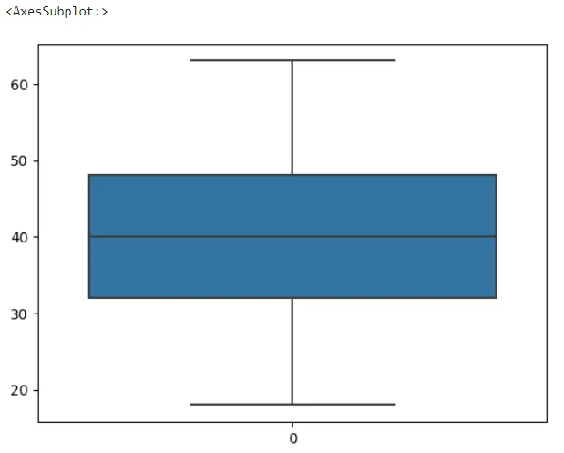
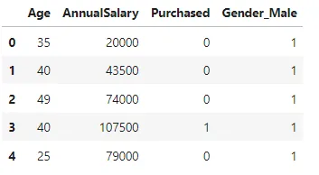
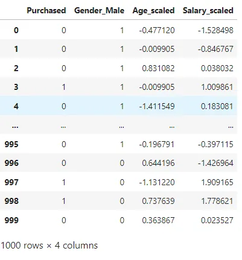
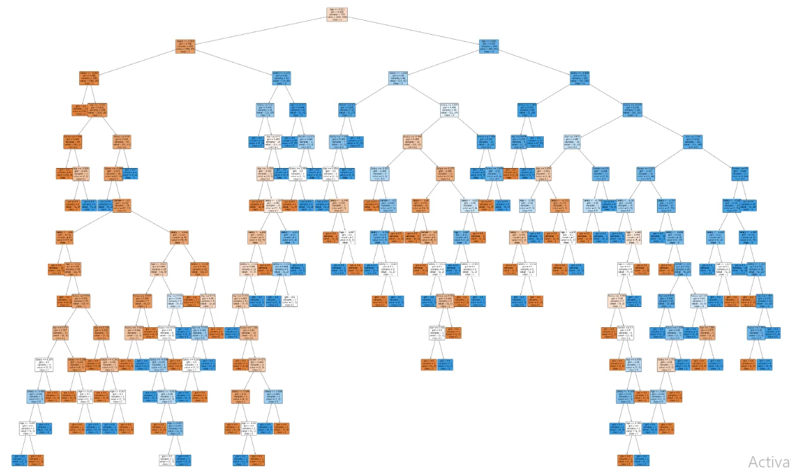

In this blog, we are going to predict that the person will buy a car or not with respect to his age,gender and salary.I got this dataset from kaggle and you can download it using this [link](https://www.kaggle.com/datasets/gabrielsantello/cars-purchase-decision-dataset).Now moving ahead, first import necessary libraries and try to get general ideas of dataset.

```python
import pandas as pd
import seaborn as sns
from sklearn.preprocessing import StandardScaler
data= pd.DataFrame(pd.read_csv('car_data.csv'))
data.head()
```



```python
data.drop('User ID',axis=1,inplace=True)
```

There are four independent features(User ID,Gender,Age and AnnualSalary) and one dependent feature(Purchased).As User ID is not useful for analysis, we have drop this column from dataset. The Purchased column contain two values 0(not purchase) and 1(purchase) so that this is categorical problem.There are not any null columns.

```python
data.info()

<class 'pandas.core.frame.DataFrame'>
RangeIndex: 1000 entries, 0 to 999
Data columns (total 4 columns):
 #   Column        Non-Null Count  Dtype
---  ------        --------------  -----
 0   Gender        1000 non-null   object
 1   Age           1000 non-null   int64
 2   AnnualSalary  1000 non-null   int64
 3   Purchased     1000 non-null   int64
dtypes: int64(3), object(1)
memory usage: 31.4+ KB
```

We can get statistical data using describe method as follows.

```python
data.describe()
```



Now,try to explore the distribution of the dataset using seaborn pairplot.



From the pairplot, there are somehow skewness in the dataset. To get rid of this check as if there may be outliers.

```python
sns.boxplot(data=data['AnnualSalary'])
```



```python
sns.boxplot(data=data['Age'])
```



From the boxplot there are no outliers on Age and AnnualSalary column.

As the dependent column is categorical so that we need to encode them using pandas get_dummies method.

```python
data_encoded = pd.get_dummies(data,drop_first=True)
data_encoded.head()
```



In order to give data for machine learning model we have to input data with same unit.But there are data with different units so we need to scaled it into same unit.For this condition we are going to use StandardScaler method.

```python
scale = StandardScaler()
data_encoded['Age_scaled'] = scale.fit_transform(data_encode d[['Age']])

data_encoded['Salary_scaled'] = scale.fit_transform(data_encode d[['AnnualSalary']])

final_data = data_encoded.drop(['Age','AnnualSalary'],axis=1)
final_data
```



Finally we have cleared our data and now we can apply machine learning model with this data. We have divie dependent and independent column into input and output values like follows.

```python
input_data = final_data.loc[:,['Gender_Male','Age_scaled', 'Salary_scaled']]

output_data = final_data.loc[:,'Purchased']
```

This is catergorical problem so that we are trying to apply Decision Tree method and Random Forest Classifier method.First go with Decision Tree algorithm.

```python
from sklearn.tree import DecisionTreeClassifier
from sklearn.model_selection import train_test_split
from sklearn.metrics import accuracy_score

X_train,X_test,y_train,y_test = train_test_split(input_data.values, output_data, test_size=0.25,random_state=1)
clf = DecisionTreeClassifier(criterion='gini', min_samp les_spl it=2,min_samples_leaf=1)

clf.fit(X_train,y_train)
predict = clf.predict(X_test)print(accuracy_score(y_test,predict))

Output: 0.904
```

The accuracy for the given data is 90.4 percent. Let's plot the tree map.

```python
from sklearn import tree
import matplotlib.pyplot as plt
labels = output_data.unique()
plt.figure(figsize=(80,50))
a = tree.plot_tree(clf,feature_names=['Gender','Age','Salary'],cla ss_n ames =str(labels),rounded=True,filled=True,fontsize=12)
plt.show()
```



Now work with Random Forest Classifier,try to get a best value of n_estimator between 1 to 100 so that we can use a best value of estimator in the model.

```python
from sklearn.ensemble import RandomForestClassifier
accuracy_list = {}
for i in range(1,100):
    forest_clf = RandomForestClassifier(n_estimators = i,criterion =          'entropy')
    forest_clf.fit(X_train,y_train)
    y_pred = forest_clf.predict(X_test)
    from sklearn import metrics
    accuracy_val = metrics.accuracy_score(y_test,y_pred)
    accuracy_list[i] = accuracy_val
max_value = max(accuracy_list,key=accuracy_list.get)
print(max_value,accuracy_list[max_value])
```

```python
output: 8 0.944
```

That means estimator value have highest accucary value among them.So that we are using estimator value 8.

```python
random_forest_clf = RandomForestClassifier(n_estimators = 8)
random_forest_clf.fit(X_train,y_train)
y_predict = random_forest_clf.predict(X_test)
from sklearn import metrics
accuracy_value = metrics.accuracy_score(y_test,y_predict)
print(accuracy_value)
```

```python
0.932
```

The Random Forest Classifier have higher accuracy than Decision Tree algorithm. We can predict the user change purchase a car with this trained model.
