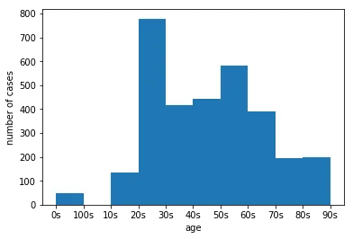
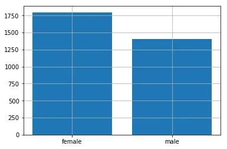
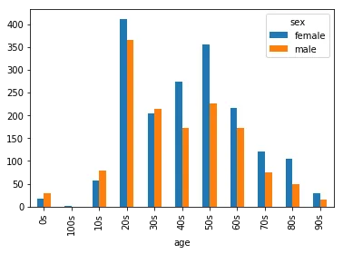
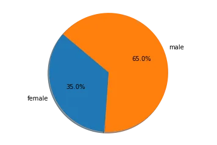
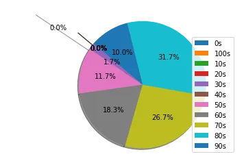

Coronavirus (COVID 19) and it's outbreak is one of the major problems in the last 2 decades. This pandemic has affected the whole world and infected millions of people till date while still increasing steadily. The creation of this blog is to draw insight about this virus and its trend.

This blog will look into the two categories age and gender and how the virus affects these categories.This blog will consist of a series of code snippets, figures with their explanation and conclusion.

**1) Loading the data set**

```python
import matplotlib.pyplot as plt
import pandas as pd
data=pd.read_csv("PatientInfo.csv")
```

The dataset used for analysis is provided by Data Science for COVID-19 (DS4C), it contains 18 columns consisting of records of about 3200 patients in South Korea who have been confirmed with the virus. The main columns used for the analysis are gender, age, confirmed_date ,released_date, deceased_date and state. In this step the data is loaded into a dataframe.

**2) Generation of histogram with age and number of infected cases**

```python
 plt.hist(data['age'].dropna())
 plt.xlabel("age")
 plt.ylabel("number of cases")
 plt.show()
```

- 

*Fig 1: Histogram representing patients according to age group*

A histogram is generated between age and number of confirmed cases. The age category has values ranging from ages less than 10 (0’s), 10s, 20s till 100s. It is clear from the histogram that people from age range 20s to 70s have been highly infected by the virus.

**3) Generation of bar chart representing number of cases with respect to age group for each gender**

```python
pop=data['sex'].value_counts().to_dict() plt.grid() plt.bar(pop.keys(),pop.values()) df=data.groupby(['age','sex'])['patient_id'].count() df.unstack().plot(kind='bar')
```

- 

*Fig 2: Bar chart representing number of cases with respect to age group for each gender*

- 

*Fig 3: Bar chart displaying number of cases as per gender*

The dataset consists of two sex groups: male and female. About 55% of the patients were female and 20s is the highest age group where people were infected. Female patients outnumbered the male patients in most of the age groups.

**4) Generation of pie charts representing the number of death according to gender and representing the number of death according age group**

```python
df3=data.groupby('sex')['deceased_date'].count().to_dict()    plt.pie(df3.values(),labels=df3.keys(),autopct='%1.1f%%', shadow=True, startangle=140)
plt.axis('equal')
plt.show()
```

- 

*Fig 4: Pie chart illustrating the percentage of fatal cases as per gender*

```python
df4=data.groupby('age')['deceased_date'].count().to_dict() explode = (0.3,0.3,0.3,0.3,0,1,0,0,0,0,0) plt.pie(df4.values(),autopct='%1.1f%%',explode=explode, shadow=True, startangle=140)
plt.axis('equal') plt.legend(df4.keys(),loc='lower right')
plt.show()
```

- 

*Fig 5: Pie chart illustrating the percentage of fatal cases as per age group*

It is clear from the pie chart that the death rate of females is more than male. The age group suffering from higher mortality rate are from 50s and upwards.

**5) Conclusion**

According to the data it is clear that females tend to be slightly more infected by the virus then males and the age group from 20s to 60s are also infected more with respect to age with 20s age group being highly infected in both the gender.The mortality rate is about 2%. Even though females have been infected slightly higher but male tend to count more up to about two third of the date rate. Also in the case of the age group people from 50s and higher have a fatal rate while the chance of getting infected for age from 20s to 60s is high.
