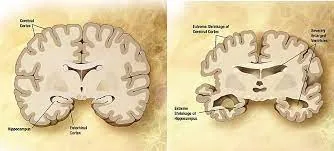
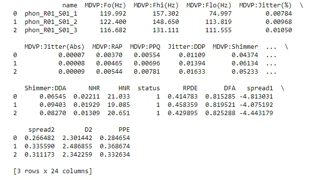
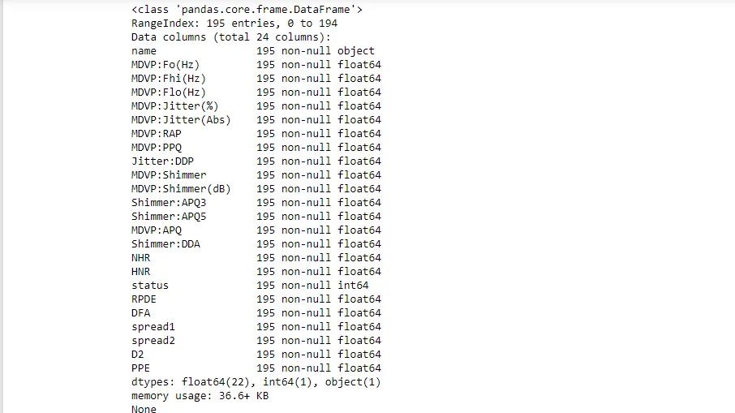
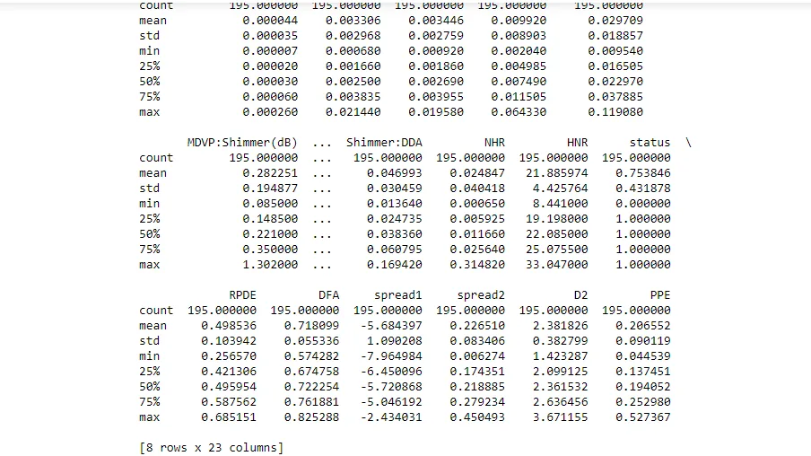
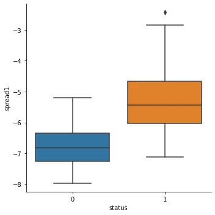
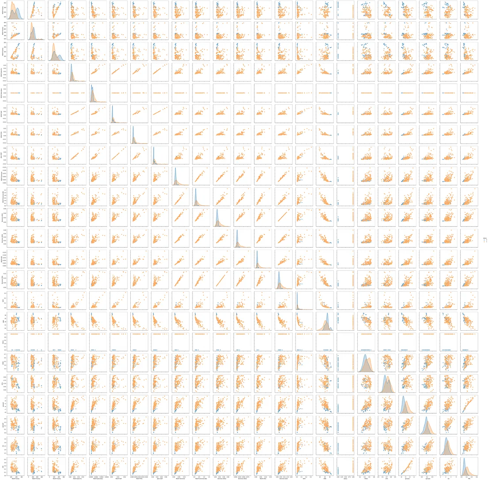
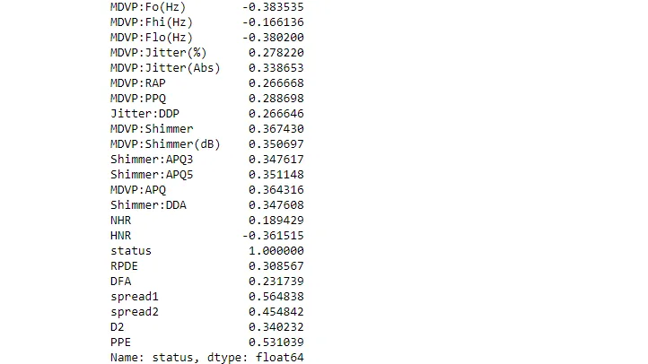

**Neurodegenerative disease** is caused by the progressive loss of structure or function of neurons, in the process known as **neurodegeneration**. Such neuronal damage may ultimately involve cell death. Neurodegenerative diseases include amyotrophic lateral sclerosis, multiple sclerosis, Parkinson's disease, Alzheimer's disease, Huntington's disease, multiple system atrophy, and prion diseases. Neurodegeneration can be found in the brain at many different levels of neuronal circuitry, ranging from molecular to systemic. Because there is no known way to reverse the progressive degeneration of neurons, these diseases are considered to be incurable; however, research has shown that the two major contributing factors to neurodegeneration are oxidative stress and inflammation. Biomedical research has revealed many similarities between these diseases at the subcellular level, including atypical protein assemblies (like proteinopathy) and induced cell death. These similarities suggest that therapeutic advances against one neurodegenerative disease might ameliorate other diseases as well.

It is estimated that 50 million people worldwide have neurodegenerative diseases and that by 2050 this figure will increase to 115 million people.

### Parkinson's disease:
Parkinson's disease (PD) is the second most common neurodegenerative disorder. It typically manifests as bradykinesia, rigidity, resting tremor, and posture instability. The crude prevalence rate of PD has been reported to range from 15 per 100,000 to 12,500 per 100,000, and the incidence of PD from 15 per 100,000 to 328 per 100,000, with the disease being less common in Asian countries.PD is primarily characterized by the death of dopaminergic neurons in the substantia nigra, a region of the midbrain. The cause of this selective cell death is unknown. Notably, alpha-synuclein-ubiquitin complexes and aggregates are observed to accumulate in Lewy bodies within affected neurons. It is thought that defects in protein transport machinery and regulation, such as RAB1, may play a role in this disease mechanism. Impaired axonal transport of alpha-synuclein may also lead to its accumulation in Lewy bodies. Experiments have revealed reduced transport rates of both wild-type and two familial Parkinson's disease-associated mutant alpha-synuclein through axons of cultured neurons. Membrane damage by alpha-synuclein could be another Parkinson's disease mechanism. *In this sense, the adoption of* *computer-aided diagnosis* *tools can offer significant assistance to clinicians.*

**In this project, we will work** **especially** **on** **Parkinson's disease dataset**.

**Dataset Description:**

The dataset used in this article is the Oxford Parkinson's Disease Detection dataset, a dataset from UCI Machine Learning repository, created by Max Little of the University of Oxford, who recorded the speech signals, in collaboration with the National Centre for Voice and Speech, Denver and Colorado. This dataset consists of a series of biomedical measurements of the voice of 31 people23 with Parkinson's disease (PD). It aims to distinguish healthy individuals from patients with Parkinson's disease. Thus, each individual was recorded at least 6 times. Therefore, each column in the table is a particular voice measure, and each row corresponds one of 195 voice recording.

- The target variable is status which is set to 0 for healthy and 1 for patient with Parkinson's disease patients.
- The other variables are: name: It stands for ASCII subject name followed by recording number
- MDVP:Fo(Hz): Average vocal fundamental frequency
- MDVP:Fhi(Hz): Maximum vocal fundamental frequency
- MDVP:Flo(Hz): Minimum vocal fundamental frequency
- MDVP:Jitter(%), MDVP:Jitter(Abs), MDVP:RAP, MDVP:PPQ, Jitter:DDPSev: Seral measures of variation in fundamental frequency
- MDVP:Shimmer, MDVP:Shimmer(dB), Shimmer:APQ3, Shimmer:APQ5, MDVP:APQ, Shimmer:DDA: Several measures of variation in amplitude
- NHR, HNR: Two measures of ratio of noise to tonal components in the voice
- RPDE, D2: Two nonlinear dynamical complexity measures
- DFA: Signal fractal scaling exponent
- spread1, spread2, PPE: Three nonlinear measures of fundamental frequency variation

Let's do some analysis on the dataset

firstly, we install and import the important python libraries and modules.

```python
#installing xgboost
!pip install xgboost

# importing liberaries

import pandas as pd
import numpy as np
import seaborn as sns
import matplotlib.pyplot as plt
from sklearn.preprocessing import MinMaxScaler
from sklearn.model_selection import train_test_split
from sklearn.metrics import accuracy_score
from xgboost import XGBClassifier
```

Here, we import the data

```python
#importing data

df = pd.read_csv('/work/parkinsons.data')
```

Doing some Exploratory data analysis

```python
#Exploring the data Set

df.head(3)
```

output:



```python
# doing some Exploratory data analysis

df.info()
```

output:



```python
df.describe()
```



Here, we do some EDA on the target variable" status" to see if we have a balanced data.

```python
#EDA on target variable

sns.countplot(x='status', data = df)
plt.xlabel('status')
plt.ylabel('count')
plt.title('Distribution of Status')
```


We found that our data is unbalanced.

Here, we do some EDA on features to see the most important features that have an noticed effect on the target variable.

```python
#Doing some EDA on features
# try to find the correlation between each feature and the target variable

# spread1
sns.relplot(x= "spread1", y = 'status', data = df, kind = "scatter")
plt.show()

sns.catplot(x = 'status', y = 'spread1', kind = 'box', data = df)
```




Then, we calculate the correlation between features and the target variable.

```python
#creating a pairplot of the features to know much more
sns.pairplot(df)
plt.show()

#correlation between the features and the target variable
correlation = df.corr()
correlation['status']
```





from the above correlation we found some important notes:

- There is a moderate positive correlation among PPE, Spread1 and Spread2 and the target variable.
- There is also a moderate negative correlation between HNR and status.

Let's build the model that can predict the presence of a neurodegenerative disease in an individual

*It is a supervised learning case because there are labeled data.*

Before building models, it is essential to pre-process the data.

First of all, the data set will be divided into features and corresponding labels. Then, the resulting data set will be divided into training and test sets.

```python
# Data preprocessingfeatures = dataset.loc[:,dataset.columns!='status'].values[:,1:]labels=dataset.loc[:,'status'].values  #Scale the features to between -1 and 1 scaler=MinMaxScaler((-1,1)) x=scaler.fit_transform(features) y=labels  # Split the dataset 80% train and 20% test x_train,x_test,y_train,y_test=train_test_split(x, y, test_size=0.2, random_state=21)   #building a classifier #Instantiate a XGBClassifier model=XGBClassifier()   #fit the classifier to the training set model.fit(x_train,y_train)
```

output[]: XGBClassifier(base_score=0.5, booster='gbtree', colsample_bylevel=1,

colsample_bynode=1, colsample_bytree=1, gamma=0, gpu_id=-1,

importance_type='gain', interaction_constraints='',

learning_rate=0.300000012, max_delta_step=0, max_depth=6,

min_child_weight=1, missing=nan, monotone_constraints='()',

n_estimators=100, n_jobs=0, num_parallel_tree=1,

objective='binary:logistic', random_state=0, reg_alpha=0,

reg_lambda=1, scale_pos_weight=1, subsample=1,

tree_method='exact', validate_parameters=1, verbosity=None)

```python
#predict the test set labels
y_pred=model.predict(x_test)
print(y_pred)
```

output:

97.4

So, the xgbclassifier has learned from the training set and can predict the presence of Parkinson's disease in an individual with 97.4% accuracy.

**Sources:**

- **Predicting Neurodegenerative diseases: Parkinson's disease case.**
- **What are Neurodegenerative Diseases and How Do They Affect the Brain?**
- **Neurodegenerative disease - Wikipedia**
