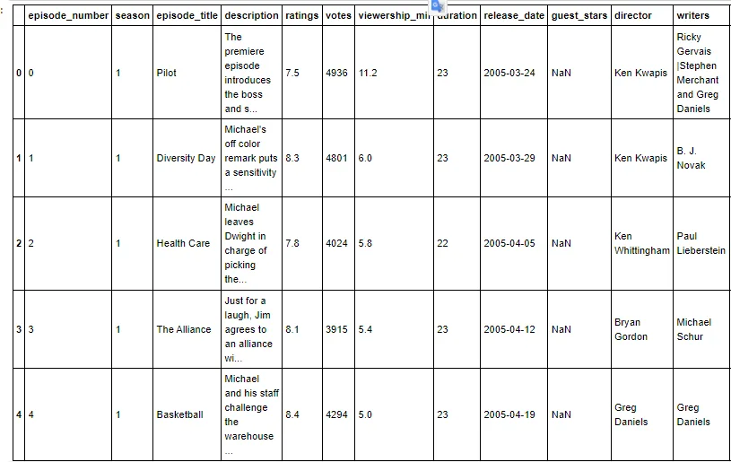
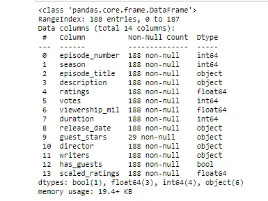
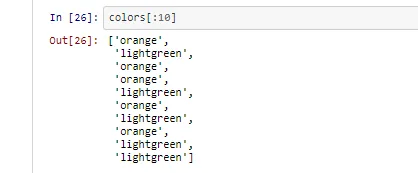
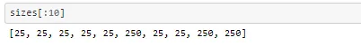
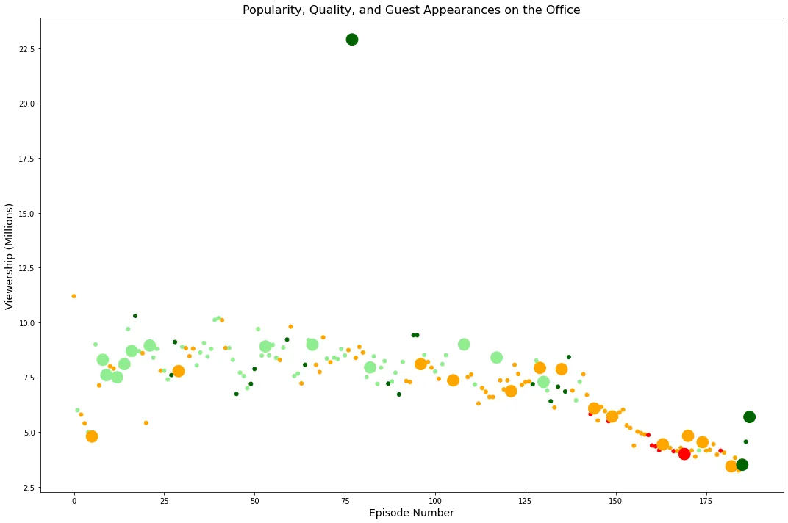
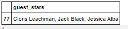

In this blog we will take a look at the data of Guest Stars in The Office.

**The Office** is an American television series that depicts the everyday work lives of office employees in the Scranton, Pennsylvania, branch of the fictional Dunder Mifflin Paper Company. It aired on **NBC** from March 24, 2005, to May 16, 2013, spanning a total of nine seasons. Based on the 2001–2003 **BBC** series of the same name created by *Ricky Gervais* and *Stephen Merchant*.

## *The Dataset:*
The original dataset is titled with *"The Office Dataset"*. It is obtained from **Kaggle** website and uploaded by the username: *"nehaprabhavalkar".*

This dataset contains information on a variety of characteristics of each episode. In detail, these are:

**datasets/office_episodes.csv**

- **episode_number:** Canonical episode number.
- **season:** Season in which the episode appeared.
- **episode_title:** Title of the episode.
- **description:** Description of the episode.
- **ratings:** Average IMDB rating.
- **votes:** Number of votes.
- **viewership_mil:** Number of US viewers in millions.
- **duration:** Duration in number of minutes.
- **release_date:** Airdate.
- **guest_stars:** Guest stars in the episode (if any).
- **director:** Director of the episode.
- **writers:** Writers of the episode.
- **has_guests:** True/False column for whether the episode contained guest stars.
- **scaled_ratings:** The ratings scaled from 0 (worst-reviewed) to 1 (best-reviewed).

## *Import Libraries*
First, we import the libraries that we will use in our code:

```python
import pandas as pd
import numpy as np
import matplotlib.pyplot as plt
```

***Read the Data***

Here we read the data CSV file into a pandas dataframe and view a couple of rows.

```python
data=pd.read_csv('datasets/office_episodes.csv')
data.head()
```

output:



we need to know some information about the data so we use .info( ):

```python
data.info()
```

output:



***Exploratory data analysis***

at the first we will colorize each episode based on its rating so we will create a list called colors, then loop over each episode and check it's scaled rating, if it's below 0.25 we append the color red to the list, if it's between 0.25 and 0.50, we append the color orange, if it's between 0.50 and 0.75, we append the light green color, and finally, dark green for all the episodes that have a rating above 0.75.

```python
colors=[]
for lab, row in data.iterrows():
 if row['scaled_ratings'] < 0.25:
  colors.append("red")
 elif 0.25 <= row['scaled_ratings'] < 0.50:
   colors.append("orange")
 elif 0.50 <= row['scaled_ratings'] < 0.75:
   colors.append("lightgreen")
 else:colors.append("darkgreen")
```

now we show the first ten rows in the color list :

```python
colors[:10]
```

so the output :



now we will resize each episode point based on guests so We will create a list called sizes, and append a size of 25 for episodes with no guests, and 250 otherwise.

```python
sizes[]
forlab,row in data.iterrows():
 if row['has_guests']==True:sizes.append(250)
 else: sizes.append(25)
```

now we show the first ten rows in the size list :



now we will create scotter plot to visualize the epsiode:

```python
fig = plt.figure(figsize=(15,10))
# Create a scatter plot
plt.scatter(data["episode_number"], data["viewership_mil"], c = colors, s = sizes)
# Create a title
plt.title('Popularity, Quality, and Guest Appearances on the Office', size = 16)
# Create an x-axis and an y-axis
plt.xlabel('Episode Number', size = 14)
plt.ylabel('Viewership (Millions)', size = 14)
# Show the plot
plt.show()
```



we need to know the top star so we need to know the highest view

```python
# The highest view
highest_view = max(data["viewership_mil"])
# Filter the Dataframe row that has the most watched episode
most_watched_dataframe = data.loc[data["viewership_mil"] == highest_view]
# Top guest stars that were in that episode
top_stars = most_watched_dataframe[["guest_stars"]]
top_stars
```

output:



**At the end I hope to get this blog useful for you thanks for reading.**

**Recourses:**

**Wikipedia:**

<https://en.wikipedia.org/wiki/The_Scrantones>

**Original dataset :**

https://www.kaggle.com/nehaprabhavalkar/the-office-dataset

**code on github:**

https://github.com/alaa-mohamed98/Investigating-Guest-Stars-in-The-Office
