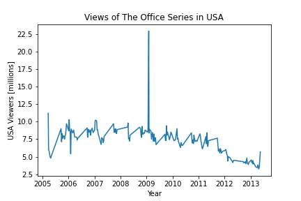
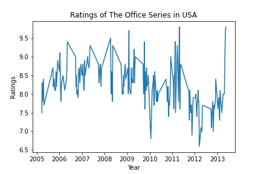
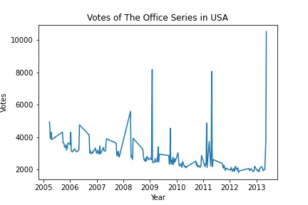
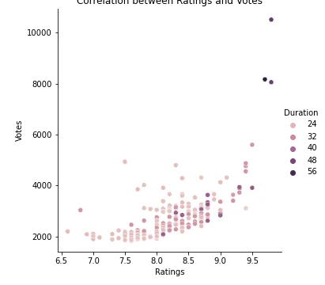

In this project, we will take a look at a dataset of The Office episodes, and try to understand how the popularity and quality of the series varied over time.

It is worth knowing that the dataset was downloaded from Kaggle.
First off, we will need to import the necessary packages and libraries to help us with our data exploration. And the following in the below cell are crucial!

```python
import pandas as pd
import matplotlib.pyplot as plt
import numpy as np
import seaborn as sns
```

The dataset is stored in a CSV file at the root of our project. It's called 'the_office_series.csv'. We will now import it in a pandas DataFrame called `df`.

```python
df = pd.read_csv('the_office_series.csv')
```

It is always a good practice to have a sneak peek at the first few rows of the DataFrame after loading. We will use the head() to accomplish this.

```python
df.head()
```

The first part of our work is to clean the DataFrame and make it suitable for analysis.

From a first glance, we could see a few things of interest.

- A column named 'Unnamed: 0'
- NaN values in the GuestStars column

But before we deal with this, let's first look at the columns we have in the DataFrame.

```python
df.columns
```

```python
Output:
Index(['Unnamed: 0', 'Season', 'EpisodeTitle', 'About', 'Ratings', 'Votes',
       'Viewership', 'Duration', 'Date', 'GuestStars', 'Director', 'Writers'],
      dtype='object')
```

From the first few rows of the data frame, we see that column `Unnamed: 0` is kind of useless as it has the same values as the index.

In that case, it is best to drop that column.

```python
df.drop(columns='Unnamed: 0', inplace=True)
```

We also listed above that the column GuestStars has NaN values. The questions now are:

- Are those five rows the only missing values or are there more?
- Are there any other fields with missing data?
- Is there enough missing data in a column to warrant it to be dropped?

Well, the below cell will give us an insight into this and give us the necessary answers.

```python
df.isnull().sum()
```

```python
Season            0
EpisodeTitle      0
About             0
Ratings           0
Votes             0
Viewership        0
Duration          0
Date              0
GuestStars      159
Director          0
Writers           0
dtype: int64
```

The good news is, that only one column in the data frame has missing values. But that column has about 85% of its data missing. The standard practice recommends that a field needs to be dropped if 75% or more of its data is missing.

So we will drop this column!

```python
df.drop(columns='GuestStars', inplace=True)
```

```python
df.shape
```

```python
(188, 10)
```

Our data frame now has 188 observations and 10 fields.

Another important thing we normally do is to check the general information of the data frame. The info method comes in handy here.

```python
df.info()
```

```python
<class 'pandas.core.frame.DataFrame'>
RangeIndex: 188 entries, 0 to 187
Data columns (total 10 columns):
 #   Column        Non-Null Count  Dtype
---  ------        --------------  -----
 0   Season        188 non-null    int64
 1   EpisodeTitle  188 non-null    object
 2   About         188 non-null    object
 3   Ratings       188 non-null    float64
 4   Votes         188 non-null    int64
 5   Viewership    188 non-null    float64
 6   Duration      188 non-null    int64
 7   Date          188 non-null    object
 8   Director      188 non-null    object
 9   Writers       188 non-null    object
dtypes: float64(2), int64(3), object(5)
memory usage: 14.8+ KB
```

From the output above, it's noteworthy to double-check the Date field. Its data type is an object even though the values are in a date format.
Since we want to understand how the popularity and quality of the series varied over time, it will be better to have this field converted to DateTime. And that is what we are doing next.

```python
df['Date'] = pd.to_datetime(df['Date'])
```

Let's have another look at the head of the data frame.

```python
df.head()
```

Fact that we are interested in the variation of popularity and quality over time, making the data frame a time series is suitable. So we will set the index to the `Date` column.

```python
df.set_index('Date', inplace=True)
```

**Exploratory Data Analysis**

Now that we are done with the data cleaning phase, it's time to do some exploration to infer some insights and answer the ultimate question of the project. But we will start by looking at the summary statistics of the numerical fields of the data frame.

```python
df.describe()
```

From the summary statistics, everything looks pretty good. We will now visualize the trend of the viewership over time.

```python
plt.plot(df['Viewership'])
plt.xlabel('Year')
plt.ylabel('USA Viewers [millions]')
plt.title('Views of The Office Series in USA')
plt.show();
```



The graph above indicates that the viewership in the USA was somewhat relatively constant between 2005 to 2008. But there was a sharp spike in 2009 resulting in over 22 million views. And there was a downward trend between 2011 and 2013.

We will now check the ratings and votes over the years.

```python
plt.plot(df['Ratings'])
plt.xlabel('Year')
plt.ylabel('Ratings')
plt.title('Ratings of The Office Series in USA')
plt.show();
```



```python
plt.plot(df['Votes'])
plt.xlabel('Year')
plt.ylabel('Votes')
plt.title('Votes of The Office Series in USA')
plt.show();
```



These two graphs do not seem to provide a positive relationship with time.
But let's look at the correlation between the numeric fields and plot their relationship.

```python
df.corr()
```

It looks like Ratings and Votes have a strong positive correlation (0.65). We will ascertain this with the help of a relplot from the seaborn library.

```python
sns.relplot(x='Ratings', y='Votes', data=df, hue='Duration');
```



And Indeed it does!

### Conclusion

Overall, there is no very major changes to the viewership of the `The Office` over time.
