**The Office** is an American television series that depicts the everyday work lives of office employees in the Scranton, Pennsylvania, branch of the fictional Dunder Mifflin Paper Company. It aired on **NBC** from March 24, 2005, to May 16, 2013, spanning a total of nine seasons. Based on the 2001–2003 **BBC** series of the same name created by *Ricky Gervais* and *Stephen Merchant*.

In this blog, we will look at a dataset that contains information on a variety of characteristics of each episodes, and derive some insights through data visualization by python libraries such as matplotlib, seaborn, and plotly.

## The Dataset
The original dataset is titled with *"The Office Dataset"*. It is obtained from **Kaggle** website and uploaded by the username: *"**nehaprabhavalkar**".*

I applied some preprocessing to the data, so the final dataset features looks like this:

## Import Libraries
First, we import the required libraries for our python code.

```python
import numpy as np
import pandas as pd
import matplotlib.pyplot as plt
import plotly_express as px
import plotly.graph_objects as go
import seaborn as sns
from sklearn.preprocessing import MinMaxScaler
```

## Read the data
Here we read the data CSV file into a pandas dataframe and view a couple of rows.

```python
office_df = pd.read_csv('D:/guest_stars/the_office_series.csv')
office_df.head()
```

This will result in:

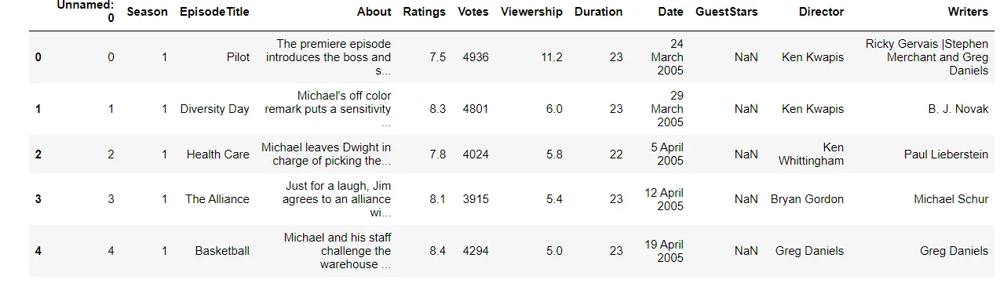

## Preprocessing
Here, we change columns names for better naming conventions

```python
columns_names = ['episode_number', 'season', 'episode_title', 'description', 'ratings', 'votes', 'viewership_mil', 'duration', 'release_date', 'guest_stars', 'director', 'writers']

office_df.columns = columns_names
```

Let's see general info about the data

```python
office_df.info()
```

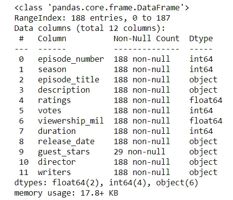

## Feature Engineering
As we've noticed in the results above, we see that the column *"guest_stars"* has just 29 non-null values!

**No worries,** this is because just few episodes had guests, other had not.

Of course, we will use this feature to add an important feature to our dataset, a feature that is **True** when the episode had guests, and **False** otherwise!

```python
cc = np.where(office_df.guest_stars.isnull(), False, True)
office_df['has_guests'] = cc
```

Now the dataset contains an extra feature named *"has_guests"* which contains Boolean values for each episode about having guests.

**Another thing we'd like to do**, is to normalize the ratings column. Originally, it contains float rating values from 0 to 10.

We will use the *MinMaxScaler* class from *sklearn.preprocessing* module to create a scaled rating feature in which the values are scaled between 0 and 1.

```python
scaler = MinMaxScaler()
office_df[["scaled_ratings"]] = scaler.fit_transform(office_df[["ratings"]])
```

**Great!** Feature Engineering is done, now we have two extra features: *has_guests* and *scaled_ratings*

## Let's Visualize!

### 1. Which season has the highest rate?
To answer this question, we will use the seaborn catplot function with the following settings:

- season number on the x-axis
- rating on the y-axis
- kind = bar; to plot a bar chart
- ci = None; to remove the confidence interval marks

```python
sns.catplot(x = "season", y = "ratings", kind='bar', data = office_df, ci=None)
plt.show()
```

This should results in the following chart:

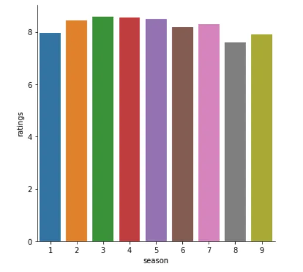

It looks like **season number 3** had the highest rate ever!

### 2. Episodes vs Views
Let's plot episodes and their views. To do so we will use the *scatter* function form *matplotlib.pyplot* module with the following parameters:

- episode number on the x-axis
- episode views (in millions) on the y-axis

```python
plt.figure(figsize=(11, 6))
plt.scatter(x = office_df['episode_number'], y = office_df['viewership_mil'])
plt.show()
```

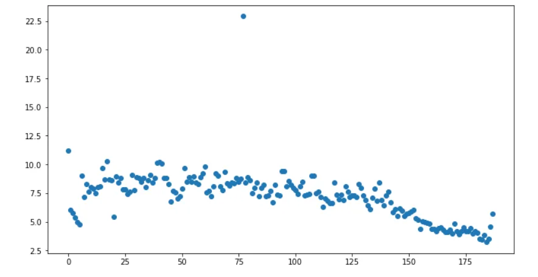

Look's great but not so informative!

#### Let's colorize each episode based on it's rating!

We will create a list called colors, then loop over each episode and check it's scaled rating, if it's below 0.25 we append the color red to the list, if it's between 0.25 and 0.50, we append the color orange, if it's between 0.50 and 0.75, we append the light green color, and finally, dark green for all the episodes that have a rating above 0.75.

```python
colors = [ ]
for rid, row in office_df.iterrows():
    if row['scaled_ratings'] < 0.25:
        colors.append('red')
    elif row['scaled_ratings'] < 0.50:
        colors.append('orange')
    elif row['scaled_ratings'] < 0.75:
        colors.append('lightgreen')
    else:
        colors.append('darkgreen')
```

Now we add an additional parameter to the *scatter* function, which is *c* that will be assigned to the created list.

```python
plt.figure(figsize=(11, 6))
plt.scatter(x = office_df['episode_number'],
            y = office_df['viewership_mil'],
            c = colors
           )
plt.show()
```

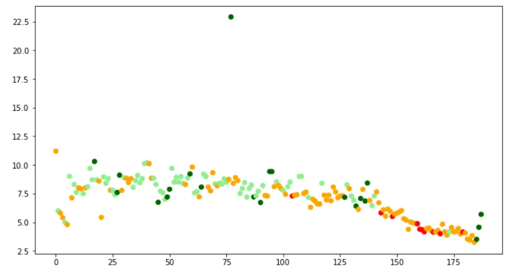

Looks nice! But we can do better!

#### Let's resize each episode point based on guests!

We will create a list called sizes, and append a size of 25 for episodes with no guests, and 250 otherwise.

```python
sizes = []

for rid, row in office_df.iterrows():
    if row['has_guests'] == False:
        sizes.append(25)
    else:
        sizes.append(250)
```

and assign that list to the parameter *s* of the *scatter* function.

```python
plt.figure(figsize=(15, 8))
plt.scatter(x = office_df['episode_number'],
            y = office_df['viewership_mil'],
            c = colors,
            s = sizes
           )
plt.show()
```

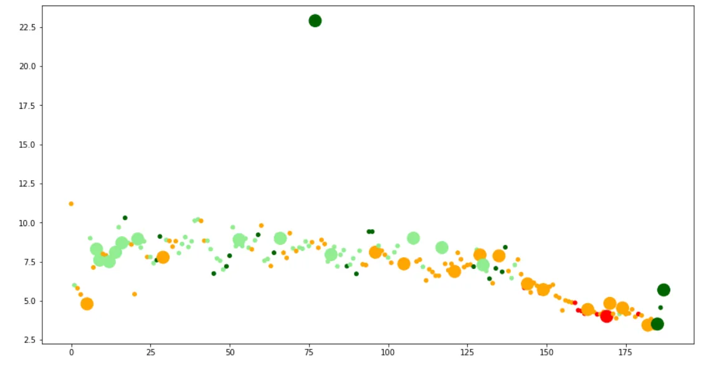

Now it looks better! But one thing that we have to do is:

#### Adding axis labels and title

```python
plt.title("Popularity, Quality, and Guest Appearances on the Office")
plt.xlabel("Episode Number")
plt.ylabel("Viewership (Millions)")
plt.show()
```

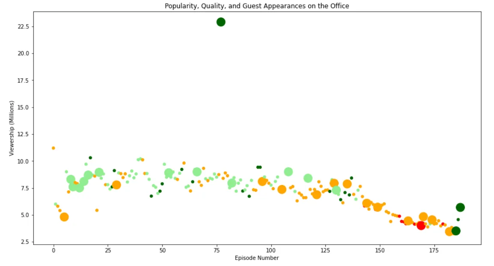

Let's do one last thing.

Can we change the **point style** based on having guests?

**Yes we can!** However, there is **no** direct way to that in scatter function!

We will split the data, making two data frames, one for episodes contain guests, the other one for the remaining. Then we plot data using the two data-frames, however, changing the *marker* parameter to star (\*) for episodes that have guest stars!

Let's do that!

Let's first add the two lists that we created (colors, and sizes) to the dataframe.

```python
office_df['colors'] = colors
office_df['sizes']  = sizes
```

Then we create two separate data-frames:

```python
# Non-Guest Episodes
non_guest_df = office_df[office_df['has_guests'] == False]

# Has-Guest Episodes
guest_df = office_df[office_df['has_guests'] == True]
```

And plot!

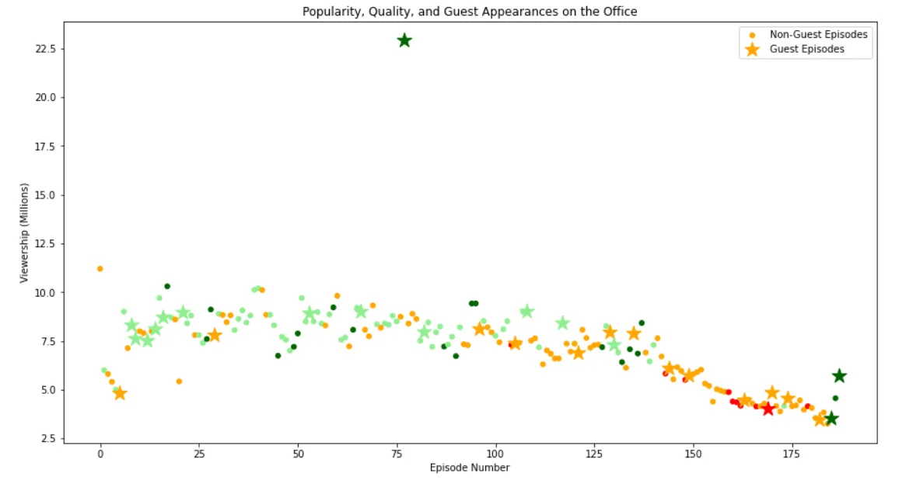

Alright! Looks neat!

We can tell from the scatter plot that the views were increasing in the first episodes, and started to decrease in the last episodes.

Moreover, you may noticed that there is that one episode that has the highest rate ever, and it has guest stars. Let's see them! They maybe the reason for the exceptional rate!

```python
office_df[office_df['viewership_mil'] == office_df['viewership_mil'].max()]['guest_stars']
```

This will result in:

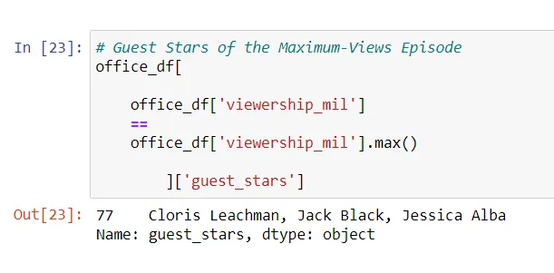

Alright, enough for episodes and views. Let's see a line plot for episodes and rating!

### 3. Episodes vs Ratings
```python
plt.figure(figsize=(11, 6))
plt.plot(office_df['episode_number'], office_df['scaled_ratings'])
plt.xlabel("Episodes")
plt.ylabel("Scaled Ratings")
plt.title("Episodes Ratings")
plt.show()
```

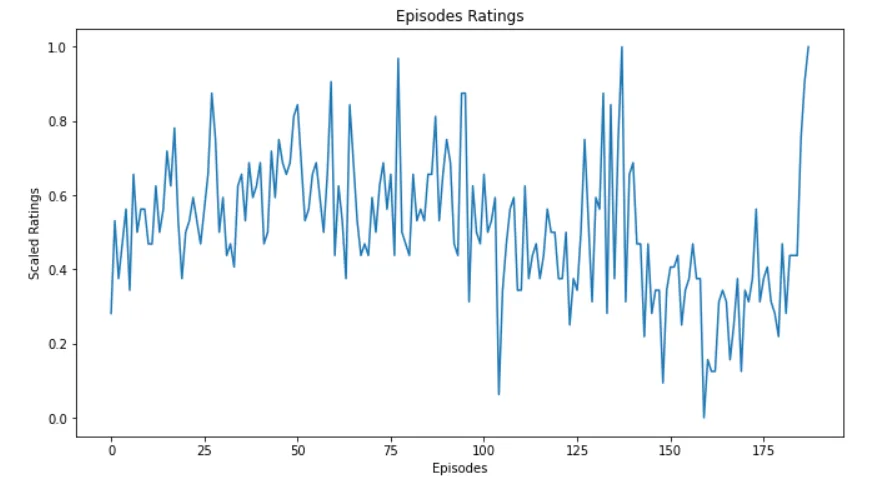

What about episodes duration? Can we plot the longest episodes considering those who have the highest rate?

### 4. Top 10 Longest Episodes
To do this, first we will sort the data-frame by duration and rating in descending order and extract the first 10 episodes, assigning the result in a new data-frame.

```python
top_10_long =
    (office_df.sort_values
        (by=['duration','ratings'],
            ascending=False)
     ).iloc[:10,:]
```

Using the *bar* method from *plotly_express* module we can plot episode title on x-axis and duration on y-axis.

```python
fig = px.bar(top_10_long,
             x='episode_title',
             y='duration',
             color_discrete_sequence=['gold'])

fig.update_layout(
           title_text='Top 10 longest episodes of all time'
           )

fig.show()
```

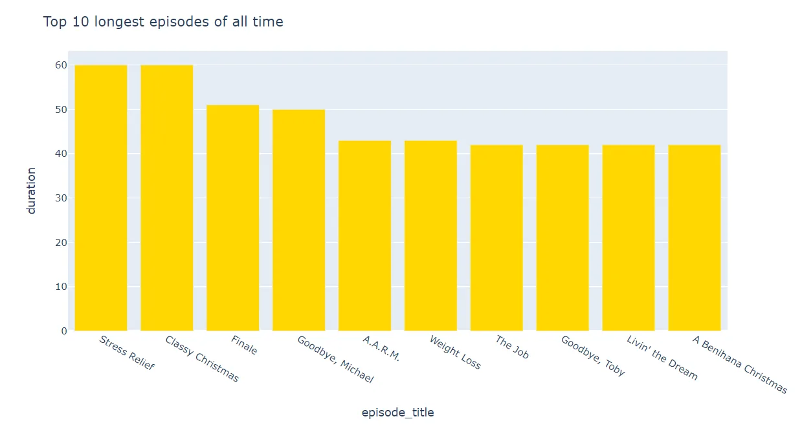

### 5. Season's Guest Stars
How about we make a pie chart that shows the percentage of guest stars in each season! Is that possible?

Well, with the module *plotly.graph_objects* and it's functions *Figure and Pie* everything is possible!

First, we will create a data-frame that contain each season with the corresponding guest star numbers.

```python
g =
office_df.groupby('season')['guest_stars'].count().reset_index()
```

Then we can pass to the *Figure* function the parameter *data* which is a list that contain calling the function *Pie* with the following parameters:

- labels: to represent each season.
- values: to represent the number of guest stars
- sort: will be assigned to False because we have already sorted the data with *reset_index* function
- marker: here we pass a dictionary with a single key *"colors"* and it's value, which is a list of colors. We can use a predefined one like: *"px.colors.qualitative.Prism"*

```python
fig = go.Figure(data=[go.Pie(
          labels=g['season'],
          values=g['guest_stars'],
          sort=False,
          marker=dict(colors=px.colors.qualitative.Prism))])

fig.update_layout(title_text='Number of guest stars appeared each season')

fig.show()
```

and the magic happens!

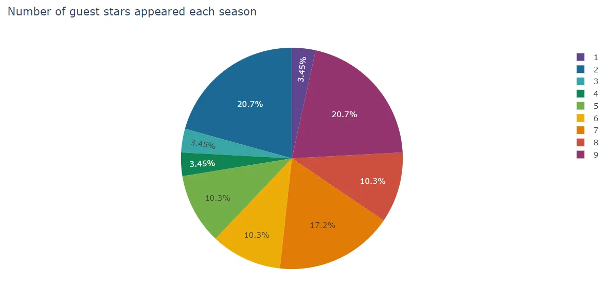

The season 9 and 2 have the most guest stars episodes!

### 6. Top 10 Highest Voted Episodes
```python
top_10_voted =
(office_df.sort_values
    (by=['votes','ratings'],ascending=False)).iloc[:10,:]

fig = px.bar(top_10_voted,
x='episode_title',
y='votes',
color_discrete_sequence=['green'])

fig.update_layout(title_text='Top 10 highest voted episodes of all time')

fig.show()
```

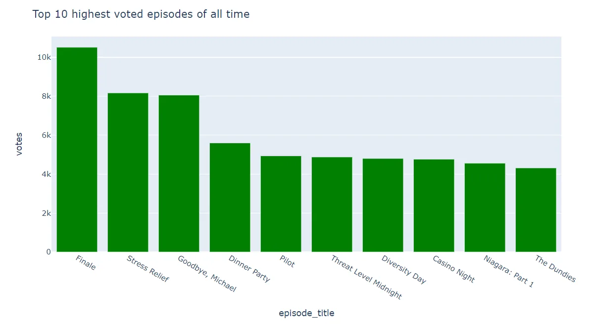

### 7. Seasons Ratings, Views, and Votes!
```python
fig = px.scatter(office_df,
                 x='ratings',
                 y='votes',
                 color='season',
                 size='viewership_mil',
                 size_max=60)

fig.update_layout(
title_text=
   'Viewership based on ratings and votes for each season',
template='plotly_dark')

fig.show()
```

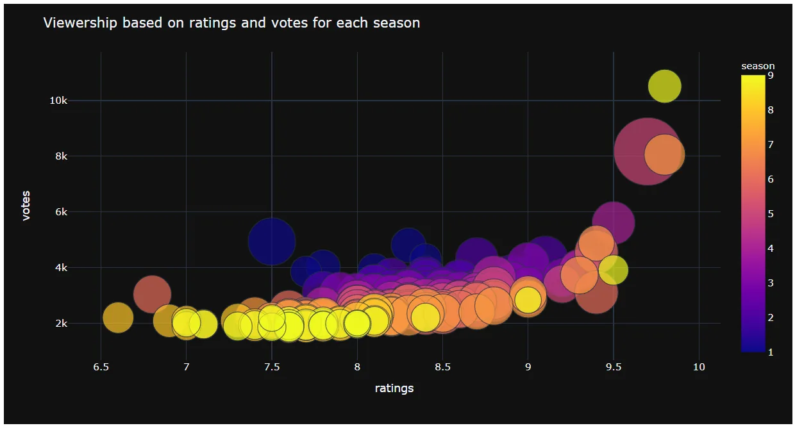

### 8. Total Ratings across Seasons
The total rating for an episode can be calculated by multiplying it's ratings by its votes.

```python
office_df['totat_ratings'] =
office_df['ratings'] * office_df['votes']
```

Now, we will create a data-frame that contains information about the seasons durations and total ratings.

```python
averageDurationTotalRating =
office_df.groupby(['season'])[['duration','totat_ratings']].mean().reset_index()
```

This will look like this:

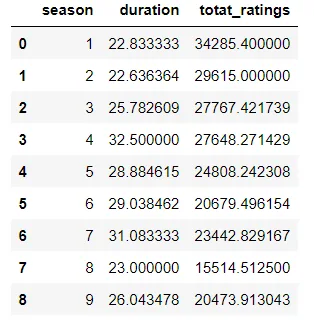

Plotting:

```python
fig =
px.scatter(averageDurationTotalRating,
x = 'season',
y = 'totat_ratings',
trendline = 'ols',
size = 'duration',
title = '<b>Total Rating across Seasons</b>')

fig.show()
```

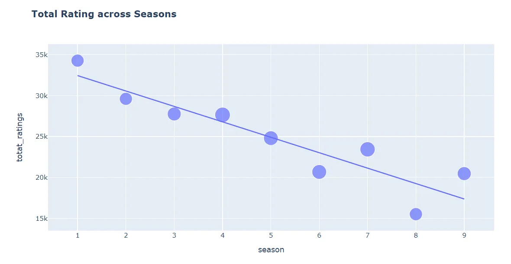

### 9. Director's Ratings
We will plot the ratings for episodes directors!

First, group the data-frame by directors, and calculate the mean of the episodes' ratings which each director has directed!

```python
directorAvgRating =
office_df.groupby('director')['ratings'].mean().reset_index()
```

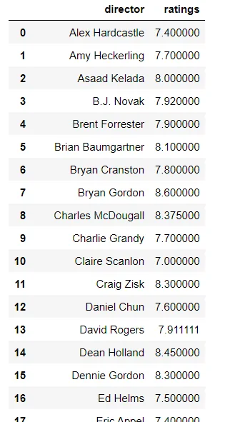

There is one row contains "See full summary" in the director column.

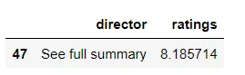

We will remove that.

```python
directorAvgRating = directorAvgRating[directorAvgRating['director'] != 'See full summary']
```

Lastly, we will sort the data-frame by the ratings in descending order.

```python
directorAvgRating =
directorAvgRating.sort_values(
by = 'ratings',ascending = False)
```

Alright, now we have the data-frame, what's next?

well, the data-frame cotains too many directors, which couldn't be visualized.

We will create a list for the directors that were part of the cast also.

```python
castDirectors = ['Paul Lieberstein', 'B.J. Novak','Steve Carell', 'John Krasinski','Rainn Wilson','Mindy Kaling']
```

then plot the ratings for just those.

```python
fig = px.bar(
directorAvgRating[directorAvgRating['director'].isin(castDirectors)],
x = 'ratings',
y='director',
orientation='h',
color='ratings',
color_continuous_scale='peach')

fig.update_layout(coloraxis_showscale=False)

fig.show()
```

and there you go!

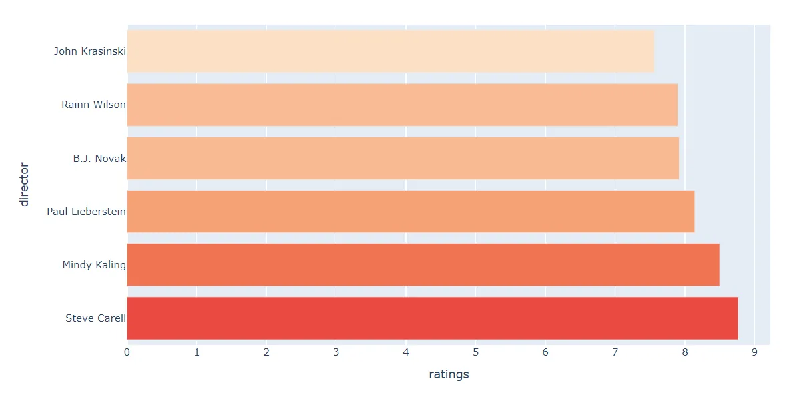

**And that's it!**

**Thanks for reading!**

**Note:** You can find code included in the blog in my [Github.](https://github.com/96ibman/datainsight_datascience_program/blob/main/guest_stars.ipynb)

Best Regards.

## Acknowledgment
This blog is part of the [Data Scientist program by Data Insight](https://www.datainsightonline.com/data-scientist-program).

## References
1. [DataCamp project: Investigating Netflix Movies and Guest Stars in The Office.](https://linktrest.io/datacamp-data-scientist-track)
2. [Original Dataset](https://www.kaggle.com/nehaprabhavalkar/the-office-dataset)
3. [Blog Cover](https://home.adelphi.edu/~cl22261/the%20office%20pic.jpg)
4. [Wikipedia](https://en.wikipedia.org/wiki/The_Office_(American_TV_series))
