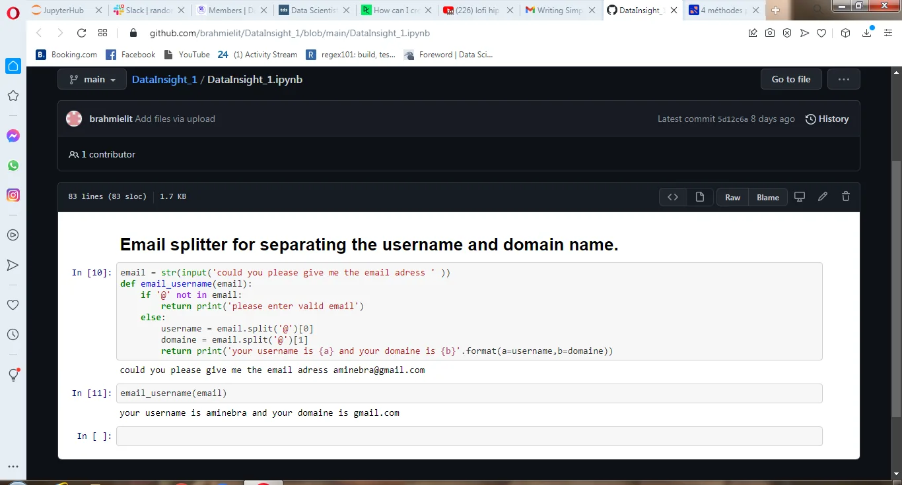

in this python mini application i will try to check first if the email given by the use contains '@' so it is may be a real email.

email = str(input('could you please give me the email adress ' )) '''input the email from the user as str'''

''' defining a funtion that get the email as input, first of all it will check if the email is real, second it will display the user name and the domaine '''

def email_username(email):

if '@' not in email:

return print('please enter valid email')

else:

username = email.split('@')[0]

domaine = email.split('@')[1]

return print('your username is {a} and your domaine is {b}'.format(a=username,b=domaine))



```python
email = str(input('could you please give me the email adress')
''' this line is meant to input the email given by the user and transofmed it into string'''
def email_username(email):a
      if '@' not in email:
         return print('please enter valid emil')
         #testing the email by seeing if it contain the '@'
       else:
          username = email.split('@')[0]
      '''splitting the mail by the delimiter '@' that will return a list, to select the username we have to select the index 0'''
         domaine = email.split('@')[1]
      #the email is the index 1
          return print('your username is {a} and your domaine is {b}'.format(a=username,b=domaine))
```
