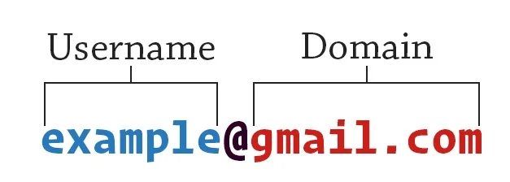

### Introduction:

Mail has become an integral part of our daily lives. But how do these email addresses work, and what sequence do the domains maintain?

The general format of an email address is [*example@gmail.co*](mailto:example@gmail.com)*m*

To distinguish email addresses, we must first fully understand the parts of the address. There username part which appear at the begining of adress, before '@' sign. After that, there is a domain part, the name of which depends on the company that owns the Mail we use.

##### Code and It's Explanation

###### Get username and domain

Initially, we get the mail address as input. In the second stage, we split down the value we have. And print the result.

Here we will use 're', which is python's library for regular expression. Again, we will get the mail address as input. And we will encode the sequence of letters and characters in regex according to the order of the valid mail. Let's define mail_check function for checking is given mail adress valid or not.

In this stage we create Capitalize function which first check is email valid after that, it splits string in term of name, username and domain part. First we split adress by '@' symbol, in the next stage we do the same operation again by '.' symbol for geting to Name and Surname.

We use map() function for capitalize the strings

### Conculusion:
We have developed an app that separates inclined usernames and domains, as well as checks whether the given address is valid or not. If you want to see all the codes together, you can use this link:

<https://github.com/Ibrahimbeu/Print>
