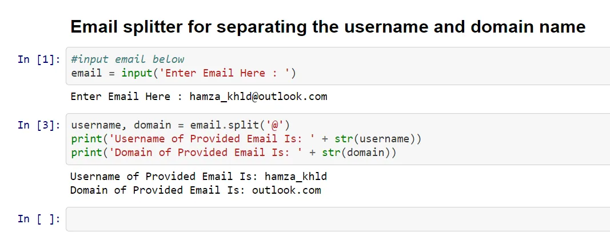

This is my task # 01 for the first assignment from the task list uploaded in Google Classroom.

My Code Description:

- First the user will enter the email.

- Then the email will split into 2 parts which will saved in two variables assigned to the method split.

- Then print the username and domain name separately via print method.

What Is Split Built in Function:

- This method is used to split the given value/string as per the input symbol.

- Like in my case my email was [hamza@outlook.com](mailto:hamza@outlook.com) and used @ in split method so the email divided into 2 parts left (hamza) is the username and right [(outlook.com)](http://outlook.com)

- As I divided the string using "@" so it will not include in the divided parts.

Code Is Attached Below as a snip of Jupyter Notebook.

Thankyou.

Regards,

Hamza Khalid
