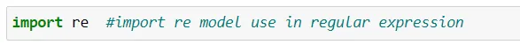
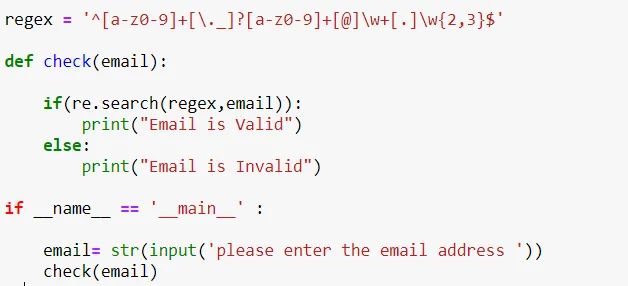
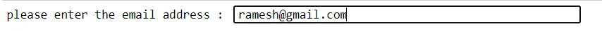
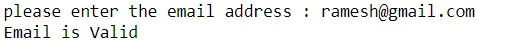
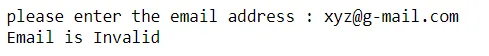

Python is a multipurpose, high level programming language. It is mostly used in software development, web development, data science and Artificial Intelligence (AI). In this blog we will explain about to check the email address is valid or not using regular expression in python. In email address @ symbol is used to separate string into two parts. First part is Email name and second part is domain of email.

For example : [firstname.lastname@gmail.com](mailto:firstname.lastname@gmail.com)

Here : firstname.lastname is email name and gmail.com is domain of gmail.

Python Regular Expression:

Regular expressions are a powerful language for matching text patterns .A series of characters defining a search pattern is called a regular expression. Patterns are used to "find" or "find and replace" operations on strings or for input validation by string-searching algorithms

Sample Regex for email = '^[a-z0-9]+[\._]?[a-z0-9]+[@]\w+[.]\w{2,3}$'

Python "re" module provides regular expression support

Assign regular expression for email validation check.

Define check function to check email input by the user.

The re.search () method takes a regular expression pattern and a string and searches for that pattern within the string. If the search is successful, search() returns a match object or None otherwise

Ask the input email from user and check.

Output:

