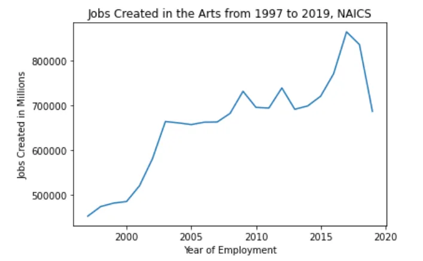
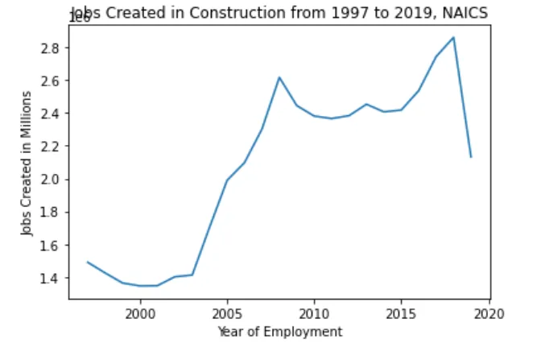
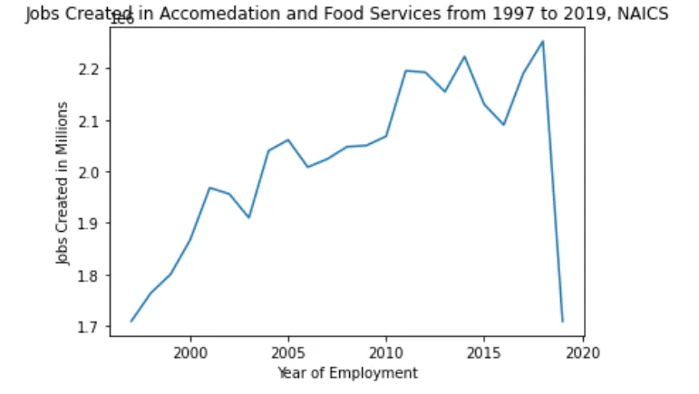
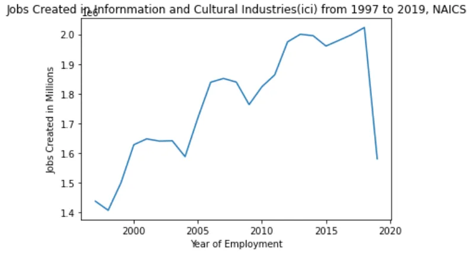
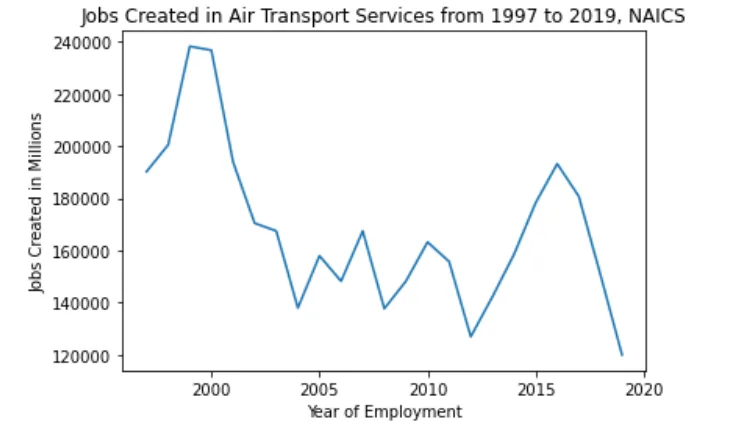

## Introduction
NAICS stands for North American Industry Classification Systems. It is an industry classification system developed by the statistical agencies of Canada, Mexico, and the United States. NAICS is a comprehensive system encompassing all economic activities. It has a hierarchical structure. At the highest level, it divides the economy into 20 sectors. At lower levels, it further distinguishes the different economic activities in which businesses are engaged.

Based on the recent revision NAICS has 21 broad sections, 88 divisions, 238 groups, and 419 classes.

§ 21 broad sections coded by letters from A to U.

§ 88 divisions were coded by two-digit numbers like 23, 61, 62.

§ 238 groups coded by three-digit numbers

§ 419 classes coded with four-digit numbers.

## Objectives
§ Complete the data output template based on the given data sets for NAICS.

§ Analyze the Employment trend for selected two-digit, three-digit or four-digit industries.

## What is given in the dataset?

The zipped files A_NEWLY_HIRED_DATA_ANALYST.zip contains

- 15 csv files which contains employment data by industry at different levels of aggregation with similar column names of

o SYEAR: Survey Year

o (ii) SMTH: Survey Month

o (iii) NAICS: Industry name and associated NAICS code in the bracket

o (iv) _EMPLOYMENT_: Employment

- LMO Detailed Industries by NAICS excel file or mapping the RTRA data to the desired data and

- Data Output Template excel file with empty employment column to be filled by mapping from 15 of the given csv files and further used for time series analysis.

**Prepare the Datasets**

After extracting the dataset let us try to import all the given files into the working environment with the necessary python libraries like pandas and matplotlib as follows.

```python
#Import all the Neccessary things to workspace
import pandas as pd
import numpy as np
import matplotlib.pyplot as plt
#Import all the csv files as dataframes
df1 = pd.read_csv(r"C:\Users\Yosef\Downloads\DATA Analyst\RTRA_Employ_2NAICS_00_05.csv")
df2 = pd.read_csv(r"C:\Users\Yosef\Downloads\DATA Analyst\RTRA_Employ_2NAICS_06_10.csv")
df3 = pd.read_csv(r"C:\Users\Yosef\Downloads\DATA Analyst\RTRA_Employ_2NAICS_11_15.csv")
df4 = pd.read_csv(r"C:\Users\Yosef\Downloads\DATA Analyst\RTRA_Employ_2NAICS_16_20.csv")
df5 = pd.read_csv(r"C:\Users\Yosef\Downloads\DATA Analyst\RTRA_Employ_2NAICS_97_99.csv")
df6 = pd.read_csv(r"C:\Users\Yosef\Downloads\DATA Analyst\RTRA_Employ_3NAICS_00_05.csv")
df7 = pd.read_csv(r"C:\Users\Yosef\Downloads\DATA Analyst\RTRA_Employ_3NAICS_06_10.csv")
df8 = pd.read_csv(r"C:\Users\Yosef\Downloads\DATA Analyst\RTRA_Employ_3NAICS_11_15.csv")
df9 = pd.read_csv(r"C:\Users\Yosef\Downloads\DATA Analyst\RTRA_Employ_3NAICS_16_20.csv")
df10 = pd.read_csv(r"C:\Users\Yosef\Downloads\DATA Analyst\RTRA_Employ_3NAICS_97_99.csv")
df11 = pd.read_csv(r"C:\Users\Yosef\Downloads\DATA Analyst\RTRA_Employ_4NAICS_00_05.csv")
df12 = pd.read_csv(r"C:\Users\Yosef\Downloads\DATA Analyst\RTRA_Employ_4NAICS_06_10.csv")
df13 = pd.read_csv(r"C:\Users\Yosef\Downloads\DATA Analyst\RTRA_Employ_4NAICS_11_15.csv")
df14 = pd.read_csv(r"C:\Users\Yosef\Downloads\DATA Analyst\RTRA_Employ_4NAICS_16_20.csv")
df15 = pd.read_csv(r"C:\Users\Yosef\Downloads\DATA Analyst\RTRA_Employ_4NAICS_97_99.csv")
#Import the excel files too.
do = pd.read_excel(r"C:\Users\Yosef\Downloads\DATA Analyst\Data_Output_Template.xlsx")
lmo = pd.read_excel(r"C:\Users\Yosef\Downloads\DATA Analyst\LMO_Detailed_Industries_by_NAICS.xlsx")
```

The output has shown no errors here. We have successfully imported all the 17 files into our working environment and let us continue cleaning of the datasets for further analysis. The fist thing we do here is replacing of characters in the datasets by commas as follows for lmo (LMO Detailed Industries by NAICS). Let us see by displaying head of lmo to check whether we replaced “&” with “,”.

```python
lmo['NAICS'] = lmo['NAICS'].replace({'&':','}, regex=True)
lmo.head()
```

Output:

```python
LMO_Detailed_Industry   NAICS
0       Farms   111 , 112
1       Fishing, hunting and trapping   114
2       Forestry and logging    113
3       Support activities for agriculture and forestry 115
4       Oil and gas extraction  211
```

To facilitate mapping of employment per each NAICS code let us put one code in a single row. To do so let us split and save lmo as one coded and multiple coded. The new files saved as lmo1 and lmo2 respectively.

```python
#Let us Separately place one code in one row...first those with only one code selected as follows
lmo1= lmo[~lmo['NAICS'].str.contains(',', na=False)]
```

```python
#Let us Separately place one code in one row...second those with more than one code and separated by comma selected as follows.
lmo2= lmo[lmo['NAICS'].str.contains(',', na=False)]
```

To have one NAICS code per row we need to split multiple NAICS like (111, 112) placed in a single row using assign function.

```python
lmo2= lmo2.assign(NAICS=lmo2['NAICS'].str.split(',')).explode('NAICS')
lmo2.head()
```

Output:

```python
NAICS   LMO_Detailed_Industry
0       111     Farms
0       112     Farms
9       311     Food, beverage and tobacco manufacturing
9       312     Food, beverage and tobacco manufacturing
16      3361    Transportation equipment manufacturing (exclud...
```

Now, we have lmo1 and lmo2 with single NAICS per each row and let us append them together and save as lmo_final.

```python
lmo_final = lmo1.append(lmo2)
lmo_final.head()
```

Output:

```python
NAICS   LMO_Detailed_Industry
1       114     Fishing, hunting and trapping
2       113     Forestry and logging
3       115     Support activities for agriculture and forestry
4       211     Oil and gas extraction
5       213     Support activities for mining and oil and gas ...
```

Another thing we need to do is merging of all the 15 employment datasets in three broad categories based on their NAICS digits as two-digits, three-digits and four-digits and each category will be comprised of five datasets. The data frames saved as NAICS_2, NAICS_3, and NAICS_4 respectively.

```python
#create three separate dataframes for 2, 3 and 4 digits of NAICS
NAICS_2 = df1.append([df2, df3, df4, df5])
NAICS_3 = df6.append([df7, df8, df9, df10])
NAICS_4 = df11.append([df12, df13, df14, df15])
```

From four of the available columns NAICS has both the name and code of each industry or services. Therefore, we need to extract and save the code as a separate column “NAICS_C”. We used lambda to do so as follows for all the three data frames created above. The code looks like the following. We can check whether it works correctly or not by using df.head() method for each separate data frame.

```python
#Update the column of each of the three dataframes by extracting NAICS_CODE from the string NAICS...2nd digit categories 1st
NAICS_2['NAICS_C'] = NAICS_2.NAICS.str.split('[').map(lambda x: x[1].strip(']'))
NAICS_2.head()
```

Output:

```python
SYEAR   SMTH    NAICS   _EMPLOYMENT_    NAICS_C
0       2000    1       Accommodation and food services [72]    148000  72
1       2000    1       Administrative and support, waste management a...       59250   56
2       2000    1       Agriculture, forestry, fishing and hunting [11] 61750   11
3       2000    1       Arts, entertainment and recreation [71] 39500   71
4       2000    1       Construction [23]       106250  23
```

Let us do the same for three-digits too.

```python
#Extract NAICS Code for the 3rd digit categories
NAICS_3['NAICS_C'] = NAICS_3.NAICS.str.split('[').map(lambda x: x[-1].strip(']'))
```

For the fourth digits also let us do similar.

```python
#Extract NAICS Code for the 4th digit categories
NAICS_4['NAICS_C'] = NAICS_4.NAICS.apply(str).str.split('[').map(lambda x: x[0].strip(']'))
```

Finally, let us create new NAICS data frame by appending all the three data frames. They have similar number of columns.

```python
#Append all the three separate NAICS Code Categories with their respective Employment Data as foll
NAICS_NEW = NAICS_2.append([NAICS_3, NAICS_4])
NAICS_NEW.head()
```

Output:

```python
SYEAR   SMTH    NAICS   _EMPLOYMENT_    NAICS_C
0       2000    1       Accommodation and food services [72]    148000  72
1       2000    1       Administrative and support, waste management a...       59250   56
2       2000    1       Agriculture, forestry, fishing and hunting [11] 61750   11
3       2000    1       Arts, entertainment and recreation [71] 39500   71
4       2000    1       Construction [23]       106250  23
```

For convenience purpose when mapping with the given template let us rename two the columns in the NAICS_NEW data frame.

We have to check whether any null value in the data frame before mapping to other data frame using the usual df.isna().sum() method.

```python
#Let us rename the column NAICS in to LMO_Detailed_Industry.
NAICS_NEW = NAICS_NEW.rename(columns= {'NAICS':'LMO_Detailed_Industry'})
NAICS_NEW = NAICS_NEW.rename(columns= {'NAICS_C':'NAICS'})
NAICS_NEW.isnull().sum()
```

Output:

```python
SYEAR                    0
SMTH                     0
LMO_Detailed_Industry    0
_EMPLOYMENT_             0
NAICS                    0
dtype: int64
```

We are lucky that the data frame has no null value, and we can proceed to mapping. To do so, let us merge the data output template with LMO detailed industry code as follows and save the merged data frame as do_lmo.

```python
do_lmo = do.merge(lmo_final, on = ('LMO_Detailed_Industry'), how = 'left')
```

Now, we can merge the employment data frame, NAICS_NEW with the merged template do_lmo to get the final data frame ready for time series analysis. The name for our data frame is f_df.

```python
f_df=do_lmo.merge(NAICS_NEW, on = (['LMO_Detailed_Industry', 'NAICS', 'SYEAR', 'SMTH']), how = 'right')
f_df.head()
```

Output:

```python
SYEAR   SMTH    LMO_Detailed_Industry   Employment      NAICS   _EMPLOYMENT_
0       2000    1       Accommodation and food services [72]    NaN     72      148000
1       2000    1       Administrative and support, waste management a...       NaN     56      59250
2       2000    1       Agriculture, forestry, fishing and hunting [11] NaN     11      61750
3       2000    1       Arts, entertainment and recreation [71] NaN     71      39500
4       2000    1       Construction [23]       NaN     23      106250
5       2000    1       Educational services [61]       NaN     61      143500
6       2000    1       Finance and insurance [52]      NaN     52      78500
7       2000    1       Health care and social assistance [62]  NaN     62      200000
8       2000    1       Information and cultural industries [51]        NaN     51      47000
9       2000    1       Management of companies and enterprises [55]    NaN     55      1000
```

We checked for null values in the data frame and managed it by dropping of NULL columns using drop function of python. Because, employment column is duplicate and one is fully null. Other thing what we did here is that of renaming the column to meet the specification of data output template.

```python
f_df.isna().sum()
```

Output:

```python
SYEAR                         0
SMTH                          0
LMO_Detailed_Industry         0
Employment               119184
NAICS                         0
_EMPLOYMENT_                  0
dtype: int64
```

```python
#No need to have similar name of columns in the same data frame...remove using drop()
f_df.drop('Employment',inplace=True, axis=1)
#Let us rename the column _EMPLOYMENT_ with Employment
f_df = f_df.rename(columns= {'_EMPLOYMENT_':'Employment'})
```

We have already imported matplotlib and we can draw line graphs by selecting specific two-digit, three-digit or four-digit LMO_detailed Industry to see the employment trend from 1997 to 2019.

We randomly selected Arts, entertainment and recreation [71] related jobs created in the given time period for our first analysis.

The primary thing we need to do is extract Arts, entertainment and recreation [71] related jobs from the bigger set of data frame and save as separate data frame(aer). Then, check whether we created the new data frame correctly or not using df.head().

```python
#Let us plot a line graph for arts entertainment and recration jobs
aer = f_df[f_df.NAICS == '71']
aer.head()
```

Output:

```python
SYEAR   SMTH    LMO_Detailed_Industry   NAICS   Employment
3       2000    1       Arts, entertainment and recreation [71] 71      39500
23      2000    2       Arts, entertainment and recreation [71] 71      41250
43      2000    3       Arts, entertainment and recreation [71] 71      44500
63      2000    4       Arts, entertainment and recreation [71] 71      40000
83      2000    5       Arts, entertainment and recreation [71] 71      41250
```

To create a line graph, we need to group employment by survey year then plot the graph as follows. The graph also has xlabel, ylabel and titles too to make it a little bit self-explanatory.

```python
aer_line = aer.groupby('SYEAR')['Employment'].sum()
aer_line.plot()
plt.xlabel("Year of Employment")
plt.ylabel("Jobs Created in Millions")
plt.title("Jobs Created in the Arts from 1997 to 2019, NAICS")
plt.show()
```



According to the above graph a maximum of 1 million jobs were created around 2017 and starts declining till the end. The overall growth of the industry was promising with some ups and downs. The current decline seems unusual in the industry.

With similar procedure let us depict the construction job created employment opportunities throughout the given period.

```python
#Let us plot a line graph for Construction jobs
con = f_df[f_df.NAICS == '23']
con_g = con.groupby('SYEAR')['Employment'].sum()
con_g.plot()
plt.xlabel("Year of Employment")
plt.ylabel("Jobs Created in Millions")
plt.title("Jobs Created in Construction from 1997 to 2019, NAICS")
plt.show()
```

Output:



The golden age for the construction industry may be that of 2003 to 2008. It has shown consistent increment of employment from year to year and becomes nearly double from 1.4 million to 2.6 million. After declining in a period between 2008 and 2015 the employment starts booming for the construction till 2018/2019. May be COVID-19 affected the sector due to lock down and other precautionary measures.

```python
#Let us plot a line graph for Accomedation and Food Services
afs = f_df[f_df.NAICS == '72']
afs_g = afs.groupby('SYEAR')['Employment'].sum()
afs_g.plot()
plt.xlabel("Year of Employment")
plt.ylabel("Jobs Created in Millions")
plt.title("Jobs Created in Accomedation and Food Services from 1997 to 2019, NAICS")
plt.show()
```

Output:



Accommodation and food services also shown an increasing trend throughout the given period with some setbacks till 2019. The sector is hugely affected than any other services and returned back to the number of jobs created in 19th.

```python
#Let us plot a line graph for Infornmation and Cultural Industries(ici)
ici = f_df[f_df.NAICS == '61']
ici_g = ici.groupby('SYEAR')['Employment'].sum()
ici_g.plot()
plt.xlabel("Year of Employment")
plt.ylabel("Jobs Created in Millions")
plt.title("Jobs Created in Infornmation and Cultural Industries(ici) from 1997 to 2019, NAICS")
plt.show()
```

Output:



Information and cultural industries also shows a five years seasonal ups and improved very well by creating many employment opportunities from 2015 to 2019. After this period it declines dramatically.

```python
#Let us plot a line graph for Air Transport Services
air_t = f_df[f_df.NAICS == '481']
air_t_g = air_t.groupby('SYEAR')['Employment'].sum()
air_t_g.plot()
plt.xlabel("Year of Employment")
plt.ylabel("Jobs Created in Millions")
plt.title("Jobs Created in Air Transport Services from 1997 to 2019, NAICS")
plt.show()
```

Output:



The highest jobs created by air transport services were around 2000 G.C. With the invention and improvement of the technology and many other reasons the sector is not creating that much jobs now.

**References**

- datacamp.com

**Acknowledgement**

- Data Insights Online
