In this tutorial we're going to be working with real time data, Because I think there's nothing better than learning while applying so let's start, This data set contains information about 10,000 movies collected from [The Movie Database (TMDb)](https://www.themoviedb.org/), including user ratings and revenue.

The idea here is that we need to answer some questions about this dataset and in order to do that we have to manipulate "wrangle" this data using some pandas functions and techniques so that we could get closer to answering these questions.

## Questions
1. Longest and shortest movies and their directors?
2. Average runtime of all movies?

we'll start by importing pandas and all essential libraries.

```python
import pandas as pd
import numpy as np
import matplotlib.pyplot as plt
import seaborn as sns
%matplotlib inline
```

then we'll load the data, then have a look at its contents, then we'll check its length and shape, we'll check the datatypes of each column and relevant information. We'll look into the usefulness of each column in our dataframe to see whether they'll be useful in our investigation and help us answer our questions or not.

We'll start by loading the data using the read_csv function then viewing the first five rows of the dataset using the head function.

```python
df = pd.read_csv('tmdb-movies.csv')
df.head()
```

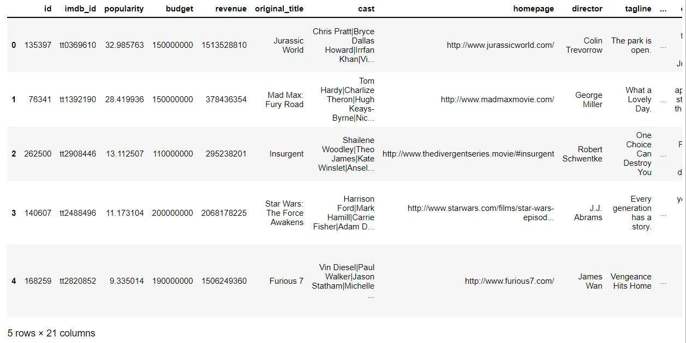

After loading the data successfully we inspect its columns and rows and see what will be useful for us, then we use the shape attribute to check the number of rows and columns in our dataset just to get an idea of how much data we're dealing with.

```python
df.shape
# Output
(10866, 21)
```

the columns method provides the names of columns in our dataset.

```python
df.columns
# Output
Index(['id', 'imdb_id', 'popularity', 'budget', 'revenue',
       'original_title', 'cast', 'homepage', 'director',
       'tagline', 'keywords', 'overview', 'runtime',
       'genres', 'production_companies', 'release_date',
       'vote_count', 'vote_average', 'release_year',
       'budget_adj', 'revenue_adj'],
       dtype='object')
```

we use the info function to get further understanding of our dataset and how every column's data behaves and their types.

```python
df.info()
```

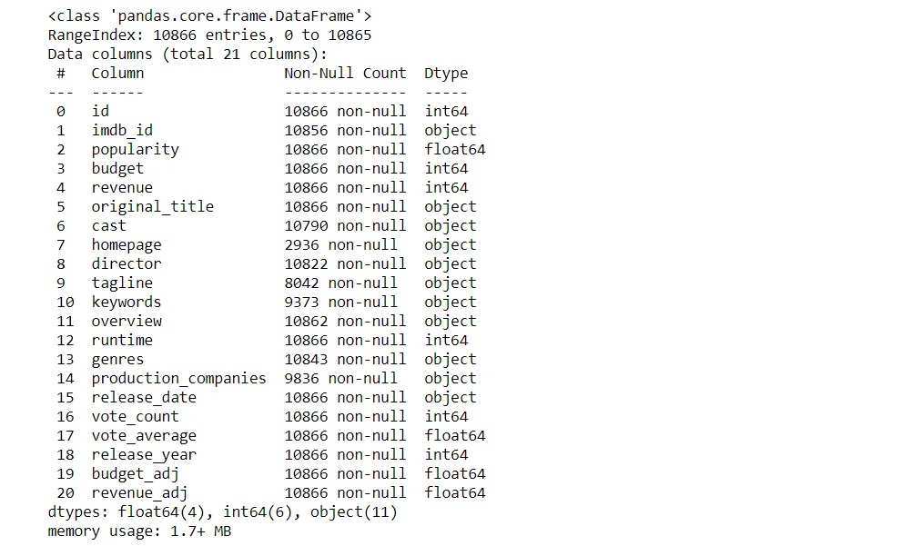

the describe function is one of my favorite because it gives us an overview of the statistics of our dataset like the mean and the median etc...

```python
df.describe()
```

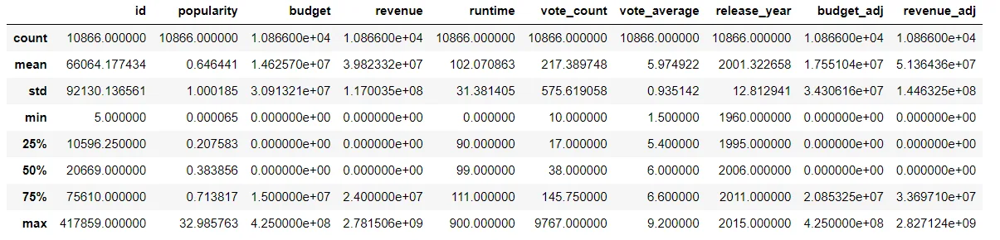

we use the hist function to view our dataset's values distribution to try and get a better understanding of our dataset.

```python
df.hist(figsize=(15, 9), bins=20);
```

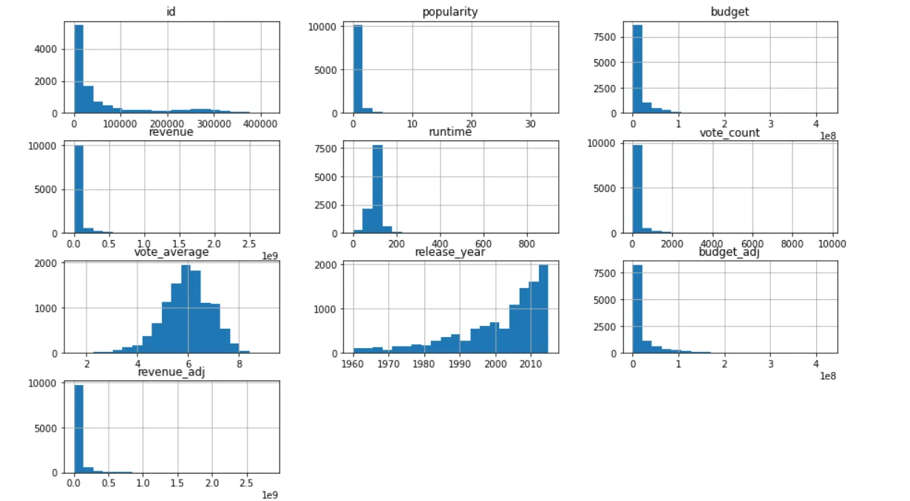

## Data Cleaning

After looking at our dataset's content, everything seems okay but we'll do some adjustments, Like dropping some columns that aren't going to be used in our line of questioning. I don't think that we're going to be using any of these columns: id, imdb_id, budget, popularity, revenue, cast, homepage, tagline, overview, keywords, release_date, production_companies, vote_count, budget_adj, revenue_adj I've also did some adjustments to the values in the genres column to make it more readable.

So we use the drop function in pandas to drop these columns like this.

```python
df2 = df.drop(['imdb_id', 'id', 'budget', 'revenue',
               'cast', 'homepage', 'tagline', 'overview',
               'keywords', 'release_date',
               'production_companies', 'vote_count',
               'budget_adj', 'revenue_adj', 'popularity'],
                axis=1)
```

then we take a look at our new dataset.

```python
df2.head()
```

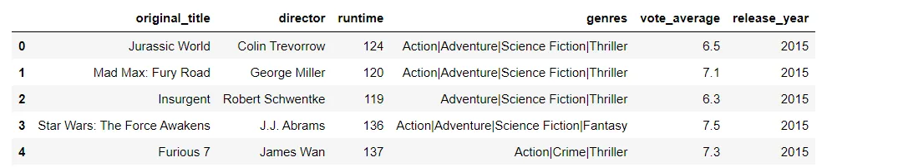

Everything seems okay except for the genres column it has this pipe char '|' and it's fine to leave it like that but I think I'll go ahead and remove this pipe and keep the first genre that appears this will be done using the apply and lambda function which are both very powerful.

```python
df2['genres'] = df2['genres'].apply(lambda x: x.split('|')[0])
```

So using this combo of apply and lambda is very common instead of looping over the column so basically what we're doing is that we're going into the column and looking for the pipe thingy and splitting our data just before hence the zero in the brackets, then we take another look at our data.

```python
df2.head()
```

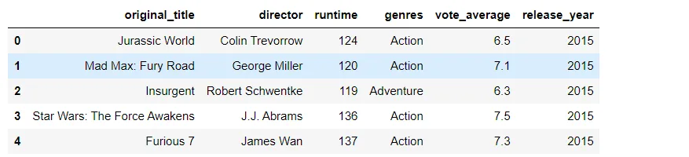

haaa much better!

We then check the size of our new dataframe and do some plots to its content to get a further understanding of the data.

```python
df.shape
# Output
(10866, 6)
```

```python
df2.hist(figsize=(12, 10), bins=20);
```

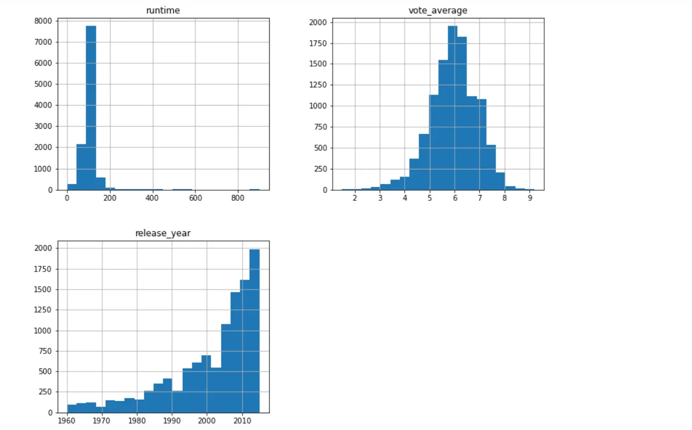

After that we use the scatter_matrix function this method of plotting the whole dataset can be useful because we can discover relations between factors that we didn't know about.

```python
pd.plotting.scatter_matrix(df2, figsize=(12, 10));
```

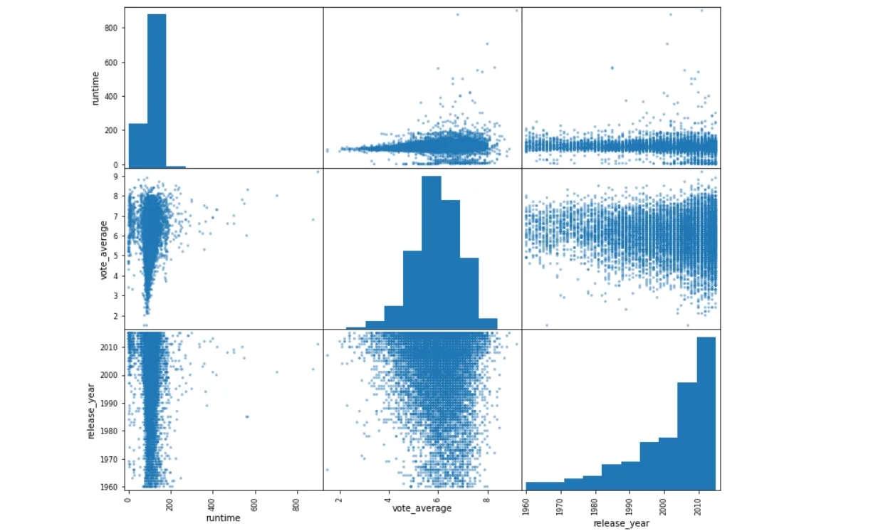

Seaborn's pairplot function gives almost the same result as the scatter_matrix but with a better design and it's more concerned with aesthetic in my opinion which is never a bad thing.

```python
sns.pairplot(df2, height=4);
```

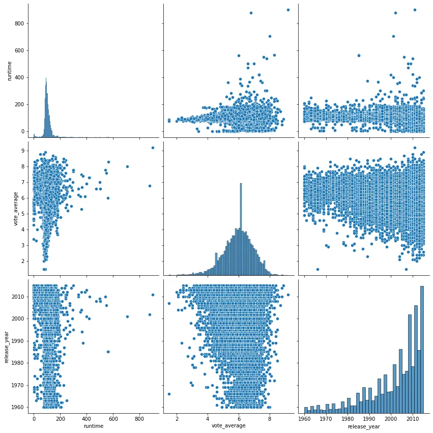

We'll use the info function again just to make sure that everything is okay with our new dataframe.

```python
df2.info()
```

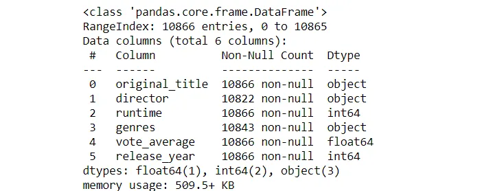

We have some missing values in the director and genres columns which will require further investigation.

In order to check for these missing values we use the isnull function followed by the sum function to get the count of missing values in each column.

```python
df2.isnull().sum()
# Output
original_title     0
director          44
runtime            0
genres            23
vote_average       0
release_year       0
dtype: int64
```

we could drop these missing values or we could fill them with "Unknown" or "Missing-Values", I think I'll do the later so we don't lose anymore data. We dropped a lot of columns already so I'll use the fillna method to do that, then I'll check again if there're any missing values just to be clear.

```python
df2.fillna("Missing-Values", inplace=True)
df2.isnull().sum()
# Output
original_title     0
director           0
runtime            0
genres             0
vote_average       0
release_year       0
dtype: int64
```

```python
df2.describe()
```

when we use the describe function again to get a summary statistics of our newly formed dataframe, something doesn't look right, we have a minimum value of 0 for the runtime of some movies so it'll require further investigation.

So we filter out the movies that has a runtime equal to zero using logical operators , then we use the value_counts function followed by the sum function to get the exact number of movies that have zero runtime.

```python
df2[df2['runtime'] == 0].head()
```

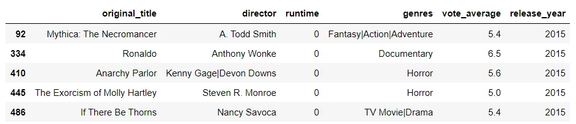

```python
df2[df2['runtime'] == 0].value_counts().sum()
# Output
31
```

There are 31 movies that are missing their runtime, all were made in the 2000-2015 period which is not that far in the past and it seems weird that they're missing their duration but anyway we'll go ahead and drop them so that they wouldn't affect our analysis.

There are several methods that we could do the dropping but I found this method to be the simplest, we set the index of the whole dataframe "using the set_index function" to the runtime column like this.

```python
df2 = df2.set_index('runtime')
df2.head()
```

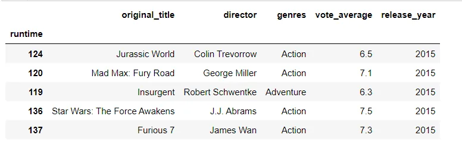

Then we drop all the rows that has an index of zero in this case the movies that has a runtime equal to zero, then we reset our index again to its original form using the reset_index function.

```python
df2 = df2.drop(0, axis=0)
df2.reset_index(inplace=True)
```

Now we run our describe function again and we find that the minimum value for the runtime of movies is now a 2 minute value which is still weird but better than a movie that has no length and it sure will require further analysis which is why we're going to explore that more in our questions.

```python
df2.describe()
```

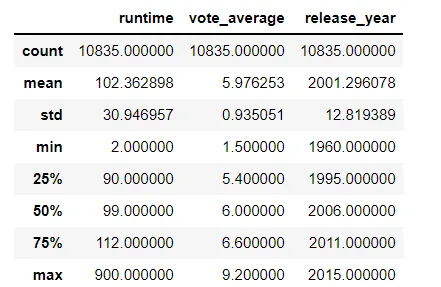

Now we'll start to answer one of our questions. **Longest and shortest movies, their ratings and directors?**

This question is a curiosity of mine actually which movie is the longest and which is the shortest, how did they do (their ratings) who were their directors and what were they thinking directing such long or short movies! yeah this last part is outside the scope of our dataset but still it's a question that would require further research from me, maybe another time. now let's get back to business, after inspecting the statistics of our runtime column we have a minimum value or the shortest movie is 2 minutes long which is really strange. and the longest is 900 minutes which is stranger that is like 15 hours long who would sit this long?

We filter our dataframe like we did before to find out more about these 2 minutes long movies.

```python
df2[df2['runtime'] == 2]
```

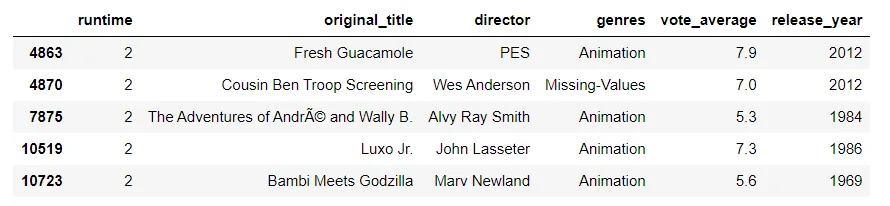

so there are 5 movies that are 2 minutes long maybe there's something wrong with our dataset and maybe not, I'm going to presume the later and continue our analysis. so we find that all of these movies' genre is Animation except for one which has a missing value.

The ratings of these short movies isn't bad actually except for two of them which are below 6 ratings which is for me the separator between good and bad but who am i to judge... then we get the average ratings to these short movies to find that they're weren't that bad in my opinion Above 6.

```python
df2[df2['runtime'] == 2]['vote_average'].mean()
# Output
6.62
```

we do the same thing but this time with the longest movie which is 15 hours long and we find that it has a rating of 9.2 which is amazing. i might start watching it to see what it's about...

```python
df2[df2['runtime'] == 900]
```

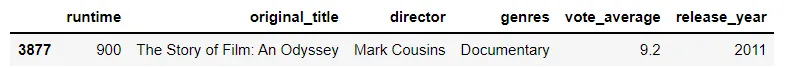

**Average runtime and ratings of all movies?** So in this we question we investigate the overall average ratings and running time of the movies and see the average runtime and ratings for each genre.

We start by calculating the average (mean) of the runtime and vote_average (ratings) using the mean function.

```python
df2['runtime'].mean()
# Output
102.3628980156899
df2['vote_average'].mean()
# Output
5.976252884171684
```

so the average running time of all the movies in our dataset is 102 minutes and the average ratings is almost 6 out of 10.

So i have a couple of ideas about how we can check each genres runtime and ratings. we could use the groupby function to group the genres the column with runtime and vote_average columns to get their average or we could use the groupby function on each column alone then merge them back together. I think I'll do both..

```python
#First groupby mentioned above which is simple and concise
grv1 = df2.groupby('genres')[['runtime', 'vote_average']].mean().reset_index()
#grv stands for genre, runtime, vote_average... which are the columns names
grv1.head()
```

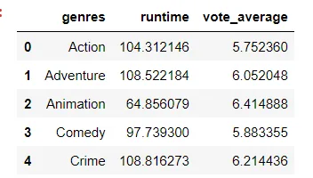

We used the reset_index function because if we didn't it would look like this which is not bad but i like to keep a numbered index to my datasets.

```python
df2.groupby('genres')[['runtime', 'vote_average']].mean().head()
```

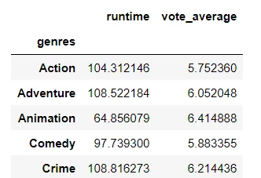

Okay so the second one was to group each column from runtime and vote_average on their own with the genres column, then we use pandas merge function to merge them together to get an output that is something similar to the first method.

```python
#Same technique as the first step nothing new
gen_run = df2.groupby('genres')[['runtime']].mean().reset_index()
#gen_run stands for genres, runtime columns
gen_run.head()
```

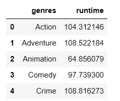

```python
gen_vot = df2.groupby('genres')[['vote_average']].mean().reset_index()
# gen_vot stands for genres, vote_average columns
gen_vot.head()
```

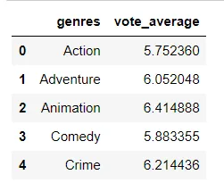

Here we do our merge of the two dataframes that we just produced.

```python
# Second method
grv2 = gen_run.merge(gen_vot, on='genres', how='left')
# grv stands for genre, runtime, vote_average... which are the columns names
grv2.head()
```

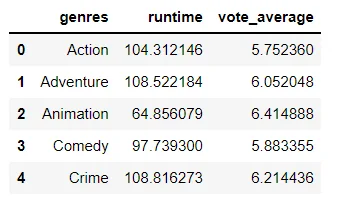

So we wanted to check the each genre's runtime and ratings which we could clearly see in our newly made dataframe but maybe a plot would help!

```python
#sns.set to adjust the size and style of the plot
# plt.figure(figsize=(15,8))
sns.set(rc = {'figure.figsize':(16,8)},style='darkgrid')
sns.barplot(x='genres', y='runtime', data=grv1)
plt.title("Runtime Average Of Movie's Genres")
#to adjust the rotation angles of the x-axis labels
plt.xticks(rotation=45);
```

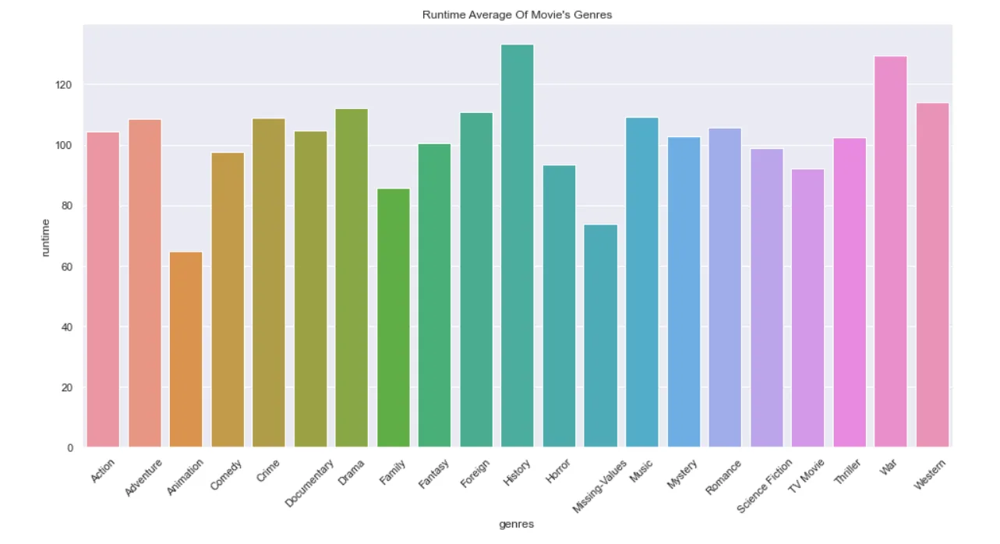

So it looks like movies about war and history have have the longest average running time among other genres, with more than two hours running time.

On the other hand we have animation, family and missing-values... wait a second missing-values is not a genre for movies but yeah it's fine we did this when we used the fillna function to fill NaN or null which are missing values in general. so they're just movies that have their genres missing maybe who ever collected the data forget about them or didn't have enough data about them anyway.. we have animation and family movies among the shortest movies.

```python
#sns.set to adjust the size and style of the plot
sns.set(rc = {'figure.figsize':(16,8)})
sns.barplot(x='genres', y='vote_average', data=grv1)
plt.title("Ratings Average Of Movie's Genres")
#to adjust the rotation angles of the x-axis labels
plt.xticks(rotation=45);
```

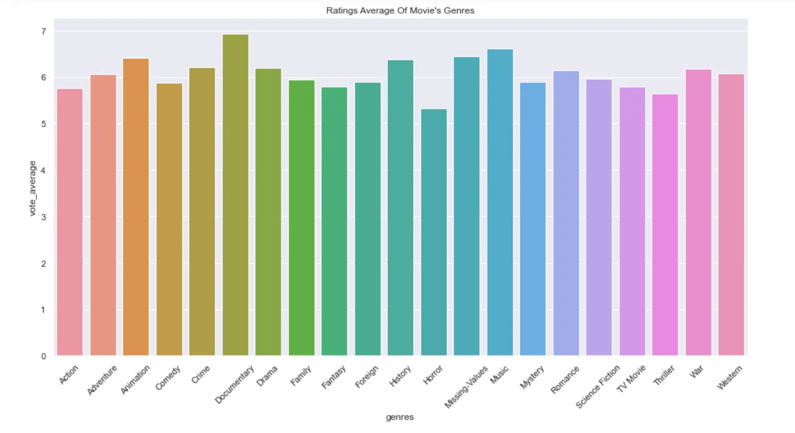

All of the movies genres average ratings are between 5 and 7 with documentaries having the highest ratings and horror with the lowest.

## Conclusion
So we saw how we could use apply and lambda functions to manipulate our data, we also used logical operators to filter for movies that had zero running time, we sorted our dataframe based on the running time then we removed those movies that had zero running time, we used basic merging to view that we could work with our data however we liked and we used plotting to get a better understanding and representation of our data.

If you wanted to check the full notebook and play around with it here's a link to my github: [Link](https://github.com/Magdiyy/Data-Insight-Scholarship/blob/main/TMDB.ipynb)
