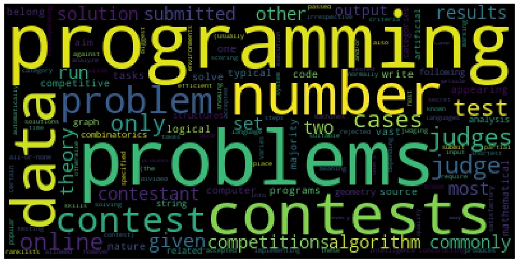

According to Wiki, Competitive programming (also known as CC) is a mind sport usually held over the Internet or a local network, involving participants trying to program according to provided specifications. One has to solve several problems ranging from easy to hard over a specific period of time with the help of programming language, often considered as a CC tool.
There are many benefits of Competitive programming which are listed hereby within:-

a) **Ability to tackle problems from different perspectives and solve even more complex real-world problems** → Competitive coders solve lots of problems from all dimensions such as number theory, combinatorics, data structures, graph theory, sets, pure calculus, geometry and many more. Therefore, they are highly adept in solving problems which occur in daily life such as finding the shortest path from source to destination, calculating interests, minimum number of moves, and many more. One develops analytical and creative skill with decent practice.

b) **Ability to deliver optimized results in shorter time**. → Most of the competitive programming contests require you to solve around 5–6 problems in limited around of time. And, of course, our solution should be optimized and should execute under given time complexity. Thus, competitive coding really helps develop this particular skill.

c) **Ease while building our own softwares**. → One of the real benefits of Competitive coding comes when we start building our own softwares. It helps us to build up several logics , write up a clean code, better understand the functions and modules, analyze and interpret several alternatives and features, and finally bring meaningful insights to the software product. Personally, I have seen a good progress in my developing skills after doing CC. Nowadays, I find a pattern in what I do. It reminds me of connecting the dots as told by Steve Jobs during his Stanford Commencement Address back in 2005. Hence, I recommend everyone who really wants to build their own softwares to work on CC.

d) **Helps to perform well in coding interviews.** → Normally in coding interviews, easy and medium level questions of competitive coding are asked with some fewer tweaks. Performing well in CC provides confidence in coding interviews and get internships and job offers from reputed companies . I have heard from many competitive coders that they don’t even bother preparing for coding interviews.

e) **Teaches how to work as a team. →** In some contests, we are required to make a team of 3–4 members (depending upon the contests). Some may be good at maths whereas some may be good at data structures. Having proper coordination and management is the key to ace coding contests. Hence, CC teaches us how to work in a team.

f) **“Failures” and “Setbacks” becomes part of life. →** Every CC coders go through “Wrong Answer on Pretest …”, “Time limit excedeed”, “ Runtime Error” , “Compilation Error” , “Presentation Error”, “Segmentation Fault”, “Memory limit exceeded ( usually less)” and other limitations. This is where we get a chance to grow by finding our fault, mistakes, bugs and probably get “Accepted” if everything goes well.Therefore, as we keep on practicing , these failures become part of life. Those who never give up ultimately succeed.
There are many other benefits such as knowledge of lots of domain from computer architecture to development strategies of several games and many more. The limit is unlimited.

**So, how to begin your Competitive Coding journey?**
The most important tool to start your journey is the programming language. Choose any of the programming language and learn the basics. Learn simple libraries available in that language. Many people prefer Java, Python, or C++ as a kickstart tool. In my opinion, C++ is the best programming language to start. There are many reasons to it.

- It is faster than Python and Java. Here, faster means the code execution time is less. You will encounter a lot of problems where the same code in C++ gets executed within the time limit whereas Python and Java fails to.
- It has vast library called Standard Template Library (STL) which has almost all libraries to solve probems.
- Majority of coders choose C++ , so there is strong community who are willing to help you in case you feel difficulty at a point.

Below are some of the websites to learn C++.
<https://www.tutorialspoint.com/cplusplus/index.htm>
<https://www.youtube.com/watch?v=vLnPwxZdW4Y> (My favorite one)
<https://www.learncpp.com/>
<https://www.edx.org/course/introduction-to-c-8>
Although C++ should be a choice in my opinion, it’s completely upto an individual what to choose. Apart from Python and Java, one can also learn Objective-C, Kotlin, Julia, Lisp, Scala, R, Visual Basic and many more though very, very few use them. Some benefits of using Python and Java for competitive coding as a complete begineer are as follows:-

**Benefits of choosing Python**

- Simple and easy to learn, understand, and use.
- Lots of libraries and built-in functions available to build code.
- Strong community of coders
- Since it is also an interpreted language, one can debug more efficiently.
- The amount of code is way more less than Java and C++. See the below code. Python takes three words whereas C++ and Java takes more.

```python
print("Hello world")    #Python
#include <iostream>             #C++
int main(){
     std::cout<<"Hello world";
}
public class Main{                 #Java
      public static void main(String args[]){
            System.out.println("Hello world");
      }
}
```

Here are some online websites to learn Python.

[Codecademy](https://linktrest.io/codecademy-data-scientist-career-path)

[Coursera](https://linktrest.io/ibm-data-science-professional-certificate)

[DataCamp](https://linktrest.io/datacamp-data-scientist-track)

[Data Insight](https://linktrest.io/datainsight-data-scientist-program)

[Dataquest](https://linktrest.io/dataquest)

[Edureka](https://linktrest.io/edureka-data-science-with-python)

[Edx](https://linktrest.io/edx)

[FutureLearn](https://linktrest.io/future-learn)

[LinkedIn Learning](https://linktrest.io/linkedin-learning)

[Masterclass](https://linktrest.io/masterclass)

[Udacity](https://linktrest.io/udacity)

[Udemy](https://linktrest.io/udemy-machine-learning-data-science-and-deep-learning-with-python)

**Benefits of choosing Java**

- The execution speed is faster in Java than Python.
- Java has **BigInteger** and **GregorianCalendar** libraries which are very helpful when dealing with big integers such as more than 10¹⁰ and working with calendar (date, timestamp, leap year) related stuffs.
- Once you know Java, learning Python and C++ becomes an easy breeze. Generally, at one point you may think of transitioning to C++. You won’t feel much difficulty learning C++.

Below are some of the great websites to learn Java.

- <https://www.codecademy.com/learn/learn-java>
- <https://www.learnjavaonline.org/>
- <https://www.edx.org/course/java-programming-fundamentals>
- <https://www.coursera.org/learn/java-programming?specialization=java-programming>

As already said, it’s upto you to choose any of the programming language. If you find difficulty in choosing any, I would recommend you to begin with a language that is easy to write and understand: **Python** . Then, transition to C++ after covering the basics of Python, or stick with Python for further. The only difference between different languages are their syntaxes, writing style, and more or less libraries available. The main objective of a competitive coder is to focus more on solving the problem rather than focusing on the tool.

**What’s Next?**

After you are comfortable with the basics of any of the programming language described earlier, it’s time to practice problems from basic. Although there are many websites to start your competitive coding journey, I would recommend [Hackerrank](http://www.hackerrank.com/) since I started from it, and it has been helping me a lot. It’s beautifully designed IDE and grouping of problems according to topic and difficulty makes it a popular choice among begineers. There are many subdomains to work on. Among them, for competitive coding one needs

- [Algorithms](https://www.hackerrank.com/domains/algorithms)
- [Data Structures](https://www.hackerrank.com/domains/data-structures)
- [Mathematics](https://www.hackerrank.com/domains/mathematics)
- [Artificial Intelligence](https://www.hackerrank.com/domains/ai) (Later)
- [Regex](https://www.hackerrank.com/domains/regex)

We can easily sort the difficulty of problems which is available at right side of the domain dashboard. Complete beginners solve few easiest problems there and get stuck at some problems. It’s normal for everyone. You can easily see the editorials( step-wise description and algorithm of the given problem) at Google or at the Hackerrank. Editorials are a great way to learn new things. And remember to solve the problems after visiting the editorial. This will make us learn fast and get a good pace. This way of learning and solving is called “Upsolving”.
There are some other websites to begin the journey which you will know in few mins if you keep reading.

After you know what competitive programming is, what types of problems are asked, it’s time to step into the area of coding contests. Internet is filled with lots of websites that host coding contests. Some of them are:-

- Codeforces (My favorite)
- Codechef
- LeetCode
- Kattis (My second favorite)
- Hackerearth
- Topcoder
- AtCoder
- and many more….

Whatever the websites I have listed above are more than enough to practice and take part in live contests.

**Codeforces →** It is one of the best site for practicing problems and taking part in contests. It has a very strong community of coders and it might take less than 5 minutes to get help from someone incase we are stuck at a problem. Many great competitive coders work on Codeforces more than any other platforms. The best thing I like about Codeforces is that it regularly hosts contests in span of 2–3 days and the quality of problems are great. The contests are generally 2–2.25 hours long and around 5–6 problems to solve. The beginners take part in Division 4, Division 3 and Division 2 whereas experts take part in Division 1 so as to maintain the level category of coders. Editorials are generally available within thirty minutes after the contest ends. Also, there are lots of problems to practice. Take part in contests to see where you belong.

**Codechef →** It is an indian-based competitive programming website which hosts three major contests every month : Long Challenge ( 10 days), Lunchtime ( 3 hours) and CookOff (3 hours). For a beginner, it’s best to take part regularly in Long Challenge for at least two times before moving to Lunchtime and Cookoff as it builds up confidence. You will get a seperate rating for each of the three and an average rating. Apart from these major contests, Codechef also hosts college coding contests, hackathons and many more.

**Leetcode →** It generally conducts weekly coding contests. There are lots of mock interview questions and challenges. I have only participated in few contests as I spend most of my time in Hackerrank and Codeforces. Also, it has lots of problems to solve.

**Kattis →** Before I properly delved into Competitive coding by joining Hackerrank back in December 2019, I used to do some problems in this platform just for fun. I didn’t know that the website was for coding contests too. Very few people know about Kattis as it is not popular like Codeforces or Codechef . It has lots of problems to solve ranging from Level 1 to Level 10. Although it hosts contests, I don’t recommend it since most of the contests problems come from the practice questions. However, you will learn a lot of things that might not be available at any other platform.

**Hackerearth →** It is also one of the best coding platforms available. We can get plenty of contests regularly which are not only limited to coding contests but also others such as hackathon, system testing, full stack solutions and many more. It helps a lot for preparing coding interviews as it contains abundant resources for data structures, algorithms, graphs and many more The tutorials available are easy to learn and understand.
<https://www.hackerearth.com/practice-onboarding/welcome-to-online-programming-1/>.
This is the great place to start. Also, lots of problems are available to solve.

**Topcoder →** It is one of the good coding platform. It conducts Single Round Match (SRM #) where contestants enter into arena and compete against each other in different rooms. FOr competitive leaders, Topcoder conducts yearly contest ( TCO19 ..) where the best coders compete for algorithm round and win cash prize worth ten thousand dollars. A competitive coder must follow topcoder regularly for exciting challenges and opportunities.

**AtCoder →** A japan-based competitive platform most commonly known for beginner’s contest. It hosts beginner’s contest in the gap of four to five days. In my opinion, **it’s best to begin beginner contests** at AtCoder before diving into Codeforces or Codechef.
There are many other platforms that provide coding contests but these are the major ones and we can see overwhelming amount of participants. Recently, on Codeforces around 28.5k participants participated in Division 2 contest.

After solving some easy problems based on your past knowledge and participating in several contests, one will know the proper structure of problems, and begins to ponder about the topics. The major topic categories for Competitive Programming include

- Sorting
- Data Structures
- Complete Search
- Greedy Algorithms
- Dynamic Programming ( most, most important)
- Amortized Analysis
- Range Queries
- Bit Manipulation
- Graph Algorithms
- Trees
- Path and Circuits
- Flow and Cuts
- Number Theory
- Combinatorics
- Matrices
- Probability
- Game Theory
- String Algorithms
- Geometry
- Normal implementation algorithms
- Calculus, Differentiation …

Almost all of the coding problems more or less come under these categories. There are many tutorials, notes, and books available online.

These are some of the resource to start with.

[Competitive Programmer’s Handbook](https://cses.fi/book/book.pdf)
[Complete Guide to C++ STL](https://www.cppreference.com/Cpp_STL_ReferenceManual.pdf) ( Required later if you transition to C++)
Programming Challenges by Steven S. Skiena
Competitive Programming 3 by Steven Halim
Problem Solving Strategies by Arthur Engel

I can’t upload books of Steven S. Skiena, Steven Halim, and Arthur Angel since they are only available in Amazon and are not distributed for free. If money is not an issue, you can buy them from Amazon. However, you can also get these books from [https://libgen.is](https://libgen.is/)/ . You have to visit the website and enter the name of the book to download in the search page. Afterwards, you have to follow the steps until you reach the download button. Then you can download from there.

Some github repositories containing abundant resources for competitive programming are listed below. They contain useful resources and algorithms that are required for solving problems.

<https://github.com/mostafa-saad/ArabicCompetitiveProgramming> ( A complete roadmap for Competitive Coding)
<https://github.com/jnikhilreddy/Competitive-programming-resources>
<https://github.com/AhmadElsagheer/Competitive-programming-library>
<https://github.com/Ashishgup1/Competitive-Coding>

These resources are sufficient to begin competitive coding journey and perform well in interviews, get a good internship, jobs (if you are planning to) and make life better by developing creative and analytical skills.

**My Competitive Coding Journey**

I started my CC journey during sophomore year of my university (yeah, considered late). More precisely on December 8, 2019. On that day, I participated in coding contest (CODEVAR) organized by my university . I knew Python basics properly so I thought of giving a try. I was completely amazed by the vigor and enthusiasm among the participants. Everyone seemed like a coder ( some were nerds too…). I learned about the benefits of competitive programming, skills developed by solving problems and many more. That moment I decided to give more time and energyon it and keep rest of the stuffs aside for a while.
The same very day, I joined Hackerrank and practiced based on topics. I even practice questions from Hackerrank these days. During those days, I used to practice easy questions in Hackerrank. Now, I practice medium and hard questions. Then, I joined Kattis platform and solved around eighty problems. Then, I got to know about Codechef while browsing, and started doing Long Challenges. Afterwhile, I knew about Codeforces. Since then, my favorite platform has been Codeforces. The way people discuss problems, share codes and help the overall community is amazing. I participate regularly in contests. I have never missed a single contest since then. On average, I try to solve around 5–6 problems everyday above my caliber. Sometimes , I cannot solve any of them whereas sometimes I solve most of them. It really takes consistent patience and deliberate time to progress.
I am still a novice coder but I practice daily. I have kept detail information of all my problems solved in [StopStalk](https://www.stopstalk.com/user/profile/Subarna578). You can also use StopStalk to analyze a nd improve your coding progress. Apart from competitive coding, I also like to write technical articles. I believe that writing articles makes a person know more about the topic and the written stuffs stays in our mind for long time. One of the reasons why I wrote this article is to show that with practice we can progress in competitive coding. At the beginning, I really felt difficulty solving problems that required some special form of algorithms. It was because I only did easy problems and didn’t even bother to look at problems little above my capacity. Later, I realized that easy problems won’t make progress in my journey. So, consistent practice and proper upsolving helps us move forward in our competitive coding journey.

**Final Note**

Practice is the key to everything. With consistent practice and discipline, one can achieve anything that he/she wants in his/her life. The more we practice coding , the more we become adapt to it. There are coders who solve problems just by reading a single line of problem description. How? Because of practice. Therefore, we must practice a lot of coding, understand what went wrong while solving, rectify them and repeat this whole process to become a very good and competitive coder.
