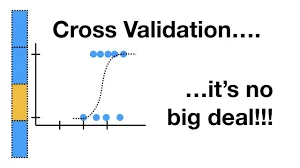
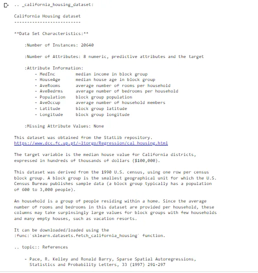
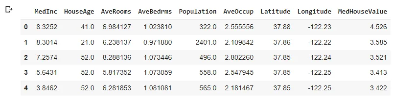
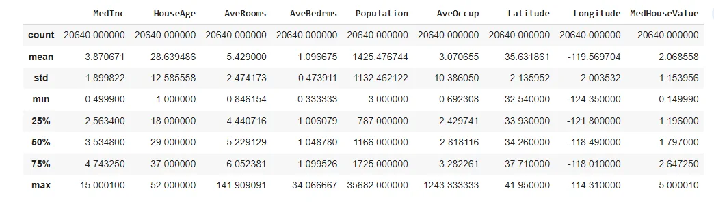
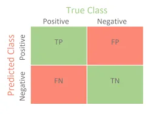

***“Predicting the future isn’t magic, it’s artificial intelligence.”***

***~Dave Waters***

Have you ever been concerned about how well your your model will perform? About whether you choose the right model for your data or not? Have you being wondering about the reasons why your model somehow overfit/underfit your data?... Well, this time i came with answers that will lead us throughout the validation of our model and eventually having the results we wish for our model to have.

**- What is Model Validation?** It consists of ensuring that the model performs as expected on new data by testing the model accuracy on data it never seen before: we call it a holdout set and we mean by it any data that is not used for training. Achieving the best accuracy for a given data will be by selecting the best model, parameters, and accuracy metrics.

For the purpose of this article, we'll be using the SKlearn fetch_california_housing() dataset. Let's display its description so we can know more about it:

```python
print(california.DESCR)
```

We see that there is an overall of 20640 rows in the dataset, 8 columns and no missing values (A characteristic of sklearn's datasets).



We’ll perform a multiple linear regression that uses all eight numerical features to make more sophisticated housing price predictions.

**-** First, we create our df with the Bunch's data and the feature names:

```python
california_df = pd.DataFrame(california.data,
                            columns=california.feature_names)
```

The, we add a column for the median house values stored in california.target values to our df:

```python
california_df['MedHouseValue'] = pd.Series(california.target)
```

```python
california_df.head()
```



How about some summary statistics?

```python
california_df.describe()
```



**- What are the Validation Basics?**

***- Creating Train, Test datasets***:

```python
X_train, X_test, y_train, y_test = train_test_split(
     california.data, california.target, random_state=111)
```

```python
X_train.shape
```

```python
(15480, 8)
```

```python
X_test.shape
```

```python
(5160, 8)
```

- Training The Model:

```python
lin_reg = LinearRegression()
```

```python
lin_reg.fit(X=X_train, y=y_train)
```

Get the regression coef fo each feature:

```python
for i, name in enumerate(california.feature_names):
     print(f'{name}: {lin_reg.coef_[i]}')
```

```python
MedInc: 0.44202226986847876
HouseAge: 0.009485627864521387
AveRooms: -0.11152579637582219
AveBedrms: 0.6266774529661829
Population: -8.039867903542053e-06
AveOccup: -0.003967404656078797
Latitude: -0.4077041613462406
Longitude: -0.42000474992289016
```

Get the intercept:

```python
lin_reg.intercept_
```

```python
-35.664795306289356
```

- The bias - Variance Tradeoff:

1. Variance: Following the training data to closely can lead to failing to generalise to the test data. It occurs when models are overfit and have high complexity. ***How do we identiify if the model is overfit or not?*** Easy, low training error but high testing error.
2. Bias: Failing to find a relationship between the data and the response.Usually happens when the models are underfit. Underfitting occurs when the model couldn't find the underlying patterns available in the data. It is more difficult to identify because both training and testing data will have a high error.

```python
train_pred = lin_reg.predict(X_train)
metrics.r2_score(y_train, train_pred)
```

```python
0.6071964783577117
```

```python
test_pred = lin_reg.predict(X_test)
metrics.r2_score(y_test, test_pred)
```

```python
0.6194436468965602
```

We can see that the model performs the same on both seen and unseen data. For r2 score, Value near 1 indicates better model.

- Accuracy Metrics:

- Classification Metrics: A confusion matrix is a technique for
 summarizing the performance of a classification algorithm.
 Classification accuracy alone can be misleading if you have an
 unequal number of observations in each class or if you have more
 than two classes in your dataset. Calculating a confusion matrix can
 give you a better idea of what your classification model is getting right
 and what types of errors it is making:



1. Accuracy: Overall ability of your model to correctly predict the correct classifiction: TN+TP / TN+FN+FP+TP
2. Precision: Number of true positives out of all predicted positive values: TP/TP+FP
3. Recall: Number of true positives out of the sum of predicted positive values and negative values: TP/TP+FN.

- Regression metrics are:

1. Mean Absolute Error(MAE): It's the average absolute difference between the prediction and the actual values. It treats all the points equally which means that it's not sensitive to outliers: ***metrics.mean_absolute_error(y_test,test_pred)***
   ***0.5306211224195606***
2. Mean Squared Error(MSE): Widely used, it is calculated similarly to MAE, but by squaring the difference between the prediction and the actual values. It allows outliers errors to contribute more to the overall:
    ***metrics.mean_squared_error(y_test,test_pred) 0.5165999664384366***

For both MAE and MSE, Small value indicates better model. Seeing the scores of our model, some questions pops up: **Did we choose the right model for our data? How can we possibly improve the score of our model?**

- Cross Validation: The problem with the holdout set is that the way the split occurs actually matters in the score of our model. So sometimes, creating a single test holdout sample is not enough to achieve the high level of model validation and there's where cross validation happens.

For a higher score, we need a bunch of training/validation splits. Cross validation make us run our single model on various training/validation combinations and gives us a lot more confidence in our final metrics:

*- SKlearn KFold:* The parameters of the function are:

- n_split:number of cross validation splits. When you choose a value for cv, each time you run the model a different 80% of the data will be used for training and a different 20% will be used for validation.
- Shuffle: boolean indicating to shuffle data before splitting.
- random_state: to replicate the model.

*- SKlearn cross_val_score:* The parameters of the function are:

- estimator: the model
- x: the train data
- y: the test data
- cv: the number of cross validation splits.

How can we use these two functions to choose the best model?

- We create a dictionnary of estimators:

```python
estimators = {
    'LinearRegression': lin_reg,
    'ElasticNet': ElasticNet(),
    'Lasso': Lasso(),
    'Ridge': Ridge()
}
```

For each key , value in the dictionnary, w create a KFold with 10 splits,

```python
mse = metrics.make_scorer(metrics.mean_squared_error)
for estimator_name, estimator_object in estimators.items():
     kfold = KFold(n_splits=10, random_state=1110, shuffle=True)
     scores = cross_val_score(estimator=estimator_object,
         X=X_train, y=y_train, cv=kfold,
         scoring= mse)
     print(f'{estimator_name}: ' + f'mean_squared_error={scores.mean()}')
```

```python
LinearRegression: mean_squared_error=0.531142277229171 ElasticNet: mean_squared_error=0.7715934105587554
Lasso: mean_squared_error=0.9562862086893722
Ridge: mean_squared_error=0.5311301185044585
```

The models with the lowest errors are the best: LinearRegression and Ridge. So, we chose the right model.

*- Leave one out crossval (LOOCV):* We implement KFold, where k equal to n, the number of observations in the data: the number of observations in X_train.shape.

For the first model, all the data will be used for training except for the first point which will be used for validation and so on till n model where allthe data will be used for training except for the n point which will be used for validation. When to use it? When the amount of training data is limited because it's computationally expensive.

```python
# Implement LOOCV
scores = cross_val_score(lin_reg, X=X_train, y=y_train, cv=15480, scoring=mse)

# Print the mean and standard deviation
print("The mean of the errors is: %s." % np.mean(scores))
print("The standard deviation of the errors is: %s." % np.std(scores))
```

```python
The mean of the errors is: 0.5320823963771337.
The standard deviation of the errors is: 1.4081580976148196.
```

*- Selecting the best model with hyperparameters Tunning:* The hyperparameters are manually set before the training occurs. To review parameters of a model:

```python
# Review the parameters of lin_reg
print(lin_reg.get_params())
```

```python
{'copy_X': True, 'fit_intercept': True, 'n_jobs': None, 'normalize': 'deprecated', 'positive': False}
```

To know more about these parameters check [the documentation](https://scikit-learn.org/stable/modules/generated/sklearn.linear_model.LinearRegression.html).

Let's create a range of possible values for some of these parameters to select from them:

```python
copy_X = [True, False]
fit_intercept = [True, False]
n_jobs = [10,20,30]
```

```python
legreg = LinearRegression(
    copy_X=random.choice(copy_X),
    fit_intercept=random.choice(fit_intercept),
    n_jobs=random.choice(n_jobs)
    )

# Print out the parameters
print(legreg.get_params())
```

```python
{'copy_X': False, 'fit_intercept': True, 'n_jobs': 30, 'normalize': 'deprecated', 'positive': False}
```

And these are the perfect parameters for our model.

*- Randomized Search CV:* Random Searching consists of randomly selecting from all hyperparameters values from the list of possible ranges.The benefits of this method is that it will test every possible combination but with every additional hyper parameter, it will increase the training time exponentially.

```python
param_dist = {"copy_X": [True,False],
              "fit_intercept": [True,False],
              "n_jobs": [10,20,30]}
linreg = LinearRegression()
```

```python
# Finalize the random search
rs = RandomizedSearchCV(
  estimator=linreg, param_distributions=param_dist,
  scoring = mse,
  cv=5, n_iter=10, random_state=1110)

rs.fit(X_train, y_train)

# print the mean test scores:
print('The accuracy for each run was: {}.'.format(rs.cv_results_['mean_test_score']))
# print the best model score:
print('The best accuracy for a single model was: {}'.format(rs.best_score_))
```

```python
The accuracy for each run was: [0.62133408 0.53414022 0.62133408 0.53414022 0.53414022 0.53414022  0.53414022 0.62133408 0.62133408 0.53414022].
The best accuracy for a single model was: 0.621334079642087
```

*- Selecting your final model:*

```python
rs.best_estimator_
```

```python
LinearRegression(copy_X=False, fit_intercept=False, n_jobs=10)
```

**- Final Notes:** Throughout this article, i went across multiple ways for model validation. For Further knowledge check those links:

[HyperParameter Tunning](https://medium.com/analytics-vidhya/hyperparameter-tuning-in-linear-regression-e0e0f1f968a1)

[Mean Squared Error Explained](https://www.mygreatlearning.com/blog/mean-square-error-explained/)

Book: Python for Programmers with Introductory AI Case Studies by Paul Deitel, Harvey Deitel.

You can find the code [Here](https://github.com/asmakrl/datacampstd/blob/main/Model%20Validation/Model_Validation.ipynb).

Happy Learning.
