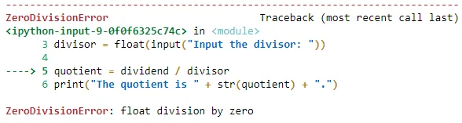
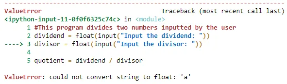

Have you encountered an error in the middle of the program runtime? Is the user input inputted incorrect data type as required? Does this error cause your program to terminate?

Programmers often deal with errors and exceptions. It usually causes trouble during runtime and blocks the succeeding steps of the algorithm. It results in crashing your program and, as a data professional, you do not want it to happen! This blog post demonstrates how to trap these possible calculation errors during runtime by using the***try...except*** statements.

```python
#This program divids two numbers inputted by the user
dividend = float(input("Input the dividend: "))
divisor = float(input("Input the divisor: "))

quotient = dividend / divisor
print("The quotient is " + str(quotient) + ".")
```

The above program calculates the quotient of the two numbers inputted by the user. It requires user inputs for the dividend and divisor. Then, it calculates its quotient and prints the result.

Input:

```python
Input the dividend: 4
Input the divisor: 0
```

Output:



We know that you cannot divide any number by zero. Thus, an error pops out in this input because of the ZeroDivisionError.

Input:

```python
Input the dividend: 4
Input the divisor: a
```

Output:



The user inputted a string in the divisor, and you cannot divide a number by an undefined variable. Thus, it outputs an error.


***try...except*** **statements**

To handle these errors and exceptions, let us generate the *try...except* statements.

```python
#This program divides two numbers inputted by the user
dividend = float(input("Input the dividend: "))
divisor = float(input("Input the divisor: "))

try:
    quotient = dividend / divisor
    print("The quotient is " + str(quotient) + ".")
except:
    print("Error! Cannot divide by zero.")
```

This works by executing the algorithm under the *try* clause first. If the *try* clause runs, it skips the *except* clause. Otherwise, if there is an exception occurs, it skips the *try* clause and proceeds to execute the *except* clause. Let us see some examples!

Input:

```python
Input the dividend: 4
Input the divisor: 2
```

Output:

```python
The quotient is 2.00.
```

Since there is no exception occurs, it executes the *try* clause.

Input:

```python
Input the dividend: 4
Input the divisor: 0
```

Output:

```python
Error! Cannot divide by zero.
```

Here, an exception occurs in defining the *quotient* variable. As a result, it proceeds to execute the *except* clause and skips the *try* clause.

You can also be more specific in naming the error, e.g., ZeroDivisionError.

```python
try:
    quotient = dividend / divisor
    print("The quotient is " + str(quotient) + ".")
except ZeroDivisionError:
    print("Error! Cannot divide by zero.")
```

However, division by error may not be the only possible error. All the same, the *except* clause allows you to add multiple errors, e.g.,

```python
try:
    quotient = dividend / divisor
    print("The quotient is " + str(quotient) + ".")
except ZeroDivisionError:
    print("Error! Cannot divide by zero.")
except ValueError:
    print("Error! This is not a number.")
```

Errors are normal to occur. It terminates the program and cannot proceed to the next steps. Hence, it is important to handle them all. ***try...except*** is really helpful especially in dealing with these errors. You will use this concept often as a data professional, thus it is important to know and practice this Python concept. You can see the list of common errors and exceptions [here](https://docs.python.org/3/tutorial/errors.html). And, see more about errors and exceptions and how to handle them [here](https://docs.python.org/3/tutorial/errors.html).
