In this article, we will go deeper into data analysis and get experimented with real-world data science projects. I am glad to guide you through this tutorial where we will munges informations using sophisticated data tools and techniques. The meaningful results we will pull from this study help us make important decisions by identifying various facts and trends.
The North American Industry Classification System (NAICS) is an industry classification system developed by the statistical agencies of Canada, Mexico, and the United States. NAICS is designed to provide common definitions of the industrial structure of the three countries and a common statistical framework to facilitate the analysis of the three economies.
For now we are going to prepare our dataset using:
-15 csv files that contain employment data by industry at different levels of aggregation, 2-digit NAICS, 3-digit NAICS, and 4-digit NAICS.
Columns mean as follows: SYEAR: Survey Year
SMTH: Survey Month
NAICS: Industry name and associated NAICS code
_EMPLOYMENT_: Employment
-LMO Detailed Industries by NAICS: An excel file for mapping the RTRA data to the desired data. The first column of this file has a list of 59 industries that are frequently used. The second column has their NAICS definitions.

Using these NAICS definitions and RTRA data, we will create a monthly employment data series from 1997 to 2018 for these 59 industries.

## Importing
```python
import pandas as pd
pd.options.mode.chained_assignment = None  # default='warn'

# importing the lmo detailed industries by NAICS
lmo = pd.read_excel("data/LMO_Detailed_Industries_by_NAICS.xlsx")
# display(lmo)

lmo['NAICS'] = lmo.NAICS.replace({' & ':','}, regex=True) # replace each & with , to easily seperate NAICS codes into new raws

lmo1 = lmo[lmo.NAICS.str.contains(',', na=False)]
lmo1.loc[:,'NAICS'] = lmo1.NAICS.str.split(',')
lmo1 = lmo1.explode('NAICS', ignore_index=True)

lmo2 = lmo[~lmo.NAICS.str.contains(',', na=False)]

lmo = lmo2.append(lmo1, ignore_index=True)

# display(lmo)
```

```python
files_2 = ["RTRA_Employ_2NAICS_06_10.csv","RTRA_Employ_2NAICS_11_15.csv","RTRA_Employ_2NAICS_16_20.csv","RTRA_Employ_2NAICS_97_99.csv"]
files_3 = ["RTRA_Employ_3NAICS_06_10.csv","RTRA_Employ_3NAICS_11_15.csv","RTRA_Employ_3NAICS_16_20.csv","RTRA_Employ_3NAICS_97_99.csv"]
files_4 = ["RTRA_Employ_4NAICS_06_10.csv","RTRA_Employ_4NAICS_11_15.csv","RTRA_Employ_4NAICS_16_20.csv","RTRA_Employ_4NAICS_97_99.csv"]
```

```python
# importing the RTRA csv 2 digits files
rtra_2 = pd.read_csv("data/RTRA_Employ_2NAICS_00_05.csv")
for file in files_2:
    lmoi = pd.read_csv("data/"+file)
    rtra_2 = rtra_2.append(lmoi, ignore_index=False)

# importing the RTRA csv 3 digits files
rtra_3 = pd.read_csv("data/RTRA_Employ_3NAICS_00_05.csv")
for file in files_3:
    lmoi = pd.read_csv("data/"+file)
    rtra_3 = rtra_3.append(lmoi, ignore_index=False)

# importing the RTRA csv 4 digits files
rtra_4 = pd.read_csv("data/RTRA_Employ_4NAICS_00_05.csv")
for file in files_4:
    lmoi = pd.read_csv("data/"+file)
    rtra_4 = rtra_4.append(lmoi, ignore_index=False)

# Note thar we should create a monthly employment data series from 1997 to 2018 for these 59 industries.
rtra_2 = rtra_2[rtra_2['SYEAR']<=2018]
# display(rtra_2)
rtra_3 = rtra_3[rtra_3['SYEAR']<=2018]
# display(rtra_3)
rtra_4 = rtra_4[rtra_4['SYEAR']<=2018]
# display(rtra_4)
```

As for lmo detailed industries by NAICS, we would clean the NAICS column by extracting the code only for the 2_digit and 3_digit rtra.

## 2-digit NAICS

```python
# rtra_2.info()
# rtra_2['code'] = rtra_2['NAICS'][1:4] #rtra_2.NAICS.str.index('[')
rtra_2['code'] = rtra_2.apply(
    lambda row: row.NAICS[row.NAICS.index('['):].strip('[').strip(']'), axis=1)

rtra_2['code'] = list(rtra_2.code.str.split('-'))
rtra_2 = rtra_2.explode('code', ignore_index=True)
display(rtra_2)
```

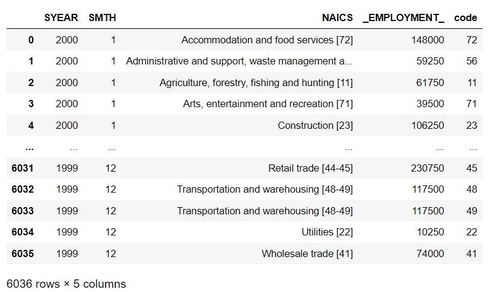

## 3-digit NAICS

We do the same thing as we did with 2-digit naics. Here, we notice that there is some 3-digit naics data do not contain naics code. So we should drop those raws.

```python
#display(rtra_3)
display(rtra_3[~rtra_3.NAICS.str.contains("\[.+", regex=True)])

rtra_3 = rtra_3.drop(rtra_3[~rtra_3.NAICS.str.contains("\[.+", regex=True)].index)

rtra_3['code'] = rtra_3.apply(
    lambda row: row.NAICS[row.NAICS.index('['):].strip('[').strip(']'), axis=1)
display(rtra_3)

rtra_3['code'] = list(rtra_3.code.str.split('-'))
rtra_3 = rtra_3.explode('code', ignore_index=True)
display(rtra_3)
```

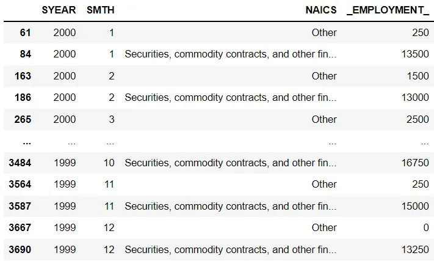

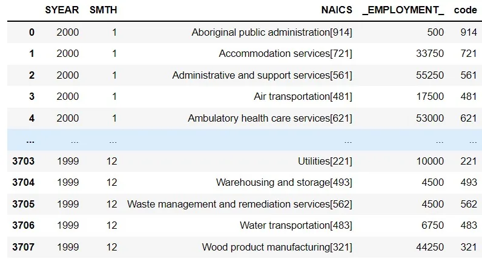

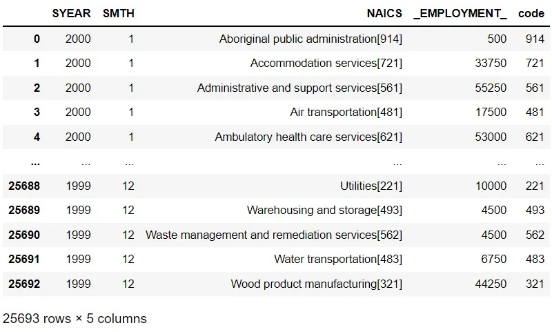

## Combining

```python
# adding the code column to 4-digit naics
rtra_4['code'] = rtra_4['NAICS']

rtra = rtra_2
rtra = rtra.append(rtra_3, ignore_index=True)
rtra = rtra.append(rtra_4, ignore_index=True)

display(rtra)
display(lmo)
```

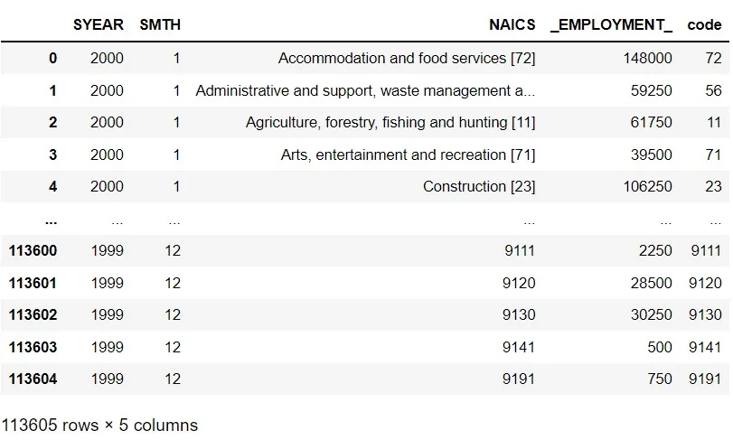

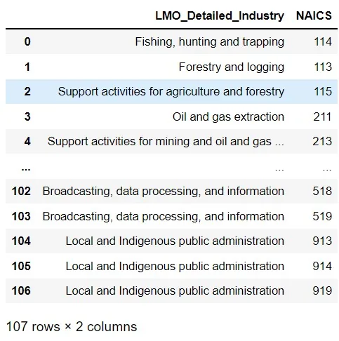

## Merging
```python
merged = lmo.merge(rtra, how='left', left_on='NAICS', right_on='code').dropna()
merged = merged[['SYEAR', 'SMTH', 'LMO_Detailed_Industry', '_EMPLOYMENT_']]

merged['SYEAR'] = merged['SYEAR'].astype('int')
merged['SMTH'] = merged['SMTH'].astype('int')
merged['_EMPLOYMENT_'] = merged['_EMPLOYMENT_'].astype('int')
merged['LMO_Detailed_Industry']
merged = merged.rename({'_EMPLOYMENT_':'Employment'})

merged = merged.reset_index()
display(merged)
```

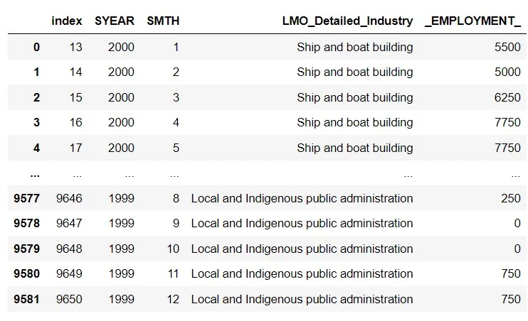

## Exploring

#### How has employment in Construction evolved and how does this compares to the total employment across all industries
```python
construction = merged[merged['LMO_Detailed_Industry'] == 'Construction']
display(construction)
```

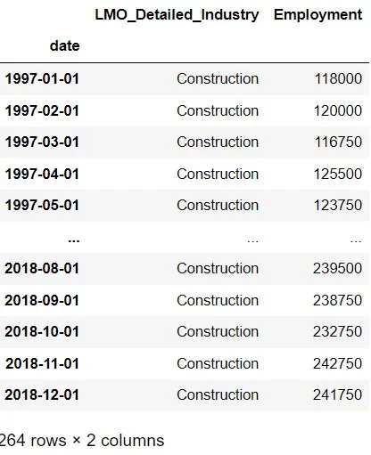

```python
import matplotlib.pyplot as plt
import seaborn as sns

construction= construction.resample('Y').sum()

construction.plot(title='Employment in construction evolution over time employment')
plt.show()
```

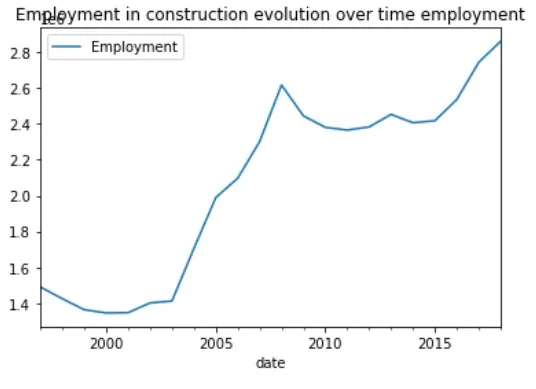

```python
all_indust = merged.resample('Y').sum()
all_indust.plot(title='Employment in all industries evolution over time employment')
plt.show()
```

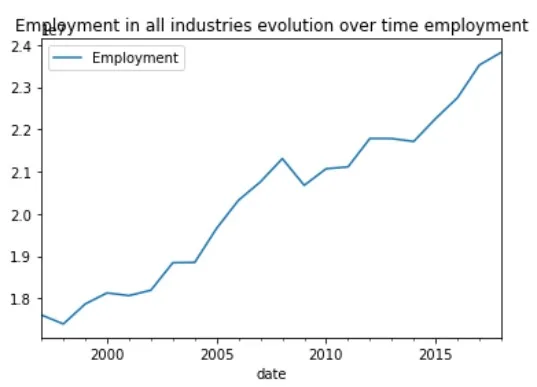

```python
annual = pd.concat([construction, all_indust], axis='columns')

annual.plot(subplots=True)

plt.show()
```

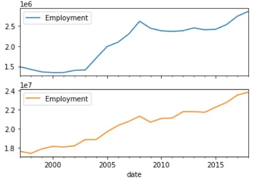

#### What are the top five industries by employment from 2016

```python
top_5= employment_summary[employment_summary.index > '2015-12-31'][0:5]
sns.barplot(x=top_5.values, y=top_5.index)

plt.title('top five industries by employment from 2016')
plt.show()
```

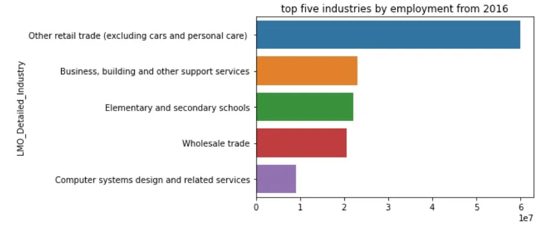

#### What are the five least employing industries

```python
worst_5= employment_summary[-6:-1].sort_values()
sns.barplot(x=worst_5.values, y=worst_5.index)

plt.title('worst five industries by employment')
plt.show()
```

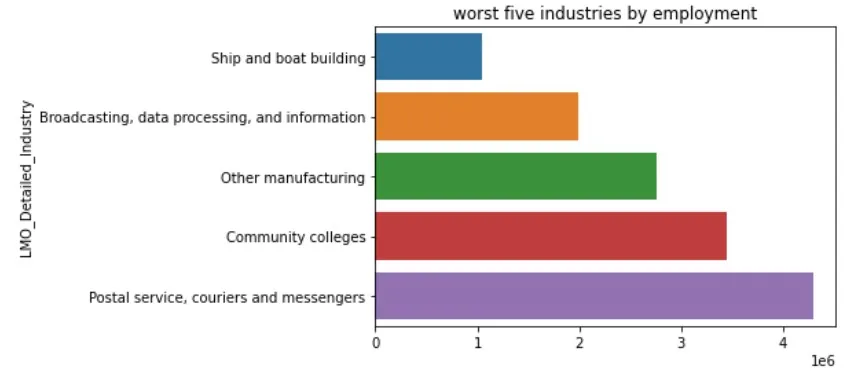

#### The mean and other important statistics

```python
merged.boxplot(column=['Employment'])
```

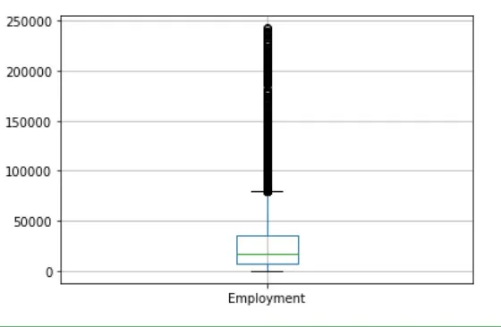

#### How is the evolution of Wholesale trade

```python
merged.reset_index(level=0, inplace=True)

total = merged.groupby(merged.date.dt.year).agg({'Employment':sum})
total['Wholesale'] = merged[merged.LMO_Detailed_Industry == 'Wholesale trade'].groupby(merged.date.dt.year).agg({'Employment':sum})

ax = sns.regplot(x=total.index, y="Wholesale",order=2, data=total,color='r')
ax.set_title('Wholesale trade Employment')
ax.set_ylabel('Employment')
ax.set_xlabel('Year')
```

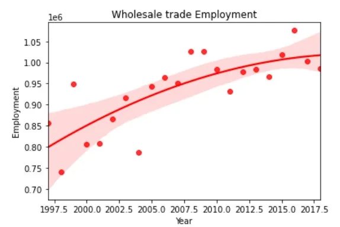

## Conclusion
These meaningful results we pull from this study help us make important decisions by identifying various facts and trends.

github: https://github.com/Jihed503/data_insight_Time_Series_Analysis_of_NAICS
