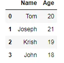
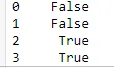
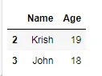
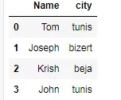
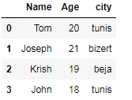
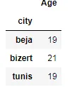
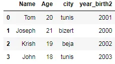
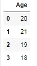

Pandas is a Python library used for working with data sets.

It has functions for analyzing, cleaning, exploring, and manipulating data.

## Why Use Pandas?
Pandas allows us to analyze big data and make conclusions based on statistical theories.

Pandas can clean messy data sets, and make them readable and relevant.

Relevant data is very important in data science.

In this notebook i will try to explain at least five pandas techniques with coding examples

- Boolean Indexing

Filtering data from a dataset is one of the most common and basic operations. There are numerous ways to filter (or subset) data in pandas with boolean indexing. Boolean indexing (also known as boolean selection) can be a confusing term, but for the purposes of pandas, it refers to selecting rows by providing a boolean value (True or False) for each row. These boolean values are usually stored in a Series or NumPy ndarray and are usually created by applying a boolean condition to one or more columns in a DataFrame.

first of all we all import the pandas package then we will initiate a dataframe wich contains students names and theire ages.

```python
import pandas as pd
data = pd.DataFrame({'Name':['Tom','Joseph','Krish','John'],'Age':[20,21,19,18]})
data
```



```python
bool_serie = data['Age'] <20
bool_serie
```



```python
data_filtered=data[bool_serie]
data_filtered
```



- merging dataframes

In life, data is provided is present in multiple files, with some of the columns present in more than one files. if you are familiar with databases and sql language, you will definitely know what I mean, sometimes you need to join two tables in one table to get specific data, the 'join' word for sql in 'merge' in pandas.

we have another dataset wich contains the city of the students



```python
df.merged = pd.merge(data, data_city , on='Name')
df.merged
```



It might happen that the column on which you want to merge the DataFrames have different names (unlike in this case). For such merges, you will have to specify the arguments left_on as the left DataFrame name and right_on as the right DataFrame name, like : df_merged = pd.merge(data,data_city,left_on='Name1',right_on='name2')

- dataframe chaining

Method chaining is a programmatic style of invoking multiple method calls sequentially with each call performing an action on the same object and returning it, Method chaining substantially increases the readability of the code.

```python
data_chained= pd.merge(data , data_city , on='Name').groupby('city).mean()
```

```python
data_chained
```



- creating new dataframe

During a data analysis, it is extremely likely that you will need to create new columns to represent new variables. Commonly, these new columns will be created from previous columns already in the dataset.

The simplest way to create a new column is to assign it a scalar value. Place the name of the new column as a string into the indexing operator. Let's create the year of birth column

```python
df_merged['date birth2']=2021 - df_merged['Age']
```

```python
df_merged
```



- Selecting DataFrame columns with filter

An alternative method to select columns is with the filter method. This method is flexible and searches column names (or index labels) based on which parameter is used. Here, we use the like parameter to search for all column names that contain the exact string 'Age'

```python
df_merged.filter(like='Age')
```



The filter method allows columns to be searched through regular expressions with the regex parameter. Here, we search for all columns that have a digit somewhere in their name: df_merged.filter(regex='/d')
