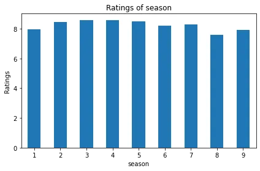
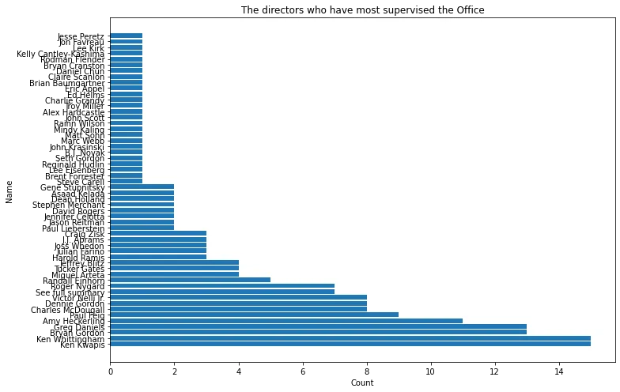
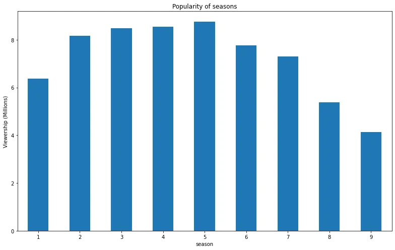
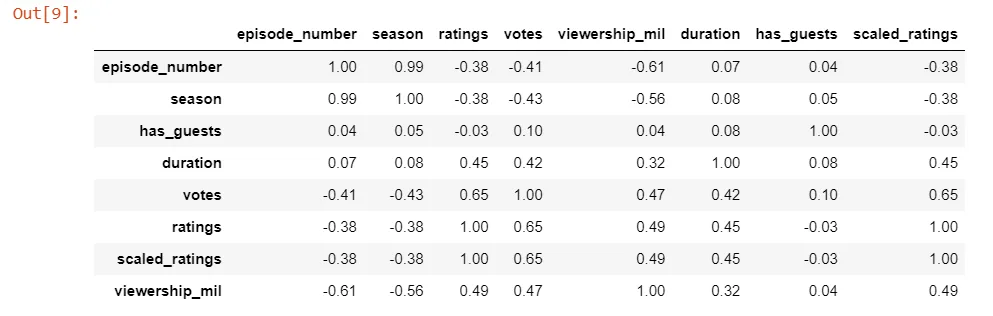
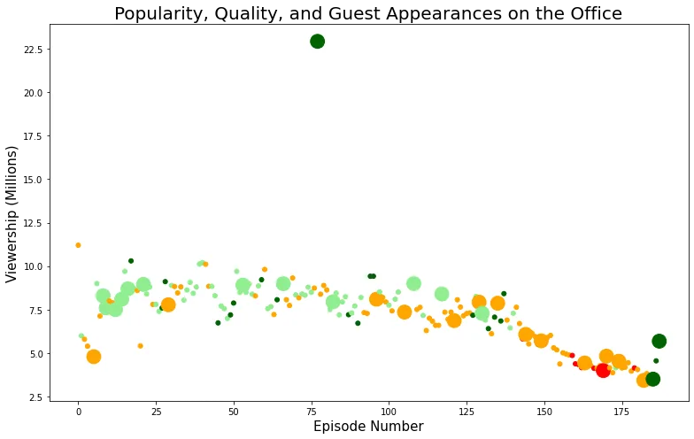

The project will focus on the Netflix data of the Tv show Office from the Kaggle website which we will use to extract the necessary information and draw conclusions. The file is composed of different variables of each episode such as :

- **episode_number:** Canonical episode number.
- **season:** Season in which the episode appeared.
- **episode_title:** Title of the episode.
- **description:** Description of the episode.
- **ratings:** Average IMDB rating.
- **votes:** Number of votes.
- **viewership_mil:** Number of US viewers in millions.
- **duration:** Duration in number of minutes.
- **release_date:** Airdate.
- **guest_stars:** Guest stars in the episode (if any).
- **director:** Director of the episode.
- **writers:** Writers of the episode.
- **has_guests:** True/False column for whether the episode contained guest stars.
- **scaled_ratings:** The ratings scaled from 0 (worst-reviewed) to 1 (best-reviewed).

## I - Exploration of the dataset
Creating graphics requires importing a number of packages first. In this project the packages we will use are pandas and matplotlib.pyplot.

```python
#load packages
import pandas as pd
import matplotlib.pyplot as plt
```

First of all, we will import our DataFrame. With the Pd. Read file by giving it the path. The code below shows the synthesis.

```python
# import the data file
df_office = pd.read_csv('datasets/office_episodes.csv')
df_office.head()
```

### 1-Data preprocessing

The data preprocessing allows us to have an idea about our data and to correct them if there are errors.

```python
# Have alook on the data
df_office.info()
# Check the value null
df_office.isnull().sum()
# Make a descriptive statistic of the data
df_office.describe()
```

### 2- Analysis
#### a-Ratings of season

To know the seasons that has been the most noted, we will make bar chart.The code below tells us how to reach our expectation:

```python
#Group ratings according to seasons
df_office.groupby("season")["ratings"].mean().plot.bar(rot=0)
# x_axis and y_axis label
plt.ylabel("Ratings")
plt.title("Ratings of season")
```



There is not a big difference between the seasons and the ratings. The season with the lowest rating is the one of the number 8.

#### b- Top directors
We are curious to identify the directors who most supervised the TV Show. For that we will do this:

```python
plt.rcParams['figure.figsize'] = [11, 7]
x= df_office["director"].unique()
y = df_office["director"].value_counts(sort=True)
plt.barh(x, y)

#Customization
plt.xlabel("Count")
plt.ylabel("Name")
plt.title("The directors who have most supervised the Office")
```



The directors who have been most in demand during the series are : **Ken Whittingham and Ken en Kwapis.**

#### c- Popularity of seasons
We are curious to identify the directors who most supervised the TV Show. For that we will do this:

```python
df_office.groupby("season["viewership_mil"].mean().plot.bar(rot=0)
plt.ylabel("Viewership (Millions)")
plt.title("Popularity of seasons")
```



We notice an ascending growth of the number of views from the first season to the fifth. Beyond that, the number of views of the last four seasons have been reduced. So season five (5) was the most viewed.

#### d-Correlation between variables
We are interested in the correlations between the variables. Here we will focus on the relationship between the number of views and the other variables. To do this we need to write this code below:

```python
# Correlation between variables
round(df_office.corr(),2).sort_values(by="viewership_mil", ascending=True)
```



The correlation between the number of views and the number of episodes is strong. But there is a weak correlation between the number of views and the duration of the episodes.

## II-Datacamp question

#### *Q1: Relation between number of episode and viewership*
Several elements will appear in the curve such as the color and size of the scatterplots depending on the presence or absence of the guests.

A for loop is used to assign colors according to their "scaled_ratings ''. The following code illustrates this:

```python
#Color by ratings
color = []

for lab, row in df_office.iterrows():
    if row['scaled_ratings']< 0.25:
       color.append("red")
    elif (row['scaled_ratings'] >= 0.25) & (row['scaled_ratings'] < 0.5):
       color.append("orange")
    elif (row['scaled_ratings'] >= 0.50) & (row['scaled_ratings'] < 0.75):
       color.append("lightgreen")
    else:
         color.append("darkgreen")
print(df_office.shape)
 The colors are arranged according to the ratings.
```

The distinction between the lines of episodes that have guests or not was made by the size of the point clouds. It was written as follows:

```python
size = []
for lab, row in df_office.iterrows():
   if row["has_guests"] == True:
      size.append(250)
   else:
      size.append(25)
print(len(size))
```

Also, the size of the point will depend on the presence of star guets or not.

#### Popularity, Quality and Guest Appereance on the Office
To know the relation between the number of views and the episode numbers according to the guest appearance or not, it would be better to have a scatter plot. The code below indicates the synthaxis of the scatter plot, the title of the graph, the title of the X and Y axes.

```python
fig = plt.figure(figsize=(11, 7))
#subsetting
plt.scatter(x='episode_number', y='viewership_mil', data=df_office, c=color, s=size)

#title label
plt.title("Popularity, Quality, and Guest Appearances on the Office", size=20)

# x_axis and y_axis label
plt.xlabel("Episode Number", size=15)
plt.ylabel("Viewership (Millions)", size=15)
```



The creation of the scatter plot shows the popularity, quality and appeal. We can see here that the episode number 77 with the presence of the guests was the most viewed. However, in general, the number of views decreased with each episode.

**Q2: One of the guest stars who was in the most watched Office episode?**

There are four guest stars in episode number 77. To find out the name of a guest among the others, we will do it according to this method:

```python
max_viewer = df_office.loc[df_office["viewership_mil"] == df_office["viewership_mil"].max()]
top_star = max_viewer["guest_stars"].values[0].split(",")[0]
print(top_star)
```

Output : Cloris Leachman

Cloris Leachman is one of the people in the guest stars category in episode 77.

## Conclusion
The office Tv Show had a good scope in general and was also well rated. It is recommended to those who have not yet seen it.

Please click here to check my repo:

[My github repository](https://github.com/Dorlote/Data_insight_programme_2021/blob/f887eb20e3a664fca19359718936907578bc3321/Exploration%20of%20the%20Office%20Dataset.ipynb)
