Neurodegeneration is the progressive loss of structure or function of neurons which includes diseases like amyotrophic lateral sclerosis, Parkinson's disease, Alzheimer's disease, fatal familial insomnia etc... There have been many studies related to Neurodegenerative diseases. This blog tries to gain some insight of one such study related to Parkinson disease. This blog structured in such a way that it explains the step wise analysis. The blog is categorized into two part with this part focusing on the Exploratory data analysis of the data set and next part focusing on generating and analyzing the predictive model. The steps for this part can be categorized into the following sections:

### 1)Understanding the data set
### 2)Performing analysis on fundamental frequencies
### 3)Performing analysis on shimmer and jitter
### 4)Visualization of the data set using PCA
### 5) Conclusion
## 1)Understanding the data set:
The data set which is used for the analysis is created by Max Little of the University of Oxford, in collaboration with the National Centre for Voice and Speech, Denver, Colorado, who recorded the speech signals. This dataset consists of a range of biomedical voice measurements with 195 samples of cases. The dataset consist of 24 attributes which are name of patients, three types of fundamental frequencies(high, low and average),several measures of variation in fundamental frequency (jitter and its type),several measures of variation in amplitude(shimmer and its type),Two measures of ratio of noise to tonal components in the voice(NHR and HNR),status(0 for healthy and 1 for Parkinson positive case), Two nonlinear dynamical complexity measures(RPDE,D2), DFA a signal fractal scaling exponent and Three nonlinear measures of fundamental frequency variation (spread1,spread2,PPE) [1]. The data set has about 75% of cases suffering from Parkinson disease and 25% of cases which are healthy.

```python
import pandas as pd
import numpy as np
import matplotlib.pyplot as plt
import seaborn as sns
data = pd.read_csv('parkinsons.data')
print(data.head())
y_value_counts = data['status'].value_counts()
print("Number of cases that are suffering from parksion are  ", y_value_counts[1], ", (", (y_value_counts[1]/(y_value_counts[1]+y_value_counts[0]))*100,"%)")
print("Number of cases that are not suffering from parksion are ", y_value_counts[0], ", (", (y_value_counts[0]/(y_value_counts[1]+y_value_counts[0]))*100,"%)")
```

- 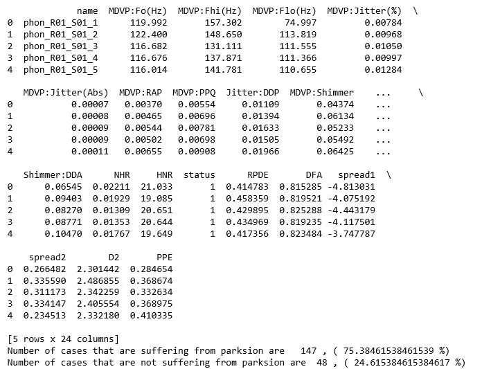

## 2)Performing analysis on fundamental frequencies
The fundamental frequencies recorded are categorized into 3 types : high , low and average. In this analysis all the 3 categorizes are considered and for each of them distribution plot, box plot and percentile table is constructed. The mentioned diagrams are used to gain insights about the role of fundamental frequencies in detecting the Parkinson disease. The code snippets and the diagrams for each frequencies are as follow:

### 2.1) For Average fundamental frequencies
```python
affected_freq_avg = data[data['status']==1]['MDVP:Fo(Hz)'].values
not_affected_freq_avg = data[data['status']==0]['MDVP:Fo(Hz)'].values
plt.boxplot([affected_freq_avg,not_affected_freq_avg])
plt.title('Box Plots of Average vocal fundamental frequency per Parskinson Positive and Parskinson Negative cases')
plt.xticks([1,2],('Parkinson Positive cases','Parkinson Negative cases'))
plt.grid()
plt.show()
plt.figure(figsize=(10,3))
sns.distplot(affected_freq_avg, hist=False, label="Parkinson Positive cases")
sns.distplot(not_affected_freq_avg, hist=False, label="Parkinson Negative cases")
plt.title('Average vocal fundamental frequency per Parkinson Positive and Negative cases')
plt.xlabel('Frequency')
plt.legend()
plt.show()
from prettytable import PrettyTable
x = PrettyTable()
x.field_names = ["Percentile", "Parkinson Positive cases", "Parkinson Negative cases"]
for i in range(0,101,5):
   x.add_row([i,np.round(np.percentile(affected_freq_avg,i),  3), np.round(np.percentile(not_affected_freq_avg,i), 3)])
 print(x)
```

- 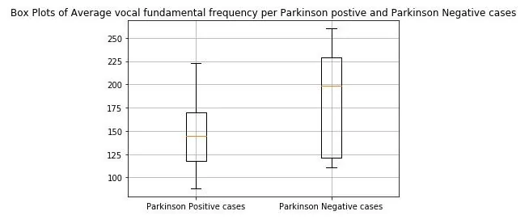

*figure 1: Box plot of Average vocal fundamental frequency per Parkinson positive and Parkinson Negative cases*

- 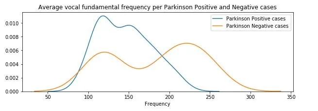

*figure 2:Distribution plot of Average vocal fundamental frequency per Parkinson positive and Parkinson Negative cases*

- 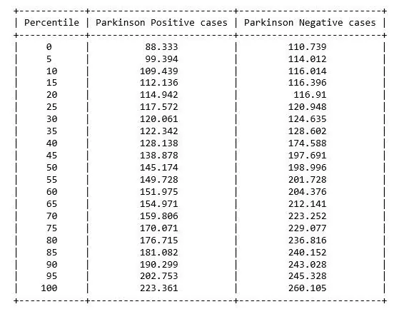

*figure 3: Percentile table of Average vocal fundamental frequency per Parkinson positive and Parkinson Negative cases*

**2.2) For high(Maximum) frequency**

```python
affected_freq_hi = data[data['status']==1]['MDVP:Fhi(Hz)'].values
not_affected_freq_hi = data[data['status']==0]['MDVP:Fhi(Hz)'].values
plt.boxplot([affected_freq_hi,not_affected_freq_hi])
plt.title('Box Plots of Maximum vocal fundamental frequency per Parkinson Positive and Parkinson Negative cases')
plt.xticks([1,2],('Parkinson Positive cases', 'Parkinson Negative cases'))
plt.grid()
plt.show()
plt.figure(figsize=(10,3))
sns.distplot(affected_freq_hi, hist=False, label="Parkinson Positive cases")
sns.distplot(not_affected_freq_hi, hist=False, label="Parkinson Negative cases")
plt.title('Maximum vocal fundamental frequency per Parkinson Positive and Negative cases')
plt.xlabel('Frequency')
plt.legend()
plt.show()
from prettytable import PrettyTable
x = PrettyTable()
x.field_names = ["Percentile", "Parkinson Positive cases", "Parkinson Negative cases"]
for i in range(0,101,5):
   x.add_row([i,np.round(np.percentile(affected_freq_hi,i),  3), np.round(np.percentile(not_affected_freq_hi,i), 3)])
 print(x)
```

- 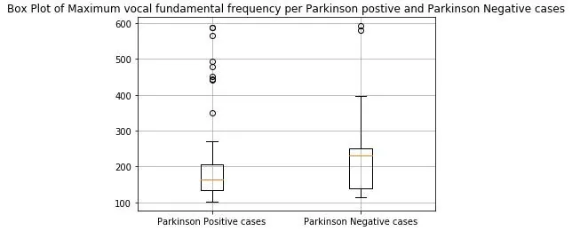

*figure 4: Box plot of Maximum vocal fundamental frequency per Parkinson positive and Parkinson Negative cases*

- 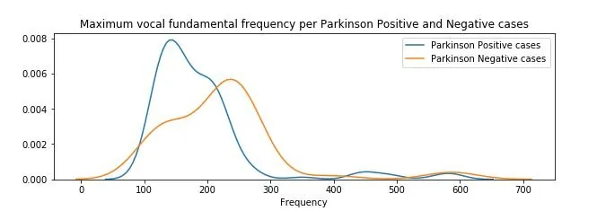

*figure 5:Distribution plot of Maximum vocal fundamental frequency per Parkinson positive and Parkinson Negative cases*

- 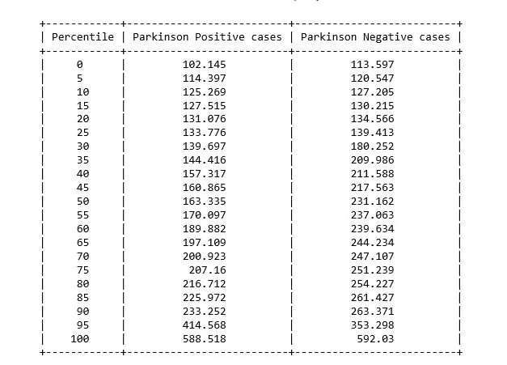

*figure 6: Percentile table of Maximum vocal fundamental frequency per Parkinson positive and Parkinson Negative cases*

**2.3) For Low (Minimum) frequency**

```python
affected_freq_low = data[data['status']==1]['MDVP:Flo(Hz)'].values
not_affected_freq_low = data[data['status']==0]['MDVP:Flo(Hz)'].values
plt.boxplot([affected_freq_low,not_affected_freq_low])
plt.title('Box Plots of Minimum vocal fundamental frequency per Parkinson Positive and Parkinson Negative cases')
plt.xticks([1,2],('Parkinson Positive cases', 'Parkinson Negative cases'))
plt.grid()
plt.show()
plt.figure(figsize=(10,3))
sns.distplot(affected_freq_low, hist=False, label="Parkinson Positive cases")
sns.distplot(not_affected_freq_low, hist=False, label="Parkinson Negative cases")
plt.title('Minimum vocal fundamental frequency per Parkinson Positive and Negative cases')
plt.xlabel('Frequency')
plt.legend()
plt.show()
from prettytable import PrettyTable
x = PrettyTable()
x.field_names = ["Percentile", "Parkinson Positive cases", "Parkinson Negative cases"]
for i in range(0,101,5):
   x.add_row([i,np.round(np.percentile(affected_freq_low,i),  3), np.round(np.percentile(not_affected_freq_low,i), 3)])
 print(x)
```

- 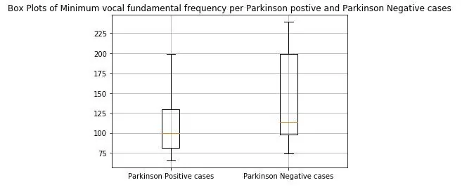

*figure 7: Box plot of Minimum vocal fundamental frequency per Parkinson positive and Parkinson Negative cases*

- 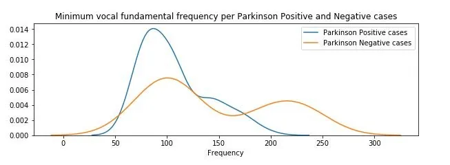

*figure 8:Distribution plot of Minimum vocal fundamental frequency per Parkinson positive and Parkinson Negative cases*

- 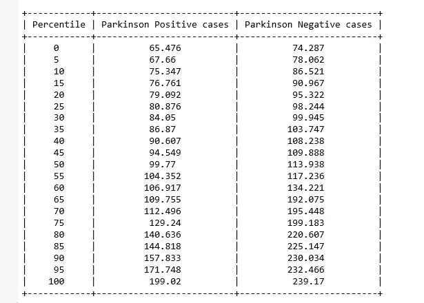

*figure 9: Percentile table of Minimum vocal fundamental frequency per Parkinson positive and Parkinson Negative cases*

From the above figures we can observe for both average and minimum vocal frequencies that the higher frequency have the higher tendency to belong to Parkinson Positive cases than of Negative cases. However the same tendency is not valid for the maximum vocal frequency category.

**3)Performing analysis on shimmer and jitter:**

Jitter and shimmer are acoustic characteristics of voice signals, and they are quantified as the cycle-to-cycle variations of fundamental frequency and waveform amplitude, respectively [ 2[].](http://nlp.lsi.upc.edu/papers/far_jit_07.pdf) The dataset consist of four variation of jitter measurement (MDVP:Jitter(%), MDVP:Jitter(Abs), MDVP:RAP, MDVP :PPQ, Jitter:DDP) and as for shimmer the variation measurement are MDVP:Shimmer, MDVP:Shimmer(dB), Shimmer:APQ3, Shimmer:APQ5, MDVP:APQ,Shimmer:DDA. For simplicity purpose the study of MDVP:Shimmer(dB) and 'MDVP:Jitter(Abs). In this study we have considered the distribution plot and violin plot for both the positive and negative cases of Parkinson disease for both MDVP:Shimmer(dB) and 'MDVP:Jitter(Abs) features.The code snippet and diagrams are as follows:

## 3.1)Analysis of Shimmer
```python
affected_MDVP = data[data['status']==1]['MDVP:Shimmer(dB)'].values
not_affected_MDVP = data[data['status']==0]['MDVP:Shimmer(dB)'].values
sns.distplot(affected_MDVP)
plt.title('Shimmer values for affected cases')
plt.xlabel('Shimmer values in DB per affected cases')
plt.show()
sns.violinplot(affected_MDVP)
plt.title('Shimmer values for affected cases')
plt.xlabel('Shimmer values in DB per affected cases')
plt.show()
sns.distplot(not_affected_MDVP)
plt.title('Shimmer values for not affected cases')
plt.xlabel('Shimmer values in DB per not affected cases')
plt.show()
sns.violinplot(not_affected_MDVP)
plt.title('Shimmer values for not affected cases')
plt.xlabel('Shimmer values in DB per not affected cases')
plt.show()
sns.FacetGrid(data, hue="status", size=5).map(sns.distplot, "MDVP:Shimmer(dB)").add_legend();
plt.show()
```

- 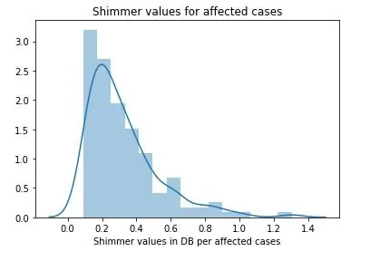

*figure 10:Distribution plot with histogram showing the Shimmer values Parkinson affected cases*

- 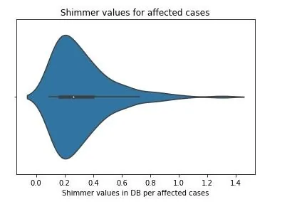

*figure 11:Violin plot of Shimmer values for Parkinson affected cases*

- 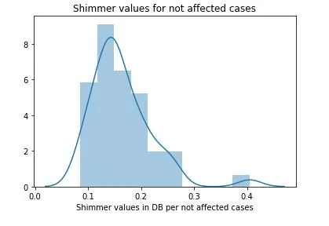

*figure 12:Distribution plot with histogram showing the Shimmer values for not affected cases*

- 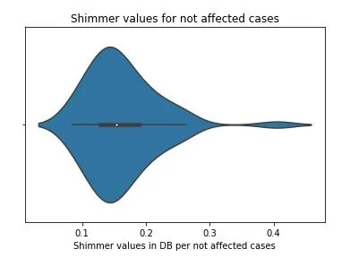

*figure 13:Violin plot of Shimmer values for not affected cases*

- 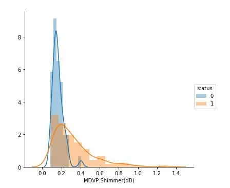

*figure 14:Distribution plots showing the Shimmer values for both Parkinson positive and negative cases*

### 3.2) Analysis of Jitter
```python
affected_MDVP = data[data['status']==1]['MDVP:Jitter(Abs)'].values
not_affected_MDVP = data[data['status']==0]['MDVP:Jitter(Abs)'].values
sns.distplot(affected_MDVP)
plt.title('Jitter values for affected cases')
plt.xlabel('Jitter values in DB per affected cases')
plt.show()
sns.violinplot(affected_MDVP)
plt.title('Jitter values for affected cases')
plt.xlabel('Jitter values in DB per affected cases')
plt.show()
sns.distplot(not_affected_MDVP)
plt.title('Jitter values for not affected cases')
plt.xlabel('Jitter values in DB per not affected cases')
plt.show()
sns.violinplot(not_affected_MDVP)
plt.title('Jitter values for not affected cases')
plt.xlabel('Jitter values in DB per not affected cases')
plt.show()
sns.FacetGrid(data, hue="status", size=5).map(sns.distplot, "MDVP:Jitter(ABS)").add_legend();
plt.show()
```

- 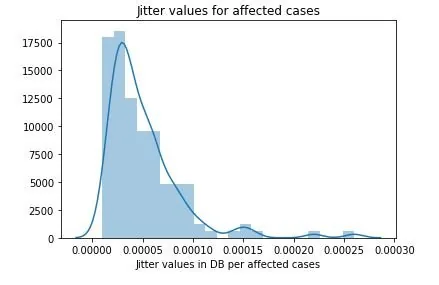

*figure 15:Distribution plot with histogram showing the Jitter values Parkinson affected cases*

- 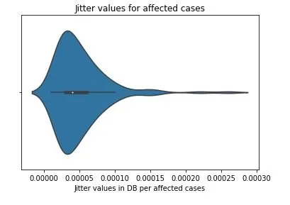

*figure 16:Violin plot of Jitter values for Parkinson affected cases*

- 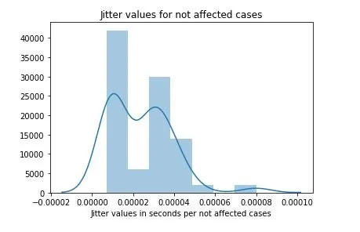

*figure 17:Distribution plot with histogram showing the Jitter values for not affected cases*

- 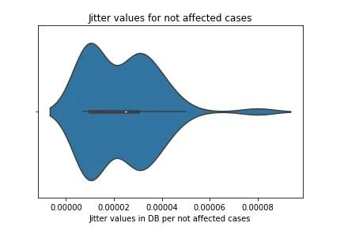

*figure 18:Violin plot of Jitter values for not affected cases*

- 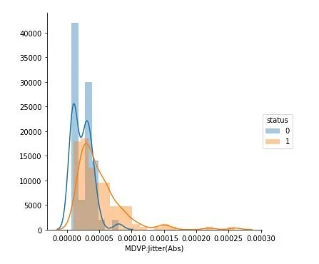

*figure 19:Distribution plots showing the Jitter values for both Parkinson positive and negative cases*

## 4)Visualization of the data set using PCA
PCA(Principal component analysis) is a technique to project data in a higher dimensional space into a lower dimensional space by maximizing the variance of each dimension [3]. The data consist of 24 columns where the first attribute is the name and id of the patient and other is the status of the patient. The name and status columns are removed and then the data is standardize as to perform PCA with the remaining components. Initially a graph of cumulative variance is plotted which shows variance with respect to number of components. Then 2D and 3D scatter plot of the data set was generated with keeping the number of components 2 and 3 respectively.

### 4.1) Generation of cumulative plot and 2D scatter plot
```python
status=data["status"]
from sklearn.preprocessing import StandardScaler
standardized_data = StandardScaler().fit_transform(data1)
from sklearn import decomposition
pca = decomposition.PCA()
pca.n_components = 22
sample_data=standardized_data
pca_data = pca.fit_transform(sample_data)
# Plot the PCA spectrum
percentage_var_explained = pca.explained_variance_ / np.sum(pca.explained_variance_);
cum_var_explained = np.cumsum(percentage_var_explained)
plt.figure(1, figsize=(6, 4))
plt.clf()
plt.plot(cum_var_explained, linewidth=2)
plt.axis('tight')
plt.grid()
plt.xlabel('n_components')
plt.ylabel('Cumulative_explained_variance')
plt.show()
# pca_reduced will contain the 2-d projects of simple data
pca.n_components = 2
pca_data = pca.fit_transform(sample_data)
pca_data = np.vstack((pca_data.T, status)).T
# creating a new data fram which help us in ploting the result data
pca_df = pd.DataFrame(data=pca_data, columns=("1st_principal", "2nd_principal", "status"))
sns.FacetGrid(pca_df, hue="status", size=6).map(plt.scatter, '1st_principal', '2nd_principal').add_legend()
plt.show()
```

- 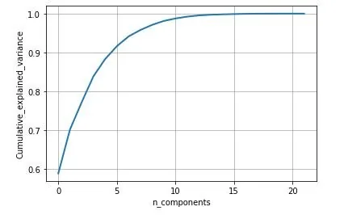

figure 20: Cumulative variance vs Number of component graph

- 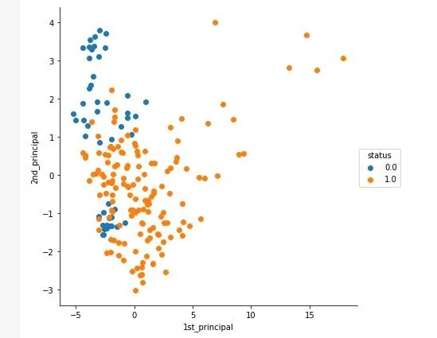

*figure 21: 2D scatter plot after performing PCA with number of components as 2*

### 4.2) Generation of 3D scatter plot
```python
from mpl_toolkits.mplot3d import Axes3D
pca.n_components = 3
pca_data = pca.fit_transform(sample_data)
print("shape of pca_reduced.shape = ", pca_data.shape)
pca_data = np.vstack((pca_data.T, status)).T
pca_df = pd.DataFrame(data=pca_data, columns=("1st_principal", "2nd_principal", "3rd_principal","status"))
fig = plt.figure()
ax = fig.add_subplot(111, projection='3d')
c_map = {0: 'blue', 1: 'red'}
ax.scatter(pca_df['1st_principal'], pca_df['2nd_principal'], pca_df['3rd_principal'], c=[c_map[_] for _ in status], s=20)
ax.view_init(30, 185)
plt.show()
```

- 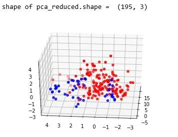

*figure 22: 3D scatter plot after performing PCA with number of components as 3*

## 5) Conclusion
From the above study we can observe that minimum and average vocal fundamental frequency tend to be higher in case of Parkinson positive cases than in negative ones, but the same argument is not clear for maximum vocal fundamental frequency. Secondly as for jitter and shimmer , only using MDVP:Shimmer(dB) and 'MDVP:Jitter(Abs) features don't yield to much insight for the Parkinson cases. So other variation of both measures in the data set may be helpful for further analysis. Finally using PCA we can determine that all the 22 features can be reduced to lesser number of features to reduce dimensionality of the data, even when reducing the dimension to 5 we can observe that about 90% of the variance is explained. Although the dimension is reduced to 2 and 3 the scatter plot seems to preserve the variation of Parkinson status. Currently the data set is small but in future the data set can be extended and the cumulative variance vs number of component graph makes it clear that PCA is favorable to reduce the dimension.

## Reference
1)'Exploiting Nonlinear Recurrence and Fractal Scaling Properties for Voice Disorder Detection', Little MA, McSharry PE, Roberts SJ, Costello DAE, Moroz IM. BioMedical Engineering OnLine 2007, 6:23 (26 June 2007)

2) Farrús, Mireia & Hernando, Javier & Ejarque, Pascual. (2007). Jitter and shimmer measurements for speaker recognition. Proceedings of the Interspeech 2007. 778-781.

3)Alpaydin, Ethem (2010). *Introduction to machine learning* (2nd ed.). MIT Press. pp. 113–120.

## Bibliography
1)J. D. Hunter, "Matplotlib: A 2D Graphics Environment", Computing in Science & Engineering, vol. 9, no. 3, pp. 90-95, 2007.
