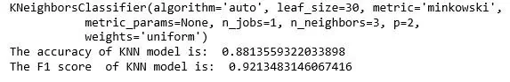
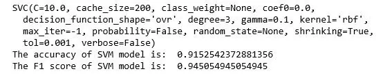
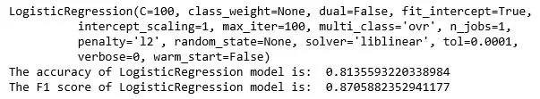
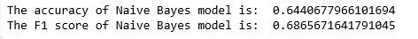
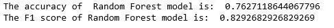
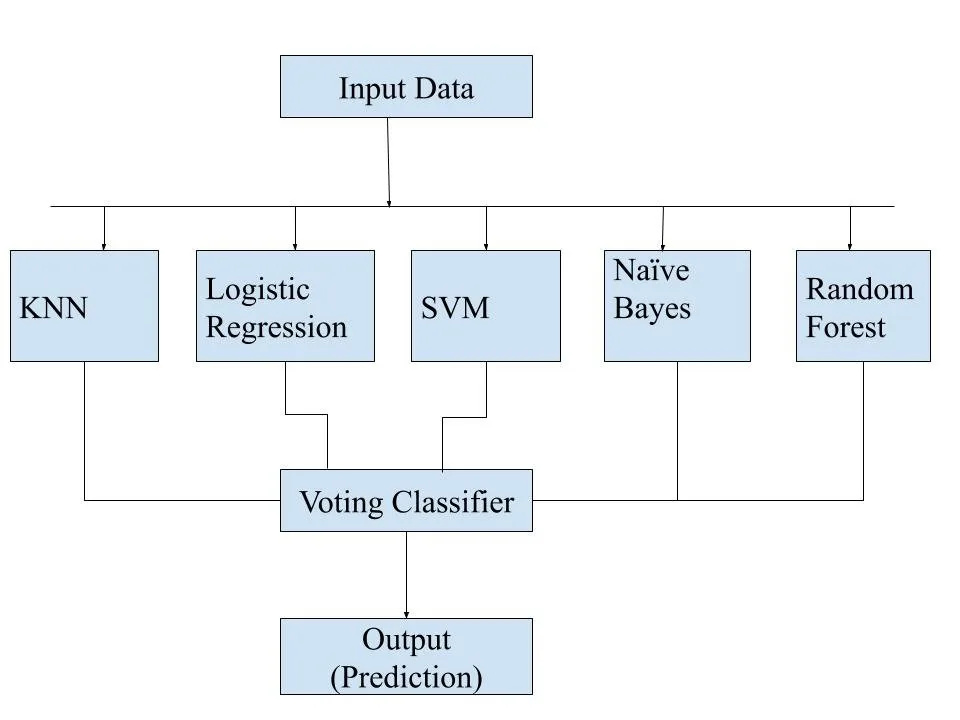
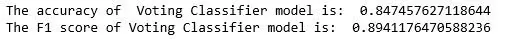
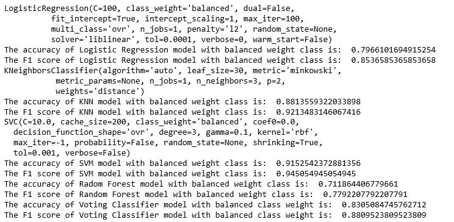
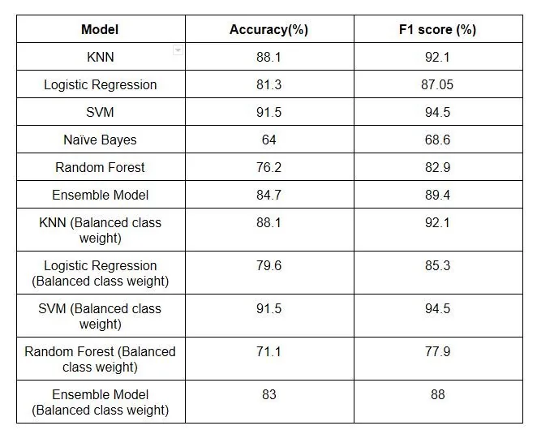

This blog is the continuation of the two part series blog .This part will be focused on developing machine learning model which can classify whether the given case is healthy or is suffering from Parkinson disease. The data set used is Oxford Dataset , same as of the pervious part. Total of 5 different Machine Learning algorithm are used which are SVM, KNN, Naïve Bayes , Logistic Regression and Random Forest. Also the concept of bagging is used with voting classifier after finding suitable hyper parameter of these model using grid search. The Performance metrics used for the model are accuracy and F1 score.

This bog is divided into 9 sections , where each section will has its on code snippet, output and related explanation. The sections are as follow:

### 1)Pre-Processing the data
### 2)Applying KNN
### 3)Applying SVM
### 4)Applying Logistic Regression
### 5)Applying Naïve Bayes
### 6)Applying Random Forest
### 7)Applying Ensemble model with voting classifier
### 8)Applying Ensemble model with voting classifier and balancing the class weight
### 9) Conclusion

### 1)Pre-Processing the data:
Pre-processing is a very crucial stage of any machine learning model development as the performance of the model highly depends upon this step. As many distance based algorithms like KNN, SVM , Logistic regression are used so the dataset is initially standardized using standardscalaer function from sklearn on the 22 features such that the mean is 0 and the variance is 1. Also the dataset is divided into 2 chunks: training set and test set in the ratio 7:3 respectively. Also while dividing the dataset the test train split is performed by stratifying the data according the status of the case. The stratifying is performed to preserve the percentage of output class (status) on training and test set.

```python
from sklearn.model_selection import train_test_split
from sklearn.preprocessing import StandardScaler
data = pd.read_csv('parkinsons.data')
y=data.status
x=data.drop(["name","status"],axis=1)
scaler = StandardScaler()
x = scaler.fit_transform(x)
x_train,x_test,y_train,y_test=train_test_split(x,y,test_size=0.3,random_state=42,stratify=y)
```

## 2)Applying KNN
KNN(K Nearest neighbor) is a supervised machine learning algorithm which classifies new data point using feature similarity. This algorithm uses he K value as hyper parameter , for this data set grid search is used to find the value of K. The accuracy and F1 of the model were 88.1% and 92.1% respectively after 5 fold cross validation.

```python
from sklearn.neighbors import KNeighborsClassifier
tuned_parameters = [{'n_neighbors': [2,3,4,5,6,7,8]}]
model = GridSearchCV(KNeighborsClassifier(), tuned_parameters, scoring = 'accuracy', cv=5)
model.fit(x_train, y_train)
print(model.best_estimator_)
print("The accuracy of KNN model is: ",model.score(x_test, y_test))
y_predict=model.predict(x_test)
print("The F1 score  of KNN model is: ",f1_score(y_test,y_predict))
```

- 

### 3)Applying SVM
SVM(Support Vector Machine) is a statistical machine learning framework that uses support vectors to classify new data points. The kernel trick can be used by SVM for feature engineering which makes is very powerful tool for supervised learning. In this study RBF kernel is used and using grid search the values of hyperparameters (C and gamma ) are figured out. The accuracy and F1 sore of the model is 91.5% and 94.5% respectively.

```python
from sklearn.svm import SVC
from sklearn.preprocessing import StandardScaler
from sklearn.model_selection import StratifiedShuffleSplit
from sklearn.model_selection import GridSearchCV
C_range = np.logspace(-2, 10, 13)
gamma_range = np.logspace(-9, 3, 13)
param_grid = dict(gamma=gamma_range, C=C_range)
grid = GridSearchCV(SVC(), param_grid=param_grid, cv=5)
grid.fit(x_train,y_train)
print(grid.best_estimator_)
print("The accuracy of SVM model is: ",grid.score(x_test, y_test))
y_predict=grid.predict(x_test)
print("The F1 score of SVM model is: ",f1_score(y_test,y_predict))
```

- 

### 4)Applying Logistic Regression
Logistic Regression is an important machine algorithm whose goal is to model the probability of a random variable Y being 0 or 1 given experimental data. This algorithm uses the C value as hyper parameter which is figured out sing grid search and 5 fold validation is performed. The accuracy and F1 sore of the model is 81.3% and 87.05% respectively.

```python
from sklearn.linear_model import LogisticRegression
from sklearn.grid_search import GridSearchCV
from sklearn.metrics import accuracy_score, f1_score
tuned_parameters = [{'C': [10**-4, 10**-2, 10**0, 10**2, 10**4]}]
model = GridSearchCV(LogisticRegression(), tuned_parameters, scoring = 'accuracy', cv=5)
model.fit(x_train, y_train)
print(model.best_estimator_)
print("The accuracy of LogisticRegression model is: ",model.score(x_test, y_test))
y_predict=model.predict(x_test)
print("The F1 score of LogisticRegression model is: ",f1_score(y_test,y_predict))
```

- 

## 5)Applying Naïve Bayes
Naïve Bayes algorithm is based on Bayes' theorem with the assumption that the all feature are conditionally independent. A simple Gaussian Naïve Bayes model is used in this experiment. The accuracy and F1 sore of the model is 64% and 68.6% respectively.

```python
from sklearn.naive_bayes import GaussianNB
clf = GaussianNB()
clf.fit(x_train, y_train)
y_predict=clf.predict(x_test)
print("The accuracy of Naive Bayes model is: ",clf.score(x_test,y_test))
print("The F1 score of Naive Bayes model is: ",f1_score(y_test,y_predict))
```

- 

### 6)Applying Random Forest
Random forest is one of the most popular bagging technique that uses various decision tree as base learn.This algorithm performs both column and row sampling and prefers base learns to have low bias and high variance. Cross validation is not performed in Random forest as out of bag points can be used for dealing with overfitting problem.The accuracy and F1 sore of the model is 76.2% and 82.9% respectively.

```python
from sklearn.ensemble import RandomForestClassifier
clf = RandomForestClassifier(max_depth=2, random_state=0)
clf.fit(x_train, y_train)
y_predict=clf.predict(x_test)
print("The accuracy of  Random Forest model is: ",clf.score(x_test,y_test))
print("The F1 score of  Random Forest model is: ",f1_score(y_test,y_predict))
```

- 

### 7)Applying Ensemble model with voting classifier
Ensemble machine learning technique can be defined as the use of various machine learning model with the aim to obtain better performance than its single constituent solely. This study uses 5 different machine learning model as illustrated in the figure 1. Finally the prediction from all the different model is supplied to voting classifier which simply performs general voting to predict the output class label The accuracy and F1 sore of the model is 84.7% and 89.4% respectively.

- 

*figure 1: Architecture of Ensemble model*

```python
from sklearn.ensemble import RandomForestClassifier, VotingClassifier
clf1=GaussianNB()
clf2=SVC(C=10,gamma=0.1)
clf3=KNeighborsClassifier(n_neighbors=3)
clf4=LogisticRegression(C=100)
clf5 = RandomForestClassifier(max_depth=2, random_state=0)
eclf1 = VotingClassifier(estimators=[('lr', clf4), ('svc', clf2), ('gnb', clf1),('knn',clf3),('rf',clf5)], voting='hard')
eclf1 = eclf1.fit(x_train, y_train)
y_predict=eclf1.predict(x_test)
print("The accuracy of  Voting Classifier model is: ",eclf1.score(x_test,y_test))
print("The F1 score of Voting Classifier model is: ",f1_score(y_test,y_predict))
```

- 

### 8)Applying Ensemble model with voting classifier and balancing the class weight
Class imbalance is one of the major problems in machine learning. One of the technique to solve this problem is to use class weight such that the class label with less occurrence is also considered equally. The dataset consist of 75% of case suffering from Parkinson disease, so this dataset suffers from class imbalance problem. In this step we simply use class weight balance to the dataset and then the best hyper parameters are found using grid search on KNN, Logistic Regression , SVM and Random Forest. Then the same ensemble architecture is used as displayed in figure 1 for making prediction. The accuracy and F1 sore of the model is 83% and 88% respectively.

```python
from sklearn.linear_model import LogisticRegression
from sklearn.grid_search import GridSearchCV
from sklearn.metrics import accuracy_score, f1_score
tuned_parameters = [{'C': [10**-4, 10**-2, 10**0, 10**2, 10**4]}]
model = GridSearchCV(LogisticRegression(class_weight='balanced'), tuned_parameters, scoring = 'accuracy', cv=5)
model.fit(x_train, y_train)
print(model.best_estimator_)
print("The accuracy of Logistic Regression model with balanced weight class is: ",model.score(x_test, y_test))
y_predict=model.predict(x_test)
print("The F1 score of Logistic Regression model with balanced weight class is: ",f1_score(y_test,y_predict))

from sklearn.neighbors import KNeighborsClassifier
tuned_parameters = [{'n_neighbors': [2,3,4,5,6,7,8]}]
model = GridSearchCV (KNeighborsClassifier(weights='distance'), tuned_parameters, scoring = 'accuracy', cv=5)
model.fit(x_train, y_train)
print(model.best_estimator_)
print("The accuracy of KNN model with balanced weight class is: ",model.score(x_test, y_test))
print("The F1 score of KNN model with balanced weight class is: ",f1_score(y_test,y_predict))

from sklearn.svm import SVC
C_range = np.logspace(-2, 10, 13)
gamma_range = np.logspace(-9, 3, 13)
param_grid = dict(gamma=gamma_range, C=C_range)
grid = GridSearchCV(SVC(class_weight='balanced'), param_grid=param_grid, cv=5)
grid.fit(x_train,y_train)
print(grid.best_estimator_)
print("The accuracy of SVM model with balanced weight class is: ",grid.score(x_test, y_test))
y_predict=grid.predict(x_test)
print("The F1 score of SVM model with balanced weight class is: ",f1_score(y_test,y_predict))

clf = RandomForestClassifier (class_weight='balanced',max_depth=2, random_state=0)
clf.fit(x_train, y_train)
y_predict=clf.predict(x_test)
print("The accuracy of Radom Forest model with balanced weight class is: ",clf.score(x_test,y_test))
print("The F1 score of Random Forest model with balanced weight class is: ",f1_score(y_test,y_predict))

clf1=GaussianNB()
clf2=SVC(class_weight='balanced',C=10,gamma=0.1)
clf3=KNeighborsClassifier(n_neighbors=3)
clf4=LogisticRegression(C=100,class_weight='balanced')
clf5 = RandomForestClassifier(max_depth=2, random_state=0)
eclf1 = VotingClassifier(estimators=[('lr', clf4), ('svc', clf2), ('gnb', clf1),('knn',clf3),('rf',clf5)], voting='hard')
eclf1 = eclf1.fit(x_train, y_train)
y_predict=eclf1.predict(x_test)
print("The accuracy of Voting Classifier model with balanced class weight is: ",eclf1.score(x_test,y_test))
print("The F1 score of Voting Classifier model with balanced class weight is: ",f1_score(y_test,y_predict))
```

- 

### 9)Conclusion
It can be observed that naïve Bayes model performance was least effective and the best performance was displayed by SVM. SVM had the best performance as RBF kernel was used which automatically transformed the features. Even using balanced class weight the performance of the model didn't seem to improve and the ensemble model had performance reduction on both accuracy and F1 score by 1%. The table 1 illustrates the model performance summary of various model used in terms of F1 score and accuracy. We can conclude that in this dataset balancing class weight was not effective, so other techniques like up sampling , down sampling and penalizing can be used for better performance.

- 

*Table 1: Model performance summary*

**Bibliography**

1)https://www.datainsightonline.com/post/exploratory-data-analysis-and-prediction-on-oxford-parkinson-s-disease-detection-dataset-part-1

2)Scikit-learn: Machine Learning in Python, Pedregosa et al., JMLR 12, pp. 2825-2830, 201
