**Table of Contents:**
1. Introduction
2. Data Wrangling
3. Exploratory Data Analysis
4. Conclusions
**Introduction:**

Data Description
The dataset used in this analysis comes from Kaggle and it contains data for soccer matches, players, and teams from several European countries in the years 2008 to 2016. The country table contains 11 rows 2 and columns and has a relationship with the league which has 11 rows and 3 columns and the team with 299 rows and 5 columns. team_attributes has 1458 and 25 columns that have relationships with teams. Match has 25979 rows and 115 columns that relate to Teams Table. the player table has 11060 with 7 columns and has a relationship with player_Attributes with 183978 rows and 42 columns. for further details

here is the link to the dataset: https://www.kaggle.com/datasets/hugomathien/soccer

**Question(s) for Analysis**
**Research Question 1**: How many times a Gaol was netted for all the leagues from 2008 to 2016?

 **Research Question 2**: Chances Created By Crossing for all leagues from 2008 to 2015?

**Research Question 3**: Which league had the most possession of the ball throughout the period?

 **Research Question 4**: Number of times a team dominated with ball position over 70 in EPL from 2008-2015

**Research Question 5**: Top 10 players with highest chances of scoring penalty in EPL?

 **Research Question 6**: who were the fastest players from 2008 to 2016?

 **Research Question 7**: who were the best left-footed shooters in the year (2015-2016) in EPL?

**Data Wrangling phase**

```python
# importing modules
import pandas as pd
import seaborn as sns
import matplotlib.pyplot as plt
%matplotlib inline
# importing datasets
df_country=pd.read_csv('Data/Country.csv')
df_league=pd.read_csv('Data/League.csv')
df_match=pd.read_csv('Data/Match.csv')
df_player=pd.read_csv('Data/Player.csv')
df_player_att=pd.read_csv('Data/Player_Attributes.csv')
df_team=pd.read_csv('Data/Team.csv')
df_team_att=pd.read_csv('Data/Team_Attributes.csv')
```

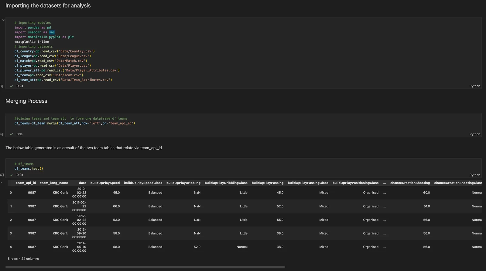

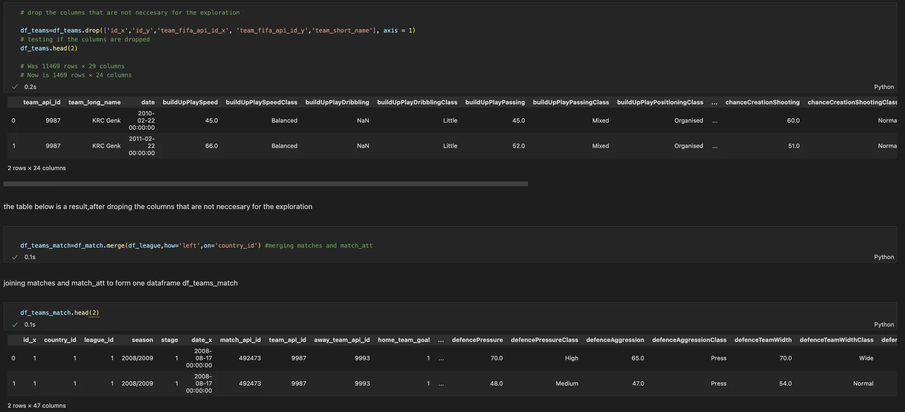

**Data cleaning:**
The below info method shows some data types are inaccurate and there is missing data in it. the total entries should be 142271 but other columns such as goals and possessions which are the basis of the analysis have missing data. let's clean them before we analyse but a function would be great to avoid repeatative work

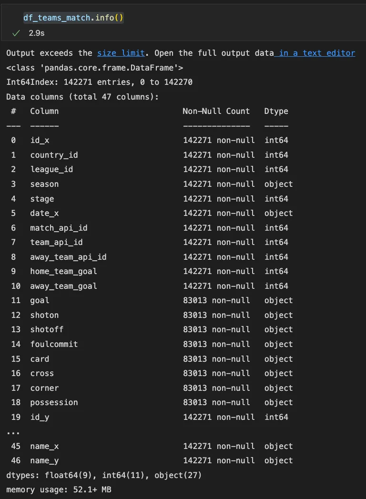

the below function produced a data that is clean and now we can do the Exploration process

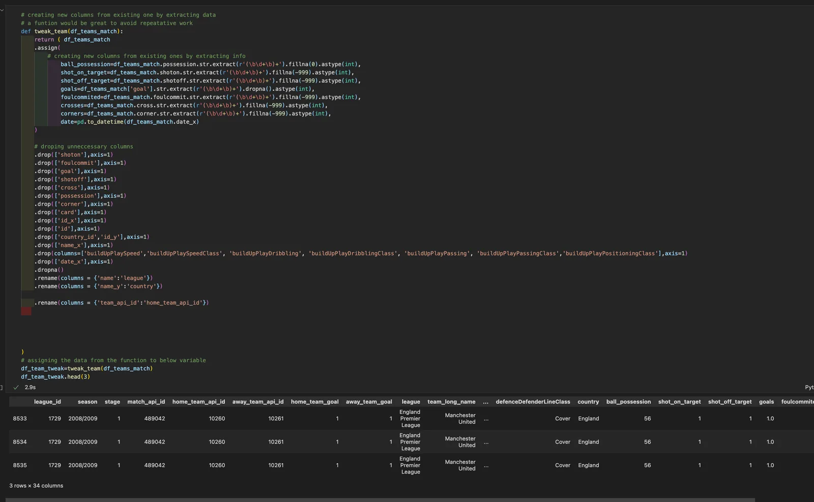

**Exploration** **Phase**

**Research Question 1: How many times a Gaol was netted for all the leagues from 2008 to 2016?**

```python
total_goals = df_team_tweak.groupby('league')[['home_team_goal','away_team_goal']].sum().sum(axis=1).sort_values\
(ascending=False)

plt.figure(figsize=(18,10))
sns.barplot(x=total_goals.index,y=total_goals)
plt.title('Goals Scored for all leagues from 2008 to 2016',fontsize=28)
plt.xticks(rotation=90)
plt.xlabel('Leagues')
plt.ylabel('Goals Scored (2008-2015)');
```

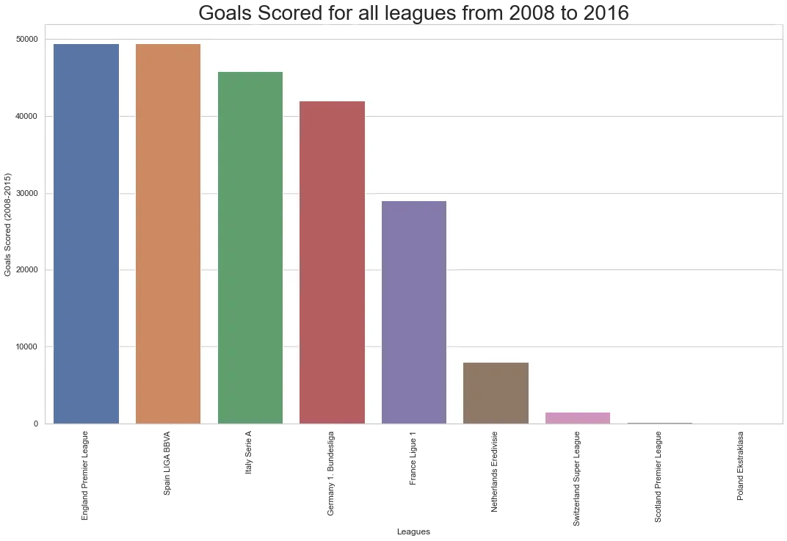

**Observation**:: EPL has the highest goals scored from the years 2008 to 2015.

**Research Question 2: Chances Created By Crossing for all leagues from 2008 to 2015?**

```python
chance_Creation_by_Crossing= df_team_tweak.groupby('league')['chanceCreationCrossing'].sum().sort_values(ascending=False)

chance_Creation_by_Crossing=chance_Creation_by_Crossing.head(5)
#Plotting the above results

plt.figure(figsize=(20,10))
sns.barplot(x=chance_Creation_by_Crossing.index,y=chance_Creation_by_Crossing)
plt.title('Chances Created By Crossing for all leagues from 2008 to 2015',fontsize=20)
plt.xticks(rotation=90)
plt.xlabel('Leagues')
plt.ylabel('Chances Created By Crossing (2008-2015)');
```

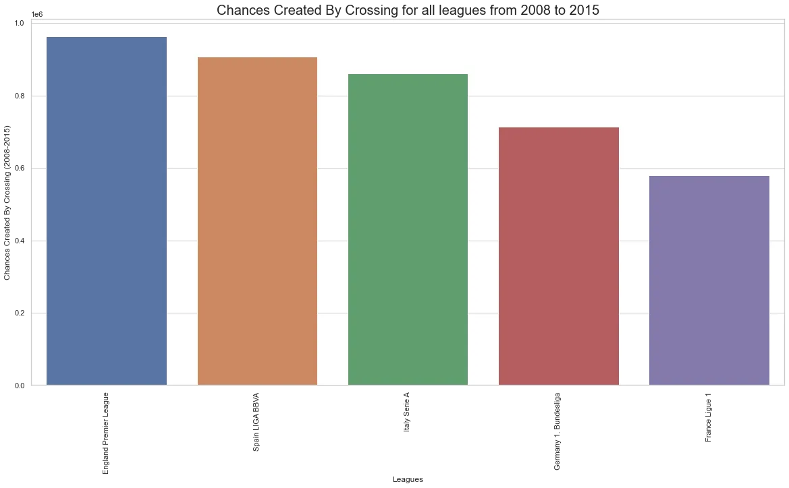

**Observation**:: France Ligue 1 has the least chances created by crossing than the Big Five leagues.

**Research Question 4: Number of times a team dominated with ball possition over 70 in EPL from 2008-2015**

```python
top_poss_teams = df_team_tweak.groupby('league').get_group('England Premier League').query("ball_possession >=70")['team_long_name'].value_counts(ascending=False)

plt.figure(figsize=(15,5))
sns.barplot(x=top_poss_teams.index,y=top_poss_teams)

plt.title('Dominated with Ball possition >= 70 from 2008 to 2016')
plt.xticks(rotation=90)
plt.xlabel('Leagues')
plt.ylabel('# of times Ball possition is over 70');
```

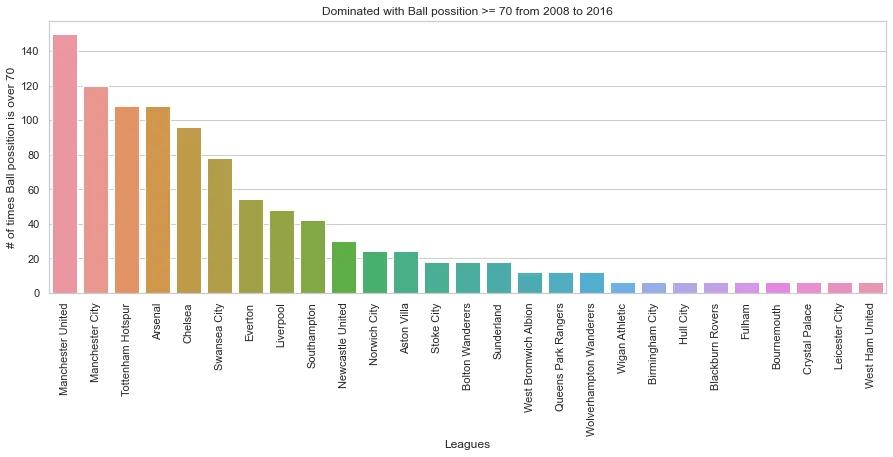

**Observation**::Manchester United and manchester city are the only two teams that had 70+ ball positions more than 120 times from 2008 to 2016.

**Data Wrangling Phase for Players Data sets**

**Below is a reminder of the objective of the player's Analysis .**
**Q5: Top 10 players with highest chances of scoring penalty in EPL?**
**Q6: who were the fastest players during 2008 to 2016?**
**Q7: who were the best left-footed shooters in the year (2015-2016) in EPL?**

**Merging Process**

```python
# below we have joined the two data set and assigned to the df_players
df_players=df_player.merge(df_player_att,how='left',on='player_api_id')
```

**Data Cleaning Process**

The below method shows most data has missing data. if the missing values are dropped then a significant amount of data is lost. therefore, the sklean simpleImputer provides a way to fill the categorical data with their frequently value and for the numeric values with their mean.

```python
df_players.isnull().sum()
id_x                       0 player_api_id              0 player_name                0 player_fifa_api_id_x       0 birthday                   0 height                     0 weight                     0 id_y                       0 player_fifa_api_id_y       0 date                       0 overall_rating           836 potential                836 preferred_foot           836 attacking_work_rate     3230 defensive_work_rate      836 crossing                 836 finishing                836 heading_accuracy         836 short_passing            836 volleys                 2713 dribbling                836 curve                   2713 free_kick_accuracy       836 long_passing             836 ball_control             836
...
gk_handling              836 gk_kicking               836 gk_positioning           836 gk_reflexes              836 dtype: int64
```

```python
# before imputing let's split our dataframe into numeric and categorical

# numeric columns
df_player_numeric=df_players.select_dtypes(include='number')
numeric_cols=df_player_numeric.columns

# categorical colums
df_player_categorical=df_players.select_dtypes(exclude='number')
cat_cols=df_player_categorical.columns
```

```python
# before imputing let's split our dataframe into numeric and categorical

# numeric columns
df_player_numeric=df_players.select_dtypes(include='number')
numeric_cols=df_player_numeric.columns

# categorical colums
df_player_categorical=df_players.select_dtypes(exclude='number')
cat_cols=df_player_categorical.columns
```

```python
# import modules

from sklearn.impute import SimpleImputer

simple_imp_num=SimpleImputer(strategy = 'constant',fill_value=-999)

# filling all nulls with -999
imputed_num=simple_imp_num.fit_transform(df_players[numeric_cols])

# let's fill the missing values of numeric columns with thier mean
simple_imp_mean=SimpleImputer(strategy = 'mean')
imputed_num=simple_imp_mean.fit_transform(df_players[numeric_cols])
df_players[numeric_cols]=imputed_num
```

**let's fill the missing values of categorical columns**

```python
# let's fill the missing values of categorical columns with their most frequenty values
simple_imp_freq=SimpleImputer(strategy = 'most_frequent')
imputed_cat=simple_imp_freq.fit_transform(df_players[cat_cols])
df_players[cat_cols]=imputed_cat
```

```python
df_players.info()
Data columns (total 48 columns):  #   Column                Non-Null Count   Dtype   ---  ------                --------------   -----    0   id_x                  183978 non-null  float64  1   player_api_id         183978 non-null  float64  2   player_name           183978 non-null  object   3   player_fifa_api_id_x  183978 non-null  float64  4   birthday              183978 non-null  object   5   height                183978 non-null  float64  6   weight                183978 non-null  float64  7   id_y                  183978 non-null  float64  8   player_fifa_api_id_y  183978 non-null  float64  9   date                  183978 non-null  object   10  overall_rating        183978 non-null  float64  11  potential             183978 non-null  float64  12  preferred_foot        183978 non-null  object   13  attacking_work_rate   183978 non-null  object   14  defensive_work_rate   183978 non-null  object   15  crossing              183978 non-null  float64  16  finishing             183978 non-null  float64  17  heading_accuracy      183978 non-null  float64  18  short_passing         183978 non-null  float64  19  volleys               183978 non-null  float64
...
 46  gk_positioning        183978 non-null  float64  47  gk_reflexes           183978 non-null  float64 dtypes: float64(42), object(6) memory usage: 68.8+ MB
```

As per the above method, the data has zero missing but there is inaccuracy in the data types. some columns have unmeaningful names and Duplicates. Below is a function that takes care of any data inconsistencies that the above method had shown and beyond.

```python
def tweak_players(df_players):
    cols=df_players.columns
    list(cols)
    return(
        df_players
        [cols]
        .assign(
            birthday=pd.to_datetime(df_players.birthday), # convert DOB datatype to datetime
            date=pd.to_datetime(df_players.date) # convert Date datatype to datetime
        )
    .drop(columns=['id_x','id_y','player_fifa_api_id_x', 'player_fifa_api_id_y']) # droping these columns
    .rename(columns={'player_api_id':'id'}) # renaming a column
    .dropna() # drop nulls
    .drop_duplicates() # drop dulicates

)
df_players_tweak=tweak_players(df_players) # call the function and save the data to the variable
df_players_tweak # testing what we got
```

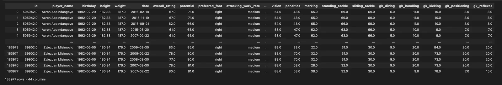

```python
#checking for nulls ,duplicates and other in accuracies
df_players_tweak.info()
 Data columns (total 44 columns):  #   Column               Non-Null Count   Dtype          ---  ------               --------------   -----           0   id                   183977 non-null  float64         1   player_name          183977 non-null  object          2   birthday             183977 non-null  datetime64[ns]  3   height               183977 non-null  float64         4   weight               183977 non-null  float64         5   date                 183977 non-null  datetime64[ns]  6   overall_rating       183977 non-null  float64         7   potential            183977 non-null  float64         8   preferred_foot       183977 non-null  object          9   attacking_work_rate  183977 non-null  object          10  defensive_work_rate  183977 non-null  object          11  crossing             183977 non-null  float64         12  finishing            183977 non-null  float64         13  heading_accuracy     183977 non-null  float64         14  short_passing        183977 non-null  float64         15  volleys              183977 non-null  float64         16  dribbling            183977 non-null  float64         17  curve                183977 non-null  float64         18  free_kick_accuracy   183977 non-null  float64         19  long_passing         183977 non-null  float64
...
 42  gk_positioning       183977 non-null  float64         43  gk_reflexes          183977 non-null  float64        dtypes: datetime64[ns](2), float64(38), object(4) memory usage: 63.2+ MB
```

**Exploratory Data Analysis**

**Research Question 5: Top 10 players with highest chances of scoring penalty in EPL?**

```python
top_penalty_takers=df_players_tweak[['player_name','penalties']].query("penalties>=94")['player_name'].value_counts()

plt.figure(figsize=(16,8))
sns.barplot(x=top_penalty_takers.index,y=top_penalty_takers)

plt.title('Players with highest chances of scoring penalty in EPL from 2008 to 2016')
plt.xticks(rotation=90)
plt.xlabel('Player Name')
plt.ylabel('# of times penalties were  >= 94 (2008-2015)');
```

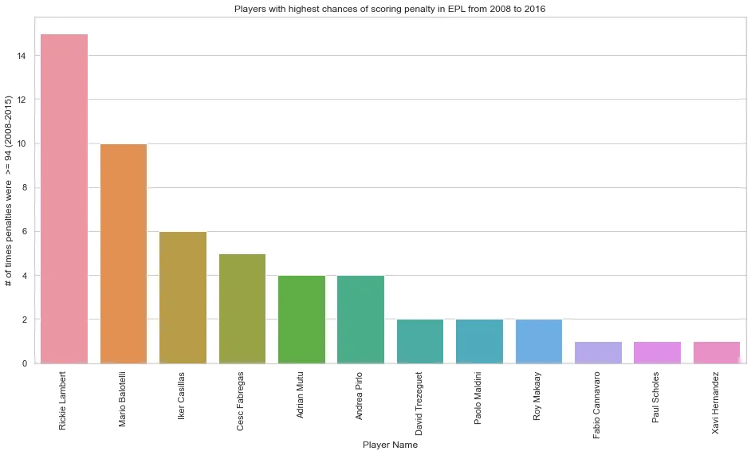

**Observation**::Rickie is the only player in the EPL that had the highest chances of scoring a penalty from 2008 to 2016

**Research Question 6: who were the fastest players during 2008 to 2016?**

```python
fastest_players=df_players[['player_name','sprint_speed']].query("sprint_speed>=96")['player_name'].value_counts()

plt.figure(figsize=(14,10))
sns.barplot(x=fastest_players.index,y=fastest_players)

plt.title('Speed Consistency  >= 96 from 2008 to 2016')
plt.xticks(rotation=90)
plt.xlabel('Player Name')
plt.ylabel('Speed Consistency >= 96 (2008-2015)');
```

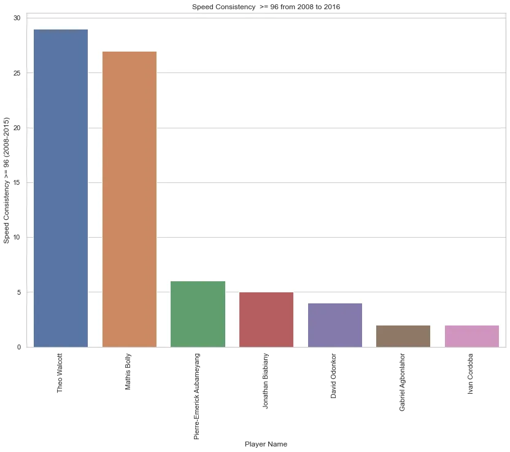

**Observation**::theo,Mathis and Pierre are the fastest players in the EPL during 2008 to 2016.

**Research Question 7 : who were the best left-footed shooters in the year (2015-2016)?**

```python
best_left_shooter=df_players[['player_name','preferred_foot','shot_power','date']].query("shot_power>=90 & preferred_foot=='left'& date>'2015' ")['player_name'].value_counts()

plt.figure(figsize=(20,8))
sns.barplot(x=best_left_shooter.index,y=best_left_shooter)
sns.set_theme(style="whitegrid")
plt.title('Best left-footed shooters in (2015-2016)',fontsize=18)
plt.xticks(rotation=90)
plt.xlabel('Player Name',fontsize=14)
plt.ylabel('# of Times Shot Power was  >= 90 (2015-2016)',fontsize=16);
```

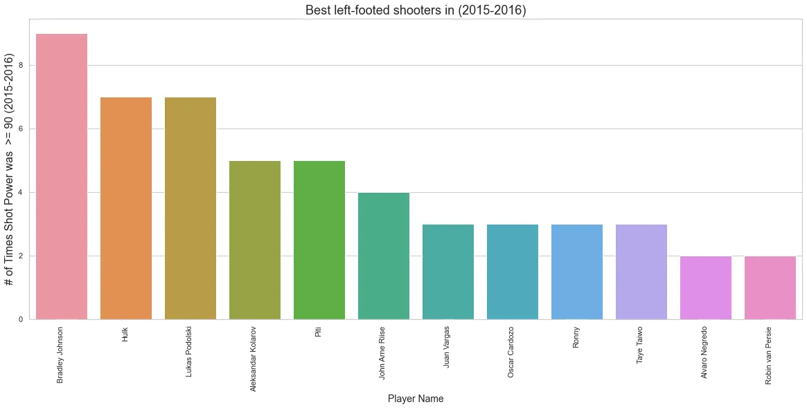

**Observation**:: Robin Van Persie was among the best left-footed players and had 90+ shot Power during the 2015/2016 season.

**Conclusions:**

Teams:

After cleaning the data, overall ball possession performance was one of the priority questions and I found out that EPL came first and Liga BBVA second. However, this could be result of data gathering mainly focused on EPL than other leagues. I also asked Examined further questions for most chances created through crossing across all leagues and EPL come first and that could be geniune since most goals were scored in the EPL. Now, with the Focus on EPL teams, i wanted to figure out,how many times a certain team had ball possion over 70 from 2008 to 2016. Manchester united and Manchester city were the only teams to have done that more than 110 times. where leicester city, Westham United and several other times have dominated 6 times with possession greater than 70. However, this could be a result of the opposition team having red card or top players' injuries, or mental problems. due to that further investigation is needed on why certain teams only had less than 30% ball possition.

Players:
after cleaning data for exploration, one of the objectives was to know, those players who had consistencily maintained speed greater that 96 over the period(2008-2016). theo Walcott and Mathis Bolly were the players to maintain that record for over 20 times, Where Pierre-Emerick Aubameyang,Jonathan Biabiany and David Odonkor consistencily had more than 3 times.however having speed greater that 96 does constitute your overall rating. i was also concerned the best left footed players with over 90 shot power. Bradley Johnson,Hulk and Lukas Podolski had achived this over 7 times. while the Greate Robin Van Persie had only once attained shot power over 90. i further analyzed the data to find out the best penalty takers with over 94% chance of scoring.Rickie Lambert and Mario Balotelli were the best penalty takers and had higher chances of netting a goal from the spot. Fabio Cannavaro,Paul Scholes and Xavi Hernandez had achieved only one time over the period of (2008-2016). I also investigated if there is correlation between player's ball control and position and from the visualization, it seems there is a postive relationship. also markig and standing tackle seems to have a greater positive relationship and this could be true after all you don't need to slide if you are already marking the player. the data had limitation since you cannot map a player with the number of goals he scored or the number of headers netted. the data concentarted the traits of the players and the team. and for that reason, we may not know if there is relationship between higher penalty accuracy and scoring.
