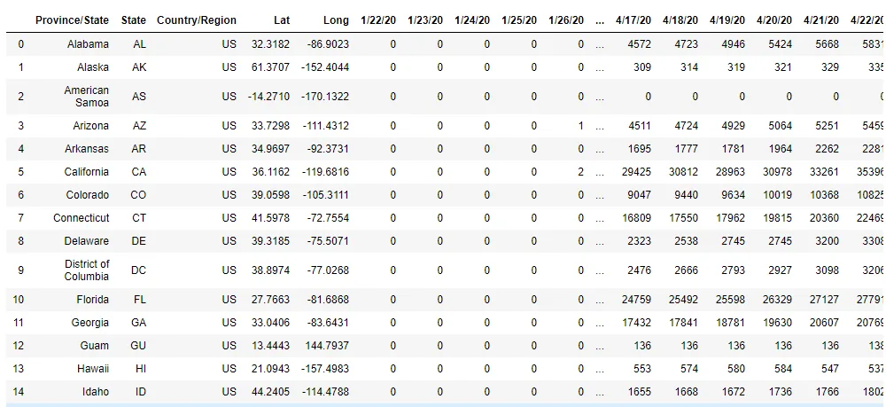
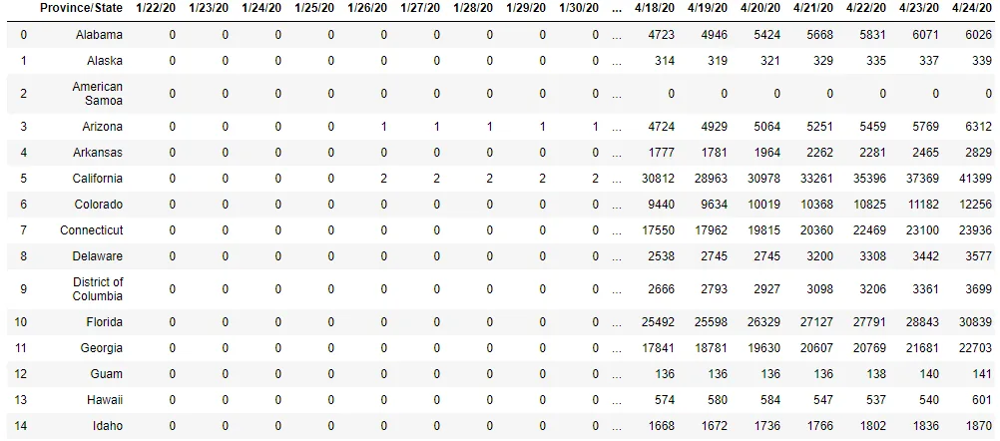
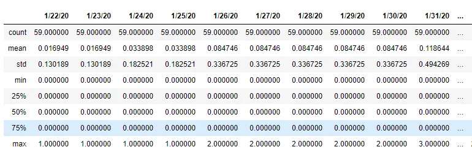
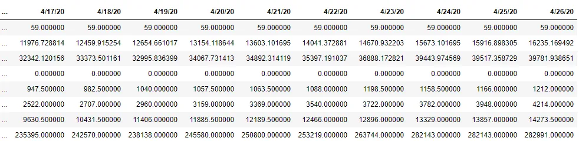
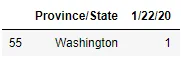
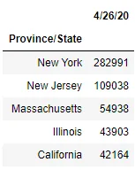
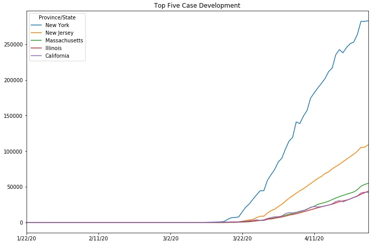
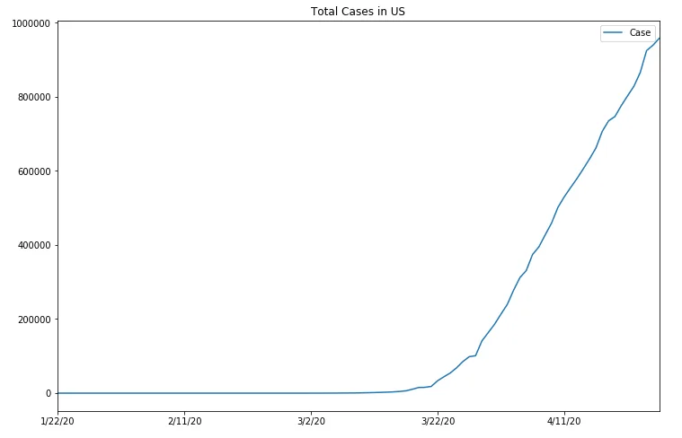
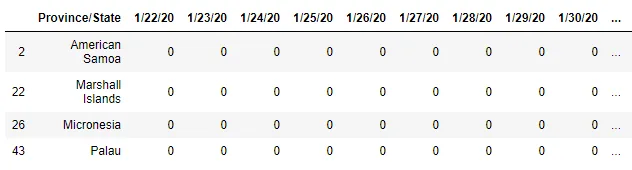
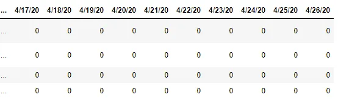

## 1. Introduction
Coronavirus disease 2019, abbreviated as COVID-19, has caused coronavirus pandemic in 2019-2020. It's spread around the world very quickly.

In this blog post, we will discover the spread of COVID-19 cases in the USA States. The data that we used in this task is the [Covid-19 USA States](https://www.kaggle.com/bioinfoacademy/covid19-usa-states-cleaned-historical-and-current) from Kaggle. This data is about cases around the US States from 22 January until 26 April 2020.

The dataset consists of 109 columns, i.e Province/State, State, Country/Region, Lat (latitude), Long (longitude), and the rest is case count from January 22nd until April 26th. And for the row, it consists of 59 rows that contain all states from the US.

From this exploratory, we hope that we can answer some questions, such as:

1. Where does the first case happen?

2. Which states have the most corona cases?

3. How is the growth of the corona case to date?

4. Is there any state that has zero cases?

## 2. Data Wrangling

In this exploratory data analysis post, we using one of the powerful python libraries. We will be using Pandas as a library for data manipulation and analysis. Then we read the CSV file through this library, so the dataset can be operated further.

```python
import pandas as pd
df = pd.read_csv('time_series_19-covid-Confirmed-us-current.csv')
```



*Data frame snippet*

From that data frame snippet, we know that data is already been cleaned (as stated in Kaggle page).

As long as we just need the case count, other unused columns will be dropped.

```python
df_case = df.drop(['State', 'Country/Region', 'Lat', 'Long'], axis=1)
```



*Cleaned data frame*

## 3. Exploratory Data Analysis
**3.1 Summary Statistic**

Using the describe() method from the Pandas library we can see the summary statistic easily.

```python
df_case.describe()
```





*Summary statistic snippet*

From that summary statistic, we can answer the stated questions from the Introduction part.

**3.2 First Case** **in the** **US**

From the summary statistic part, we can see that in January 22nd maximum value is 1. So we will explore further to know where the first case happened.

```python
first_case = df_case['1/22/20'] == 1
df_case[first_case]
```



The first case happened in Washington state. As ABC News states, the man in his 30s who has traveled to Wuhan, infected by this coronavirus.

**3.3 Most Corona Case**

From the summary statistic in the 26th April column, we can find out where the most recent corona cases are.

```python
df_case_top = df_case.sort_values(['4/26/20'], ascending=False)
df_case_top.set_index('Province/State', inplace=True)
df_case_top5 = df_case_top.iloc[:5]
df_case_top5[['4/26/20']]
```



*Top five cases*

The most cases that happened up until now are in New York state, followed by New Jersey, Massachusetts, Illinois, and California.

**3.4 The Growth of the Corona Case to Date**

To find out the growth up to recent cases, we need to plot the data into a time-based chart. We will use the plot() method from Pandas to plot the data into a line chart.

First, we will see the case growth case for the most five.

```python
df_case_top5.T.plot(figsize=(10,8), kind='line')
```



It seems that the growth of cases in these states will not experience anticlimax in the near future. And how is the case as a whole in the US?

```python
# Make agregate column
total_case = df_case.sum(axis=0, numeric_only=True)
df_total_case = total_case.to_frame()
df_total_case.rename(columns={0: "Case"}, inplace=True)
```

```python
df_total_case.plot(figsize=(12,8),
                  kind='line',
                  title='Total Cases in US')
```



Corona cases in the US continue to grow until now.

**3.5 Zero Cases, Is any?**

From the chart, we can see that the cases are still growing until now. But in the summary statistic in the 26th April column, there is some row that has zero value.

```python
zero_cases = df_case['4/26/20'] == 0
df_case[zero_cases]
```





Although overall case growth is still increasing to this day, there are still some states that are free of the corona. These states are American Samoa, Marshall Islands, Micronesia, and Palau.

## 4. Conclusion and** **Recommendation

There is som conclusion from this project:

1. The first case happened in Washington state.

2. The most case happened in New York state, followed by New Jersey, Massachusetts, Illinois, and California.

3. Corona cases in the US States is still growing until now.

4. American Samoa, Marshall Islands, Micronesia, and Palau are states that free from Corona cases until now.

As a recommendation, for US State people should obey the government regarding the pandemic case, and always do the WHO advice, like washing hands, social distancing, stay at home, and others. Because this case is not yet over.

*Stay healthy everyone, we wish this pandemic will pass quickly.*

References:

1. [Wikipedia](https://en.wikipedia.org/wiki/Coronavirus)

2. [ABC News](https://abcnews.go.com/Health/timeline-coronavirus-started/story?id=69435165)

3. [WHO Advice for Public](https://www.who.int/emergencies/diseases/novel-coronavirus-2019/advice-for-public)

*Feel free to check our notebook project*[*here*](https://github.com/adipurnamk/ANALYSIS-OF-COVID-19-DATASET)*.*
