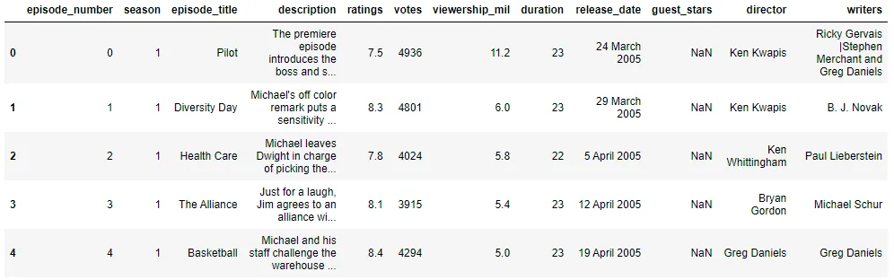
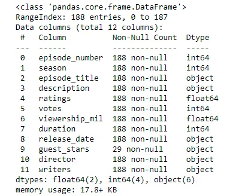
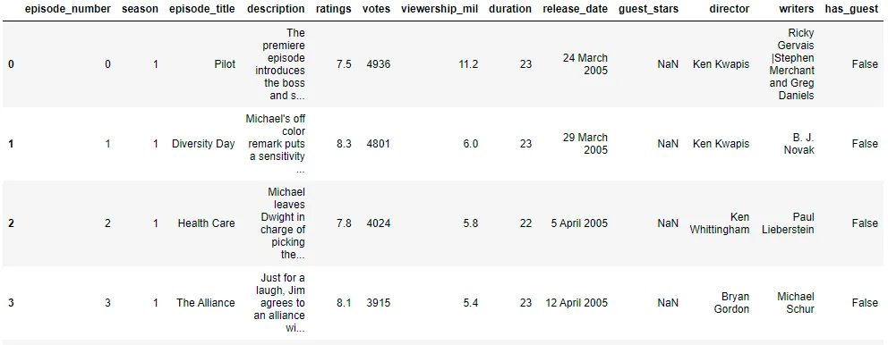
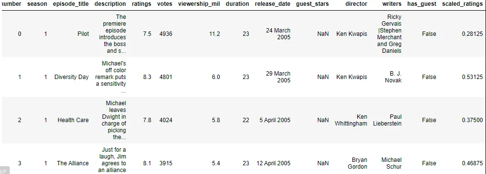
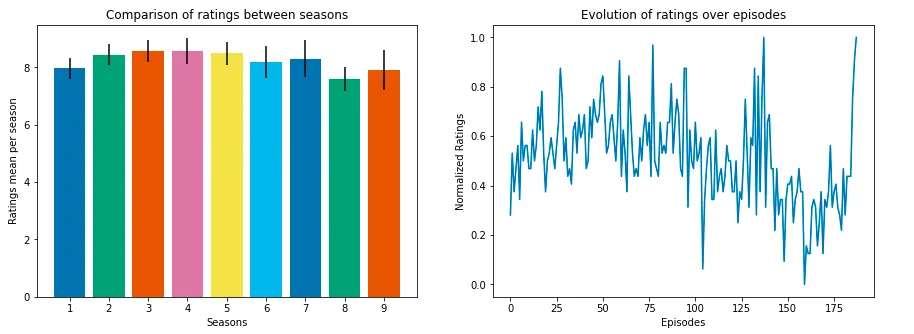
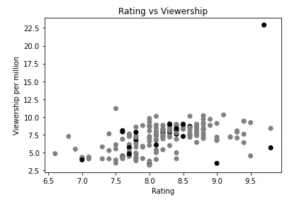
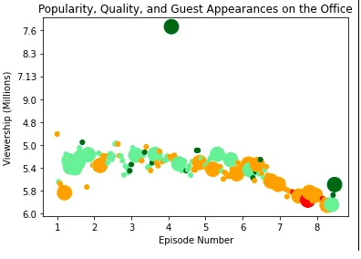
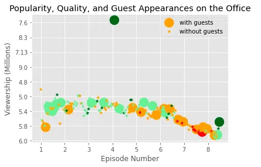
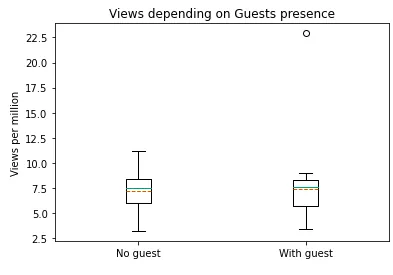

***The Office*** is an American [mockumentary](https://en.wikipedia.org/wiki/Mockumentary) [sitcom](https://en.wikipedia.org/wiki/Sitcom) television series that depicts the everyday work lives of office employees in the [Scranton, Pennsylvania](https://en.wikipedia.org/wiki/Scranton,_Pennsylvania), branch of the fictional [Dunder Mifflin Paper Company](https://en.wikipedia.org/wiki/Dunder_Mifflin). It aired on [NBC](https://en.wikipedia.org/wiki/NBC) from March 24, 2005, to May 16, 2013, spanning a total of nine seasons.

In this post, we will explore a dataset that contains information about each episode of this TV show and we will perform data visualization to understand how the popularity and quality of the series varied over time. We will be using python as a programming language.

First of all, we start by importing the needed libraries:

```python
import numpy as np
import pandas as pd
import matplotlib.pyplot as plt
```

## 1. Exploring the dataset and preprocessing

Our dataset "the_office_series" is downloaded from Kaggel.

It is originally in the format and column names such as shown in the figure below:


To make the data more readable, we decided to make some changes on the column names.

```python
names = ['episode_number', 'season', 'episode_title', 'description', 'ratings', 'votes', 'viewership_mil', 'duration', 'release_date', 'guest_stars', 'director', 'writers']
data.columns = names
display(data.head())
```

We can see the output in the figure below:



To get more information about our dataset, we run the following command:

```python
data.info()
```

We obtain this output:



From 188 rows, we notice that only 29 one has non null value in the guest_stars column. So we decided to add a column indicating whether is there a guest in that episode or not.

```python
bool_series= pd.notnull(data['guest_stars'])
data['has_guest']=bool_series
data.head()
```

The output is shown in the figure below:



Finally, we will normalize the the ratings by adding a new column named scaled_ratings.

```python
data['scaled_ratings'] = data['ratings'].apply(lambda x:(x -min(data['ratings']))/(max(data['ratings'])-min(data['ratings'])))
data.head()
```

Our output is as follows:



So finally, our dataset now contains these columns in details:

- **episode_number:** Canonical episode number.
- **season:** Season in which the episode appeared.
- **episode_title:** Title of the episode.
- **description:** Description of the episode.
- **ratings:** Average IMDB rating.
- **votes:** Number of votes.
- **viewership_mil:** Number of US viewers in millions.
- **duration:** Duration in number of minutes.
- **release_date:** Airdate.
- **guest_stars:** Guest stars in the episode (if any).
- **director:** Director of the episode.
- **writers:** Writers of the episode.
- **has_guest:** True/False column for whether the episode contained guest stars.
- **scaled_ratings:** The ratings scaled from 0 (worst-reviewed) to 1 (best-reviewed).

The exploration and the preprocessing are so important and they pave the way to data visualization.

## 2. Data Visualization

#### A) Ratings over seasons and episodes

First of all, we will start by comparing rates over the season by creating a bar plot having the rating on the y-axis and the season number on the x-axis. We will also make a plot about the normalized rating over the episodes of the whole series.

We used matplotlib library to create these plots as follows:

```python
# rating evolution over the seasons and episodes
seasons=data['season'].unique()
plt.style.use('seaborn-colorblind')
fig, ax= plt.subplots(1,2)
for season in seasons:
         df = data[data['season']==season]
         ax[0].bar(season,df['ratings'].mean(),yerr =
                         df['ratings'].std())
ax[0].set_xlabel('Seasons')ax[0].set_ylabel('Ratings mean per season')
ax[0].set_xticks(seasons)
ax[0].set_title("Comparison of ratings between seasons")
ax[1].plot(data['episode_number'], data['scaled_ratings'])
ax[1].set_xlabel("Episodes")
ax[1].set_ylabel("Normalized Ratings")
ax[1].set_title("Evolution of ratings over episodes")
fig.set_size_inches(15, 5)
plt.show()
```



Both seasons 3 and 4 seem to be very successful having the highest ratings.

Now let's see together the correlation of ratings and views number with the influence of the presence of a guest.

We will create a scatter plot using matplotlib library and make the difference between episodes having a guest or not by color.

So, the black points are the ones where there is a guest present and the gray ones are for episodes with no guest.

```python
def color_for_guests(presence):
	if presence == True:
		return 'black'
	else:
		return 'gray'
```

```python
fig, ax = plt.subplots()
color_list = [color_for_guests(presence) for presence in data['has_guest']]
ax.scatter(data['ratings'], data['viewership_mil'], c = color_list )
ax.set_xlabel('Rating')
ax.set_ylabel('Viewership per million')
ax.set_title("Rating vs Viewership")
plt.show()
```



We can see from this scatter plot that the ratings and views are correlated positively and some guests could have some influence on some episodes popularity.

### B) Views evolution

Now let's visualize the number of views over the whole series by creating a scatter plot with episode numbers on the x-axis and the views number on the y-axis.

To add some details on our plot, we will change the color based on the episode rating so we created this list:

```python
#Creating the colors for the plot
colors = []
for i, row in data.iterrows():
    if row['scaled_ratings'] < 0.25:
            colors.append("red")
    elif (0.25 <= row['scaled_ratings'] and
                    row['scaled_ratings']< 0.50):
            colors.append("orange")
    elif (0.50 <= row['scaled_ratings'] and
                    row['scaled_ratings']< 0.75):
            colors.append("lightgreen")
    else:
            colors.append("darkgreen")
```

And to make the difference between episodes having guests or not, we will be changing the points size:

```python
#Sizing system
size_sys=[]
for i,row in data.iterrows():
    if row['has_guest']==True:
        size_sys.append(250)
    else:
        size_sys.append(25)
```

And let's create our plot now.

```python
#intialize figure
fig = plt.figure(figsize=(11,7))
fig, ax = plt.subplots()
#create scatter plot
ax.scatter(data['episode_number'],data['viewership_mil'], c=colors, s=size_sys)
ax.set_xticklabels(data['episode_number'])
ax.set_yticklabels(data['viewership_mil'])
#title and labels
ax.set_title("Popularity, Quality, and Guest Appearances on the Office")
ax.set_xlabel("Episode Number")
ax.set_ylabel("Viewership (Millions)")
plt.show()
```



We can notice that the episodes views at the end of series decreased and that there is a star that influenced the viewership in the middle of the series from that point in the top of the plot.

We can also make the episodes with guests present more noticed by changing the style. In our case, the whole episodes with have a little star points and the ones having a guest will be presented by big points as the previous plot.

```python
data['color']= colorsdata['size']=
size_sysdf_with_guests= data[data['has_guest']==True]
df_with_no_guests= data[data['has_guest']==False]
fig = plt.figure(figsize=(11,7))
fig, ax = plt.subplots()
#create scatter plot
ax.scatter(df_with_guests['episode_number'],df_with_guests['viewership_mil'], c=df_with_guests['color'], s=df_with_guests['size'],label='with guests')
ax.scatter(df_with_no_guests['episode_number'],df_with_no_guests['viewership_mil'], marker='*', c=df_with_no_guests['color'], s=df_with_no_guests['size'],label='without guests')
ax.set_xticklabels(data['episode_number'])
ax.set_yticklabels(data['viewership_mil'])
#title and labels
ax.set_title("Popularity, Quality, and Guest Appearances on the Office")
ax.set_xlabel("Episode Number")
ax.set_ylabel("Viewership (Millions)")
plt.legend()
plt.show()
```



Amazing how the style can make the plots look better.

To compare more the guests influence on the number of views, we will create a boxplot showing the views details for both episode having guests and not.

```python
fig, ax = plt.subplots()
ax.boxplot([data[data['has_guest'] == False]['viewership_mil'], data[data['has_guest'] == True]['viewership_mil']],labels= ['No guest', 'With guest'], showmeans = True,meanline=True)
ax.set_title('Views depending on Guests presence')
ax.set_ylabel('Views per million')
plt.show()
```



As we said before, the presence of guest could have some influence on the view numbers.

That's all. In this post, we covered data preprocessing and data visualization using matplotlib python library with the creation of different plots.

[You can find the code on Github here.](https://github.com/arijbt/Data-Insight2021/blob/main/Projects/1_Project_InvestigatingGuestStarsin_The_Office.ipynb)

## Acknowledgment
This blog is part of the [Data Scientist program by Data Insight](https://www.datainsightonline.com/data-scientist-program).

## References

1. [Wikipedia](https://en.wikipedia.org/wiki/The_Office_(American_TV_series)#cite_note-1 ) [*The Office*](https://en.wikipedia.org/wiki/The_Office_(American_TV_series)#cite_note-1 ) [(American TV serie](https://en.wikipedia.org/wiki/The_Office_(American_TV_series)#cite_note-1 )s

2. [Kaggle dataset.](https://www.kaggle.com/nehaprabhavalkar/the-office-dataset)

3. [Datacamp unguided project](https://projects.datacamp.com/projects/1170)
