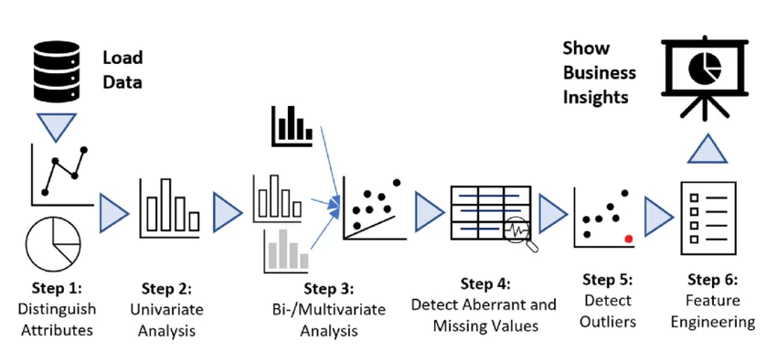

**Exploratory Data Analysis** (EDA) is used by data scientists to analyze and investigate data sets and summarize their main characteristics, often employing data visualization methods.

**Advantages of Exploratory Data Analysis are:**

- Improve understanding of variables by extracting averages, mean, minimum, and maximum values, etc.
- Discover errors, outliers, and missing values in the data.
- Identify patterns by visualizing data in graphs such as box plots, scatter plots, histograms, correlation matrix, pair plot, etc.

In this blog, I will be performing Explanatory Data Analysis(EDA) in the Titanic Dataset. You can find the dataset here: [Titanic - Machine Learning from Disaster | Kaggle](https://www.kaggle.com/c/titanic)

## Titanic: The story


The sinking of the Titanic is one of the most infamous shipwrecks in history.

On April 15, 1912, during her maiden voyage, the widely considered “unsinkable” RMS Titanic sank after colliding with an iceberg. Unfortunately, there weren’t enough lifeboats for everyone on board, resulting in the death of 1502 out of 2224 passengers and crew.

While there was some element of luck involved in surviving, it seems some groups of people were more likely to survive than others.

In this blog, we will be looking at the impact of age, sex, ticket class on the survival chances of people boarded on the ship.

1. **Importing the dataset and required libraries**
2. **Data Cleaning(Dropping column with null values, statistical analysis)**
3. **Data Visualization(Scatter Plot, Bar Plot)**

## Understanding the Dataset
The first step for any data science project is to understand the dataset we are going to work with. Here, since we are working on the Titanic dataset, I will be describing it. There is a total of 11 columns in this dataset.

**Data Discription:**

1. survival: Survival (0 = No; 1 = Yes)
2. pclass: Passenger Class (1 = 1st; 2 = 2nd; 3 = 3rd)
3. name: Name
4. sex: Sex
5. age: Age
6. sibsp: Number of Siblings/Spouses Aboard
7. parch: Number of Parents/Children Aboard
8. ticket: Ticket Number
9. fare: Passenger Fare
10. cabin: Cabin
11. embarked: Port of Embarkation (C = Cherbourg; Q = Queenstown; S = Southampton)

**Data Dictionary:**

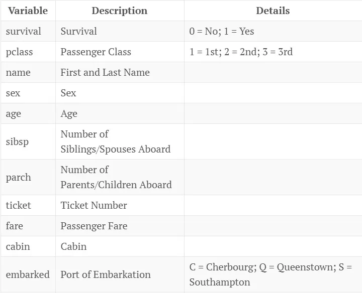

### Variable Notes

**pclass**: A proxy for socio-economic status (SES)

1st = Upper

2nd = Middle

3rd = Lower

**age**: Age is fractional if less than 1. If the age is estimated, is it in the form of xx.5

**sibsp**: The dataset defines family relations in the following way:

Sibling = brother, sister, stepbrother, stepsister

Spouse = husband, wife (mistresses and fiancés were ignored)

**parch**: The dataset defines family relations in the following way:

Parent = mother, father

Child = daughter, son, stepdaughter, stepson

Some children traveled only with a nanny, therefore parch=0 for them.

## Importing the Dataset and Required Libraries
```python
import pandas as pd # data processing, CSV file I/O (e.g. pd.read_csv)
import seaborn as sns
import matplotlib.pyplot as plt
```

```python
#Importing the dataset using pandas read_csv
df= pd.read_csv('train.csv')
```

```python
df.head()
```

Here first, we imported libraries like pandas, seaborn, matplotlib and NumPy. Where seaborn and matplotlib are used for data visualization and pandas is used for data cleaning. The pandas.head() method is used to print the top 5 rows by default, if we want to display the 'n' number of rows we can write .head(10), where n = 10.

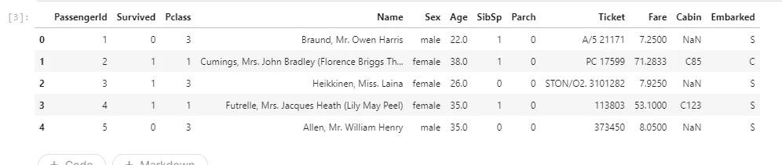

## Data Cleaning(Dropping column with null values, statistical analysis)

First, we will see a statistical summary of the imported dataset using pandas.describe() method.

```python
df.describe()
```

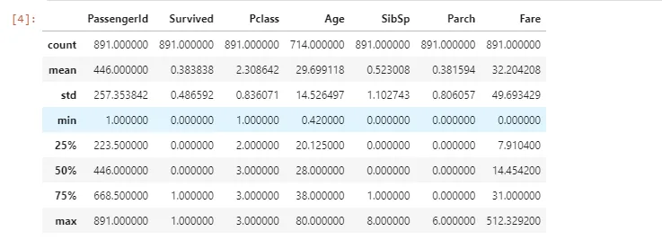

From the above table, we can see that mean of the survived column is 0.38, but since this is not a complete dataset we cannot conclude on that.

The count for the ‘Age’ column is 714, which means the dataset has some missing values. We will have to clean up the data before I start exploring.

Before cleaning the dataset let's look at the info on datatypes in the dataset using pandas.info() method. It will give us a concise summary of a DataFrame.

```python
df.info()
```

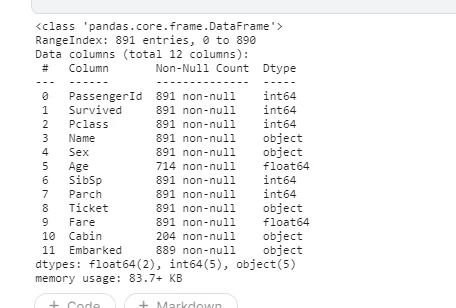

Here we can see that there are some missing values in the ‘Age’, ‘Cabin’ and ‘Embarked’ columns. We will not be using the ‘Cabin’ column which has the most number of missing values. There are some columns that are not required in my analysis so we will be dropping them.

Now, we will be looking at the null values using pandas.isnull method.

```python
# Check number of null values in a column
df.isnull().sum()
```

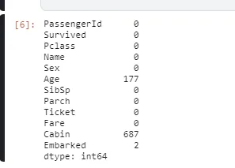

Here, we can see that the ‘Cabin’ column has the most number of missing values so we will be dropping it.

```python
#dropping column not in use and having maximum number of null values i.e. Cabin column
df_cleaned = df.drop(['PassengerId', 'Name', 'Ticket', 'Cabin'], axis=1)
df_cleaned.head()
```

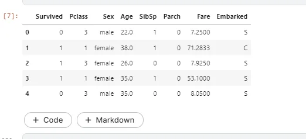

```python
df_cleaned.describe()
```

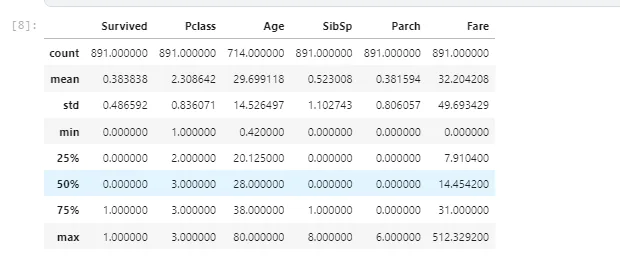

```python
df_cleaned.isnull().sum()
```

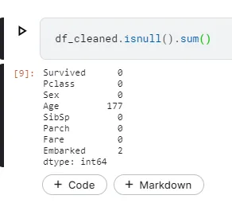

Here, we can see that the "Cabin" column has been drooped off with some other columns such as name, passenger id which is not necessary for the present analysis.

## Data Visualization(Scatter Plot, Bar Plot)
In this blog, we will be visualizing the survival chance vs the age, ticket class and embarkation.

Let's look at the survival column first. The value of the *Survived* column is either 0 or 1, where 0 represents that the passenger is not survived while 1 represents the passages that survived. Now in order to find out the number of the two, we are going to employ *groupby()* method.

```python
# Group the data frame by values in Survived column, and count the number of occurrences of each group.
survived_count = df.groupby('Survived')['Survived'].count()
survived_count
```

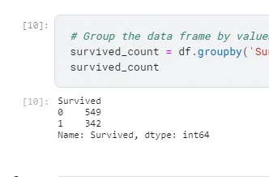

```python
# Grouped by survival
plt.figure(figsize=(4,5))
plt.bar(survived_count.index, survived_count.values)
plt.title('Grouped by survival')
plt.xticks([0,1],['Not survived', 'Survived'])
for i, value in enumerate(survived_count.values):
    plt.text(i, value-70, str(value), fontsize=12, color='white',
             horizontalalignment='center', verticalalignment='center')
plt.show()
```

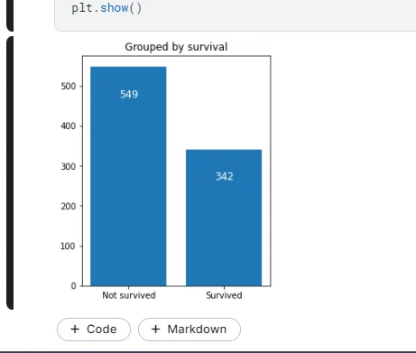

Since we will look into the ticket class(Pclass), gender(Sex) and Embarkation(Embarked) columns let's visualize them using gropupby() method and see the count value also.

**For Ticket Class(Pclass)**

```python
# Group the data frame by classes in the pclass column, and count the number of occurrences of each group.
pclass_count = df.groupby('Pclass')['Pclass'].count()
pclass_count
```

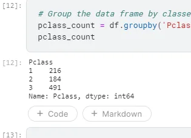

```python
plt.figure(figsize=(7,7))
plt.title('Grouped by pclass')
plt.pie(pclass_count.values, labels=['Class 1', 'Class 2', 'Class 3'],
 autopct='%1.1f%%', textprops={'fontsize':13})
plt.show()
```

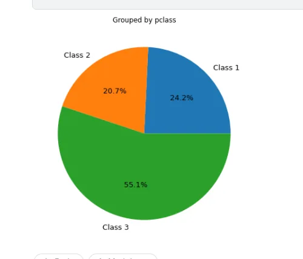

**For Gender**

```python
# Group the data frame by classes in the pclass column, and count the number of occurrences of each group.
sex_count = df.groupby('Sex')['Sex'].count()
sex_count
```

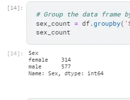

```python
plt.figure(figsize=(7,7))
plt.title('Grouped by gender')
plt.pie(sex_count.values, labels=['male', 'female'],
 autopct='%1.1f%%', textprops={'fontsize':13})
plt.show()
```

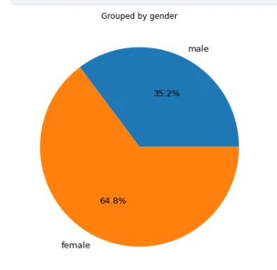

**For Port of Embarkation**

```python
# Group the data frame by classes in the pclass column, and count the number of occurrences of each group.
embark_count = df.groupby('Embarked')['Embarked'].count()
embark_count
```

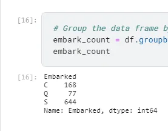

```python
plt.figure(figsize=(7,7))
plt.title('Grouped by embarkation')
plt.pie(embark_count.values, labels=['Cherbourg', 'Queenstown', 'Southampton'],
        autopct='%1.1f%%', textprops={'fontsize':13})
plt.show()
```

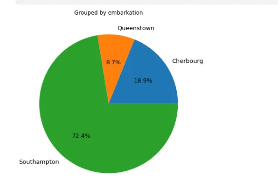

Now, let's visualize the following questions:

1. Did Sex play a role in Survival?
2. Did class played role in survival?
3. How does Embarkation vary across different ports?

#### 1. Did Sex play a role in Survival?
```python
#Survivial number according to gender or sex i.e. Male and Female
survived_sex = df.groupby('Sex')['Survived'].sum()
plt.figure(figsize=(4,5))
plt.bar(survived_sex.index, survived_sex.values)
plt.title('Survived female and male')
for i, value in enumerate(survived_sex.values):
    plt.text(i, value-20, str(value), fontsize=12, color='white',
             horizontalalignment='center', verticalalignment='center')
plt.show()
```

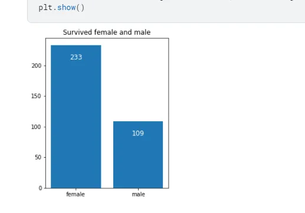

#### 2. Did class played role in survival?
Here we see the survival rate across all the classes. We can do this by taking the sum of survived passengers for each class and dividing it by the total number of passengers for that class and multiplying by 100. Here, we will use the pandas groupby() function to segregate passengers according to their class.

```python
#sns.plt.hist(df_cleaned.groupby(['Pclass', 'Survived', 'Sex']).size())
grouped_by_pclass = df_cleaned.groupby(['Pclass', 'Survived', 'Sex'])
grouped_by_pclass.size()
```

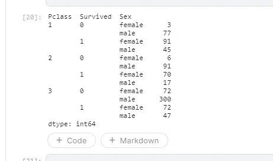

```python
df_cleaned.groupby(['Pclass'])['Survived'].sum()/df_cleaned.groupby(['Pclass'])['Survived'].count()*100
```

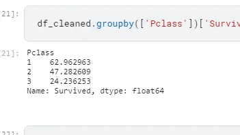

Here, we can see that *Class* did play role in the survival of the passengers.

```python
sns.factorplot('Survived', col='Pclass', hue='Sex', data=df_cleaned, kind='count', size=7, aspect=.8)
plt.subplots_adjust(top=0.9)
sns.plt.suptitle('Class and gender wise segregation of passengers', fontsize=16)
```

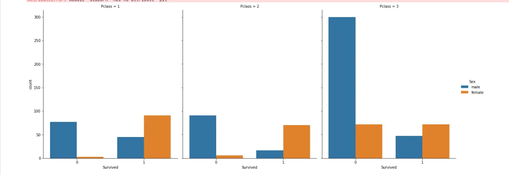

From the above visualization, we can see that class played an important for the Survival of Male and Female passengers.

#### 3. How does Embarkation vary across different ports?

We segregate the passengers according to the Port of Embarkation and visualize it.

```python
sns.lmplot('Age', 'Fare', data=df_cleaned, fit_reg=False, hue="Pclass", col="Embarked", scatter_kws={"marker": ".", "s": 20})
plt.subplots_adjust(top=0.9)
sns.plt.suptitle('Scatterplot of passengers w.r.t Fare and Age for diff. ports', fontsize=16)
```

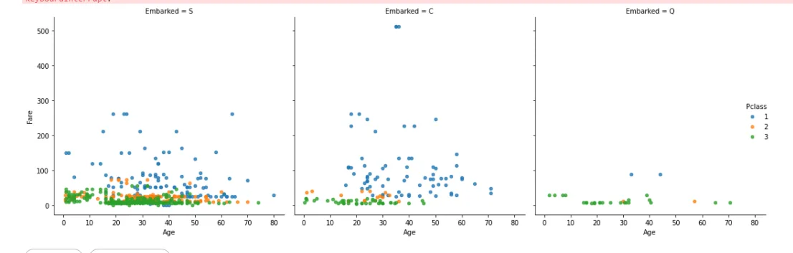

## Conclusion
Hence, we can see that the change of survival did vary with different factors such as gender, embarkation and ticket class. In gender, we see that women had higher chances of survival. In the ticket visualization, we can see that people in Class 3 had a lower chance of survival and the people in class 1 had a higher chance of survival.

There are some limitations in this dataset such as missing values for some attributes of passengers. This is not in any form an exhaustive study. More can be done on this data set.

#### Reference:
1. [Titanic - Machine Learning from Disaster | Kaggle](https://www.kaggle.com/c/titanic)
2. [Exploratory Data Analysis - Alpha Teds Technology](https://alphateds.com/exploratory-data-analysis-eda/)
3. [Exploratory Data Analysis of Titanic Dataset (shriramjaju.page)](https://www.shriramjaju.page/2017-03-26-DAND-titanic/)

Thank you for your time.

Regards,

Tanushree Nepal
