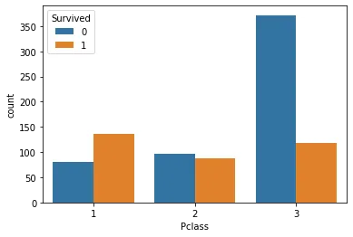
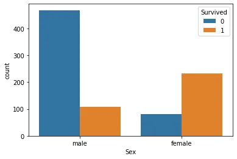
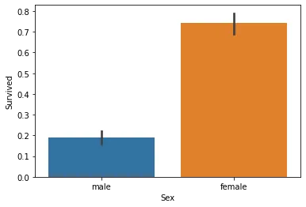
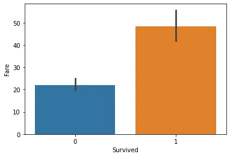
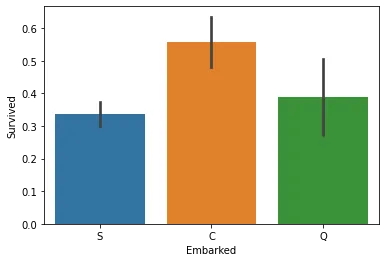

The sinking of the Titanic is one of the most infamous shipwrecks in history.

On April 15, 1912, during her maiden voyage, the widely considered “unsinkable” RMS Titanic sank after colliding with an iceberg. Unfortunately, there weren’t enough lifeboats for everyone onboard, resulting in the death of 1502 out of 2224 passengers and crew.

While there was some element of luck involved in surviving, it seems some groups of people were more likely to survive than others.

This notebook performs an exploratory data analysis (EDA) of the titanic datasets answers the question: “what sorts of people were more likely to survive?” using passenger data (ie name, age, gender, socio-economic class, etc).

Download dataset from Kaggle via <https://www.kaggle.com/c/titanic/data?select=train.csv>

Import Python libraries

```python
import pandas as pd
import seaborn as sns
from matplotlib import pyplot as plt
%matplotlib inline
```

Read the data

```python
titanic=pd.read_csv('train.csv')
```

Read the information in the data

```python
titanic.info()
```

Output:

```python
<class 'pandas.core.frame.DataFrame'>
RangeIndex: 891 entries, 0 to 890
Data columns (total 12 columns):
 #   Column       Non-Null Count  Dtype
---  ------       --------------  -----
 0   PassengerId  891 non-null    int64
 1   Survived     891 non-null    int64
 2   Pclass       891 non-null    int64
 3   Name         891 non-null    object
 4   Sex          891 non-null    object
 5   Age          714 non-null    float64
 6   SibSp        891 non-null    int64
 7   Parch        891 non-null    int64
 8   Ticket       891 non-null    object
 9   Fare         891 non-null    float64
 10  Cabin        204 non-null    object
 11  Embarked     889 non-null    object
dtypes: float64(2), int64(5), object(5)
memory usage: 83.7+ KB
```

We take a look at the shape of our dataset

```python
titanic.shape
```

Output:

```python
(891, 12)
```

The dataset has about 12 columns, which are explained below;

PassengerId: unique IDs for each passenger onboard.

Survived: 1 indicates those who survived the shipwreck while 0 indicate those who failed.

Pclass: Passenger's socio-economic class, i.e 1st, 2nd or 3rd.

Name: Name of each passenger

Sex: Gender of each passemger

Age: Age of each passenger

SibSp: number of siblings and spouses of each passenger.

Parch: number of parents and children of each passenger.

Ticket: Ticket number of each passenger

Fare: Amount paid by each passenger

Cabin: Cabin seat of each passenger

Embarked: location where the passengers embarked from(either S-Southampton, Q-Queenstown or C-Cherbourg)

Now, let's do EDA on this dataset to see the factors that determine survival of the titanic

1. Pclass

```python
ax = sns.countplot(x="Pclass", hue="Survived", data=titanic)
```

Output:



```python
ax = sns.barplot(x = "Pclass", y = "Survived", data=titanic)
```


Higher class passengers(P1) - 65%, survived more than middle class (P2) and lower class passengers (P3) which confirms that Survival is directly related to the class of the passengers.

2. Sex

```python
ax = sns.countplot(x="Sex", hue="Survived", data=titanic)
```

Output:



```python
ax = sns.barplot(x = "Sex", y = "Survived", data=titanic)
```

Output:



Female survived more than male which implies sex determine the survival of the titanic ship. Infact, around 75% of the Survivor are female which means Sex plays an important role in survival

3. Fare

```python
ax = sns.barplot(x = "Survived", y = "Fare", data=titanic)
```

Output:



The higher the fare, the chances of survival of the titanic ship

4. Embarked

```python
ax = sns.barplot(x = "Embarked", y = "Survived", data=titanic)
```



Those who embarked at Cherbourg (60%) have more chances at survival than others (Southampton - 35%, Queenstown - 40%)

Finally;

```python
x = sns.barplot(y = "Survived", data=titanic)
```


About 33% survived the Titanic disaster, which is close to the official figures (32%)

In summary;

From the above report, the most important determinant of survival are as follows:

1. Sex- Females are more likely to survive
2. Pclass - Those who paid for first class are more likely to survive
3. Fare- Those who paid higher fare are more likely to survive
4. Embarked - Those who embarked at 'C' have a higher chance at survival
