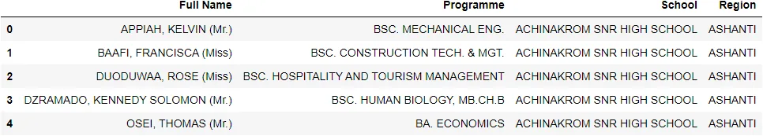
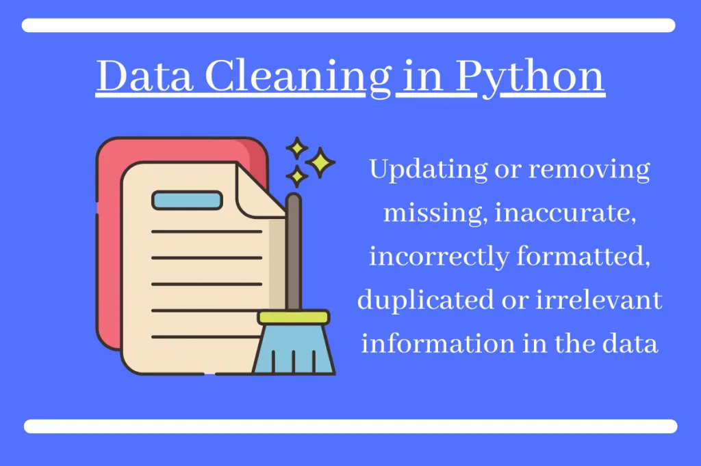
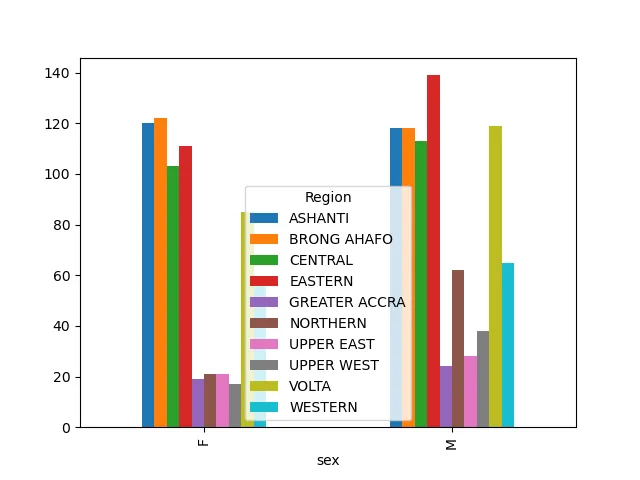
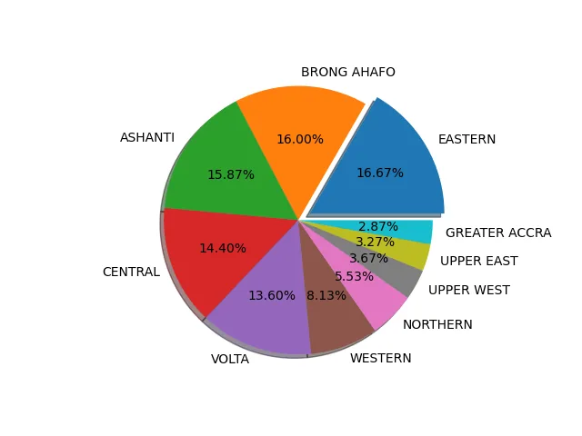
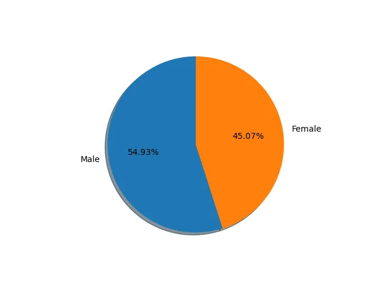

Understanding how to prepare your Data is an essential skill for working in Python. It is what you do before you can make meaningful inferences from the data.

Visualizing data in graphs, figures, etc. makes it easier to understand the information in the data and provides Insights.

In this blog, I am discussing these essential skills needed for data preparation. I will be focusing on these;

1. Importing Data
2. Cleaning Data
3. Visualizing Data

Before you can start to work on any data, you need to understand the "make-up" of the said data. Once there is understanding you are good to start working.

1. **IMPORTING DATA**


*Importing data will allow you to upload a dataset from external sources and further allow you to perform actionable insight on the datasets to solve a business problem.*

Before performing any actionable insight on the dataset such as cleaning the data, wrangling the data, and visualizing the data. You first need to import the said data into Python. There are a lot of ways you can import data into python but it depends on the type of data file you are working on.

***Examples of the Data Files;***

Excel file, CSV file, Text file, HDF5 file, MATLAB files, RDBMS, etc.

Using these different files you import them differently,

One popular option for importing data is to use the **pandas,**

especially for a huge dataset. I have already discussed some pandas functions [here](https://t.co/avhVctqq31)

In that regard, before you can import the dataset, we also need to import pandas

```python
# Importing needed library
import pandas as pd
```

Now, we can load the data needed.

Here we will discuss the common and basic data files i.e. Excel file and CSV file.

**Excel File**

Importing an excel file, the common way normally used is **pd.****read_excel()**

**pd.read_excel()** : loads an excel file with the extensions; xls, xlsx, etc. into a DataFrame for further analysis using python

**STEPS TO LOAD**

*> Copy the excel file path.*

Suppose this is the file path that includes the file name and the file extension

C:\Users\Alberta\Desktop\Data Science Class\DataInsight\Data-Analysis-and-Visualization-main\EDA of KNUST less endowed students Dataset\knust_stu.xlsx"

*> Apply the code.*

```python
df = pd.read_excel(r"C:\Users\Alberta\Desktop\Data Science Class\DataInsight\Data-Analysis-and-Visualization-main\EDA of KNUST less endowed students Dataset\knust_stu.xlsx")
df
```

The r before the file path string .... r"c because of the special character \ in the path.

or,

```python
df = df.read_excel("r"C:\Users\Alberta\Desktop\Data Science Class\DataInsight\Data-Analysis-and-Visualization-main\EDA of KNUST less endowed students Dataset\knust_stu.xls")
```

*> Run the codes*

Runthe code by calling if

After this code has run, it loads the excel file into the pandas DataFrame.

```python
 df.head()
```

**CSV File (Comma-Separated Values)**

Another data file is a CSV file (comma-separated values) which is a delimited text file that uses a comma to separate values.

You can import a csv by calling

pd.read_csv()

pd.read_csv() : This loads a csv file into a DataFrame.

It follows the same steps as loading an excel file but here the file extension differ

Looks like this,

```python
knust = pd.read_csv(r"C:\Users\Alberta\Desktop\Data Science Class\DataInsight\Data-Analysis-and-Visualization-main\EDA of KNUST less ndowed students Dataset\knust_stu.csv")
knust.head()
```



**\*\*\*\*\***Notice that with the excel file you use pd.read_excel and with the CSV file you used pd.read_csv

Now, we know some basics of importing data in Python.

There are other ways you can also import data once that data is not on your laptop like web scraping using HTML, which I am not going to dive deeper into. But we extract from the websites by importing BeautifulSoup and request.

```python
import request
from bs4 import BeautifulSoup
```

```python
url = '' example "
r = request.get(url)
html.doc = r.text
Soup = BeautifulSoup(html.doc)
Pretty_Soup = Soup.pretty()
print(pretty_Soup)
```

I will end here for Importing Data. I bet you can now import some basic files.

**2.** **DATA CLEANING**



What is Data Cleaning?

From [Wikipedia](https://en.wikipedia.org/wiki/Data_cleansing),

**Data cleansing** or **data cleaning** is the process of detecting and correcting (or removing) corrupt or inaccurate records from a recordset, table, or database and refers to identifying incomplete, incorrect, inaccurate, or irrelevant parts of the data and then replacing, modifying, or deleting the dirty or coarse data.

After the data has been imported, you can now explore the data. First and foremost you need to clean the data.

*Why do you need to clean the data?*

You need to clean the data because you can not make meaningful insights from messy and dirty data. As the saying goes - "Garbage In, Garbage Out".

Using messy and dirty data for analysis, predictions, and making inferences will not cause only wrong outcomes but also bad decisions. Hence the need to clean data.

*How to clean the data*

Using a dataset from the Kwame Nkrumah University of Science and Technology. About the less endowed students(High School students in the deprived communities).

You can clean a data by

1. Checking for Missing Values
2. Dropping Irrelevant Features
3. etc.

Now let us dive right into it.

You need to import the needed libraries;

```python
import pandas as pd
import numpy as np
```

Load the necessary dataset. We have already discussed how to;

```python
knust = pd.read_csv(r"C:\Users\Alberta\Desktop\Data Science Class\DataInsight\Data-Analysis-and-Visualization-main\EDA of KNUST less endowed students Dataset\knust_stu.csv")
knust.head()
```

Running head() gives the top five from the dataset.

**Output:**


Performing exploratory data

```python
knust.info()
```

**Output:**

```python
<class 'pandas.core.frame.DataFrame'>
RangeIndex: 1500 entries, 0 to 1499
Data columns (total 6 columns):
 #   Column      Non-Null Count  Dtype
---  ------      --------------  -----
 0   Unnamed: 0  1500 non-null   int64
 1   #           1500 non-null   int64
 2   Full Name   1500 non-null   object
 3   Programme   1500 non-null   object
 4   School      1500 non-null   object
 5   Region      1500 non-null   object
dtypes: int64(2), object(4)
memory usage: 70.4+ KB
```

***Checking for Missing Values***

Missing Values are values that were not recorded in a dataset. They can be a single missing value in a cell or missing values in the entire observation (rows or columns).

To know the distinct items within a column per count use value_counts

```python
df['knust'].value_counts()
```

**Output:**

```python
Full Name                         Programme                          School                         Region
ASANTE, ERIC (Mr.)                BA. HISTORY                        ASSIN NSUTA SNR HIGH SCHOOL    CENTRAL          2
TORGBOR, CHRISTIAN (Mr.)          BSC. LAND ECONOMY                  NINGO SNR HIGH SCHOOL          GREATER ACCRA    2
ACOLATSE, SENA NICHOLAS (Mr.)     BA. SOCIOLOGY                      WORAWORA SNR HIGH SCHOOL       VOLTA            2
NLANSONG, NJIBICHE FRANCIS (Mr.)  BSC. CIVIL ENG.                    DAMONGO SNR HIGH SCHOOL        NORTHERN         2
TITRIKU, SOLOMON (Mr.)            BSC. DEVELOPMENT PLANNING          VAKPO SNR HIGH SCHOOL          VOLTA            2
                                                                                                                    ..
ATIGAH, EMMANUEL KWASI (Mr.)      BSC. NATURAL RESOURCES MANAGEMENT  AGOTIME SNR. HIGH SCHOOL       VOLTA            1
ATIDOGLO, PETER KWAME (Mr.)       BSC. METALLURGICAL ENG.            TSITO SNR. HIGH/TECH. SCHOOL   VOLTA            1
ATIAH, AYINBORA JOHN (Mr.)        BA. RELIGIOUS STUDIES              GOWRIE SNR HIGH/TECH SCHOOL    UPPER EAST       1
ATIAH, AUGUSTINE ABEEYINE (Mr.)   BA. HISTORY                        KUSANABA SNR. HIGH SCHOOL      UPPER EAST       1
ZUTUNU, BELINDA SENANYUIE (Miss)  BSC. REAL ESTATE                   MAFI-KUMASE SNR HIGH/COMM SCH  VOLTA            1
Length: 1492, dtype: int64
```

**Dropping Missing Values**

But in an instance where there are missing you can deal with them by dropping the entire row or column.

*Dropping column*

```python
df.drop['example', axis = 1]
```

*Dropping row*

```python
df.drop['example', axis = 0]
```

This drops the entire column or row with the name example. With this approach, you lose some essential information in the data that can be useful.

Hence not a best practice.

**Replacing Missing Values**

On the other hand, you can input values to replace these null values. Replacing helps you to overwrite the data.

Example:

```python
df['example'].replace('x', 'y', inplace = True)
```

With inplace = True, any change is done permanently. To avoid this and have the original dataset, you can assign a variable name

```python
df.['example'] = df.['example'].replace('x', 'y')
```

**Replacing NAN Values**

You will use the python code *df.isnull().sum()* to check for the "null" values in the dataset.

From the dataset, we are using;

```python
knust.isnull().sum()
```

**Output:**

```python
Full Name     0
Programme     0
School        0
Region        0
dtype: int64
```

This indicates that there is no null value in each series.

Now when we have null values and you want fill them

```python
df['example'] = df[;example'].fillna(' ')
```

You need not to replace all the null values at once. You can replace them with the mean, median, the highest occurring value, or the lowest occurring value.

**Dealing with Irrelevant Features**

Irrelevant features in the DataFrameare not useful toyou and there is need a to drop such observations. They do not contribute tothe goal of the project. Hence we can safely drop them.

Example Using KNUST dataset.

```python
# The above data contains two irrelevant datasets, the first two columns.

knust.drop(['Unnamed: 0','#'],axis=1,inplace=True)
```

```python
knust.info()
```

**Output:**

```python
<class 'pandas.core.frame.DataFrame'>
RangeIndex: 1500 entries, 0 to 1499
Data columns (total 4 columns):
 #   Column     Non-Null Count  Dtype
---  ------     --------------  -----
 0   Full Name  1500 non-null   object
 1   Programme  1500 non-null   object
 2   School     1500 non-null   object
 3   Region     1500 non-null   object
dtypes: object(4)
memory usage: 47.0+ KB
```

.....

```python
# We are now going to group each student according to gender.
# This can be done by using the 'Miss' and 'Mr' which is at the end of every name
x = df['Full Name'].str[-6:].str.strip().value_counts()
y = df['Full Name'].str[-6:].str.strip().value_counts(normalize=True)
print(x)
print(y*100)
```

**Output:**

```python
(Mr.)     824
(Miss)    676
Name: Full Name, dtype: int64
(Mr.)     54.933333
(Miss)    45.066667
Name: Full Name, dtype: float64
```

**3. Data Visualization**


Clean and well-structured data is ready for analysis. One best way to make meaningful insight from data is to visualize it.

**\*\***Good visualization allows you to communicate your data to other consumers for easy understanding.

Before you Visualize, you need to import the necessary libraries. Commonly used libraries are the matplotlib and seaborn but there are others that you can explore

```python
import matplotlib.pyplot as plt
%matplotlib notebook
import seaborn as sns
```

**Matplotlib**

This is one popular library in python for plotting. It is low leveled as compared to seaborn. Before you can use it you need to install it i.e.

```python
pip install matplotlib
```

Matplotlib is essentially used for creating basic and popular graphs which include the bar chart, histogram, line chart, and others.

*Bar Chart*; To plot a bar chart, you use

```python
df.plot(kind='bar')
```

```python
plot.bar()
```

An example from the Knust dataset

```python
df=df.groupby(['sex','Region']).size()
df=df.unstack()
df.plot(kind='bar')
```



I am going to illustrate the other plots **(pie chart)** with an example using the KNUST data;

Now let us take a look at the number of regions which participated in the program and the percentage of students number in each region

```python
region_name  = df['Region'].value_counts().index
region_stu_num = df['Region'].value_counts().values
region_name
```

**Output:**

```python
Index(['EASTERN', 'BRONG AHAFO', 'ASHANTI', 'CENTRAL', 'VOLTA', 'WESTERN', 'NORTHERN', 'UPPER WEST', 'UPPER EAST', 'GREATER ACCRA'], dtype='object')
```

```python
region_stu_num
```

**Output:**

```python
array([250, 240, 238, 216, 204, 122,  83,  55,  49,  43], dtype=int64)
```

....

```python
### Lets check the regions which participated in the program
fig,ax = plt.subplots()
# This is to explode the region with most number of students
explode=[0]*len(region_name)
explode[0]=0.1
ax.pie(region_stu_num,labels=region_name,autopct='%1.2f%%',shadow=True,explode=explode,radius=1);
```

**Output:**



```python
region = (df['Region'].value_counts(normalize=True)*100)
print('{} region has the largest number of students  with a percentage of {}%'.format(region.idxmax(),np.round(region.max(),2)))
print('{} region has the least number of students  with a percentage of {}%'.format(region.idxmin(),np.round(region.min(),2)))
```

**Output:**

```python
EASTERN region has the largest number of students  with a percentage of 16.67%
GREATER ACCRA region has the least number of students  with a percentage of 2.87%
```

The above code snippet gives a visual representation of the regions and the percentage of students in each. Which makes it easy for others to understand the data, without necessarily working on the data.

Visualization of gender in percentage

```python
plt.figure()
male,female = (df['sex']).value_counts().items()
plt.pie(np.array([male[1],female[1]]),labels=['Male','Female'],autopct='%1.2f%%',shadow=True,startangle=90,radius=1);
print('This shows the percentage of females and males selected')
```

**Output:**



```python
This shows the percentage of females and males selected
```

**Conclusion:**

The above gives a comprehensive tutorial on Importing Data, Cleaning Data, and Data Visualization.

Note:

For the full Exploratory Data Analysis, check them out [here](https://github.com/Johnson-a-hash/Exploratory-Data-Analysis)

I hope you find this blog useful in your learning.

HAPPY LEARNING!!!!

Reference :

<https://en.wikipedia.org/wiki/Data_cleansing>

Data Camp
