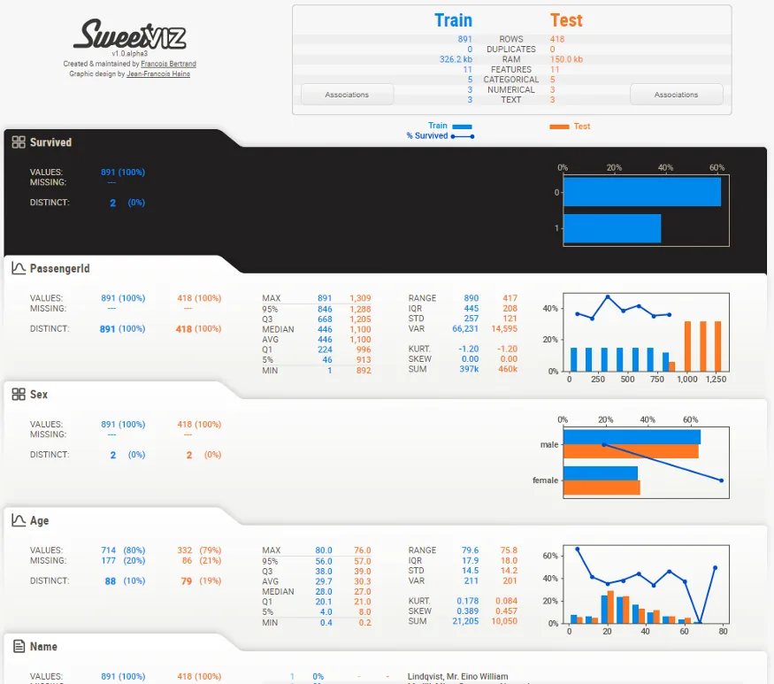

**Exploratory data analysis (EDA)** is an important early stage in all data science projects, often following the same steps to characterize a data set . Given the repetitiveness and similarity of such steps, there are several libraries in Python to automate the process and help get started.

One of the many is an open-source Python library called **Sweetviz** (GitHub) that has been built for exactly this purpose. It Creates a standalone HTML report using a Pandas data frame.One of few more libraries is **PandasProfiling** .

Sweetviz has powerful features: not only does it create insightful and beautiful visualizations with minimum lines of code, but it also provides analytics that would take much longer to generate manually.

Comparing two datasets (e.g. training and testing) Visualization of target values ​​for all other variables .

**It packs a powerful punch:** in addition to creating insightful and beautiful visualizations with just two lines of code, it provides analysis that would take a lot more time to generate manually, including some that no other library provides so quickly, such as:

· **Comparison of 2 datasets**(e.g., Train vs. Test)

· **Visualization of the target value** against all other variables

[Here is a link to a report generated by Sweetviz for the well-known sample Titanic Survivor dataset](http://cooltiming.com/SWEETVIZ_REPORT.html). We will be analyzing this report in this article.

For this article, we will be analyzing the sample Titanic Survivor dataset

you can find [here](https://drive.google.com/file/d/11MgXvwics58UwiMjUSWJDAjn6hiflC-W/view?usp=sharing).

After installation of Sweetviz (using *pip install sweetviz*), simply load the pandas data frames as you normally would, then call either *analyze()*, *compare()* or *compare_intra()* depending on your need (more on that below). The full documentation can be found on [GitHub](https://github.com/fbdesignpro/sweetviz). For now, let's start with the case at hand, loading it as so:

```python
import sweetviz
import pandas as pd
train = pd.read_csv("train.csv")
test = pd.read_csv("test.csv")
```

We now have 2 data frames (train and test), and we would like to analyze the target value “Survived”. I want to point out in this case, we know the name of the target column in advance, but it is always optional to specify a target column. We can generate a report with this line of code:

```python
my_report = sweetviz.compare([train, "Train"], [test, "Test"], "Survived")
```

Running this command will perform the analysis and create the report object. To get the output, simply use the show_html() command:

```python
my_report.show_html("Report.html") # Not providing a filename will default to SWEETVIZ_REPORT.html
```

After generating the file, it will open it through your default browser and should look something like this:

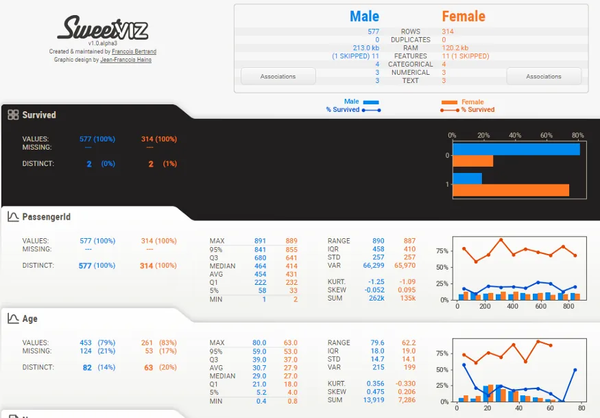

There’s a lot to explain, so let’s take it one step at a time!

**Summary display**

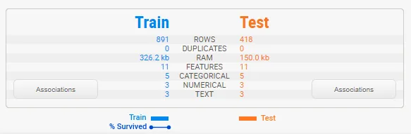

The summary shows us the characteristics of both dataframes side-by-side. We can immediately identify that the testing set is roughly half the size of the training set, but that it contains the same features. That legend at the bottom shows us that the training set does contain the “Survived” target variable but that the testing set does not.

Note that Sweetviz does a best guess at determining the data type of each column, between numerical, category/boolean and text. These can be overridden—more on that below.

**Associations**

Hovering your mouse over the “Associations” button in the summary will make the Associations graph appear on the right-hand side:

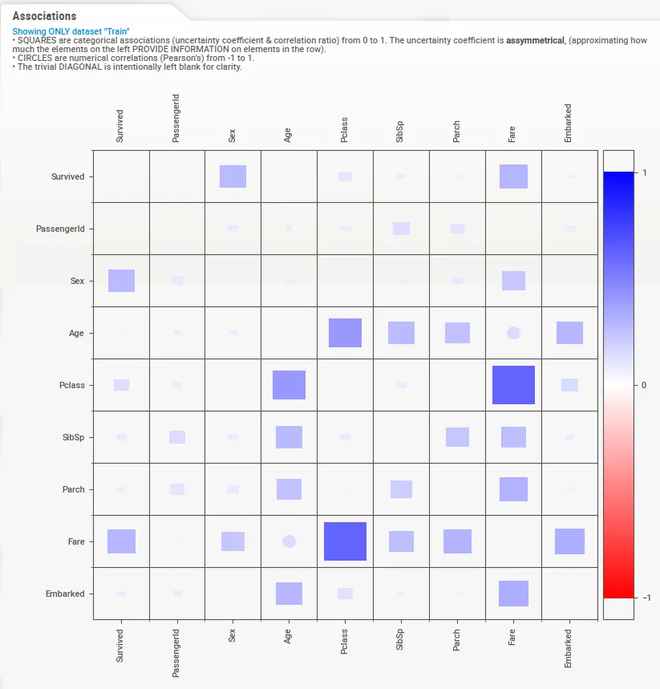

This graph is a composite of the visuals from [Drazen Zaric: Better Heatmaps and Correlation Matrix Plots in Python](https://towardsdatascience.com/better-heatmaps-and-correlation-matrix-plots-in-python-41445d0f2bec) and concepts from [Shaked Zychlinski: The Search for Categorical Correlation](https://towardsdatascience.com/the-search-for-categorical-correlation-a1cf7f1888c9).

Basically, in addition to showing the traditional numerical correlations, it unifies in a single graph both numerical correlation but also the uncertainty coefficient (for categorical-categorical) and correlation ratio (for categorical-numerical). Squares represent categorical-featured-related variables, and circles represent numerical-numerical correlations.

Finally, it is worth mentioning that these correlation/association methods shouldn’t be taken as benchmark as they make some assumptions on the underlying distribution of data and relationships. However, they can be a very useful starting point.

**Target variable**

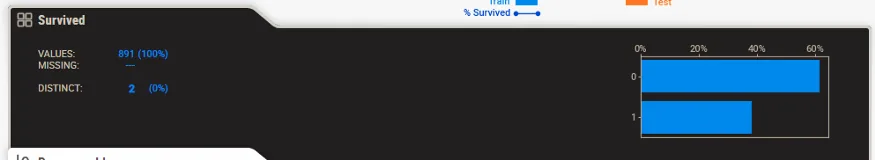

When a target variable is specified, it will show up first, in a special black box.

We can note from this summary that “Survived” has no missing data in the training set (891, 100%), that there are 2 distinct possible values (accounting for less than 1% of all values), and from the graph, it can be estimated that roughly 60% did not survive.

**Detail area (categorical/boolean)**

When you move the mouse to hover over any of the variables, an area to the right will showcase the details. The content of the details depends on the type of variable being analyzed. In the case of a categorical (or boolean) variable, as is the case with the target, the analysis is as follows:

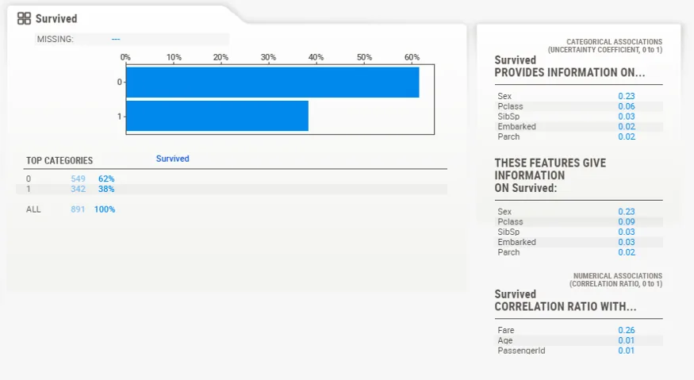

Here, we can see the exact statistics for each class, where 62% did not survive, and 38% survived. You also get the detail of the associations for each of the other features.

**Numerical data**

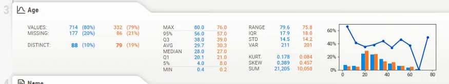

Numerical data shows more information on its summary. Here, we can see that in this case, about 20% of data is missing (21% in the test data, which is very consistent).

**Note that the target value (“Survived” in this case) is plotted as a line right over the distribution graph. This enables instant analysis of the target distribution with regard to other variables.**

Interestingly, we can see from the graph on the right that the survival rate is pretty consistent across all ages, except for the youngest, which have a higher survival rate. It would look like “women and children first” was not just talk.

**Detail area (numerical)**

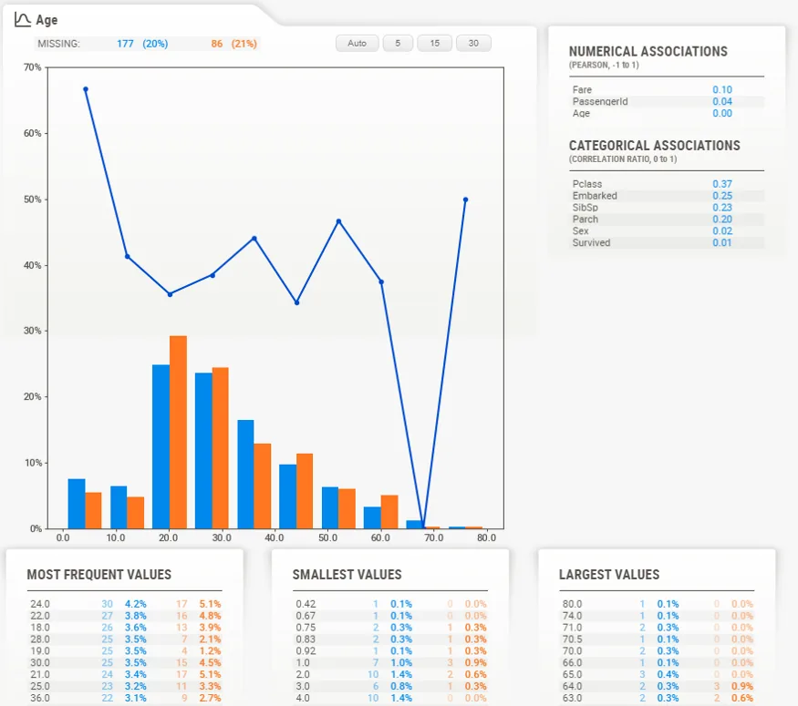

As with the categorical data type, the numerical data type shows some extra information in its detail area. Noteworthy here are the buttons on top of the graph. These buttons change how many “bins” are shown in the graph. You can select the following:

- Auto
- 5
- 15
- 30

**Text data**

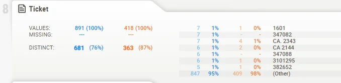

For now, anything that the system does not consider numerical or categorical will be deemed as “text”. Text features currently only show count (percentage) as stats.

## FeatureConfig: forcing data types, skipping columns
In many cases, there are “label” columns that you may not want to analyze (although target analysis can provide insights on the distribution of target values based on labeling). In other cases, you may want to force some values to be marked as categorical even though they are numerical in nature.

To do all this, simply create a FeatureConfig object and pass it in to the analyze/compare function. You can specify either a string or a list to kwargs skip, force_cat and force_text:

```python
feature_config = sweetviz.FeatureConfig(skip="PassengerId", force_cat=["Ticket"])

my_report = sweetviz.compare([train, "Train"], [test, "Test"], "Survived", feature_config)
```

## Comparing sub-populations (e.g. Male vs Female)

Even if you are only looking at a single dataset, it can be very useful to study the characteristics of different subpopulations within that dataset. To do so, Sweetviz provides the compare_intra() function. To use it, you provide a boolean test that splits the population (here we try train["Sex"] == 'male', to get a sense of the different gender populations), and give a name to each subpopulation. For example:

```python
my_report = sweetviz.compare_intra(train, train["Sex"] == 'male', ["Male", "Female"], 'Survived')

my_report.show_html() # Not providing a filename will default to SWEETVIZ_REPORT.html
```

Yields the following analysis: (for this screenshot I used feature_config to skip showing the analysis of the “Sex” feature, as it is redundant)

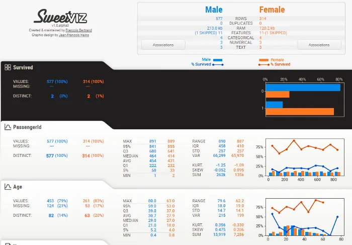

## Putting it all together
EDA is a fluid, artistic process that must be uniquely adapted to each set of data and situation. However, a tool like Sweetviz can help kickstart the process and get rid of a lot of the initial minutiae of characterizing datasets to provide insights right off the bat. Let’s go through all the features for the Titanic dataset to see what that could look like.

## Individual fields
**PassengerId**

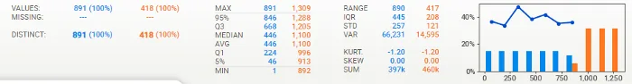

- The distribution of ID’s and survivability is even and ordered as you would hope/expect, so no surprises here.
- No missing data

**Sex**

- About twice as many males as females, but…
- Females were much more likely to survive than males
- Looking at the correlations, Sex is correlated with Fare which is and isn’t surprising…
- Similar distribution between Train and Test
- No missing data

**Age**

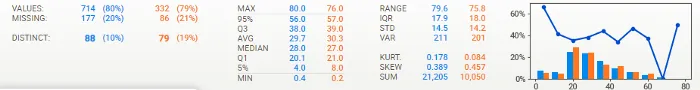

- 20% missing data, consistent missing data and distribution between Train and Test
- Young-adult-centric population, but ages 0–70 well-represented
- Surprisingly evenly distributed survivability, except for a spike at the youngest age
- Using 30 bins in the histogram in the detail window, you can see that this survivability spike is really for the youngest (about <= 5 years old), as at about 10 years old survivability is really low.
- Age seems related to Siblings, Pclass and Fare, and a bit more surprisingly to Embarked

**Name**


- No missing data, data seems pretty clean
- All names are distinct, which is not surprising

**Pclass**

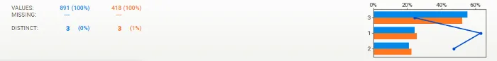

- Survivability closely follows class (first class most likely to survive, third class least likely)
- Similar distribution between Train and Test
- No missing data

**SibSp**


- There seems to be a survival spike at 1 and to some degree 2, but (looking at the detail pane not shown here) there is a sharp drop-off at 3 and greater. Large families couldn’t make it or perhaps were poorer?
- Similar distribution between Train and Test
- No missing data

**Parch**

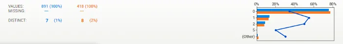

- Similar distribution between Train and Test
- No missing data

**Ticket**

- ~80% distinct values, so about 1 in 5 shared tickets on average
- The highest frequency ticket was 7, which is generally consistent with the maximum number of siblings (8)
- No missing data, data seems pretty clean

**Fare**

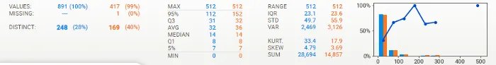

- As expected, and as with Pclass, the higher fares survived better (although sample size gets pretty thin at higher levels)
- A Correlation Ratio of 0.26 for “Survived” is relatively high so it would tend to support this theory
- About 30% distinct values feels a bit high as you would expect fewer set prices but looks like there is a lot of granularity so that’s ok
- Only 1 missing recordu in the Test set, data pretty consistent between Train and Test

**Cabin**

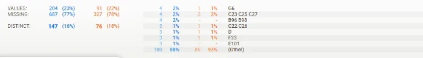

- A lot of missing data (up to 78%), but consistent between Train and Test
- Maximum frequency is 4, which would make sense to have 4 people maximum in a cabin

**Embarked**

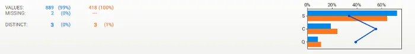

- 3 distinct values (S, C, Q)
- Only 2 missing rows, in Train data. Data seems pretty consistent between Train and Test
- Survivability somewhat higher at C; could this be a location with richer people?
- Either way, “Embarked” shows a Uncertainty Coefficient of only 0.03 for “Survived”, so it may not be very significant

**General analysis**

- Overall, most data is present and seems consistent and make sense; no major outliers or huge surprises

**Test versus Training data**

- Test has about 50% fewer rows
- Train and Test are very closely matched in the distribution of missing data
- Train and Test data values are very consistent across the board

**Association/correlation analysis**

- Sex, Fare and Pclass give the most information on Survived
- As expected, Fare and Pclass are highly correlated
- Age seems to tell us a good amount regarding Pclass, siblings and to some degree Fare, which would be somewhat expected. It seems to tell us a lot about “Embarked” which is a bit more surprising.

**Missing data**

- There is no significant missing data except for Age (~20%) and Cabin (~77%) (and an odd one here and there on other features)

**Conclusion**
All this information in shortest possible lines of code.
Using Sweetviz easily gives us a significant information when we start looking at a new dataset. It’s worth mentioning that it can be useful later in the analysis process, for example during feature-generation, to get a quick overview of how new features play out. I hope you will find it as useful a tool in your own data analytics.
