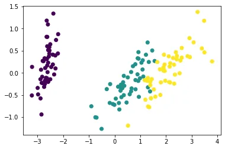

**Introduction**

A high dimensional data is a data that has too many input variables or features. These features may be in the form of columns in spreadsheets. With too many input variables, a machine learning algorithm may train extremely slowly and will require a lot of disk space to run smoothly. In addition, models are less likely to overfit on a dataset with fewer dimensions. This means, that less misleading data ensures that there is less opportunity to make decisions based on noise.

A dataset with vast input features complicates the predictive modeling task by putting performance and accuracy at risk. This is known as the curse of dimensionality. Less redundant data improve the modeling accuracy.

It is important to note that before you reduce dimensionality in your dataset, the data must be tidy.

In this blog, we will be exploring three ways to reduce dimensionality in our dataset.

- Feature Selection
- Feature Extraction
- Dimension Reduction using Principal Component Analysis.

Feature selection

Feature selection involves choosing the features or columns that are important to you from a larger dataset. The difficult part here is deciding on which features are important. It is essential when selecting features for machine learning to have domain knowledge of the dataset. Feature selection is essential in removing irrelevant or unneeded columns in the dataset that do not contribute to the accuracy of a predictive model. For example, a person's hospital credit score is irrelevant if you want to predict whether they have cancer or not. Therefore removing those columns from your dataset will greatly impact the accuracy of your model.

Feature extraction

Feature extraction is a process of dimensionality reduction by which an initial set of raw data is reduced to more manageable groups for processing. Ìt usually involves making new features out of existing features. The key to feature extraction is having good knowledge of the features in your dataset. You can combine multiple features into a new feature that makes the original ones inessential. For example, a BMI column can be extracted from a hospital dataset that has both the heights and weights of their patients. So you can fit your model using the BMI instead.

Principal Component Analysis

Principal component analysis (PCA) is a method that rotates the dataset in a way such that the rotated features are statistically uncorrelated. This rotation is often followed by selecting only a subset of the new features, according to how important they are for explaining the data. PCA features are in decreasing order of variance. PCA performs dimension reduction by discarding the PCA features with lower variance, which it assumes to be noise, and retaining the higher variance PCA features, which it assumes to be informative.

For example, the iris dataset has 4 features representing the 4 measurements. Here, the measurements are in a numpy array called samples. Let's use PCA to reduce the dimension of the iris dataset to only 2. We import PCA as usual. Create a PCA model specifying n_components=2, and then fit the model and transform the samples as usual. Printing the shape of the transformed samples, we see that there are only two features, as expected.

```python
from sklearn.datasets import load_iris
from sklearn.decomposition import PCA
import matplotlib.pyplot as plt
import seaborn as sns
```

Load iris dataset and assign the data and target attributes to the variables samples and species.

```python
iris=load_iris()
samples=iris.data
species= iris.target
samples.shape
```

instantiate PCA and fit and transform it the samples.

```python
pca= PCA(n_components= 2)
X = pca.fit_transform(samples)
X.shape
```

plot the features using a scatter plot.

```python
plt.scatter(X[:,0],X[:,1],c= species)
plt.show()
```

Output:



Here is a scatterplot of the two PCA features, where the colors represent the three species of iris. Remarkably, despite having reduced the dimension from 4 to 2, the species can still be distinguished. Remember that PCA didn't even know that there were distinct species. PCA simply took the 2 PCA features with the highest variance. As we can see, these two features are very informative.

A cumulative sum of the explained variance ratio shows the two features make up 97.78% of the total variance.

```python
print(pca.explained_variance_ratio_.cumsum())
```

output:

```python
[0.92461872 0.97768521]
```

REFERENCES

[Dimension reduction with PCA | Python (datacamp.com)](https://campus.datacamp.com/courses/unsupervised-learning-in-python/decorrelating-your-data-and-dimension-reduction?ex=9)

[Principal component analysis | Python (datacamp.com)](https://campus.datacamp.com/courses/dimensionality-reduction-in-python/feature-extraction?ex=5)

This is a data insight assignment.

Follow my [LinkedIn](https://www.linkedin.com/in/benjamin-owusu-a8a676218/)

[COVER PHOTO](https://unsplash.com/photos/YeUVDKZWSZ4?utm_source=unsplash&utm_medium=referral&utm_content=creditShareLink)
