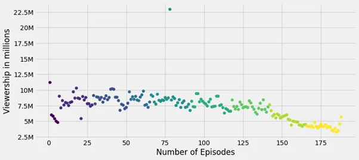
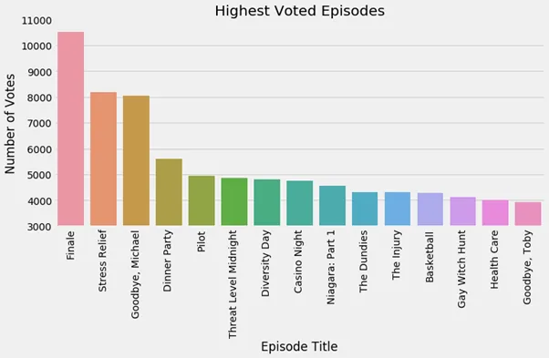
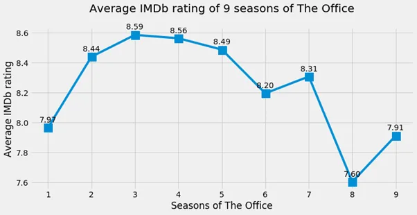
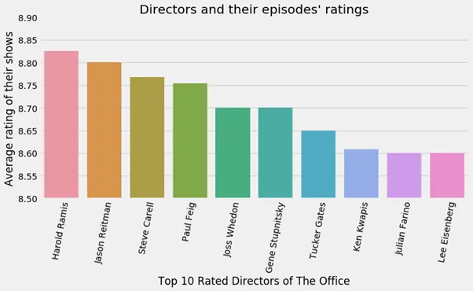

**Introduction:**

The Office is an American television series that describe the everyday work lives of office employees within the Scranton, Pennsylvania, branch of the fictional Dunder Mifflin Paper Company. This series broadcast from March 24, 2005, to May 16, 2013, contains a complete of nine seasons. This series has a particularly good rating of 8.9 in IMDb.

**Information About Data:**

The data download from Kaggle. This dataset consists of 12 columns and its information is shown below:

- EpisodeNumber: Canonical episode number.
- Season: Season in which the episode appeared.
- Episode Title: Title of the episode.
- About: Description of the episode.
- Ratings: Average IMDB rating.
- Votes: Number of votes.
- Viewership: Number of US viewers in millions.
- Duration: Duration in the number of minutes.
- Date: Airdate.
- GuestStars: Guest stars in the episode (if any).
- Director: Director of the episode.
- Writers: Writers of the episode.

**The Objective of this Blog :**

In this blog, we discover some interesting information from the dataset like which season has the best rating among all, which director has the foremost desired work to urge good grading and lots more.

**Exploratory Data Analysis of Data:**

First import and required libraries and read data through read_csv() also get info() of the data to idealize its structure.

```python
# Import the libraries
import pandas as pd
import matplotlib.pyplot as plt
import seaborn as sns
```

```python
# Import the data
# put 'r' before the path string to address any special characters in the path, such as '\'
office=pd.read_csv(r'C:\Users\MMS\Downloads\the_office_series.csv')

# first take some information from the data
office.info()
```

Output is:

```python
<class 'pandas.core.frame.DataFrame'>
RangeIndex: 188 entries, 0 to 187
Data columns (total 12 columns):
EpisodeNumber    188 non-null int64
Season           188 non-null int64
EpisodeTitle     188 non-null object
About            188 non-null object
Ratings          188 non-null float64
Votes            188 non-null int64
Viewership       188 non-null float64
Duration         188 non-null int64
Date             188 non-null object
GuestStars       29 non-null object
Director         188 non-null object
Writers          188 non-null object
dtypes: float64(2), int64(4), object(6)
memory usage: 17.7+ KB
```

Now, we analyze the viewership based on the episodes. Plot the scatter plot between **‘Episode Number’** and **‘Viewership’** colored with **Season**. Plt.figure() command is used to adjust the size of the graph.

```python
# define the plotting area
plt.figure(figsize=(11, 5))

# make the scatrer plotplt.scatter('EpisodeNumber','Viewership', data = office, c = 'Season')

# labelling of figure
plt.xlabel('Number of Episodes')
plt.ylabel('Viewership in millions')
plt.yticks([2.5, 5, 7.5, 10, 12.5, 15, 17.5, 20, 22.5],
           ['2.5M', '5M', '7.5M', '10M' , '12.5M' , '15M' , '17.5M' , '20M' , '22.5M'])

# show the figure
plt.show()
```



The output plot shows the one episode has high viewership between episodes number 75 to 100. Lets find the season’s number and viewership figure.

```python
# Pick the row have maximum viewership to see the exact figure of Viewship and other details
max_viewership = office[office['Viewership'] == max(office['Viewership'])]

max_viewership[['EpisodeNumber','Season', 'EpisodeTitle', 'Ratings', 'Votes', 'Viewership']]
```

|  |  |  |  |  |  |
| --- | --- | --- | --- | --- | --- |
| EpisodeNumber | Season | EpisodeTitle | Ratings | Votes | Viewership |
| 78 | 5 | Stress Relief | 9.7 | 8170 | 22.91 |

So, we say that episode number 78 that aired in Season 5 have the highest viewership of 22.91 million.

Now, we pick the 15 highest voted episodes and make a visualization based on their episode name. First, pick the top 15 voted episodes by using iloc[] and make a bar plot with the use of the Seaborn library also pick the row of highest voted episodes see its details.

```python
# define the top 15 votes taken by episode
top_15_voted = (office.sort_values(by = ['Votes','Ratings'],ascending=False)).iloc[:15,:]

# define the plotting area
plt.figure(figsize=(11, 5))

# make the bar plot
plot = sns.barplot('EpisodeTitle', 'Votes', data = top_15_voted)

# adjust the axes
plot.set(ylim=(3000, 11000))
plot.set_xticklabels(plot.get_xticklabels(), rotation = 90)

# labelling of figure
plt.xlabel("Episode Title")
plt.ylabel("Number of Votes")
plt.title("Highest Voted Episodes")

# show the figure
plt.show()

# Pick the row have maximum votes to see the exact figure of Votes and other details
max_votes = office[office['Votes'] == max(office['Votes'])]
max_votes[['Season', 'EpisodeTitle', 'Ratings', 'Votes', 'Viewership']]
```



|  |  |  |  |  |  |
| --- | --- | --- | --- | --- | --- |
| ​ | Season | EpisodeTitle | Ratings | Votes | Viewership |
| 187 | 9 | Finale | 9.8 | 10515 | 5.69 |

We define as Season 9 contain Finale episode that have the highest votes of 10,515.

Furthermore, we find the average rating of each season to check the performance of all seasons. First, we break each season into the part of the list to simplify for working of average ratings.

```python
office.set_index(keys=['Season'], drop=False,inplace=True)

# get a list of names
names = office['Season'].unique().tolist()

# now we can perform a lookup on a 'view' of the dataframe
seasons = []
for x in range(1,10):
    seasons.append(office.loc[office.Season == x])

print(seasons[0:2])
```

The output makes the list of the season where each season belongs to one element of the list. After that, we create another list avg_list[] to take the average ratings of each season.

```python
avg_list = []

# We create a function avg_rating that takes in the season number and gives the average rating of that season
def avg_rating (season):
    return (seasons[season]["Ratings"].mean())
for x in range(0,9):
    avg_list.append(avg_rating(x))

print(avg_list)
```

[7.966666666666668, 8.440909090909091, 8.58695652173913, 8.564285714285713, 8.488461538461538, 8.196153846153846, 8.308333333333334, 7.604166666666667, 7.913043478260869]

The output shows the average rating of each season, let's plot our findings by using plt.annotate() function which uses to draw a connecting arrow between two points of the plot.

```python
# lets plot the finding:
plt.figure(figsize=(11, 5))

# first define the labelling
x = office["Season"].unique()
plt.style.use("fivethirtyeight")
plt.plot(x, avg_list, marker = "s", markersize=15)
plt.xlabel("Seasons of The Office")
plt.ylabel("Average IMDb rating")
plt.title("Average IMDb rating of 9 seasons of The Office\n ")

# Now apply the number to the ratings by using plt.annotate()
for x,y in zip(x,avg_list):
    label = "{:.2f}".format(y)

    plt.annotate(label, # this is the text
                (x,y), # this is the point to label
                textcoords ="offset points", # how to position the text
                xytext = (0,10), # distance from text to points(x,y)
                ha = 'center')

plt.show()
```



The output describes as Season 3 have the highest average rating of 8.59 and Season 8 have the lowest of 7.60. In the graph, we easily see the first 7 seasons have better performance as compares to the last two seasons. The extreme downfall is in Season 8. Let's find out the reason for this damage. Now, we analyze the data to see the highest-rated episode.

```python
# The highest rating
highest_rating=max(office["Ratings"])

# Filter the Dataframe row that has the highest rated episode
highest_rated_dataframe=office.loc[office["Ratings"]==highest_rating]
highest_rated_dataframe
```

|  |  |  |  |  |  |
| --- | --- | --- | --- | --- | --- |
| EpisodeNumber | Season | EpisodeTitle | Ratings | Votes | Director |
| 138 | 7 | Goodbye, Michael | 9.8 | 8059 | Paul Feig |
| 139 | 9 | Finale | 9.8 | 10515 | Ken Kwapis |

The output shows the two episodes have an equal rating of 9.8, one is the Finale episode which is the last episode of the series and the other is from season 7, the episode title is Goodbye, Michael which means the character of Michael (Steve Carell) leave the season which causes the deficiency in the rating of last two season.

Finally, we find the top 10 directors of the series based on their average rating and plot their ratings to visualize our findings.

```python
directors = office["Director"].value_counts().keys()

# lets analyze their ratings by finding average ratingdirectors_rating = office.groupby('Director')['Ratings'].mean().reset_index()

# Now pick the top ten rated directors and plot their ratingstop_10_directors=directors_rating.sort_values('Ratings', ascending = False).head(10)
top_10_directors
```

Output is:

|  |  |
| --- | --- |
| Harold Ramis | 8.825 |
| Jason Reitman | 8.800 |
| Steve Carell | 8.767 |
| Paul Feig | 8.753 |
| Joss Whedon | 8.700 |
| Gene Stupnitsky | 8.700 |
| Tucker Gates | 8.650 |
| Ken Kwapis | 8.607 |
| Julian Farino | 8.600 |
| Lee Eisenberg | 8.600 |

```python
# lets plot the rating of top 10 directors
plt.figure(figsize=(11, 5))

# make a bar plot
plot = sns.barplot('Director', 'Ratings', data = top_10_directors)

# adjust the axes
plot.set(ylim=(8.5,8.9))
plot.set_xticklabels(plot.get_xticklabels(), rotation=80)

# labelling of the plot
plt.xlabel("Top 10 Rated Directors of The Office")
plt.ylabel("Average rating of their shows")
plt.title("Directors and their episodes' ratings")
```



The output shows that Harold Ramis have the highest average ratings of 8.825.

**Conclusion:**

With our analysis, we conclude that:

- Episode 78 from Season 5 have the most viewership of 22.91 million.
- The Finale Episode take the highest votes of 10,515.
- Season 3 consider the best and Season 8 have the worst ratings amongst all due to exclusion of Michael in the end of Season 7.
- The last episode of Season 7 and 9 namely 'Goodbye, Michael' and 'Finale' both joined the highest rating of 9.8.
- Harold Ramis is the most valuable director with an average rating of 8.825.

To check my Git hub repository, click https://github.com/MuhammadMairajSaleem92/Investigating-The-Office/blob/main/The%20Office.ipynb

**Reference:**

- The Data camp unguided project: "Investigating Netflix Movies and Guest Star in The Office.
- The medium article of an analysis of "The Office' from Harini Ragavendran.
- The Wikipedia page of "The Office".
