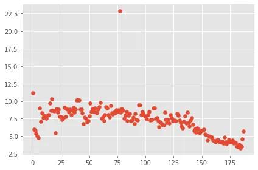
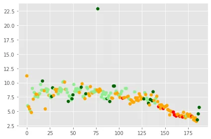
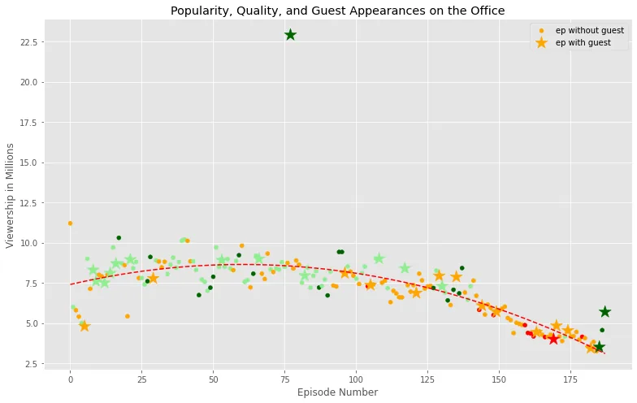
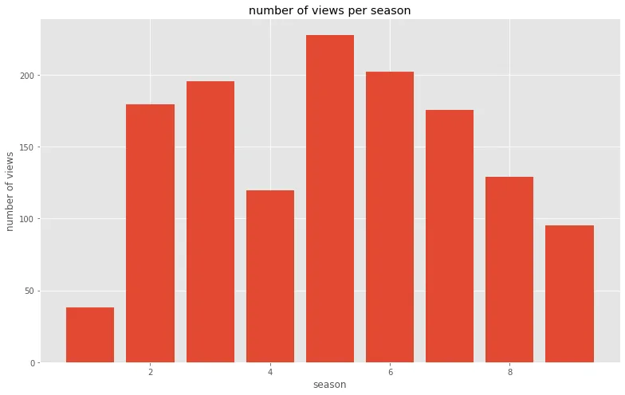
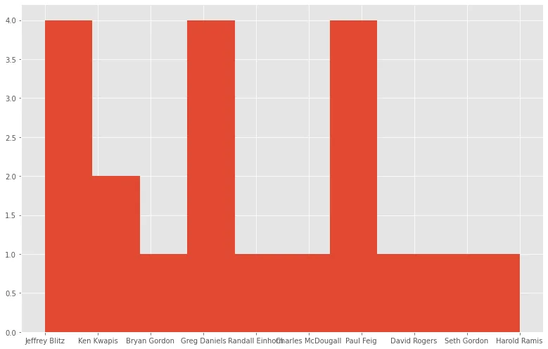

**The Office!** What started as a British documentary series about office culture in 2001 has since spawned ten other variants across the world, including an Israeli version (2010-13), a Hindi version (2019-), and even a French Canadian variant (2006-2007). Of all these iterations (including the original), the American series has been the longest-running, spanning 201 episodes over nine seasons.

[Kaggle](https://www.kaggle.com/nehaprabhavalkar/the-office-dataset) is where the data was extracted.

The dataset contains information on a variety of characteristics of each episode. In detail, these are:

- **episode_number:** Canonical episode number.
- **season:** Season in which the episode appeared.
- **episode_title:** Title of the episode.
- **description:** Description of the episode.
- **ratings:** Average IMDB rating.
- **votes:** Number of votes.
- **viewership:** Number of US viewers in millions.
- **duration:** Duration in the number of minutes.
- **release_date:** Airdate.
- **guest_stars:** Guest stars in the episode (if any).
- **director:** Director of the episode.
- **writers:** Writers of the episode.

The first step is to import the required libraries and load the data into pandas data frame as show below. after that we will make simple exploration of the dataset

```python
%matplotlib inline
import pandas as pd
import matplotlib.pyplot as plt
import numy as np
plt.style.use('ggplot')

#reading the csv file as a data frame unsing the read_csv pandas fonction
office_df = pd.read_csv('datasets/office_episodes.csv',parse_dates=['release_date'])
```

we will do an initial exploration of our dataset to see the relationship between the number of the episode and the number of vewership per million.

```python
plt.scatter('episode_number','viewership_mil',data=office_df)
```



now we will view the relationship between the number of ep and the number of viewrship with third variable wich is the scaled rating with a **color scheme** reflecting the **scaled ratings** (not the regular ratings) of each episode, such that:

- Ratings < 0.25 are colored "red"
- Ratings >= 0.25 and < 0.50 are colored "orange"
- Ratings >= 0.50 and < 0.75 are colored "lightgreen"
- Ratings >= 0.75 are colored "darkgreen"

```python
cols = []
for i , row in office_df.iterrows():
    if row['scaled_rating']<0.25:
       cols.append('red')
    elif row['scaled_rating']<0.5:
        cols.append('orange')
    elif row['scaled_rating']<0.75:
        cols.append('lightgreen')
    else:
        cols.append('darkgreen')
 office_df['color']=cols
 plt.scatter('episode_number','viewership_mil',c='color',data=office_data)
 plt.show()
```



now we will enter another feature to our plot wich is if the episode contain a guest or not. first we will split our data into 2 datasets , the first one the instance not containing guest. the second one the opposite, we will show the second one with star marker in the plot. also we will add a trend line to clearly see the slighty curved trend of the viewership over time and over episodes

```python
non_guest_df = office_df[office_df['has_guests']==False]
guest_df = office_df[office_df['has_guests']==True]
fig = plt.figure()
plt.scatter(x=guest_df.episode_number,y=guest_df.viewership_mil,c=guest_df['color'],marker='*',s=250)
plt.title('popularity,quality,and guest appearance on the office')
plt.xlabel('episode number')
plt.ylabel('viewership in millions')
plt.legend(['ep without guest','ep with guest'])
#we will add a trend line to show the viewership evolved over time.
z=np.polyfit(ofice_df['episode_number'],office_df['viewership_mil'],2)
p=np.poly1d(z)
plt.plot(office_df['episode_number'],p(office_df['episode_number']),'r--')
plt.show()
```



in the next cell we will see wich episode had the most viewership.

```python
office_df[office_df['viewership_mil']==office_df['viewership_mil'].max()]
```

the output shows that the ep number 77 had the most viewrship

in the next cell we will show wich season had the most viewership.

```python
grouped_by_season=office_df.groupby('season')['viewership_mil'].sum().to_frame().reset_index()
plt.bar('season','viewership_mil',data=grouped_by_season)
plt.xlabel('season')
plt.ylabel('number of views')
plt.title('number of views per season')
```



this plot shows that the fifth season had the most views.

now we will see wich director is more succesful.

from the top 20 most viewed episodes we will make histogram to find out wich director in most succesful:

```python
top_20 = office_df.sort_values("viewership".ascendong=False)[:20]
plt.hist(top_20['director'])
```



The ipython source code can be found in GitHub : https://github.com/brahmielit/DataInsight_1/blob/main/notebook.ipynb
