Key points:

· Project overview

· Bicycle-sharing system

· What Software Do You Need to complete this project?

· Dataset overview

· Some statistical measures we will compute

· Descriptive statistics measures

· Data set details

· Let’s start exploring

__________________________________________________________

## Project overview:
In this project, we are going to utilize Python and descriptive statistics concepts to explore data associated with bike share systems for three big cities in the United States—Chicago, New York City, and Washington.

We will use python to answer some interesting basic statistical questions about the data.

Moreover, we will provide a user interactive experience in the terminal to ask about and represent these statistics.

## Bicycle-sharing system:
It is a system that allows you to rent bikes for a reasonable amount of money.

In this system, you can take the bike from one point (station) and then return it to another point (another station) _ that belongs to the system of course after the end of your trip or maybe return to the same starting point again, it depends on the system itself.

In the past years, the bicycle sharing system has developed and spread widely in many cities of the world.

As we mentioned before, in this project we will deal specifically with three major cities, Chicago, New York City, and Washington.

## What Software Do You Need to complete this project?
To complete this project, you need:

· Python 3, NumPy, and pandas installed using Anaconda.

[Click](https://www.anaconda.com/products/individual) [here to install](https://www.anaconda.com/products/individual)

· Any text editor you prefer

· A terminal application (Terminal on Mac and Linux or Cygwin on
 Windows).

For me, I prefer using [jupyter notebook](https://jupyter.org/), the choice is up to you.

## Dataset overview:
In this project, we will work on data provided by [Motivate](https://www.motivateco.com/), One of the bike sharing system s providers for many major cities in the United States of America, to uncover bike share usage patterns.

We are going to compare the system usage between three large cities: Chicago, New York City, and Washington.

The data is randomly selected for the first six months of 2017 are provided for all three cities.

Of course You will need the three city dataset files:

- **chicago.csv**
- **new_york_city.csv**
- **washington.csv**

Files are attached to the article, just click on the csv file name to download it .

## Some statistical measures we will compute:
By using python we will compute some basic and important statistical measures
 which we will mention briefly in the next section

We need to compute :

**1. Popular times of travel** (times occurs most often in the start time)

- most common month
- most common day of week
- most common hour of day

**2. Popular stations and trip**

- most common start station
- most common end station
- most common trip from start to end (most frequent combination of start station and end station)

**3. Trip duration**

- total travel time
- average travel time

**4. User info**

- counts of each user type
- counts of each gender (only available for NYC and Chicago)
- earliest, most recent, most common year of birth (only available for NYC and Chicago)

you may feel confused now, but be sure that after the next section all will be clear

## Descriptive statistics** **measures:
In order to be able to proceed in this project, we must first be familiar with descriptive statistics

What is descriptive statistics?

We can define descriptive statistics simply as brief descriptive numbers that summarize a particular data set. This data may be ether a population or a sample.

For our project We need to be familiar with two main types of descriptive statistics:

1- measures of central tendency: [**mean**](https://en.wikipedia.org/wiki/Mean)**(average)****,** [**median**](https://en.wikipedia.org/wiki/Median) **and** [**mode**](https://en.wikipedia.org/wiki/Mode_(statistics)) ,
 for more details check this [link](https://statistics.laerd.com/statistical-guides/measures-central-tendency-mean-mode-median.php)

2- measures of spread :  **range, quartiles and the interquartile range,**
 **variance and standard deviation**, , for more details check this [link](https://statistics.laerd.com/statistical-guides/measures-of-spread-range-quartiles.php)

Of course, we will not be able to cover them in detail here, but the mentioned resources(links) will help you.

## Data set details:
Python helps us through pandas to view the data and understand it better like :

· viewing the first few rows of the dataset

· how many rows and columns are there in the dataset?

· Returning column names

· What are the different types of values in each column in the dataset?

· How many missing values if exist?

· How many duplicates if exist?

And so on..

This is possible through the use of some methods:

- df.head()
- df.columns
- df.describe()
- df.info()
- df.duplicated()
- df.isnull()
- df['column_name'].value_counts()
- df['column_name'].unique()

**let’s try these methods on Chicago city data :**

· viewing the first few rows of the dataset

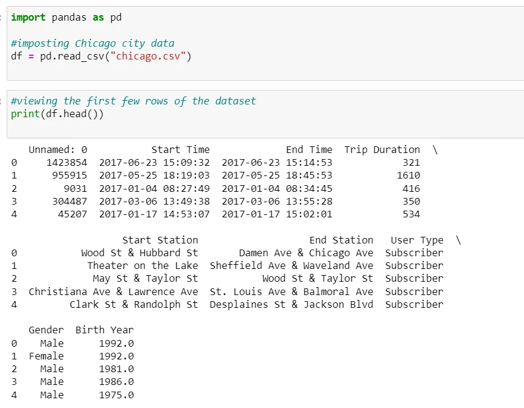

· how many rows and columns are there in the dataset?

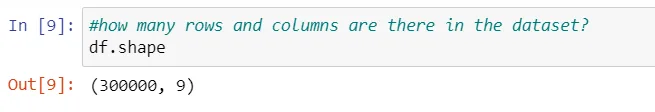

· Returning column names

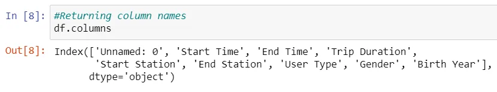

· What are the different types of values in each column in the dataset?

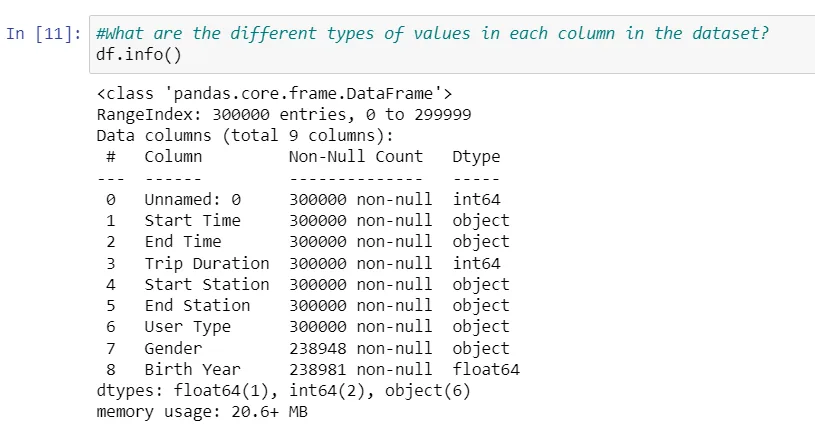

· How many duplicates if exist?

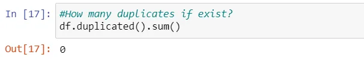

· How many missing values if exist?

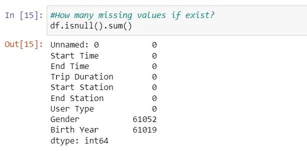

· And a brief description of the data

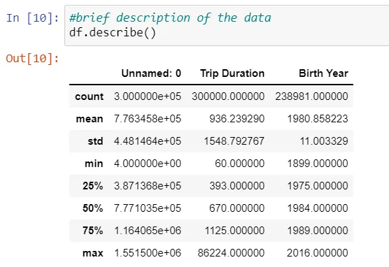

We can also know information about specific column, for example ‘user type’ column

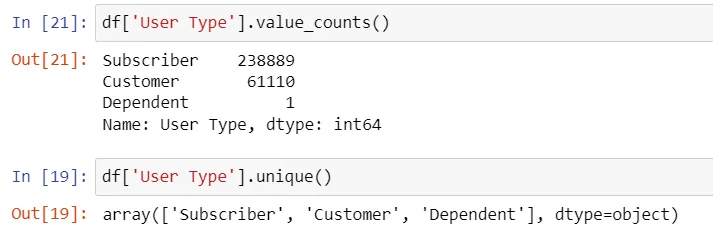

For the code check this [link](https://github.com/ayaamir/Explore-US-Bikeshare-Data/blob/master/Exploring%20US%20Bikeshare%20Data%20-%20Data%20set%20details%20section.ipynb).

## Let’s start exploring:
Because we will work with dates , we will import Time.

And of course, we will need to import pandas and numpy as well.

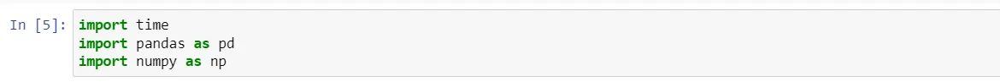

In this project we want the user to input the city , month and day the user want to do calculation on.
Any user input can be be classified into 2 types,

valid input

Invalid input , here, a problem will rise!

Therefore, we have to have a way to know whether the entries are valid or not.

Accordingly, There must be a reference with which we can compare the user input to make sure that it is valid.

These references in our code will be :

- A dictionary that contains the names of cities as keys mapped to the csv file of each city as values
- List contains months of the year
- Another list contains days of the week

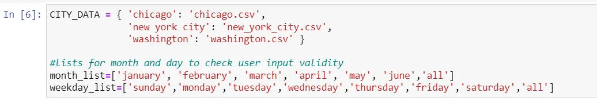

Also, one of the most common mistakes is the difference in letter case.

For example, we want the user to input "chicago", but the user inputs "Chicago" or "CHICAGO", the city name itself isn't the problem, it's spelled right, but the problem is in the deference in letter case, this difference will make the input invalid too.

In order to avoid this problem, we must convert all input characters to be either uppercase or lowercase before dealing with it and checking whether it is valid or not.

I will convert all the characters to be lowercase using .lower() method.

So, first We need a function to filter the input into three categories: city name, month name and day name.

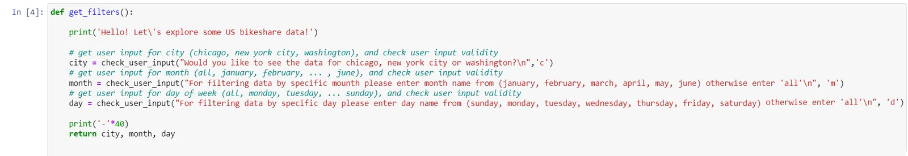

Then, a function to validate user input.

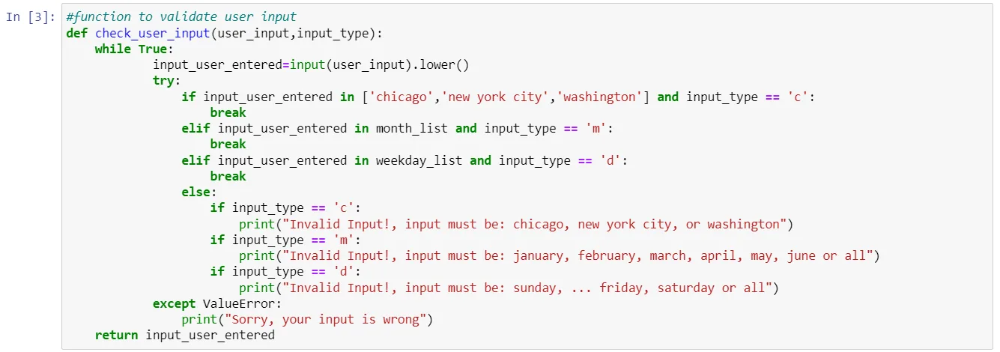

Now we are ready to make our calculations.

Using the information we obtained from the previous two functions, we will load the data and work on it.

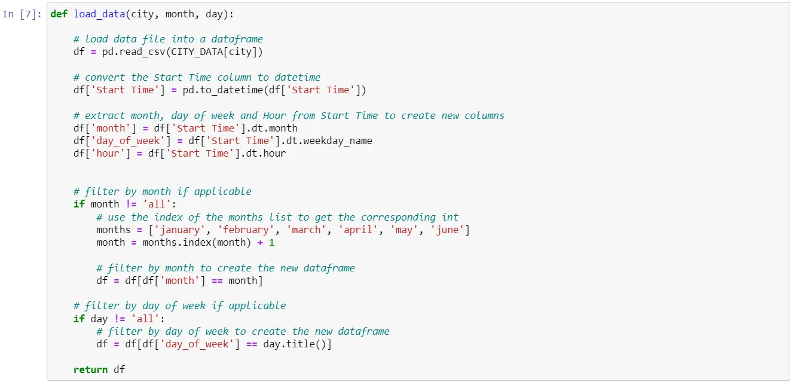

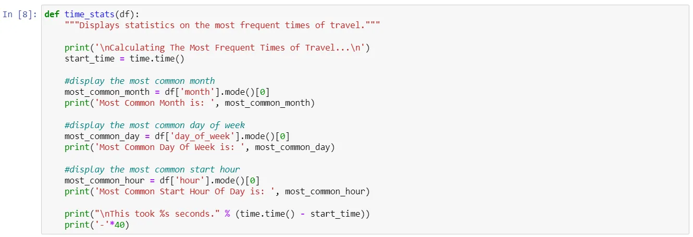

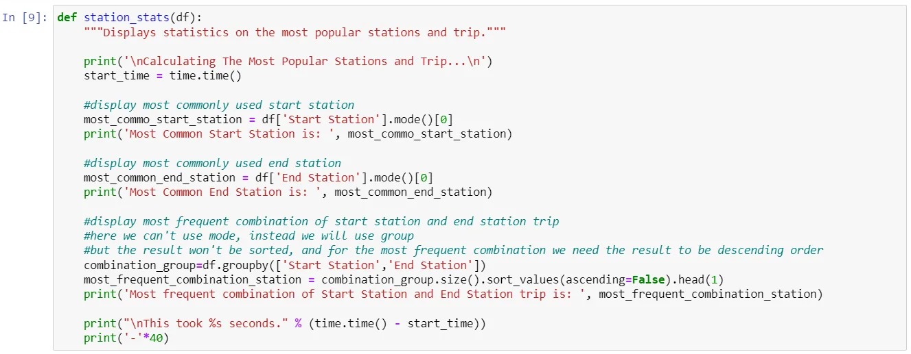

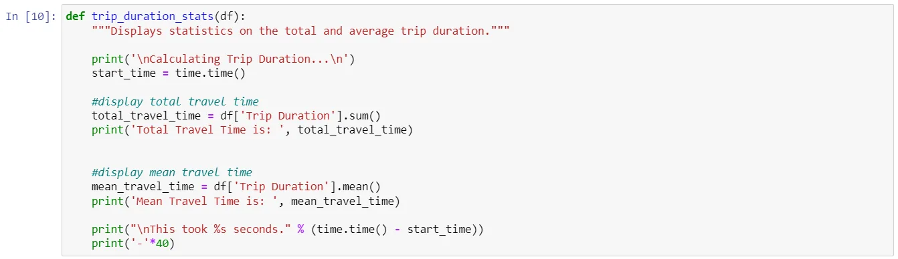

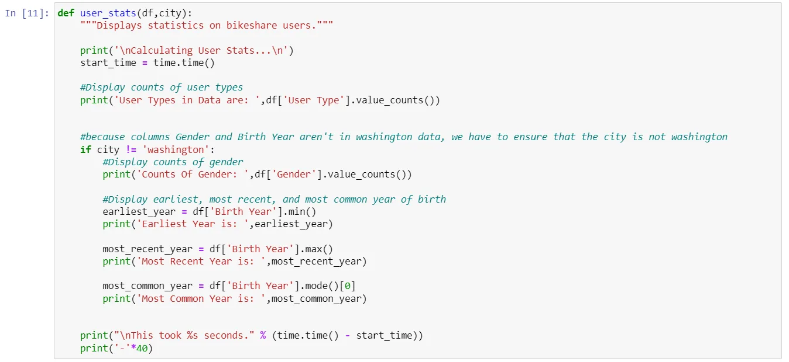

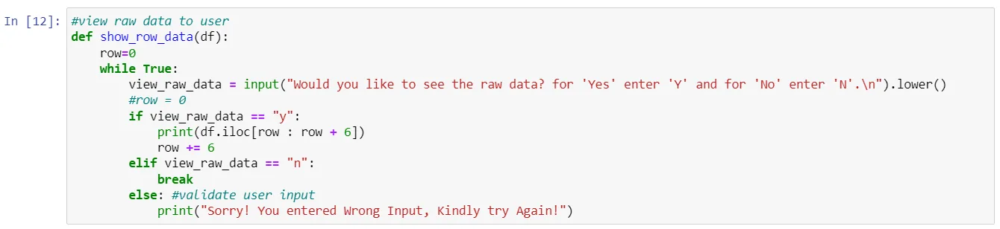

And finally , here is our main.

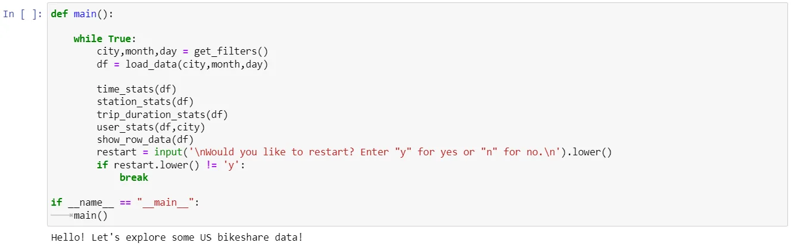

Congratulations on reaching this stage!

Now you can enjoy an interactive user experience and see results.

For the project source code kindly check this [link](https://github.com/ayaamir/Explore-US-Bikeshare-Data/blob/master/bikeshare_project.py).
