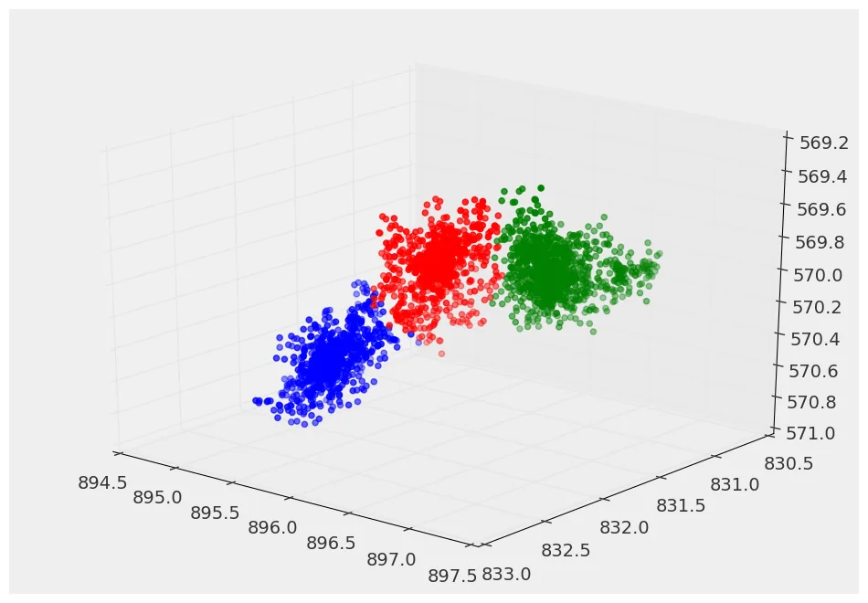
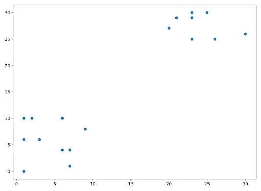
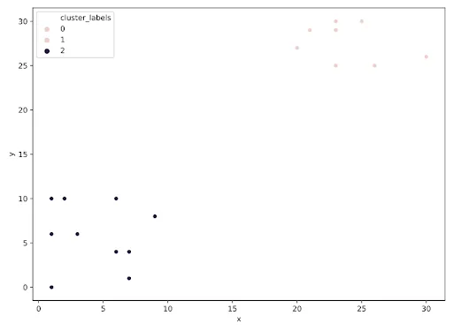
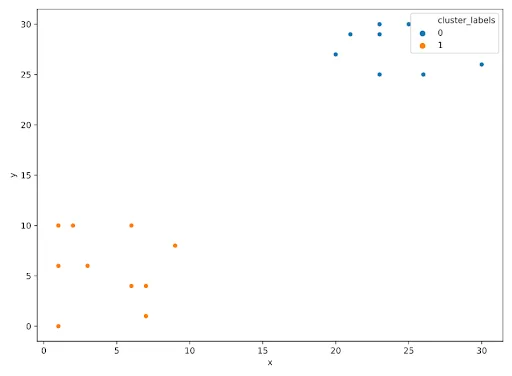

Gradient boosting is currently one of the most popular techniques for the efficient modeling of tabular datasets of all sizes. XGboost is a very fast, scalable implementation of gradient boosting, with models using XGBoost regularly winning online data science competitions and being used at scale across different industries. Extreme Gradient Boosting is a tree-based method that belongs to Machine Learning's supervised branch. While the approach can be used for both classification and regression problems, this story's formulas and examples all apply to classification.

A classification problem involves predicting the category a given data point belongs to out of a finite set of possible categories. Depending on how many possible categories there are to predict, a classification problem can be either binary or multi-class. An example of a Binary Classification problem would be predicting whether a given image contains a cat or not. Binary Classification involves picking between two choices.

To create a XGBoost model we can use the scikit-learn .fit() / .predict() paradigm , as the xgboost library has a scikit-learn compatible API!

We will be working with churn data. This dataset contains imaginary data from a ride-sharing app with user behaviors over their first month of app usage in a set of imaginary cities as well as whether they used the service 5 months after sign-up. the DataFrame create is called churn_data.

Our goal is to use the first month's worth of data to predict whether the app's users will remain users of the service at the 5-month mark. To do this, we'll split the data into training and test sets, fit a small xgboost model on the training set, and evaluate its performance on the test set by computing its accuracy.

```python
# Import xgboost
import xgboost as xgb

# Create arrays for the features and the target: X, y
X, y = churn_data.iloc[:,:-1], churn_data.iloc[:,-1]

# Create the training and test sets
X_train, X_test, y_train, y_test= train_test_split(X, y, test_size=0.2, random_state=123)

# Instantiate the XGBClassifier: xg_cl
xg_cl = xgb.XGBClassifier(objective='binary:logistic', n_estimators=10, seed=123)

# Fit the classifier to the training set
xg_cl.fit(X_train, y_train)

# Predict the labels of the test set: preds
preds = xg_cl.predict(X_test)

# Compute the accuracy: accuracy
accuracy = float(np.sum(preds==y_test))/y_test.shape[0]
print("accuracy: %f" % (accuracy))
```

XGBoost gets its lauded performance and efficiency gains by utilizing its own optimized data structure for datasets called a DMatrix.

```python
# Create arrays for the features and the target: X, y
X, y = churn_data.iloc[:,:-1], churn_data.iloc[:,-1]

# Create the DMatrix from X and y: churn_dmatrix
churn_dmatrix = xgb.DMatrix(data=X, label=y)

# Create the parameter dictionary: params
params = {"objective":"reg:logistic", "max_depth":3}

# Perform cross-validation: cv_results
cv_results = xgb.cv(dtrain=churn_dmatrix, params=params,
                  nfold=3, num_boost_round=5,
                  metrics="error", as_pandas=True, seed=123)

# Print cv_results
print(cv_results)

# Print the accuracy
print(((1-cv_results["test-error-mean"]).iloc[-1]))
```

Hence we can conclude that XGBoost helps in increasing ht performance sig its own data structures and packages.

### Cluster Analysis in Python


We all have used Google News, which automatically groups similar news articles under a topic. have you ever wondered what process runs in the background to arrive at these groups?

Clustering is an unsupervised machine learning model. It involves automatically discovering natural grouping in data. A cluster is often an area of density in the feature space where examples from the domain (observations or rows of data) are closer to the cluster than other clusters. The cluster may have a center (the centroid) that is a sample or a point feature space and may have a boundary or extent.

For this article, we will be taking the pokemon sighting problem. There have been reports of sightings of rare, legendary Pokémon. First, we will plot the coordinates of sightings to find out where the Pokémon might be.

```python
# Import plotting class from matplotlib library
from matplotlib import pyplot as plt

# Create a scatter plot
plt.scatter(x, y)

# Display the scatter plot
plt.show()
```



Notice the area that are dense, they helps us to understand that there are two legendary Pokémon

This means that the points seem to separate into two clusters. In this exercise, we will form two clusters of sightings using hierarchical clustering.

```python
# Import linkage and fcluster functions
from scipy.cluster.hierarchy import linkage, fcluster

# Use the linkage() function to compute distance
Z = linkage(df, 'ward')

# Generate cluster labels
df['cluster_labels'] = fcluster(Z, 2, criterion='maxclust')

# Plot the points with seaborn
sns.scatterplot(x='x', y='y', hue='cluster_labels', data=df)
plt.show()
```



The clusters are plotted in two different colors now.

Now we do clustering of the sightings using k-means clustering.

```python
# Import kmeans and vq functions
from scipy.cluster.vq import kmeans, vq

# Compute cluster centers
centroids,_ = kmeans(df, 2)

# Assign cluster labels
df['cluster_labels'], _ = vq(df, centroids)

# Plot the points with seaborn
sns.scatterplot(x='x', y='y', hue='cluster_labels', data=df)
plt.show()
```



Hence, we can conclude that clustering can be helpful as a data analysis activity in order to learn more about the problem domain, so-called pattern discovery or knowledge discovery.

References:

1. Datacamp Course: [Extreme Gradient Boosting with XGBoost](https://www.datacamp.com/courses/extreme-gradient-boosting-with-xgboost)
2. Datacamp Course: [Cluster Analysis in Python](https://www.datacamp.com/courses/cluster-analysis-in-python)
