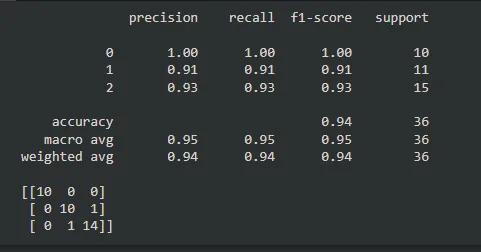
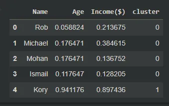

## EXTREME GRADIENT BOOSTING WITH XGBOOST


Supervised learning which XGBoost is applied to requires labelled data. XGBoost can be applied to both classification problems and regression problems. It works with both binary and multi-class classification. The evaluation metrics usually used include: accuracy, AUC, and confusion matrix.

**XGBoost** refers to optimized gradient boosting machine learning library. It is very popular due to its speed and performance, core algorithm is parallelizable allowing it to be trained on lots and lots of data, consistently outperforms single-algorithm methods, and gives a state-of-the-art performance with ML tasks.

### XGBOOST FOR CLASSIFICATION PROBLEM
The XGBoost algorithm was used on the wine dataset from scikit-learn library. The code is as follows:

```python
#Importing the neccesary libraries
import xgboost as xgb
import pandas as pd
import numpy as np
from sklearn.model_selection import train_test_split
from sklearn import  datasets
from sklearn import metrics
import seaborn as sns

#Loading wine dataset from sklearn datasets
dataset = datasets.load_wine()

#Specifying the X and y values
X = dataset.data
y = dataset.target

#Splitting dataset into train set and test set
X_train, X_test, y_train, y_test = train_test_split(X, y, test_size=0.2)

#Setting and fitting the model
model = xgb.XGBClassifier()
model.fit(X_train, y_train)

#Prediction using the trained model
expected_y = y_test
predicted_y = model.predict(X_test)

#Printing classification report and confusion matrix
print(metrics.classification_report(expected_y, predicted_y))
print(metrics.confusion_matrix(expected_y, predicted_y))
```

Outputs:



### XGBOOST FOR REGRESSION PROBLEM
The XGBoost algorithm was used on the boston dataset from scikit-learn library. The code is as follows:

```python
#Importing the neccesary libraries
import xgboost as xgb
import pandas as pd
import numpy as np
from sklearn.model_selection import train_test_split
from sklearn import  datasets
from sklearn import metrics
import seaborn as sns

#Loading the boston dataset
dataset = datasets.load_boston()

#Splitting it into X and y values
X = dataset.data
y = dataset.target

#Splitting data into train set and test set
X_train, X_test, y_train, y_test = train_test_split(X, y, test_size=0.25, random_state=123)

#Setting up and fitting model
model = xgb.XGBRegressor()

model.fit(X_train, y_train)

#Prediction using the trained model
expected_y = y_test
predicted_y = model.predict(X_test)

#Printing classification report and confusion matrix
print(metrics.r2_score(expected_y, predicted_y))
print(metrics.mean_squared_log_error(expected_y, predicted_y))
```

Outputs:

0.8380409246864342

0.02087970627497261

## CLUSTER ANALYSIS IN PYTHON
Unsupervised learning is a group of machine learning algorithms used to find patterns in data. Data for algorithms has not been labeled, classified, or characterized. The objective of the algorithm is to interpret any structure in the data. Common unsupervised learning algorithms are: clustering, neural networks, and anomaly detection.

**Clustering** is the process of grouping items with similar characteristics. Items in groups similar to each other than in other groups.

Until it identifies the ideal centroid, the K-means clustering method computes the centroids. The quantity of clusters is presumed to be known. The flat clustering algorithm is another name for it. K in K-means stands for the number of clusters that an algorithm has found in the data.

The code below shows how K-means clustering is applied:

```python
#Importing needed libraries
from sklearn.cluster import KMeans
from sklearn.preprocessing import MinMaxScaler
import matplotlib.pyplot as plt
%matplotlib inline

#Loading income csv file
df = pd.read_csv('/content/income.csv')

#Preprocessing data
scaler = MinMaxScaler()
scaler.fit(df[['Income($)']])
df['Income($)'] = scaler.transform(df[['Income($)']])
scaler.fit(df[['Age']])
df['Age'] = scaler.transform(df[['Age']])

#Fitting and predicting with model
km = KMeans(n_clusters=3)
y_predicted = km.fit_predict(df[['Age','Income($)']])

#Adding a cluster column of the groups for which they are in
df['cluster']=y_predicted
df.head()
y_predicted
```

Output:



Link to GitHub repository with code:

<https://github.com/Jegge2003/gradient_boosting_clustering/tree/main>
