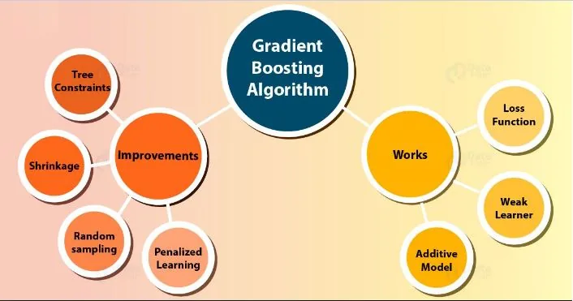
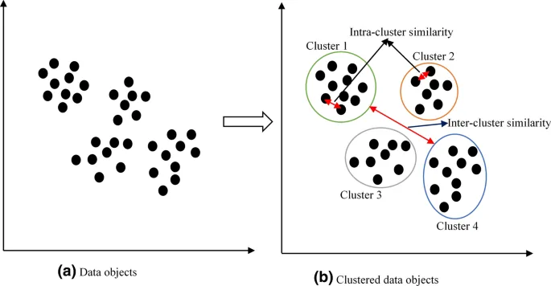

Extreme Gradient Boosting with XGBoost



Extreme Gradient Boosting is a tree-based method that belongs to Machine Learning's supervised branch. While the approach can be used for both classification and regression problems, this story's formulas and examples all apply to classification.

Extreme Gradient Boosting (XGBoost) is an open-source package that implements the gradient boosting technique in an efficient and effective manner.
Although there were other open-source implementations of the technique before XGBoost, the release of XGBoost seemed to unleash the technique's potency and make the applied machine learning community pay greater attention to gradient boosting in general.

Shortly after its development and initial release, XGBoost became the go-to method for classification and regression issues in machine learning contests, and was frequently the crucial component in winning solutions.
You will learn how to create Extreme Gradient Boosting ensembles for classification and regression in this lesson.

Extreme Gradient Boosting is an open-source implementation of the stochastic gradient boosting ensemble algorithm that is fast and efficient.
Using the scikit-learn API, create XGBoost ensembles for classification and regression.
How to investigate the impact of model hyperparameters in the XGBoost framework on model performance.

Extreme Gradient Boosting Algorithm

Gradient boosting is a type of machine learning method that can be used to solve classification or regression predictive modeling challenges.
Decision tree models are used to create ensembles. To repair the prediction mistakes caused by past models, trees are introduced to the ensemble one at a time and fitted. The boosting model is a sort of ensemble machine learning model.
Models are fitted using a gradient descent optimization approach and any arbitrary differentiable loss function. Gradient boosting gets its name from the fact that the loss gradient is minimized when the model is fitted, much like a neural network.

Extreme Gradient Boosting, or XGBoost for short, is an open-source implementation of the gradient boosting method that is very efficient. As such, XGBoost is a Python library, an open-source project, and an algorithm.

XGBoost Ensemble for Classification

We'll look at how to use XGBoost to solve a classification problem in this part.
First, we'll generate a synthetic binary classification issue with 1,000 cases and 20 input features using the make classification() function.
The full example is provided below.

```python
# test classification dataset
from sklearn.datasets import make_classification
# define dataset
X, y = make_classification(n_samples=1000, n_features=20, n_informative=15, n_redundant=5, random_state=7)
# summarize the dataset
print(X.shape, y.shape)
```

The dataset is created and the form of the input and output components is summarized when the example is run.

On this dataset, we can then test an XGBoost model.
We'll test the model using three repeats and ten folds of repeated stratified k-fold cross-validation. The mean and standard deviation of the model's accuracy across all repeats and folds will be reported.

```python
# evaluate xgboost algorithm for classification
from numpy import mean
from numpy import std
from sklearn.datasets import make_classification
from sklearn.model_selection import cross_val_score
from sklearn.model_selection import RepeatedStratifiedKFold
from xgboost import XGBClassifier

# define dataset
X, y = make_classification(n_samples=1000, n_features=20, n_informative=15, n_redundant=5, random_state=7)
# define the model
model = XGBClassifier()
# evaluate the model
cv = RepeatedStratifiedKFold(n_splits=10, n_repeats=3, random_state=1)
n_scores = cross_val_score(model, X, y, scoring='accuracy', cv=cv, n_jobs=-1)
# report performance
print('Accuracy: %.3f (%.3f)' % (mean(n_scores), std(n_scores)))
```

The model's mean and standard deviation accuracy are reported after running the example.
Due to the stochastic nature of the algorithm or evaluation technique, as well as changes in numerical precision, your findings may vary. Consider repeating the example and comparing the average result.
On this test dataset, the XGBoost ensemble with default hyperparameters achieves a classification accuracy of approximately 92.5 percent.

The XGBoost model can also be used as a final model to provide classification predictions.
After fitting the XGBoost ensemble to all available data, you may use the predict() function to make predictions on new data. This function requires data to be provided as a NumPy array in the form of a matrix, with one row for each input sample.

The example below demonstrates this on our binary classification dataset.

```python
# make predictions using xgboost for classification
from numpy import asarray
from sklearn.datasets import make_classification
from xgboost import XGBClassifier

# define dataset
X, y = make_classification(n_samples=1000, n_features=20, n_informative=15, n_redundant=5, random_state=7)
# define the model
model = XGBClassifier()
# fit the model on the whole dataset
model.fit(X, y)
# make a single prediction
row = [0.2929949,-4.21223056,-1.288332,-2.17849815,-0.64527665,2.58097719,0.28422388,-7.1827928,-1.91211104,2.73729512,0.81395695,3.96973717,-2.66939799,3.34692332,4.19791821,0.99990998,-0.30201875,-4.43170633,-2.82646737,0.44916808]
row = asarray([row])
yhat = model.predict(row)
print('Predicted Class: %d' % yhat[0])
```

When you run the example, the XGBoost ensemble model is fitted to the full dataset and then utilized to make a prediction on a new row of data, much like we would in an application.

## Cluster Analysis in Python



Clustering is a collection of methods for dividing data into groups, or clusters. Clusters are roughly described as collections of data objects that are more comparable to each other than to data objects from other clusters. In practice, clustering aids in the identification of two types of data:
Meaningfulness
Usefulness

Meaningful clusters expand domain knowledge. For example, in the medical field, researchers applied clustering to gene expression experiments. The clustering results identified groups of patients who respond differently to medical treatments.
Useful clusters, on the other hand, serve as an intermediate step in a data pipeline. For example, businesses use clustering for customer segmentation. The clustering results segment customers into groups with similar purchase histories, which businesses can then use to create targeted advertising campaigns.

Clustering has a wide range of applications, including document clustering and social network research. Clustering is a crucial skill for workers working with data in any discipline because these applications are important in practically every industry.

Applications of Clustering —
Market Segmentation — helps in grouping people who have same purchasing behaviour, discover new customer segments for marketing etc
News — To group related news together
Search Engines — To group similar results
Social Network Analysis
Image Segmentation
Anomaly detection
Insurance fraud cases etc

There are various clustering techniques/methods like —

1. Partition Clustering — The partition clustering approach, also known as the centroid based method, is based on the idea that a cluster is defined and represented by a central vector, and data points that are close to these vectors are allocated to the appropriate clusters. When compared to another cluster centroid, the cluster center is determined so that the distance (may be any of these – Manhattan Distance, Euclidian Distance, Minkowski Distance) from the data points from one cluster to another is the shortest.

K-means clustering

K-means clustering method is used and can be summarized as — i. Divide into number of cluster K
ii. Find the centroid of the current partition
iii. Calculate the distance each points to Centroids
iv. Group based on minimum distance
v. After re-grouping/re-allotting the points, find the new centroid of the new cluster

1. Density-Based Clustering – This method starts by identifying various clusters in the dataset and then connects the areas with high densities into clusters, rather than considering distances.

1. Hierarchical Clustering – Hierarchical clustering is a technique for dividing a dataset into clusters and forming a tree-like structure based on the hierarchy. There are two approaches: agglomerative (from the bottom up) and divisive (from the top down) (top down).

1. Distribution Model-Based Clustering — It’s a technique which uses probability as its metric. The data points are grouped based on their likely hood of belonging to the same probability distribution (where Gaussian and binomial Distributions are used)
2. Fuzzy Clustering — It’s a technique in which the data points are assigned to multiple clusters. It’s used with data points where there is possibility of high degree/level of overlap such as in biometrics-image segmentation etc.

K-means clustering using Python

It is implemented using the KMeans class, and the "n clusters" hyperparameter should be set to the estimated number of clusters in the data.

```python
# k-means clustering
from numpy import unique
from numpy import where
from sklearn.datasets import make_classification
from sklearn.cluster import KMeans
from matplotlib import pyplot

# define dataset
X, _ = make_classification(n_samples=1000, n_features=2, n_informative=2, n_redundant=0, n_clusters_per_class=1, random_state=4)

# define the model
model = KMeans(n_clusters=2)

# fit the model
model.fit(X)

# assign a cluster to each example
yhat = model.predict(X)

# retrieve unique clusters
clusters = unique(yhat)

# create scatter plot for samples from each cluster

for cluster in clusters:
    # get row indexes for samples with this cluster
    row_ix = where(yhat == cluster)
    # create scatter of these samples
    pyplot.scatter
    (X[row_ix, 0],X[row_ix, 1])
# show the plot
pyplot.show()
```

When the example is run, the model is fitted to the training dataset and a cluster is predicted for each example in the dataset. The points are then colored by their assigned cluster on a scatter plot.

In this scenario, an acceptable grouping is established, however the approach is less suitable to this dataset due to the unequal equal variation in each dimension.
