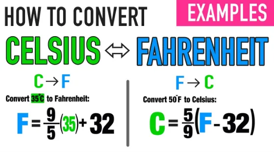

Hello folks,

This is youssef Hussien and this is my first blog post ever :) I hope that I can perfectly convey my message to you.

This blog post is about a simple application I created in Python. It’s called “FehrenheitToCelisiusConverter”. As the name suggests, this application is mainly used to convert from a given Fahrenheit degree to a Celsius degree. But at first, what are Fahrenheit and Cliesius measurements, and why conversion between them is important.

Celsius is a scale, that revolves around the freezing and boiling points of water. It's nice and even: 0°C is freezing and 100°C is boiling. "It just makes sense!". There's an old, bad joke about the two scales: with Fahrenheit, you're really cold at 0°F and really hot at 100°F; with Celsius, you're cold at 0°C and dead at 100°C. Fahrenheit gives you almost double—1.8x—the precision\* of Celsius without having to delve into decimals, allowing you to better relate to the air temperature. Again, we're sensitive to small shifts in temperature, so Fahrenheit allows us to discern between two readings more easily than Celsius could.

One Celsius degree is equal to the (Fahrenheit degree -32)x 5/9.

Thus it is important to be able to convert between the two scales easily and smoothly. This app does so.

1. For this application the user is requested to enter a Fahrenheit degree:
2. The user is prompted with his inputs:
3. And the result is the equivalent Celsius degree:

***References:***

[*http://thevane.gawker.com/fahrenheit-is-a-better-temperature-scale-than-celsius-1691707793*](http://thevane.gawker.com/fahrenheit-is-a-better-temperature-scale-than-celsius-1691707793)

*https://www.youtube.com/watch?v=QFTDofic0Ek*
