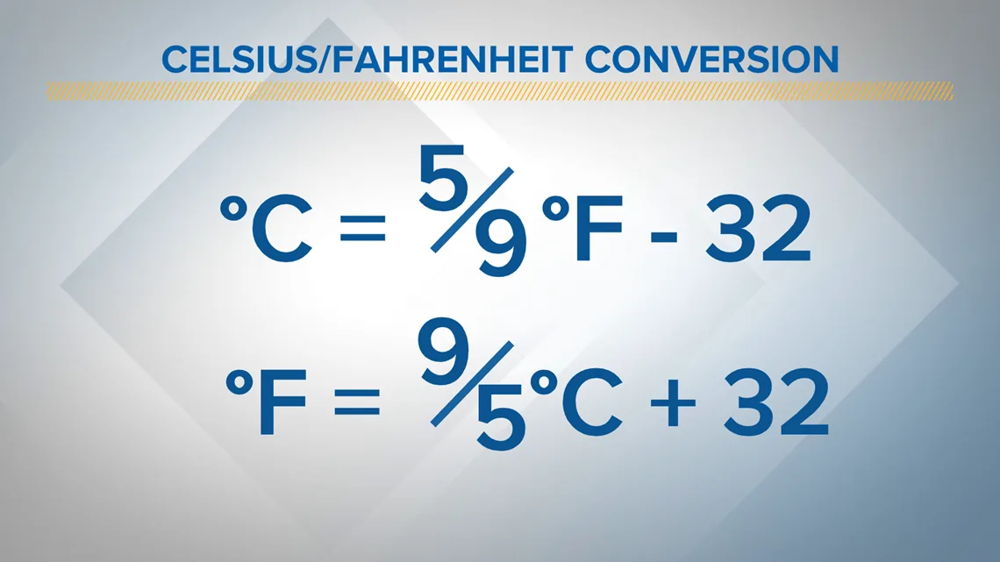

Generally to measure the temperature we make use of one of these two popular units. **Fahrenheit** & **Celsius**.

Converting one into another is usually boring and can be easily automated. Today we will be building a simple & short project which will convert Fahrenheit to Celsius for us in seconds.

So the first thing we are going to do is to ask the user for the temperature in **Fahrenheit** to convert it into the **Celsius**.

```python
temp = float(input("Enter a temperature in Fahrenheit: "))
```

We will convert the temperature into float using **float()** so that we can perform calculations on it.

Now finally let's perform calculation and convert the temperature into Celsius.

```python
celsius = (temp - 32) * 5/9
```

This expression you see above is the general formula to convert Fahrenheit into Celsius.

Now finally let's print our temperature in Celsius:

```python
print("Temperature {} in Fahrenheit is equal to {} in Celsius".format(temp, celsius))
```

Here we go we are done!
