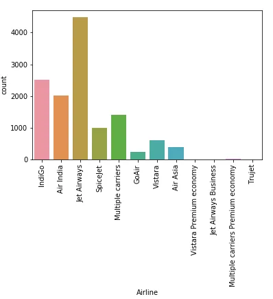
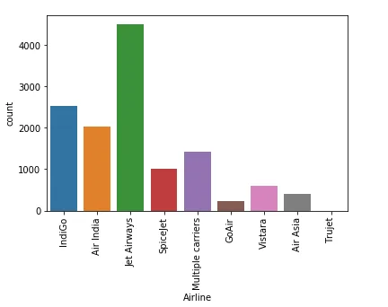
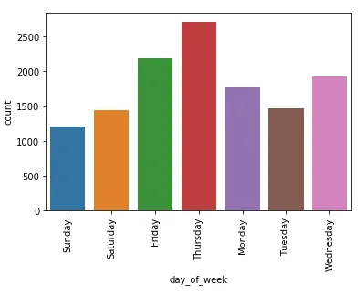
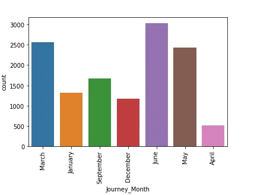

Machine learning fits mathematical notations to the data in order to derive some insights. The models take features as input. A feature is generally a numeric representation of an aspect of real-world phenomena or data. Just the way there are dead ends in a maze, the path of data is filled with noise and missing pieces. Our job as Data scientists is to find a clear path to the end goal of insights.

Mathematical formulas work on numerical quantities, and raw data isn't exactly numerical. Feature Engineering is the way of extracting features from data and transforming them into formats that are suitable for Machine Learning algorithms.

It is divided into 3 broad categories:-

**Feature Selection**: All features aren't equal. It is all about selecting a small subset of features from a large pool of features. We select those attributes which best explain the relationship of an independent variable with the target variable. There are certain features which are more important than other features to the accuracy of the model. It is different from dimensionality reduction because the dimensionality reduction method does so by combining existing attributes, whereas the feature selection method includes or excludes those features.
The methods of Feature Selection are the Chi-squared test, correlation coefficient scores, LASSO, Ridge regression etc.

**Feature Transformation**: It means transforming our original features to the functions of original features. Scaling, discretization, binning and filling missing data values are the most common forms of data transformation. To [reduce right skewness of the data](https://codeburst.io/2-important-statistics-terms-you-need-to-know-in-data-science-skewness-and-kurtosis-388fef94eeaa), we use log.

**Feature Extraction**: When the data to be processed through an algorithm is too large, it’s generally considered redundant. Analysis with a large number of variables uses a lot of computation power and memory, therefore we should reduce the dimensionality of these types of variables. It is a term for constructing combinations of the variables. For tabular data, we use PCA to reduce features. For images, we can use line or edge detection.

We start with this [data-set from MachineHack](https://www.machinehack.com/course/predict-the-flight-ticket-price-hackathon/).
We will first import all the packages necessary for Feature Engineering.

```python
import pandas as pd
import numpy as np
import matplotlib.pyplot as plt
import datetime
```

We will load the data using pandas and also set the display to the maximum so that all columns with details are shown:

```python
pd.set_option('display.max_columns', None)data_train = pd.read_excel('Data_Train.xlsx')data_test = pd.read_excel('Data_Test.xlsx')
```

Before we start pre-processing the data, we would like to store the target variable or label it separately. We will combine our training and testing data sets, after removing the label from the training dataset. The reason why we are combining train and test data sets is that Machine Learning models aren’t great at extrapolation, ie, ML models aren’t good at inferring something that has not been explicitly stated from existing information. So, if the data in the test set hasn’t been well represented, like in the training set, the predictions won’t be reliable.

```python
price_train = data_train.Price
# Concatenate training and test sets
data = pd.concat([data_train.drop(['Price'], axis=1), data_test])
```

This is the output we get after data.columns

```python
Index(['Airline', 'Date_of_Journey', 'Source', 'Destination', 'Route','Dep_Time', 'Arrival_Time', 'Duration', 'Total_Stops',
'Additional_Info', 'Price'], dtype='object')
```

To check the first five rows of the data, type data.head().

To see the broader picture we use data.info() method.

```python
<class 'pandas.core.frame.DataFrame'>
Int64Index: 13354 entries, 0 to 2670
Data columns (total 10 columns):
Airline            13354 non-null object
Date_of_Journey    13354 non-null object
Source             13354 non-null object
Destination        13354 non-null object
Route              13353 non-null object
Dep_Time           13354 non-null object
Arrival_Time       13354 non-null object
Duration           13354 non-null object
Total_Stops        13353 non-null object
Additional_Info    13354 non-null object
dtypes: int64(1), object(10)
memory usage: 918.1+ KB
```

To understand the distribution of our data, use data.describe(include=all)

We would like to analyse the data and remove all the duplicate values.

```python
data = data.drop_duplicates()
```

We’d want to check for any null values in our data, therefore, data.isnull.sum().

```python
Airline            0
Date_of_Journey    0
Source             0
Destination        0
Route              1
Dep_Time           0
Arrival_Time       0
Duration           0
Total_Stops        1
Additional_Info    0
Price              0
dtype: int64
```

Therefore, we use the following code to remove the null value.

```python
data = data.drop(data.loc[data['Route'].isnull()].index)
```

**Airlines**

Let’s check the Airline column. We notice that it contains categorical values. After using data['Airline'].unique() , we notice that the values of the airline are repeated in a way.

We first want to visualize the column:

```python
sns.countplot(x='Airline', data=data)
plt.xticks(rotation=90)
```



This visualization helps us understand that there are certain airlines which have been divided into two parts. For example, Jet Airways had another part called Jet Airways Business. We would like to combine these two categories.

```python
data['Airline'] = np.where(data['Airline']=='Vistara Premium economy', 'Vistara', data['Airline'])

data['Airline'] = np.where(data['Airline']=='Jet Airways Business', 'Jet Airways', data['Airline'])

data['Airline'] = np.where(data['Airline']=='Multiple carriers Premium economy', 'Multiple carriers', data['Airline'])
```



**Flight’s Destination**

The same goes with Destination. We find that Delhi and New Delhi have been made into two different categories. Therefore, we’ll combine them into one.

```python
data['Destination'].unique()
data['Destination'] = np.where(data['Destination']=='Delhi','New Delhi', data['Destination'])
```

**Date of Journey**

We check this column, data['Date_of_Journey'] and find that the column is in this format:-

```python
24/03/2019
1/05/2019
```

This is just raw data. Our model cannot understand it, as it fails to give numerical value. To extract useful features from this column, we would like to convert them into weekdays and months.

```python
data['Date_of_Journey'] = pd.to_datetime(data['Date_of_Journey'])

OUTPUT
2019-03-24
2019-01-05
```

And then to get weekdays from it

```python
data['day_of_week'] = data['Date_of_Journey'].dt.day_name()

OUTPUT
Sunday
Saturday
```



And from Date_of_Journey, we will also get the month.

```python
data['Journey_Month'] = pd.to_datetime(data.Date_of_Journey, format='%d/%m/%Y').dt.month_name()

OUTPUT
March
January
```


