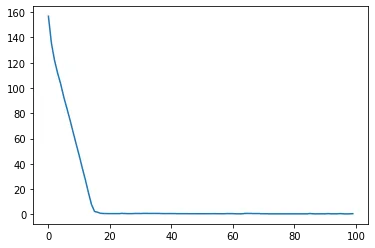
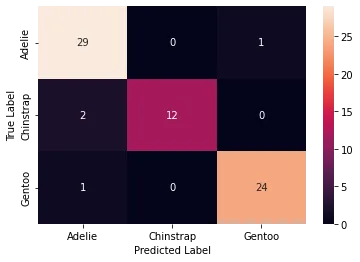

## Feature Engineering for NLP in Python


One of the most critical processes in machine learning is feature engineering. Machine learning algorithms work because of the process of applying domain knowledge of the data to produce features. Consider the machine learning algorithm as a learning child: the more accurate the information you offer, the better they will be able to interpret it. Putting our data first will yield greater results than concentrating just on models. Feature engineering aids in the creation of better data, allowing the model to comprehend it and produce reasonable outcomes.

Natural language processing (NLP) is a branch of artificial intelligence that studies how humans interact with technology through natural language. To comprehend a natural language, you must first comprehend how we construct sentences, how we communicate our thoughts using various words, signs, and special characters, and, most importantly, we must comprehend the context of the sentence in order to determine its meaning.

If we can use these contexts as features in our model and feed them to it, the model will be able to better grasp the phrase. The number of words, number of capital words, number of punctuation, number of unique words, number of stopwords, average sentence length, and so on are some of the common aspects that we may extract from a sentence. We can specify these characteristics based on the data set we're working with. We'll utilize a Twitter data set in this blog to add some more characteristics like the number of hashtags, mentions, and so on. In the next sections, we'll go through each one in depth.

Extracting Features from Text

We'll go through some of the most prevalent feature extraction approaches and methodologies in this section. We'll also discuss when to employ them and some of the problems we could experience while putting them into practice. There are three types of feature extraction methods: basic, statistical, and advanced/vectorized. Let's have a discussion about it.

Basic Methods

These feature extraction techniques are based on NLP and linguistic principles. These are among of the oldest strategies, yet they are still quite effective and are utilized in a variety of settings. Let's take a look at a couple of them.

Parsing

Now, this parsing is a little different from what we discussed in the last chapter where we parsed different types of documents into text. In this context, parsing is a process of breaking a sentence (or some text) into smaller chunks that helps us understand the syntactic structure and syntactic meaning of the sentence. In NLP, rules of context-free grammar (CFG) or probabilistic context-free grammar (PCFG) are used to analyze sentences. Building a parser from scratch is a very complex task in itself. We would pick a grammar like CFG or PCFG, then decide upon which type of parser we want to build. Based on that, we would implement certain algorithms to build our very own parser. We certainly don’t have to do it every time and can use pre-built tools. Now, let’s see how you can break down a sentence into its syntactic components using spaCy.

```python
import spacy
from spacy import displacy
nlp = spacy.load("en_core_web_sm")
text = ("Mark is a good student but he failed")
doc = nlp(text)
for token in doc:
    print(token.orth_, token.dep_, token.head.orth_,     [t.orth_ for t in token.lefts], [t.orth_ for t in token.rights])
displacy.render(doc, style="dep", jupyter=True)
```

Grammatical features such as noun phrases, PoS tags for words in those phrases, root words from sentences, and so on can be extracted. In practice, we rarely build a parser from the ground up. Furthermore, we only employ parsing to extract grammatical aspects when dealing with problems that necessitate them, such as grammar correction systems.

PoS Tagging

The technique of tagging each word in a corpus with its matching part of speech is known as Parts of Speech (PoS) tagging. A tagger, sometimes known as a PoS tagger, is a tool that applies the appropriate PoS tag to a word. Tagging is difficult since the part of speech can change depending on the overall meaning of the statement. Although it is feasible to create your own PoS tagger using an annotated corpus, manually picked features, and a machine learning algorithm, we will most likely have to rely on a tagger that is currently available. To extract PoS tags, we can utilize the polyglot library as follows.

```python
import nltk
from nltk.tokenize import word_tokenize

text = word_tokenize("Shakespeare was born and raised in Stratford-upon-Avon, Warwickshire. At the age of 18, he married Anne Hathaway, with whom he had three children: Susanna and twins Hamnet and Judith.")nltk.pos_tag(text)
```

PoS tags can be really useful in a bunch of different applications like chatbots, information extraction systems, information retrieval etc.

Name Entity Recognition (NER)

It is a technique of extracting named entities, i.e. noun phrases that represent real-world objects such as people, places, and organizations, from a text, as the name suggests. In the line "Barack Obama is from Hawaii," for example, Barack Obama is a person while Hawaii is a separate thing (location). To extract entities, we can use spaCy's NER tool as follows.

```python
import spacy
from spacy import displacy
doc = nlp('Shakespeare was born and raised in Stratford-upon-Avon, Warwickshire. At the age of 18, he married Anne Hathaway, with whom he had three children: Susanna and twins Hamnet and Judith.')
displacy.render(doc, jupyter=True, style='ent')
```

Shakespeare **PERSON** was born and raised in Stratford **ORG** -upon-Avon, Warwickshire. At the age of 18 **DATE** , he married Anne Hathaway **PERSON** , with whom he had three **CARDINAL** children: Susanna **ORG** and twins Hamnet **ORG** and Judith **ORG** .

In situations where we may need to search for information in a huge corpus, NER features are extremely beneficial. Information extraction, retrieval, search, and recommendation systems can all benefit from it.

Bag of Words (BoW)

Unlike the methodologies previously addressed, BoW simplifies the representation of the language by removing complications such as grammar and syntactic structure. BoW simply depicts text in the form of a bag/set of words, where the text can take the shape of documents, sentences, and so on. Consider the following illustration.

Sentence 1: Matt is a fan of football.
Sentence 2: He also likes to cook occasionally.
Sentence 3: He is a nice guy.
Based on these sentences, we can create a BoW list as follows.
BoW_List = [“Matt”, “is”, “a”, “fan”, “of”, “football”, “He”, “also”, “likes”, “to”, “cook”, “occasionally”, “nice”, “guy”]
Using this BoW, we can calculate and represent each document based on its term frequency.
Sentence 1: [1, 1, 1, 1, 1, 1, 0, 0, 0, 0, 0, 0, 0, 0]
Sentence 2: [0, 0, 0, 0, 0, 0, 1, 1, 1, 1, 1, 1, 0, 0]
Sentence 3: [0, 1, 1, 0, 0, 0, 0, 0, 0, 0, 0, 0, 1, 1]
These features can be fed to machine learning algorithms. We can calculate BoW using the scikit-learn library as follows.

```python
from sklearn.feature_extraction.text import CountVectorizer
import pandas as pd

doc1 = "Matt is a fan of football"
doc2 = "He also likes to cook occasionally"
doc3 = "He is a nice guy"

bow_vectorizer = CountVectorizer()

X = bow_vectorizer.fit_transform([doc1,doc2,doc3])

bow_df = pd.DataFrame(X.toarray(),columns=bow_vectorizer.get_feature_names_out())
bow_df.head()
```

BoWs can be used in a wide variety of NLP tasks like document classification, neural feature generation, sentiment analysis etc.

Statistical Methods

Term Frequency-Inverse Document Frequency (TF-IDF)

Advanced Methods

Word2Vec

**Introduction to TensorFlow in Python**


TensorFlow is an open-source machine learning package that may be used for a variety of purposes. It's a symbolic math library that can also be used to create and train neural networks to recognize and analyze patterns and correlations, similar to how humans learn and reason. It is frequently used at Google for both research and production, replacing its closed-source predecessor, DistBelief. The Google Brain team created TensorFlow for internal Google use. On November 9, 2015, it was released under the Apache 2.0 open source license.
TensorFlow provides a Python API as well as C++, Haskell, Java, Go and Rust APIs.

A multidimensional array of numbers can be used to represent a tensor. The rank and shape of a tensor are the number of dimensions and the size of each dimension, respectively.

```python
# a rank 0 tensor, i.e. a scalar with shape ():
42
# a rank 1 tensor, i.e. a vector with shape (3,):
[1, 2, 3]

# a rank 2 tensor, i.e. a matrix with shape (2, 3):
[[1, 2, 3], [3, 2, 1]]
# a rank 3 tensor with shape (2, 2, 2) :
[ [[3, 4], [1, 2]], [[3, 5], [8, 9]]]
```

All data of TensorFlow is represented as tensors. It is the sole data structure:
tf.float32, tf.float64, tf.int8, tf.int16, …, tf.int64, tf.uint8, ...

TensorFlow programs consist of two discrete sections:

1. A graph is created in the construction phase.
2. The computational graph is run in the execution phase, which is a session.

```python
import tensorflow as tf
tf.compat.v1.disable_eager_execution()

# Computational Graph:

c1 = tf.constant(0.034)
c2 = tf.constant(1000.0)
x = tf.multiply(c1, c1)
y = tf.multiply(c1, c2)
final_node = tf.add(x, y)

# Running the session:

with tf.compat.v1.Session() as sess:
    result = sess.run(final_node)
    print(result, type(result))
```

```python
import tensorflow as tf
tf.compat.v1.disable_eager_execution()

# Computational Graph:

c1 = tf.constant(0.034, dtype=tf.float64)
c2 = tf.constant(1000.0, dtype=tf.float64)
x = tf.multiply(c1, c1)
y = tf.multiply(c1, c2)
final_node = tf.add(x, y)

# Running the session:

with tf.compat.v1.Session() as sess:
    result = sess.run(final_node)
    print(result, type(result))
```

```python
import tensorflow as tf
tf.compat.v1.disable_eager_execution()

# Computational Graph:

c1 = tf.constant([3.4, 9.1, -1.2, 9], dtype=tf.float64)
c2 = tf.constant([3.4, 9.1, -1.2, 9], dtype=tf.float64)
x = tf.multiply(c1, c1)
y = tf.multiply(c1, c2)
final_node = tf.add(x, y)

# Running the session:

with tf.compat.v1.Session() as sess:
    result = sess.run(final_node)
    print(result, type(result))
```

A computational graph is a graph of nodes formed by a succession of TensorFlow operations. Let's start by constructing a simple computational graph. Each node receives zero or more tensors as input and outputs a tensor. Constant nodes do not accept any input.

The nodes do not provide a numerical value when printed. We've defined a computational graph, but there's been no numerical assessment!

```python
c1 = tf.constant([3.4, 9.1, -1.2, 9], dtype=tf.float64)c2 = tf.constant([3.4, 9.1, -1.2, 9], dtype=tf.float64)x = tf.multiply(c1, c1)y = tf.multiply(c1, c2)final_node = tf.add(x, y)print(c1)print(x)print(final_node)
```

We must run the computational graph during a session to evaluate the nodes. The control and state of the TensorFlow runtime are encapsulated in a session. The code below creates a Session object, then calls its run function to run enough of the computational network to evaluate nodes 1 and 2. By executing the computational graph in a single session, as shown below. We'll need to make a session object:

```python
session = tf.compat.v1.Session()
```

Now, we can evaluate the computational graph by starting the run method of the session object:

```python
result = session.run(final_node)
print(result)
print(type(result))
```

Of course, we will have to close the session, when we are finished:

```python
session.close()
```

Working with the with statement, as we did in the introduction examples, is usually a better option!

Similarity to NumPy

We will rewrite the following program with Numpy.

```python
import tensorflow as tf
tf.compat.v1.disable_eager_execution()

session = tf.compat.v1.Session()
x = tf.range(12)
print(session.run(x))
x2 = tf.compat.v1.reshape(tensor=x, shape=(3, 4))
x2 = tf.compat.v1.reduce_sum(x2, reduction_indices=[0])
res = session.run(x2)
print(res)

x3 = tf.eye(5, 5)
res = session.run(x3)
print(res)
```

```python
Now a similar Numpy version:
import numpy as np

x = np.arange(12)
print(x)
x2 = x.reshape((3, 4))
res = x2.sum(axis=0)
print(res)

x3 = np.eye(5, 5)
print(x3)
```

**Introduction to Deep Learning in Python**


Deep Learning (DL) is simply one of the many machine learning techniques available. Machine learning (ML) refers to approaches that allow a computer to "learn" patterns in data by being exposed to a large number of examples. Machine learning is frequently referred to as a type of artificial intelligence (AI). Artificial intelligence is defined in a variety of ways, but it mainly entails having computers mimic the behavior of intelligent biological systems. Many works of science fiction have explored the concept of an artificial intelligence that meets (or exceeds) human intelligence in all domains since the 1950s. Despite recent developments in AI and machine learning research, we can only approach human-like intelligence in a few niche areas and are still a long way from a general-purpose AI. Artificial intelligence, Machine Learning, and Deep Learning are depicted in the diagram below.

Neural Networks

A neural network is a type of artificial intelligence technology that is based on how neurons in the brain function. A neural network is made up of neurons, which are interconnected computational units. Each neuron :

- has one or more inputs, e.g. input data expressed as floating point numbers
- most of the time, each neuron conducts 3 main operations:

  - take the weighted sum of the inputs
  - add an extra constant weight (i.e. a bias term) to this weighted sum
  - apply a non-linear function to the output so far (using a predefined activation function)

- return one output value, again a floating point number

By linking the output of one neuron to the input of another, several neurons can be linked together. These connections have weights that indicate the connection's'strength,' and the weights are modified during training. A computational graph is described in this fashion by the combination of neurons and connections, as seen in the image below. The neurons in most neural networks are grouped into layers. Signals may pass via one or more intermediary layers known as hidden layers on their way from the input layer to the output layer. The graphic below depicts a three-layer neural network, with each circle representing a neuron, each line representing an edge, and the arrows indicating the direction in which data moves.

Neural networks aren't a new concept; they've existed since the late 1940s. However, until roughly 2010, neural networks tended to be rather tiny, with only a few tens or even hundreds of neurons. As a result, they were only able to solve very basic tasks. Around 2010, advances in computing power and training techniques enabled considerably larger and more powerful networks to be built. Deep neural networks, often known as Deep Learning, are a type of deep neural network.

Deep Learning necessitates a lot of practice with example data to teach the network what output it should create for a given input. Classifying photographs is a frequent Deep Learning application. The network will be taught here by being "shown" a sequence of images and being told what they contain. After the network has been trained, it should be able to classify the contents of another image properly. However, we are not limited to using photos; a Deep Learning neural network may learn any type of input. This allows children to appear to learn a set of complex rules simply by being shown the rules' inputs and outputs rather than being taught the rules themselves. Deep Learning networks have been taught to play video games and even drive cars using these methods. The data on which networks are trained must normally be rather large, containing thousands of examples. As a result, they aren't appropriate for all applications and should be viewed as one of many machine learning techniques accessible.

Deep networks often include tens or even hundreds of layers, whereas traditional "shallow" networks could have three to five levels. As a result, they have millions of different weights. The graphic below displays a diagram of all the layers on a Deep Learning network built to recognize pedestrians in photographs (there are too many neurons to illustrate them all). The network's input (leftmost) layer is an image, and the network's final (rightmost) layer outputs a zero or one to assess whether the input data belongs to the data class we're interested in.

What sort of problems can Deep Learning solve?

- Pattern/object recognition
- Segmenting images (or any data)
- Translating between one set of data and another, for example natural language translation.
- Generating new data that looks similar to the training data, often used to create synthetic datasets, art or even “deepfake” videos.

  - This can also be used to give the illusion of enhancing data, for example making images look sharper, video look smoother or adding colour to black and white images. But beware of this, it is not an accurate recreation of the original data, but a recreation based on something statistically similar, effectively a digital imagination of what that data could look like.

What sort of problems can’t Deep Learning solve?

- Any case where only a small amount of training data is available.
- Tasks requiring an explanation of how the answer was arrived at.
- Classifying things which are nothing like their training data.

Deep Learning Libraries

- TensorFlow
- PyTorch
- Keras

Classification by a Neural Network using Keras

1. Formulate/outline the problem: penguin classification

In this episode we will be using the penguin dataset, this is a dataset that was published in 2020 by Allison Horst and contains data on three different species of the penguins.
We will use the penguin dataset to train a neural network which can classify which species a penguin belongs to, based on their physical characteristics.

The palmerpenguins data contains size measurements for three penguin species observed on three islands in the Palmer Archipelago, Antarctica. The physical attributes measured are flipper length, beak length, beak width, body mass, and sex.

2. Identify inputs and outputs

We must familiarize ourselves with the dataset in order to determine the inputs and outputs that will be used to create the neural network. This process is often referred to as data exploration.
We'll begin by importing the Seaborn library, which will assist us in obtaining and visualizing the dataset. Seaborn is a robust library with a wide range of visualizations. Remember that the data must be in a pandas dataframe; fortunately, the datasets in seaborn are already in a pandas dataframe.

We can load the penguin dataset using

```python
import seaborn as sns
penguins = sns.load_dataset('penguins')
```

Visualization

Because looking at figures like this usually doesn't give us a strong sense of the data we're dealing with, let's make a visualization.

Pair Plot

The Pair Plot is a useful visualization for datasets with few properties. This can be done with the help of sns.pairplot (...). Each attribute is plotted against each other in a scatterplot. The graphs on the diagonal are layered kernel density estimate plots for the different values of the species column when the hue='species' setting for the pairplot is used.

Input and Output Selection

Now that we've become comfortable with the dataset, we can choose which data variables to feed into the neural network and which target we want to forecast. In the rest of this episode we will use the bill_length_mm, bill_depth_mm, flipper_length_mm, body_mass_g attributes. The target for the classification task will be the species.

3. Prepare data

The input data and target data aren't in a format that can be used to train a neural network just yet.

Change types if needed

The species column is our category objective, but pandas treats it as the generic type Object. We can use pandas to transform this to a categorical type:

```python
penguins['species'] = penguins['species'].astype('category')
```

Clean missing values

You may have noticed that some rows in the dataset had missing (NaN) values during the exploration phase; keeping such values in the input data would cause the training to fail, therefore we must deal with them. There are a variety of approaches to dealing with missing values, but for now, we'll just drop the offending rows by calling dropna():

```python
# Drop two columns and the rows that have NaN values in them
penguins_filtered = penguins.drop(columns=['island', 'sex']).dropna()

# Extract columns corresponding to features
penguins_features = penguins_filtered.drop(columns=['species'])
```

Prepare target data for training

Second, the target data is in an unusable format for training purposes. A neural network can only accept numerical inputs and outputs, and it learns by calculating how "far away" the neural network's predicted species is from the genuine species. It's impossible to quantify this "distance" or error when the goal is a string category column, as we have here. As a result, we'll change the format of this column to something more appropriate. There are a variety of ways to accomplish this, but we'll use one-hot encoding. This encoding creates as many columns as there are unique values, assigning a 1 to the column with the proper class and 0s to the remaining columns. For instance, for a penguin of the Adelie species the one-hot encoding would be 1 0 0

Fortunately pandas is able to generate this encoding for us.

```python
import pandas as pd

target = pd.get_dummies(penguins_filtered['species'])
target.head() # print out the top 5 to see what it looks like.
```

Split data into training and test set

Finally, we'll divide the data into two sets: a training and a test set. The training set will be used to train the neural network, while the test set will be kept separate. The test set will be used to evaluate the trained neural network's performance on unseen data. A validation set is frequently kept apart from the training and test sets (i.e. the dataset is split into 3 parts). The values of the neural network's parameters and training procedures are then chosen from this validation set. However, for this episode, we'll just do a training and test set.

To split the cleaned dataset into a training and test set we will use a very convenient function from sklearn called train_test_split. This function takes a number of parameters:

- The first two are the dataset and the corresponding targets.
- Next is the named parameter test_size this is the fraction of the dataset that is used for testing, in this case 0.2 means 20% of the data will be used for testing.
- random_state controls the shuffling of the dataset, setting this value will reproduce the same results (assuming you give the same integer) every time it is called.
- shuffle which can be either True or False, it controls whether the order of the rows of the dataset is shuffled before splitting. It defaults to True.
- stratify is a more advanced parameter that controls how the split is done. By setting it to target the train and test sets the function will return will have roughly the same proportions (with regards to the number of penguins of a certain species) as the dataset.

```python
from sklearn.model_selection import train_test_split

X_train, X_test, y_train, y_test = train_test_split(penguins_features, target,test_size=0.2, random_state=0, shuffle=True, stratify=target)
```

4. Build an architecture from scratch or choose a pretrained model

Keras for neural networks

Keras will be used to define and train our neural network models in this lecture. Keras is a machine learning framework with one of its key benefits being ease of use. It's part of the tensorflow python package, and you can get it with tensorflow import keras.
Keras has functions, classes, and definitions that can be used to create deep learning models, cost functions, and optimizers (optimizers are used to train a model).
We need to make sure Keras is imported before moving on to the next step of the procedure. This is how we go about it:

```python
from tensorflow import keras
```

It is beneficial to this class if everyone achieves the same results from their training. At several moments during its execution, Keras employs a random number generator. As a result, we'll need two random seeds, one for numpy and the other for tensorflow:

```python
from numpy.random import seed
seed(1)
from tensorflow.random import set_seed
set_seed(2)
```

Build a neural network from scratch

Now we'll create a neural network from scratch, which, while it may appear difficult at first, is actually rather simple with Keras.
Keras allows you to build a neural network by layering and connecting them. For the time being, we'll just employ one type of layer: a completely connected or dense layer. The keras.layers module defines this in Keras. Quite a crowded class.
The number of neurons in a dense layer is a parameter you can specify when you create the layer. Every neuron in the dense layer receives an edge when the layer is connected to its input and output layers.(i.e. connection) to all of the input neurons and all of the output neurons. The hidden layer in the image in the introduction of this episode is a Dense layer.

Keras treats the input differently as well; it automatically calculates the number of inputs and outputs a layer requires, as well as how many edges must be constructed. This means we must inform Keras of the size of our contribution. This is accomplished by creating a keras. Tell the input class how big our input is.

```python
inputs = keras.Input(shape=X_train.shape[1])
```

We store a reference to this input class in a variable so we can pass it to the creation of our hidden layer. Creating the hidden layer can then be done as follows:

```python
hidden_layer = keras.layers.Dense(10, activation="relu")(inputs)
```

Now we'll make a new layer to serve as our output layer. The call is pretty similar to the last one because we utilize a Dense layer again.

```python
output_layer = keras.layers.Dense(3, activation="softmax")(hidden_layer)
```

We employ three neurons for the output layer because we chose one-hot encoding.
The softmax activation ensures that the three output neurons give values between 0 and 1, and that they add to 1. This can be interpreted as a 'probability' that the sample is from a specific species.
Now that the layers of our neural network have been defined, we can merge them into a Keras model to make training easier.

```python
model = keras.Model(inputs=inputs, outputs=output_layer)model.summary()
```

The model summary here can show you some information about the neural network we have defined.

Choose a pretrained model

You can typically use a pretrained network if your data and problem are extremely similar to what others have done. You can utilize a pretrained network and finetune it for your problem even if your problem is unique but the data type is common (for example, photos). The Model Zoo, pytorch hub, and tensorflow hub all include a huge amount of publically available pretrained networks.

5. Choose a loss function and optimizer

We have now designed a neural network that in theory we should be able to train to classify Penguins. However, we first need to select an appropriate loss function that we will use during training. This loss function tells the training algorithm how wrong, or how ‘far away’ from the true value the predicted value is.
For the one-hot encoding that we selected before a fitting loss function is the Categorical Crossentropy loss. In Keras this is implemented in the keras.losses.CategoricalCrossentropy class. This loss function works well in combination with the softmax activation function we chose earlier. The Categorical Crossentropy works by comparing the probabilities that the neural network predicts with ‘true’ probabilities that we generated using the one-hot encoding. This is a measure for how close the distribution of the three neural network outputs corresponds to the distribution of the three values in the one-hot encoding. It is lower if the distributions are more similar.

Next we need to choose which optimizer to use and, if this optimizer has parameters, what values to use for those. Furthermore, we need to specify how many times to show the training samples to the optimizer.
Once more, Keras gives us plenty of choices all of which have their own pros and cons, but for now let us go with the widely used Adam optimizer. Adam has a number of parameters, but the default values work well for most problems. So we will use it with its default parameters.
Combining this with the loss function we decided on earlier we can now compile the model using model.compile. Compiling the model prepares it to start the training.

```python
model.compile(optimizer='adam', loss=keras.losses.CategoricalCrossentropy())
```

6. Train model

The model is now ready to be trained.
The fit method is used to train the model; it accepts the input data and target data as inputs and contains numerous extra parameters for different training possibilities. We just change the number of epochs here. Every sample in the training data has been shown to the neural network and used to update its parameters in one training period.

```python
history = model.fit(X_train, y_train, epochs=100)
```

Fit provides a history object with a history attribute that contains the training loss and perhaps other metrics every training period. Plotting the training loss to show how the training proceeds can be highly instructive. We can achieve this with seaborn as follows:

```python
sns.lineplot(x=history.epoch, y=history.history['loss'])
```



This plot can be used to identify whether the training is well configured or whether there are problems that need to be addressed.

7. Perform a prediction/classification

Now that we have a trained neural network, we can utilize the predict function to anticipate new penguin samples.
Using the predict function, we will use the neural network to predict the species of the test set. In the next stage, we'll use this prediction to assess the performance of our trained network. This will return a numpy matrix, which we will transform to a pandas dataframe so that the labels can be easily seen.

```python
y_pred = model.predict(X_test)
prediction = pd.DataFrame(y_pred, columns=target.columns)
prediction
```

Remember that the output of the network uses the softmax activation function and has three outputs, one for each species. This dataframe shows this nicely.

We now need to transform this output to one penguin species per sample. We can do this by looking for the index of highest valued output and converting that to the corresponding species. Pandas dataframes have the idxmax function, which will do exactly that.

```python
predicted_species = prediction.idxmax(axis="columns")
predicted_species
```

8. Measuring performance

It's critical to evaluate how well a trained neural network operates now that it's been trained. We want to know how well it will perform in a realistic prediction scenario, and we'll need to measure performance again while changing the hyperparameters.
During the data preparation stage, we built a test set, which we will now utilize to create a confusion matrix.

Confusion matrix

With the predicted species we can now create a confusion matrix and display it using seaborn. To create a confusion matrix we will use another convenient function from sklearn called confusion_matrix. This function takes as a first parameter the true labels of the test set. We can get these by using the idxmax method on the y_test dataframe. The second parameter is the predicted labels which we did above.

```python
from sklearn.metrics import confusion_matrix

true_species = y_test.idxmax(axis="columns")

matrix = confusion_matrix(true_species, predicted_species)
print(matrix)
```

Unfortunately, this matrix is kinda hard to read. Its not clear which column and which row corresponds to which species. So let’s convert it to a pandas dataframe with its index and columns set to the species as follows:

```python
# Convert to a pandas dataframe
confusion_df = pd.DataFrame(matrix, index=y_test.columns.values, columns=y_test.columns.values)

# Set the names of the x and y axis, this helps with the readability of the heatmap.
confusion_df.index.name = 'True Label'
confusion_df.columns.name = 'Predicted Label'
```

We can then use the heatmap function from seaborn to create a nice visualization of the confusion matrix. The annot=True parameter here will put the numbers from the confusion matrix in the heatmap.

```python
sns.heatmap(confusion_df, annot=True)
```



9. Tune hyperparameters

As previously mentioned, there are numerous hyper parameter options while designing and training a neural network. Later episodes will delve deeper into these hyperparameters. For the time being, it's crucial to remember that the parameters we chose were somewhat arbitrary, and hyperparameter values should be chosen with greater care.

10. Share model

It's really convenient to be able to reuse a trained neural network without having to retrain it. This can be accomplished by utilizing the model's save method. It accepts a string as a parameter, which is the path of the model's directory.

```python
model.save('my_first_model')
```
