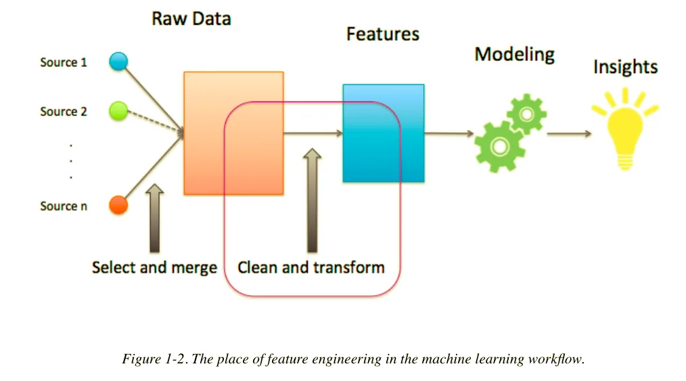
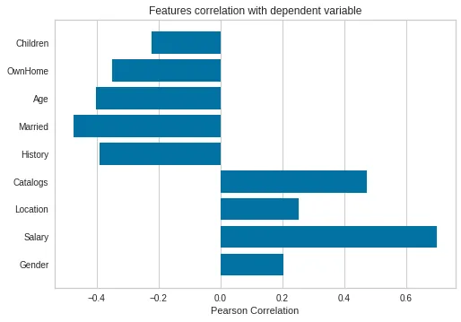

What happens when you have so many variables and wonder which ones to pick to build your machine learning model. How do you choose the features that will best work with your model and give you the results you need to see? That is what feature engineering is all about, I guess its also because of the name I find it fascinating, more like scientific terminology but this concept will help any data scientist maneuver through machine learning.

They are three things or ways to do basic feature engineering

Filter methods

Uses statistical techniques and selects features based on their distributions and the computation is very fast

Embedded methods

Features are embedded within training models and only specific types of models perform this selection. e.g. regression models. It selects feature importance given by that model.

Wrapper methods

Features are chosen by building different models and may be added or dropped progressively. The combination is based on a step forward, step backward approach.

### Things to look at in feature engineering

- Percent of missing values
- Amount of variation- drop variables with zero variation. Drop variables that have the same values all over the data
- Pairwise correlation- if two features are highly correlated, drop one of them. You have to keep one that has a high correlation coefficient with your target. Features that have a low correlation with your target should be dropped.

## Filter methods
We will use marketing data to illustrate every method.

```python
marketing=pd.read_csv("DirectMarketing.csv")
marketing.head()
```

The filter method and all the other methods will be derived from the scikit learn library and the feature selection.

```python
from sklearn.feature_selection import SelectKBest
from sklearn.feature_selection import f_regression
target=marketing['AmountSpent']
features=marketing[['Gender','Salary','Location','Catalogs', 'History','Married','Age','OwnHome','Children']]
```

```python
select=SelectKBest(f_regression, k=5).fit(features,target)
```

k represents the number of features you want to be selected.

```python
feature_mask=select.get_support()
feature_mask
output: array([False,  True, False,  True,  True,  True,  True, False, False])
```

Based on the features used, it gives a boolean answer to each feature. As you can see, the method gave me the five best features. Next is scoring each feature in relation to the target.

```python
select.scores_
output:array([ 42.31907952, 956.69400352,  68.02824177, 287.08541076,        179.25655432, 292.17537961, 192.4564106 , 140.05632645,         51.88635174])
```

## Wrapper method
It basically prunes the least important features at each step and we are going to use the linear regression model.

```python
from sklearn.feature_selection import RFE
from sklearn.linear_model import LinearRegression
rfe=RFE(estimator=LinearRegression(),n_features_to_select=5,step =1)
```

For every step, 1 feature is being removed.

```python
rfe.fit(features,target)
rfe_features=rfe.get_support()
rfe_features
output:array([ True, False,  True, False,  True,  True, False,  True, False])
```

## Embedded methods
```python
from sklearn.linear_model import Lasso
```

```python
lasso=Lasso(alpha=1.0)
lasso.fit(features,target)
lasso.coef_
output: array([-4.16026963e+01,  2.04634320e-02,  4.61984160e+02,  4.15600344e+01,        -1.40455444e+02,  3.37562553e+01,  1.90878380e+01, -4.38257583e+01,        -1.91262978e+02])
```

## Bonus
You can also visualize and see the correlations between the target and the features using Pearson and spearsman correlations. The library used is called FeatureCorrelation from YellowBrick.

```python
from yellowbrick.target import FeatureCorrelation
visualize=FeatureCorrelation(labels=features.columns,method='pearson')
visualize.fit(features,target)
visualize.poof() #mode of display
```



We can deduce that the Salary has the highest correlation with our target. There are also other advanced methods of feature engineering but this is a way to get started in this topic especially for beginners.
