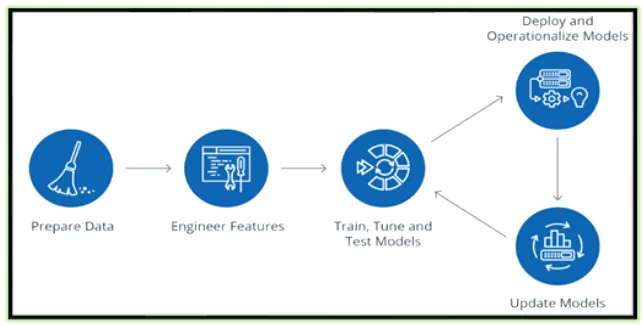
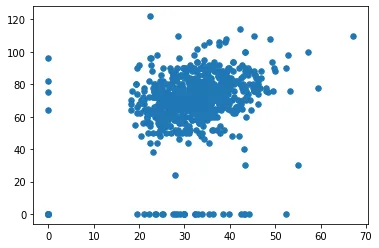

Figure (1)

#### Introduction

Hello and welcome to my new article in which we try to discuss some crucial feature engineering methods using Python language. Well feature engineering is not a new technique in fact it is the 'old that never gets old'. It' old because it's been used since we started dealing with data, and it never gets old because it encapsulates various data engineering techniques such as selecting relevant features, handling missing data, encoding the data, and normalizing it. It is one of the most important tasks and plays a role majorly in the fate of the model. In order to assure that the algorithm chosen can perform to its best, it is important to engineer the features of the input data accordingly.

Github repo: [Link](https://github.com/omarmohamed2011/Feature-Engineering-using-Python)

In most cases, Data Scientists deal with data extracted from massive open data sources such as the internet, surveys, or reviews. This data is crude and is known as **raw data**. It may contain missing values, unstructured data, incorrect inputs, and outliers. If we directly use this raw, un-processed data to train our models, we will land up with a model having a very poor efficiency. Thus data preparation phase is followed directly by a Feature Engineering phase which plays an extremely pivotal role in determining the performance of any machine learning model. The trained model can be either deployed or deployed and re-updated again even after being deployed. You can see the data pipeline in the Figure(1).

Feature Engineering can be done in a variety of ways, we will be limited to discuss feature selection and dimensionality reduction as they are crucial yet under appreciated parts of the process. We will use sklearn documentation to help us imply this with Python.

#### Feature Selection

The classes in the sklearn library .feature_selection method can be used for feature selection and / or dimensionality reduction on sample sets as well as on large scaled sets, either to improve model prediction’ accuracy scores or to assert a good performance on very high-dimensional datasets.

##### 1. Variance Features

Let's start first with Variance. In pure statistics, Variance is the squared deviation of a variable from its mean. It’s calculated by mean of square minus square of mean

Var(X)= E[ ( X- mean )^2]

To implement it with Python; firstly, let's install required libraries, import it. Secondly, use it on a sample of numbers.

```python
!pip install statistics

import statistics

sample = [2.74, 1.23, 2.63, 2.22, 3, 1.98]
print("Variance of sample set is " ,statistics.variance(sample))
>>> Variance of sample set is 0.40924000000000005
```

Another sample, let's see the output.

```python
sample2 = [1.5,1.6,1.7,1.55,1.64,1.66]
print("Variance of sample set is % s"%(statistics.variance(sample2)))
>>> Variance of sample set is 0.00545666666667
```

```python
sample3 = [.5,15,157.3,1505,264.2]
print("Variance of sample set is % s"%(statistics.variance(sample3)))
>>> Variance of sample set is 401380.595
```

##### 2. Remove low var features

Variance Threshold is a simple baseline approach to feature selection. It inquires to remove all features whose variance is below or doesn't meet some threshold. By default, it removes all zero-variance features, i.e features that have the same value in all samples. As an example, suppose that we have a dataset with boolean features, and we want to remove all features that are either one or zero (on or off) in more than 80% of the samples. We can think of finding a variance threshold; and the variance of such variables is given by:

Var(X) = p\*(1-p)
So we choose the threshold as: 0.8\*(1-0.8)

```python
from sklearn.feature_selection import VarianceThreshold
import numpy as np

X = np.array([[0, 0, 1],
[0, 1, 0], [1, 0, 0],
[0, 1, 1], [0, 1, 0],
[0, 1, 1]])

sel = VarianceThreshold(threshold=(0.8*0.2))

sel.fit(X)

X2 = sel.fit_transform(X)
print(X)
print(X2)
>>>
array([[0, 0, 1],
       [0, 1, 0],
       [1, 0, 0],
       [0, 1, 1],
       [0, 1, 0],
       [0, 1, 1]])

array([[0, 1],
       [1, 0],
       [0, 0],
       [1, 1],
       [1, 0],
       [1, 1]])
```

So the second feature here had a lower variance than threshold so it's eliminated because it lacks importance in comparison to others. Let's also try it on the iris dataset. The Iris Dataset **contains four features (length and width of sepals and petals) of 50 samples of three species of Iris (Iris setosa, Iris virginica and Iris versicolor)**. These measures were used to create a linear discriminant model to classify the species and used in lots of data science projects to explain some concepts.

```python
from sklearn.datasets import load_iris

X, y = load_iris(return_X_y=True)
X[:15]
>>>
array([
[5.1, 3.5, 1.4, 0.2],
[4.9, 3. , 1.4, 0.2],
[4.7, 3.2, 1.3, 0.2],
[4.6, 3.1, 1.5, 0.2],
[5. , 3.6, 1.4, 0.2],
[5.4, 3.9, 1.7, 0.4],
[4.6, 3.4, 1.4, 0.3],
[5. , 3.4, 1.5, 0.2],
[4.4, 2.9, 1.4, 0.2],
[4.9, 3.1, 1.5, 0.1],
[5.4, 3.7, 1.5, 0.2],
[4.8, 3.4, 1.6, 0.2],
[4.8, 3. , 1.4, 0.1],
[4.3, 3. , 1.1, 0.1],
[5.8, 4. , 1.2, 0.2]])
```

```python
y[:15]
>>>
array([0, 0, 0, 0, 0, 0, 0, 0, 0, 0, ..., 0, 0, 0])
```

Now let's see the features after being engineering and low variance features are eliminated.

```python
sel = VarianceThreshold(threshold=(0.3))

sel.fit(X)

X2 = sel.fit_transform(X)
X2[:15]
>>>
array([[5.1, 1.4, 0.2],
[4.9, 1.4, 0.2],
[4.7, 1.3, 0.2],
[4.6, 1.5, 0.2],
[5. , 1.4, 0.2],
[5.4, 1.7, 0.4],
[4.6, 1.4, 0.3],
[5. , 1.5, 0.2],
[4.4, 1.4, 0.2],
[4.9, 1.5, 0.1],
[5.4, 1.5, 0.2],
[4.8, 1.6, 0.2],
[4.8, 1.4, 0.1],
[4.3, 1.1, 0.1],
[5.8, 1.2, 0.2]])
```

##### Dimensionality Reduction

In a term of definitions, dimensionality reduction refers to techniques that reduce the number of input variables in a dataset. More input features often make a predictive modeling task harder to train, more likely that's why we need dimensionality reduction.

###### 1. Principal Component Analysis

Firstly what are principal components: Principal components are new variables that are constructed as linear combinations or mixtures of the initial variables; supposing the initial variables are x1,x2, ... ,x6:

Y1 = x1 + 3\*x4 - x5

Y2 = 5*\*x2 + 7\**x3 - 2\*x6

These combinations are done in such a way that the new variables ( principal components : X1,X2) are uncorrelated and most of the information within the initial variables is squeezed or compressed into the first components.

 -> X1 and X2 are uncorrelated.

 -> All variables x1~x6 are compressed in the new pricipal components (X1,X2).

- A covariance matrix helps the correlated variables to be grouped.

How do we calculate it: Principal components are constructed in such a manner that the first principal component accounts for the largest possible variance in the data set (2 variables for example).

```python
## Simple plot for the PCA explanation:

plt.scatter(X[:, 5], X[:, 2], s=30,)
plt.show()
>>>
```



The second principal component is calculated in the same way, with the condition that it is uncorrelated with the first principal component.

And the component calculation is repeated until reaching the needed number of components.

When to use it:

When you want to reducing the number of variables.
When you are making variables more interpretable.
You're not able to identify variables importance.

#### Conclusion

The article tried to discuss the Feature Engineering steps required before the modeling phase, we tried to reveal some methods we think are crucial to this phase; Dimensionality reduction and Feature Selection. We also provided some other examples in the previously mentionned notebook.

For more information check out the sklearn documentation for feature engineering, until next time!
