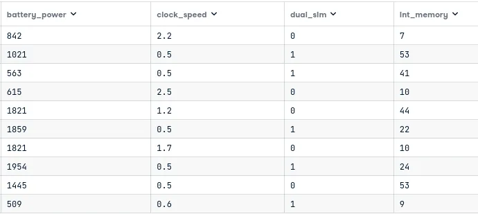
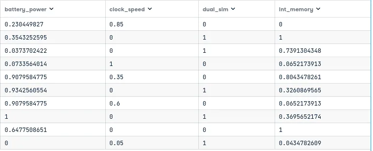
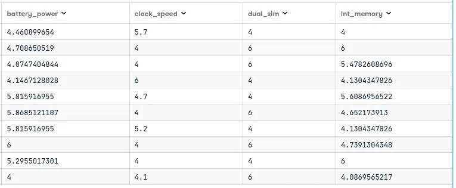
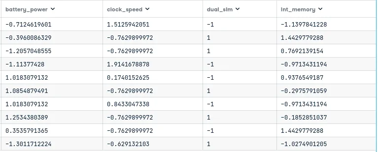

**Feature scaling** is a method used to normalize data before passing it to any machine learning algorithm. It is a substantial part of the data preprocessing workflow with the intent to enhance the accuracy of the machine learning model. In this blog post, we'll begin by explaining to you why you must consider feature scaling and when to use it, after that, we will list the different feature scaling techniques we have. Finally, we will demonstrate two feature scaling techniques using the Scikit-learn library.

## 1. Why feature scaling ?
We are going to work with Mobile price classification data set to download from [Kaggle](https://www.kaggle.com/datasets/iabhishekofficial/mobile-price-classification). The purpose of this data set is to predict the price range of a mobile phone based on its features (eg: RAM, Internal Memory, etc). To demonstrate how feature scaling works, we will only use ten samples, and four features of this data set.

- **battery_power**: Total energy a battery can store in one time measured in mAh
- **clock_speed**: speed at which microprocessor executes instructions
- **dual_sim**: Has dual sim support or not
- **int_memory:** Internal Memory in Gigabytes

```python
import pandas as pd

selected_columns = ['battery_power','clock_speed', 'dual_sim','int_memory']

data = pd.read_csv('mobile_price_train.csv', nrows=10)[selected_columns]

display(data.head(10))
```



Our data here have a different meaning for us (human) but not for machine learning algorithm who only see number. So, in our data set, machine learning model would consider that **"battery_power"** is more important than other feature. We can summarize that assumption with this inequaly: **"battery_power">"int_memory">"clock_speed">"dual_sim"**.

So if we convert the internal memory into megabytes or kilobytes, this would not be the same. Then, we need to bring all feature in the same standing so that significant number doesn't impact the model just because of their large magnitude.

## 2. When to use feature scaling ?
**Feature scaling** is a crucial part of data preprocessing, especially for machine learning algorithms that calculate distances between data. If we don't scale our data during the data preprocessing step, the feature with the higher value range starts dominating when calculating distances during the machine learning training phase. Some algorithms where feature scaling can sweeten performance are:

- K-Nearest-Neighbor (KNN) with Euclidean distance
- K-Means with Euclidean distance
- PCA (Principal Component Analysis)
- Gradient descent
- Support Vector Machine (SVM)

All tree-based algorithms are insensitive to feature scaling because a decision tree is only spliting a node based on a single feature. This split on a feature is not influenced by other features.

## 3. Feature scaling techniques
There are two majors technique of feature scaling: **Normalization and standardization.**

### 3.1. Normalization

Normalization is used when we want to border our values between two number typically between [0,1] or [-1,1]. It 's good to use when you know that the distribution of your data doesn't follow a Gaussian distribution. This can be useful in algorithm that do not assume any distribution of the data like KNN or Neural Network.

### 3.2.Standardization

It's transforms the data to have zero mean and a variance of 1. Standardization is not affected by the outliers.

### 3.3.Standardization or Normalization

One approach to know which method to use is the use the both and select the one with better performance. Note that impact of outlier is very high in normalization.

To decide whether scaling is a good idea or not, you should ask yourself some questions:

- What would normalization do to our data ? Should that become easier or do you risk deleting important information ?
- Is the algorithm sensitive to the scale of the data ?
- Does the algorithm or its actual implementation perform its own normalization ?

The last item is very important because if you perform scaling on your data before passing to those algorithm, performance would not be improve. We have for example Naives Bayes algorithms.

There are many ways to perform feature scaling:

- Min Max Scaler
- Standard scaler
- Max Abs Scaler
- Robust Scaler
- Quantile transformer scaler
- Power transformer scaler
- Unit Vector scaler

Now, let's jump to practice feature scaling with scikit-learn to have our hand dirty.

## 4. Practicing feature scaling with scikit-learn
Scikit-learn have a dedicate module for data preprocessing called **sklearn.preprocessing.** This module also contains a bunch of method for feature scaling.

### 4.1.Min-Max Scaling

Min-Max scaling is a normalization technique which by default shift data to the interval [0,1].

```python
from sklearn.preprocessing import MinMaxScaler

scaler = MinMaxScaler()
scaler.fit(data)

data_scaled = scaler.transform(data)
pd.DataFrame(data_scaled, columns=data.columns)
```



We now remark that all our data range from 0 to 1 and then they have the same importance for the machine learning algorithm.

By default, MinMax scaler scale our data to the interval [0,1] but we can specify our interval like this:

```python
scaler = MinMaxScaler([4,6])
```

Now, all our data will be transformed to fit this interval.



### 4.2.Standard scaler

Standard Scaler is a standardization technique so data will be transformed to have a mean of 0 and a standard deviation of 1.

```python
from sklearn.preprocessing import StandardScaler

std_scaler = StandardScaler()

std_scaler.fit(data)
data_scaled = std_scaler.transform(data)

pd.DataFrame(data_scaled, columns=data.columns)
```



> The application of other scaling methods follows the same principle using Scikit-learn API. We start importing from sklearn.preprocessing, after we instantiate this scaler and fit it with data and finally we transform our data.

You can found the code used in this post [here](https://app.datacamp.com/workspace/w/ca547367-4917-4dc5-ac46-dbcc665200d2).
