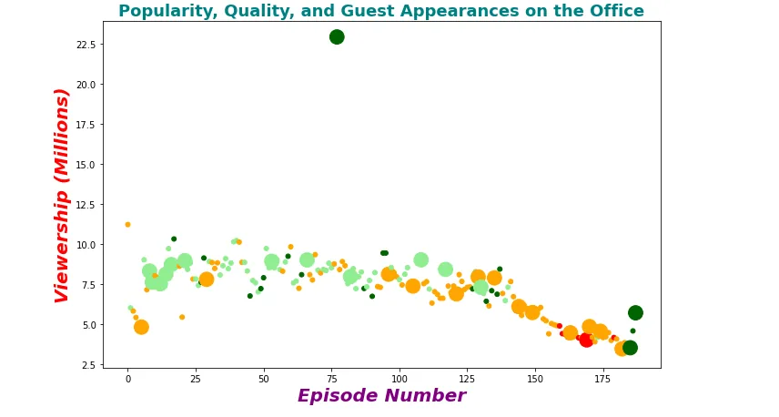

Consistent with Wikipedia,

> *The Office is an American* [*mockumentary*](https://en.wikipedia.org/wiki/Mockumentary)[*sitcom*](https://en.wikipedia.org/wiki/Sitcom) *television series that depicts the everyday work lives of office employees in the* [*Scranton, Pennsylvania*](https://en.wikipedia.org/wiki/Scranton,_Pennsylvania)*, branch of the fictional* [*Dunder Mifflin Paper Company*](https://en.wikipedia.org/wiki/Dunder_Mifflin)*. It aired on* [*NBC*](https://en.wikipedia.org/wiki/NBC) *from March 24, 2005, to May 16, 2013, spanning a total of nine seasons.*

In this, blog post, we are going to use our knowledge in data visualization with **matplotlib** to search out the guest start within the [dataset](https://www.kaggle.com/nehaprabhavalkar/the-office-dataset) download from [Kaggle](https://www.kaggle.com/). We are also going to use **pandas** to load and manipulate our dataset and **lambda function to** simplify certain parts of our code. If you're ready, let's start.

### 1. Import pandas and matplotlib library

***Pandas*** could be a fast, powerful, flexible and simple to use open source data analysis and manipulation tool, built on top of the Python programing language. We generally import it as follow together with his common prefix:

```python
import pandas as pd
```

***Matplotlib*** may be a comprehensive library for creating static, animated, and interactive visualizations in Python. To import it, use the subsequent code.

```python
import matplotlib.pyplot as plt
```

### 2. Load the Office dataset

After importing pandas and matplotlib, let's load data from the CSV file.

```python
# Read data fron csv file
data = pd.read_csv('office_episodes.csv', parse_dates=['release_date'])
```

The parameter **parse_dates** allows pandas to parse the date in string format to pandas data type.

### 3. Creation of an instance matplotlib.pyplot.figure

**matplotlib.pyplot.figure()**  allow us to define the property of the figure,

in other words to customize our draw.

```python
# Instnciate a figure
fig = plt.figure()

# Set figure params
plt.rcParams['figure.figsize'] = [11, 7]
```

What do **rcParams** means? Indeed, on every occasion Matplotlib loads, it defines a runtime configuration (**rc**) containing the default styles for each plot element we create. This configuration is adjusted at any time using the plt.rc convenience routine. The rc settings are stored in an exceedingly dictionary called [matplotlib.rcParams](https://matplotlib.org/stable/api/matplotlib_configuration_api.html#matplotlib.rcParams), which is global to the matplotlib package. In our case, we only use a parameter that changes the dimensions of our figure.

### 4. Define the plotting color for a different group of data

A **color scheme** reflecting the **scaled ratings** of every episode is defined as follow:

- Ratings < 0.25 are colored "red"
- Ratings >= 0.25 and < 0.50 are colored "orange"
- Ratings >= 0.50 and < 0.75 are colored "lightgreen"
- Ratings >= 0.75 are colored "darkgreen"

The python code to define the colour list is:

```python
# Define colors for ploting
colors=[]

for _, row in data.iterrows():
    if row['scaled_ratings'] < 0.25:
        colors.append('red')
    elif row['scaled_ratings'] < 0.5:
        colors.append('orange')
    elif row['scaled_ratings'] < 0.75:
        colors.append('lightgreen')
    else:
        colors.append('darkgreen')

data['colors'] = colors
```

The python code **data['colors'] = colors**  directly add a new column in the original office datasets

### 5. Defining plotting size for certain group of data

A **sizing system** of plotting follows the principle that episodes with guest appearances have a marker size of 250 and episodes without are sized 25.

To easily solve the matter, we are going to use a lambda and maps function couple with a ternary operator to do that in one line.

```python
# Define size for ploting
data['size'] = data['has_guests'].map(lambda x: 250 if x == True else 25 )
```

During this line of code :

- We access **has_guests** column of our data frame
- We apply the map function within the previous result to be able to process and transform all the items in an iterable without using an explicit ***for loop***
- Add the end, we use **a lambda function**  to apply a transformation in each element of the result and a ternary operator to decide the value to return depending on **has_guests** value

Coupling lambda function and ternary operator, we write less code than normal. To know more about lambda function in python, I wrote [one blog post](https://www.datainsightonline.com/post/lambda-expression-in-python-and-his-usage-in-data-science) on that subject.

### 6. Labels our plot

To better understand our scatter plot, we must label it.

```python
# Set plot title
plt.title("Popularity, Quality, and Guest Appearances on the Office", color="teal", fontweight="bold", fontsize=18)

# Set plot xlabel
plt.xlabel("Episode Number",color="purple", fontsize=20, fontweight="bold", fontstyle="italic")

# Set plot y label
plt.ylabel("Viewership (Millions)", color="red", fontsize=20, fontweight="bold", fontstyle="italic")
```

In the process of labeling our plot, we can do more customization by settings:

- The color of the label with the attribute **color**
- The size with the attribute **fontsize or size**  where size is in point (eg: 20, 12,) or relative size ( e.g., 'smaller', 'x-large' )
- The style with the attribute **fontstyle or style** where the value can be **[ 'normal' | 'italic' | 'oblique' ]**
- The weight with attribute **weight or fontweigh**t where values are **[ 'normal' | 'bold' | 'heavy' | 'light' | 'ultrabold' | 'ultralight']**

### 7. Create a scatter plot
**A** ***scatter plot***is a type of plot or mathematical diagram using Cartesian coordinates to display values for typically two variables for a set of data.We can now draw our scatter plot with the following code.

```python
#  Create a scatter plot
plt.scatter(x=data['episode_number'], y=data['viewership_mil'], c=data['colors'], s=data['size'])

# Show the plot
plt.show()
```

The **plt.scatter()** method take a lot of parameters among which:

- **size (s)** that is a list of sizes to change the size of values in the plot
- **color (c)**  that is the list of colors to change the color of the points in the plot
- **Shape**
- **Transparency**

After complete all these steps, our plot looks like this:



### 8. Find the guest stars
```python
data[data['viewership_mil']==data['viewership_mil'].max()]['guest_stars']
```

This final code will provide us names of guest stars.

We can find the entire source code [here](https://github.com/tderick/datainsightonlineprogram).

#### References:

1. 'The Office' series datasets was downloaded from Kaggle [**here**](https://www.kaggle.com/nehaprabhavalkar/the-office-dataset)**.**
2. Investigating Appearance of Guest Stars in 'The Office' Series [**here**](https://www.datainsightonline.com/post/investigating-appearance-of-guest-stars-in-the-office-series)**.**
3. DataCamp's Unguided Project: "Investigating Netflix Movies and Guest Stars in The Office" [**here**](https://projects.datacamp.com/projects/1170)**.**
4. Matplotlib text properties and layouts, [here](https://matplotlib.org/stable/tutorials/text/text_props.html)
5. The_Office_(American_TV_series) (Wikipedia) [here](https://en.wikipedia.org/wiki/The_Office_(American_TV_series))
6. Matplotlib backend management docs [here](https://matplotlib.org/stable/api/matplotlib_configuration_api.html)
7. Matplotlib Configurations and Stylesheets [here](https://jakevdp.github.io/PythonDataScienceHandbook/04.11-settings-and-stylesheets.html)
