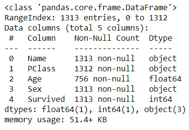
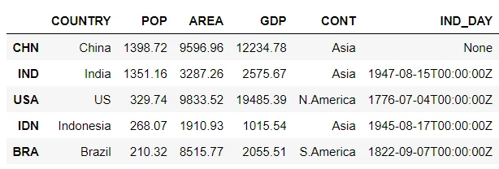
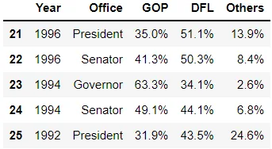
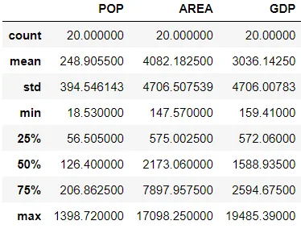
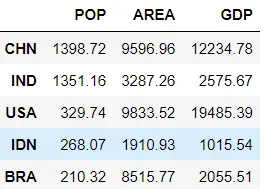
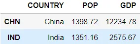
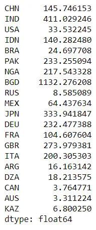
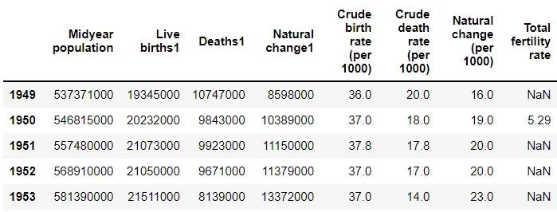
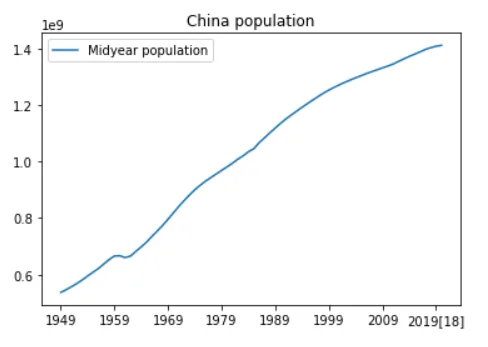

Real-world data is messy. That’s why libraries like pandas are so valuable.

Using pandas we can take the pain out of data manipulation by extracting, filtering, and transforming data in DataFrames, clearing a path for quick and reliable data. analysis.

In this article, we will give a tutorial on some useful pandas techniques that are very important for dealing with data using python.

1. Importing data
2. Retrieving informations
3. Filtering
4. Apply Function
5. Plotting

First of all, we have to import pandas.

```python
import pandas as pd
```

## Importing data using pandas
Pandas library offers many different possibilities for loading files of different formats.

### csv files:

A comma-separated values (CSV) file is a plaintext file with a .csv extension that holds tabular data. This is one of the most popular file formats for storing large amounts of data.

```python
titanic_df = pd.read_csv('titanic.csv')
titanic_df.info()
```



### JSON files:

JSON is plain text, but has the format of an object, and is well known in the world of programming, including Pandas. In our examples we will be using a JSON file called 'data.json'.

```python
df = pd.read_json('data.json')
df.head()
```



### HTML files:

An HTML is a plaintext file that uses hypertext markup language to help browsers render web pages. The extensions for HTML files are .html and .htm.

```python
df = pd.read_html('https://en.wikipedia.org/wiki/Minnesota') # list of tables

df[6].tail() # displays the last five rows of the first table
```



## Retrieving informations from DataFrame:

In order to better understand our dataset, we should know more about it using some pandas methods that describe our data.

### (rows, columns)

```python
df.shape
```

```python
(20, 6)
```

### Describe index

```python
df.index
```

```python
Index(['CHN', 'IND', 'USA', 'IDN', 'BRA', 'PAK', 'NGA', 'BGD', 'RUS', 'MEX',
       'JPN', 'DEU', 'FRA', 'GBR', 'ITA', 'ARG', 'DZA', 'CAN', 'AUS', 'KAZ'],
      dtype='object')
```

### Summary statistics

```python
df.describe()
```



### Median of values

```python
df.median()
```

```python
POP      126.400
AREA    2173.060
GDP     1588.935
dtype: float64
```

## Filtering Data:

### Selecting columns by data type

We can use the pandas.DataFrame.select_dtypes(include=None, exclude=None) method to select columns based on their data types. The method accepts either a list or a single data type in the parameters include and exclude. It is important to keep in mind that at least one of these parameters (include or exclude) must be supplied and they must not contain overlapping elements.

In this example, we want to select the numeric columns (both integers and floats) of the dataframe by passing in the string 'number' to the include parameter.

```python
numeric_df = df.select_dtypes(include='number')

numeric_df.head()
```



### Selecting disjointed rows and columns

To select multiple rows and columns, we need to pass two list of values to both indexers. The code below shows how to extract the country, the population and the GDP of countries with id CHN and IND.

```python
df.loc[['CHN', 'IND'], ['COUNTRY', 'POP', 'GDP']]
```



## Apply function:

The pandas .apply() method takes a function as an input and applies this function to an entire DataFrame.

### Calculation the number of human inhabitants per square kilometer

First, we will call the .apply() methos on our dataframe. Then use the lambda function to iterate over the rows of the dataframe. For every row, we grab the 'POP' column and divide it by the 'AREA' column. Finally, we will specify the axis=1 to tell the .apply() method that we want to apply it on the rows instead of columns.

```python
df.apply(
    lambda row: row['POP']*1000/row['AREA'],
    axis=1)
```



## Visualizing our data

We want to vusualize how chine population increases through past years. First of all, we will load data from wikepedia using html file like what we have seen from the begining. We are setting the first column as index by passing index_col as parameter and setting it to 0.

```python
china_df = pd.read_html('https://en.wikipedia.org/wiki/Demographics_of_China', index_col=0)[5]

china_df.head()
```



Now that we have all data we need. We are ready to plot our dataframe.

```python
china_df.plot(kind='line', y='Midyear population', title='China population')
```



## Conclusion
**Pandas is a powerful python library for data science. But It is not the unique, we still have to use other libraries like mathplotlib and seaborn.**

[**GITHUB**](https://github.com/Jihed503/data_insight_Pandas_Techniques_for_Data_Manipulation_in_Python/blob/main/Pandas_Techniques_for_Data_Manipulation_in_Python.ipynb)
