**PANDAS**

Pandas is a Python library used for working with data sets. It is used for for analysing, cleaning, exploring and manipulating data. Pandas allows us to analyse big data.It can clean messy data sets, and make them readable and relevant.

1. **Exploring Dataset**

First we import the python libraries, pandas and numpy as follows.

```python
import pandas as pd
import numpy as np
```

Now we load our csv (comma-separated values ) file and assign a file name to it.

```python
df = pd.read_csv('Rectangular Data.csv')
```

To read the first five rows of our data we make use of head() method.

```python
df.head()
```

Output

- 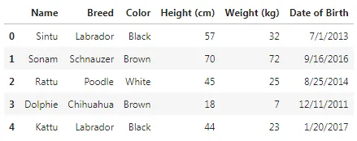

We make use of tail() method along with it we assign a numeric value for the number of last rows we want to view. Here we have assign 2, in order to view the last two rows of our data.

```python
df.tail(2)
```

- 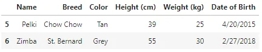

The info() function is used to print a concise summary of a DataFrame. This method prints information about a DataFrame including the index dtype and column dtypes, non-null values and memory usage.

```python
df.info()
```

- 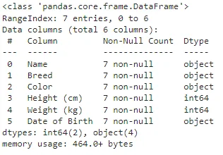

The shape attribute is used to view the number of rows and columns of our DataFrame.

```python
df.shape

output
(7, 6)
```

Pandas describe() is used to view some basic statistical details like percentile, mean, std etc. of a data frame or a series of numeric values.

```python
df.describe()

output
array([['Sintu', 'Labrador', 'Black', 57, 32, '7/1/2013'],
       ['Sonam', 'Schnauzer', 'Brown', 70, 72, '9/16/2016'],
       ['Rattu', 'Poodle', 'White', 45, 25, '8/25/2014'],
       ['Dolphie', 'Chihuahua', 'Brown', 18, 7, '12/11/2011'],
       ['Kattu', 'Labrador', 'Black', 44, 23, '1/20/2017'],
       ['Pelki', 'Chow Chow', 'Tan', 39, 25, '4/20/2015'],
       ['Zimba', 'St. Bernard', 'Grey', 55, 30, '2/27/2018']],
      dtype=object)
```

The columns attribute and index returns the column labels and the index name of the given Dataframe.

```python
df.columns
output
Index(['Name', 'Breed', 'Color', 'Height (cm)', 'Weight (kg)',
       'Date of Birth'],
      dtype='object')

df.index
output
RangeIndex(start=0, stop=7, step=1)
```

2. **Pivot Table**

First we calculate the mean of height of each color.

```python
df.pivot_table(values='Height (cm)', index='Color')
```

- 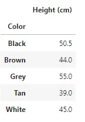

Median of each color Height is calculated.

```python
df.pivot_table(values='Height (cm)', index='Color', aggfunc=np.median)
```

- 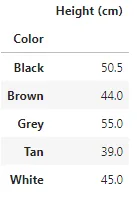

To view multiple statistics we make use of aggfunc

```python
df.pivot_table(values='Height (cm)', index='Color', aggfunc=[np.mean, np.median])
```

- 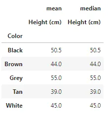

Pivot in Two variables.

```python
df.pivot_table(values='Height (cm)', index='Color', columns='Breed')
```

- 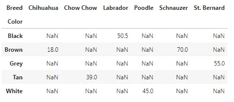

Filling missing values, value to replace missing values with (in the resulting pivot table, after aggregation).

```python
df.pivot_table(values='Height (cm)', index='Color', columns='Breed', fill_value=0)
```

- 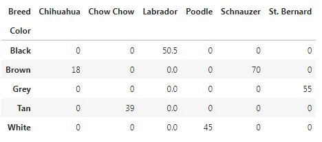

We sum the rows and columns together.

```python
df.pivot_table(values='Height (cm)', index='Color', columns='Breed', fill_value=0, margins=True)
```

- 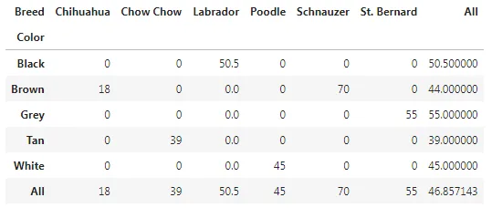

3. **Sorting**

**The**sort_values() function sorts a data frame in Ascending or Descending order of passed Column. By default pandas sorts the datas in ascending order.

```python
df.sort_values('Height (cm)')
```

- 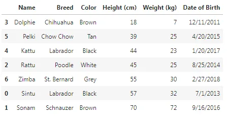

In order to sort the datas in descending order we have to specify ascending=False.

```python
df.sort_values('Weight (kg)', ascending=False)
```

- 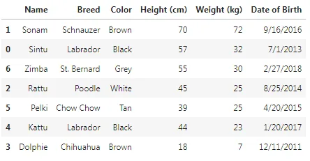

We can also sort multiple values by calling pandas DataFrame .sort_values in ascending with a list of column names to sort the rows in the DataFrame object based on the columns specified.

```python
df.sort_values(['Weight (kg)', 'Height (cm)'])
```

- 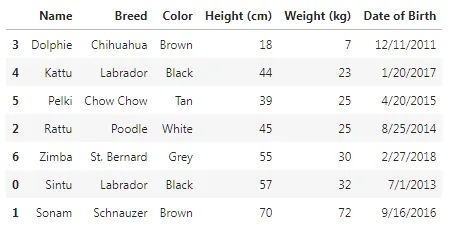

4. **Subsetting**

To select a single column, use square brackets [] with the column name of the column of interest.

```python
df['Breed']

Output
0       Labrador
1      Schnauzer
2         Poodle
3      Chihuahua
4       Labrador
5      Chow Chow
6    St. Bernard
Name: Breed, dtype: object
```

To select multiple columns we can pass the column name of the desired columns.

```python
df[["Name","Height (cm)"]]
```

- 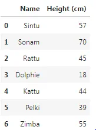

Subsetting rows with boolean values

```python
df["Height (cm)"] > 50

Output
0     True
1     True
2    False
3    False
4    False
5    False
6     True
Name: Height (cm), dtype: bool
```

Subsetting rows with numeric values

```python
df[df["Height (cm)"] > 50]
```

- 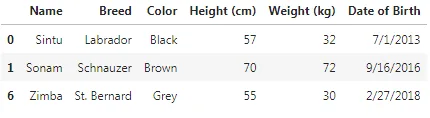

Subsetting datas based on words.

```python
df[df["Breed"] == 'Labrador']
```

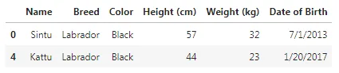

Subsetting with on multiple datas

```python
is_lab = df['Breed'] == 'Labrador'
is_black = df['Color'] == 'Black'
df[is_lab & is_black]
```

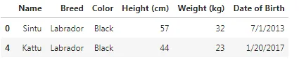

5. **Summary Statistics**
Summary statistics is a part of descriptive statistics that summarises and provides the gist of information about the sample data. Statisticians commonly try to describe and characterise the observations by finding: a measure of location, or central tendency, such as the arithmetic mean.
We find the mean of height as follows.

```python
df['Height (cm)'].mean()

Output
46.857142857142854
```

We also calculate the oldest and the latest date.

```python
df['Date of Birth'].min()
Output
'1/20/2017'

df['Date of Birth'].max()
Output
'9/16/2016'
```

We calculate the cumulative sum of the weights of the dogs as follows.

```python
df['Weight (kg)'].cumsum()

Output
0     32
1    104
2    129
3    136
4    159
5    184
6    214
Name: Weight (kg), dtype: int64
```

**Conclusion**

This article is written in part of the data insight online program with reference of datas from DataCamp.
