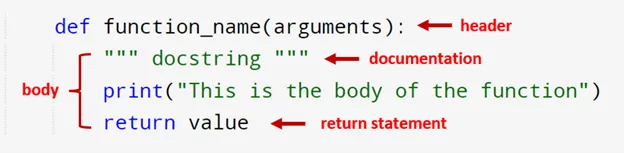

Imagine a refrigerator without compartments. Suppose it’s almost full, unarranged, and foods and beverages are on top of each other. Among these foods include eggs and, unfortunately, some of them are cracked. You do not know where the cracked eggs are placed because it’s messy and unorganized. Thus, you need to clean everything for the refrigerator does not stink.

Similar to programming languages, implementing codes without dividing them into different sections could demand thorough cleaning. If some errors exist, it is difficult to locate these errors, especially when dealing with more than hundreds of lines of code. It is also challenging to modify some parts if they do not run as intended. Luckily, functions exist! It enables codes to be divided into different sections that carry out specific tasks each.


A function is a block of codes that executes a specific task. It only runs when it is called, and it can be called multiple times. It can return values depending on the algorithm to what it commands. Functions are implemented to have a clean, organized, easy to read and manage, and easy to debug program. Here, we can see that it is a best practice to implement functions. Thus, let us learn how to generate functions in Python!

**Step 1**. Initiate the function implementation with the **def** keyword to define the function.

```python
def
```

**Step 2**. Name your function.

```python
def function_name
```

You will use this name in calling it. You can name the function anything you want as long as it follows the Python guidelines in naming a function.

**Step 3**. Define the arguments.

```python
def function_name(arguments)
```

Arguments are the given variables that already have values. These arguments are already defined when the function is called. You can put arguments as many as you want that can be used in the functionality of the entire function, i.e.

```python
def function_name(variable_1, variable_2, ..., variable_n):
```

You can also put a default parameter value by adding the equal sign ‘=’ and its value. It automatically assigns a value to a particular variable by default when the parameter is not included in calling the function. For example,

```python
def function_name(variable_1 =2 ):
```

when you called the function and variable_1 is not specified, it automatically assigns the value as 2 (see above snippet).

**Step 4**. (optional) Add documentation by enclosing three quotations.

```python
def function_name(variable_1, variable_2, ..., variable_n):
    """ docstring """
```

This docstring briefly explains what the function does. Also, notice the semi-colon and the indention. The semi-colon ends the function header, and it directs you to the next line with automatic indention. You can also make the indention by pressing the tab or just 4 whitespaces. It is important to align your codes in this indention to determine that it is still part of the function. If a code does not align in this indention, Python will read that it is not included in the function anymore.

**Step 5**. Put all the statements or commands.

```python
def function_name(variable_1, variable_2, ..., variable_n):
    """ docstring """
    print("This is the body of the function")
```

Put all the statements of the algorithm you to command the function on how it will execute.

**Step 6**. (optional) Put the return statement.

```python
def function_name(variable_1, variable_2, ..., variable_n):
    """ docstring """
    print("This is the body of the function")
    return value
```

If you want your function to return a value, you can include a return statement by simply adding a **return** and the variable containing the value you want to be returned.

**Step 7**. Lastly, call the function.

```python
function_name(arguments)
```

To execute the function, call it by inputting the function name together with the necessary arguments.

To fully understand how to implement functions, see the example below:

```python
def add(num1,num2):
    """ This function adds two numbers """
    sum = num1 + num2
    return sum
```

This function adds two numbers and returns the sum. To execute the function, call it through its function name and define the necessary arguments, i.e.,

```python
sum = add(1,1)

print("The sum is " + str(sum) + ".")
```

Output:

```python
The sum is 2.
```

See more about functions [here](https://docs.python.org/3/tutorial/controlflow.html#defining-functions).
