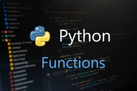
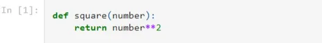
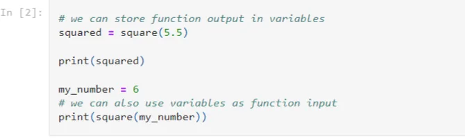
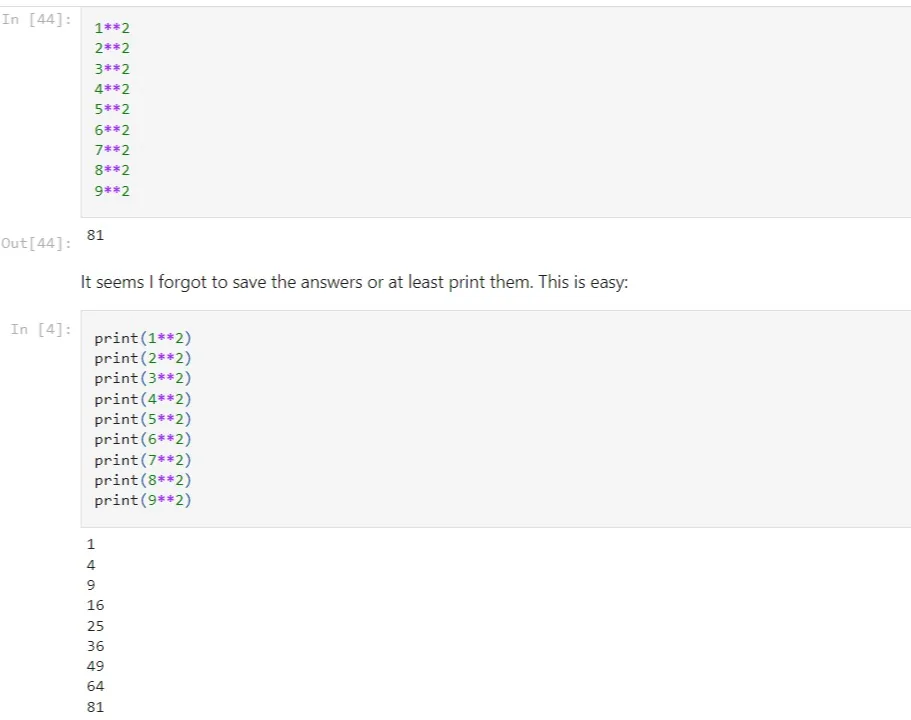
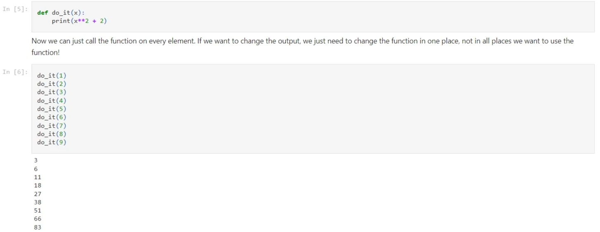

Many programs react to user input. Functions allow us to define a task we would like the computer to carry out based on input. A simple function in Python might look like this:

We define functions using the (def) keyword. Next comes the name of the function, which in this case is (square). We then enclose the function's input in parentheses, in this case (number). We use (:) to tell Python we're ready to write the body of the function.

In this case the body of the function is very simple; we return the square of (number) (we use \*\* for exponents in Python). The keyword return signals that the function will generate some output. Not every function will have a return statement, but many will. A return statement ends a function.

Let's see our function in action:

## Why Functions?

We can see that functions are useful for handling user input, but they also come in handy in numerous other cases. One example is when we want to perform an action multiple times on different input. If I want to square a bunch of numbers, in particular the numbers between 1 and 10, I can do this pretty easily (later we will learn about iteration which will make this even easier!)

That worked! However, what if I now want to go back and add two to all the answers? Clearly changing each instance is not the right way to do it. Lets instead define a function to do the work for us.

### Splitting out the work into functions is often a way to make code more modular and understandable. It also helps ensure your code is correct. If we write a function and test it to be correct, we know it will be correct every time we use it. If we don't break out code into a function, it is very easy to make typos or other errors which will cause our programs to break.
