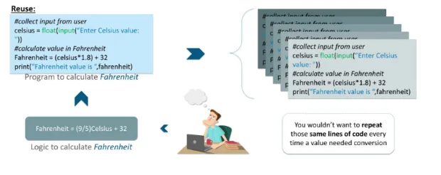

Hello everyone,

In this short tutorial, I will give you a brief introduction to the concept of functions in Python. Actually, functions are one of the basic concepts in all programming languages. Functions are simply a bulk of code that is responsible for doing a specific task “function :)” and are used over and over again in your code. So instead of writing that bulk of code over and over again. You define your function once and reuse it as many times as you want.

**Would you rather write a single piece of code 10 times or just once and use it 10 times?**

So, functions are nothing but tasks that a user wants to perform. But, defining it once with a name will let you reuse that functionality without making your main programs look too scary. This drastically reduces lines of code and even makes debugging easier.

You define the function once, and let it do everything for you.

**Types Of Python Functions**

There are many types of Python Functions. And each of them is very vital in its own way. The following are the different types of Python Functions:

- Python Built-in Functions
- Python Recursion Functions
- Python Lambda Functions
- Python User-defined Functions

In the below notebook, I give a brief example of a user-defined function “I defined :)” that is written in Python and facilitates us with the process of summing a list of numbers.
