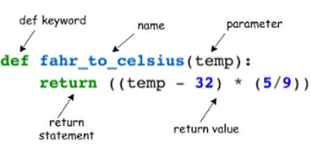

In python , functions can be considered a small factory that have a specific task that takes an input, processes it and produces an output.It is essentially like a block of statements performing a specific task.

A function in python is defined using the def keyword followed by the name of a function and one or moreoptional parameters wich represents the variable that exists only within the functionand can not called outside the function The function can have a return value which is optional

It presents the output generated by the function and is returned to the main program For calling a function, we need to inser inputs ( or arguments) in order to perform a certain task and produce an output Functions are very helpful when it comes code more organized and fashionable and it can be called repeatedly instead or rewriting the code.

A simple example of fuctions is the print() function which gives the screen printout of the input

```python
print("this is easy")this is easy
```

Taking an example , Let us say that you want to write a code that celebrate person birthday by showing his name and his age :

```python
def birthday(name, age) :print ("happybirthday", name)print(name, "is",age, "years old")print("I wish you great day!")print(birthday("sara" ,25))
```

The out put for this code would be :

```python
happybirthday sara
sara is 25 years old
I wish you great day!
```

We can create function that creates 2 functions sin_angle and cos_angle . These functions calculate in and cosin of an angle given in degrees :

```python
import math
def sin_angle(x):Y=math.radians(x)return math.sin(x)

#let us take an example for x=60 :print(sin_angle(30))

def cos_angle(x):Y=math.radians(x)return math.cos(x)
#let us take an example for x=60 :print(cos_angle(60))
```

The output would be :

```python
-0.9880316240928618-0.9524129804151563
```
